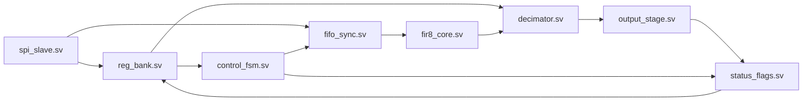

# RTL Architecture

## Top-level signal processor

## Note di integrazione V4

- `spi_slave.sv` implementa un protocollo SPI minimale a frame da 24 bit.
- `reg_bank.sv` espone configurazione e stato.
- `control_fsm.sv` gestisce `IDLE -> RUN -> DONE`.
- `top.sv` integra il datapath FIFO → FIR → DECIM → OUTPUT.
- `scripts/synth_yosys.sh` è la prima bozza di sintesi RTL reale.

## Freeze RTL target della V4

La V4 punta a congelare:
- porte top-level
- mappa registri base
- datapath base
- protocollo SPI minimale
