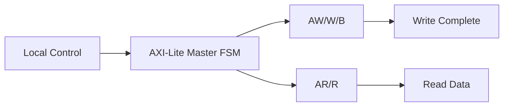

## Scehma a blocchi AXI Lite Master Base

```mermaid
flowchart LR
    A[Local Control] --> B[AXI-Lite Master FSM]
    B --> C[AW/W/B]
    B --> D[AR/R]
    D --> E[Read Data]
    C --> F[Write Complete]
```