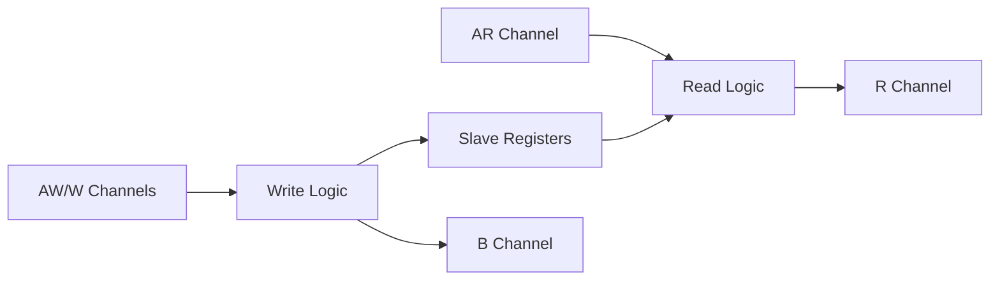

## Schema a blocchi AXI Lite Slave Base

```mermaid

flowchart LR
    A[AW/W Channels] --> B[Write Logic]
    B --> C[Slave Registers]
    D[AR Channel] --> E[Read Logic]
    C --> E
    E --> F[R Channel]
    B --> G[B Channel]

```