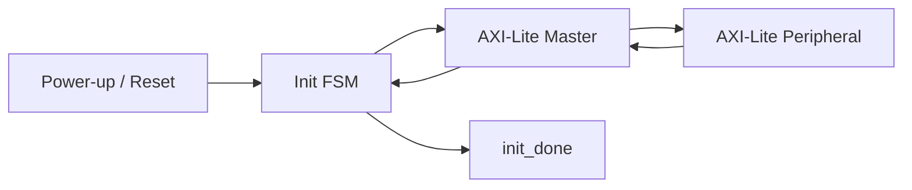

## Scehma a blocchi AXI Lite Master-FSM

```mermaid
flowchart LR
    A[Power-up / Reset] --> B[Init FSM]
    B --> C[AXI-Lite Master]
    C --> D[AXI-Lite Peripheral]
    D --> C
    C --> B
    B --> E[init_done]
```