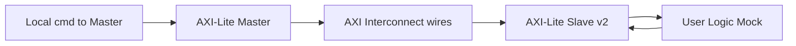

## Scehma a blocchi AXI Lite Master-Slave

```mermaid
flowchart LR
    A[Local cmd to Master] --> B[AXI-Lite Master]
    B --> C[AXI Interconnect wires]
    C --> D[AXI-Lite Slave v2]
    D --> E[User Logic Mock]
    E --> D
```