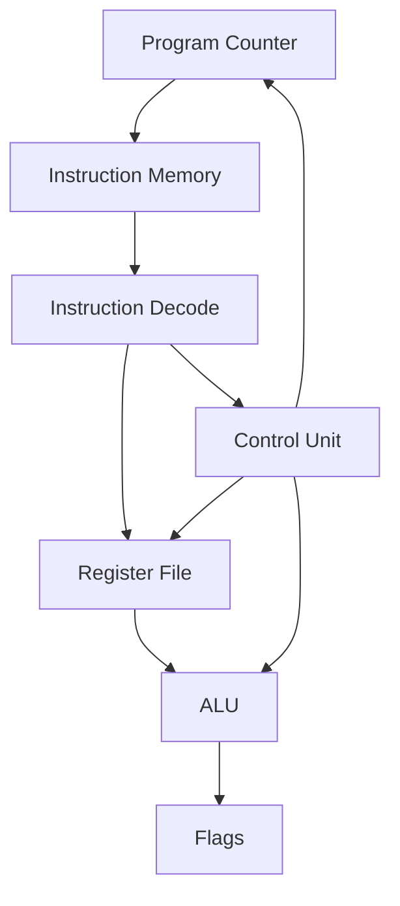

## CPU flowchart

```mermaid

flowchart TD
    A[Program Counter] --> B[Instruction Memory]
    B --> C[Instruction Decode]
    C --> D[Register File]
    D --> E[ALU]
    E --> F[Flags]
    C --> G[Control Unit]
    G --> D
    G --> E
    G --> A
	
```