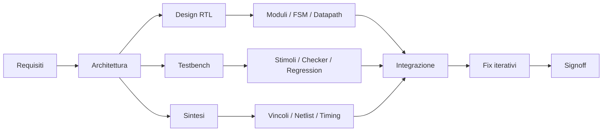

## Flusso di progettazione VHDL

```mermaid

flowchart LR
    A[Requisiti] --> B[Architettura]
    B --> C[Design RTL]
    B --> D[Testbench]
    B --> E[Sintesi]
    C --> F[Moduli / FSM / Datapath]
    D --> G[Stimoli / Checker / Regression]
    E --> H[Vincoli / Netlist / Timing]
    F --> I[Integrazione]
    G --> I
    H --> I
    I --> J[Fix iterativi]
    J --> K[Signoff]
	
```