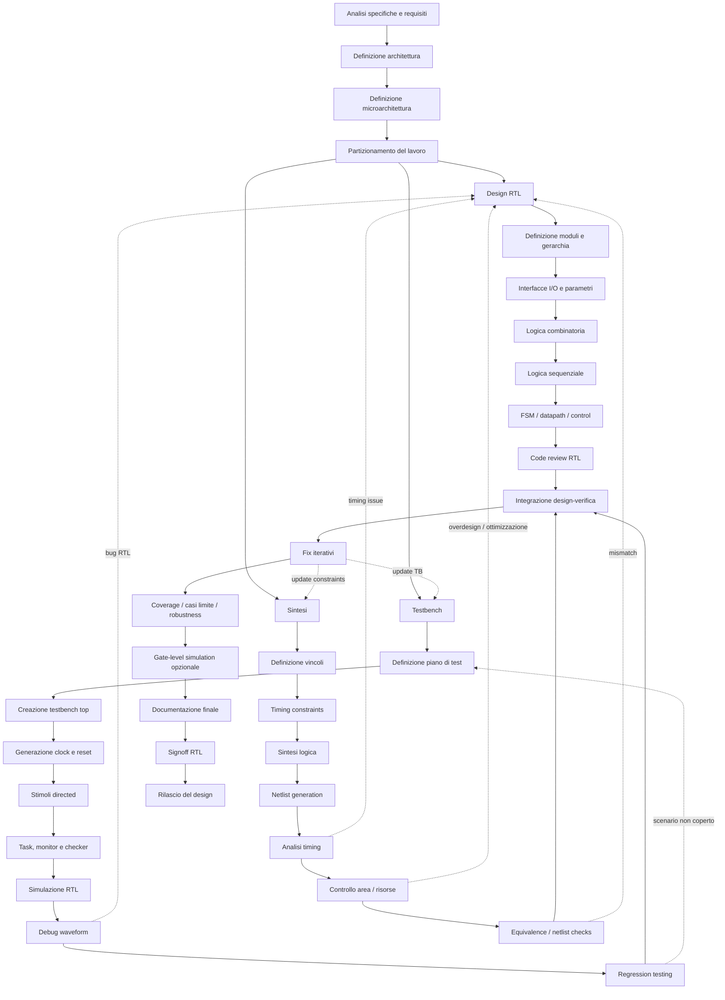

## Flusso di progettazione Verilog

```mermaid

flowchart TD
    A[Analisi specifiche e requisiti] --> B[Definizione architettura]
    B --> C[Definizione microarchitettura]
    C --> D[Partizionamento del lavoro]

    D --> E[Design RTL]
    D --> F[Testbench]
    D --> G[Sintesi]

    %% DESIGN
    E --> E1[Definizione moduli e gerarchia]
    E1 --> E2[Interfacce I/O e parametri]
    E2 --> E3[Logica combinatoria]
    E3 --> E4[Logica sequenziale]
    E4 --> E5[FSM / datapath / control]
    E5 --> E6[Code review RTL]

    %% TESTBENCH
    F --> F1[Definizione piano di test]
    F1 --> F2[Creazione testbench top]
    F2 --> F3[Generazione clock e reset]
    F3 --> F4[Stimoli directed]
    F4 --> F5[Task, monitor e checker]
    F5 --> F6[Simulazione RTL]
    F6 --> F7[Debug waveform]
    F7 --> F8[Regression testing]

    %% SYNTHESIS
    G --> G1[Definizione vincoli]
    G1 --> G2[Timing constraints]
    G2 --> G3[Sintesi logica]
    G3 --> G4[Netlist generation]
    G4 --> G5[Analisi timing]
    G5 --> G6[Controllo area / risorse]
    G6 --> G7[Equivalence / netlist checks]

    %% CONVERGENCE
    E6 --> H[Integrazione design-verifica]
    F8 --> H
    G7 --> H

    H --> I[Fix iterativi]
    I --> J[Coverage / casi limite / robustness]
    J --> K[Gate-level simulation opzionale]
    K --> L[Documentazione finale]
    L --> M[Signoff RTL]
    M --> N[Rilascio del design]

    %% Feedback loops
    F7 -. bug RTL .-> E
    F8 -. scenario non coperto .-> F1
    G5 -. timing issue .-> E
    G6 -. overdesign / ottimizzazione .-> E
    G7 -. mismatch .-> E
    I -. update TB .-> F
    I -. update constraints .-> G
	
```