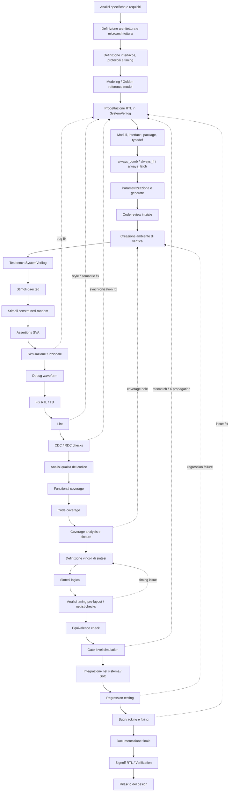

## Flusso di lavoro SystemVerilog

```mermaid

flowchart TD
    A[Analisi specifiche e requisiti] --> B[Definizione architettura e microarchitettura]
    B --> C[Definizione interfacce, protocolli e timing]
    C --> D[Modeling / Golden reference model]
    D --> E[Progettazione RTL in SystemVerilog]

    E --> E1[Moduli, interface, package, typedef]
    E1 --> E2[always_comb / always_ff / always_latch]
    E2 --> E3[Parametrizzazione e generate]
    E3 --> F[Code review iniziale]

    F --> G[Creazione ambiente di verifica]
    G --> G1[Testbench SystemVerilog]
    G1 --> G2[Stimoli directed]
    G2 --> G3[Stimoli constrained-random]
    G3 --> G4[Assertions SVA]
    G4 --> H[Simulazione funzionale]

    H --> H1[Debug waveform]
    H1 --> H2[Fix RTL / TB]
    H2 --> I[Lint]
    I --> J[CDC / RDC checks]
    J --> K[Analisi qualità del codice]

    K --> L[Functional coverage]
    L --> M[Code coverage]
    M --> N[Coverage analysis e closure]

    N --> O[Definizione vincoli di sintesi]
    O --> P[Sintesi logica]
    P --> Q[Analisi timing pre-layout / netlist checks]
    Q --> R[Equivalence check]
    R --> S[Gate-level simulation]
    S --> T[Integrazione nel sistema / SoC]

    T --> U[Regression testing]
    U --> V[Bug tracking e fixing]
    V --> W[Documentazione finale]
    W --> X[Signoff RTL / Verification]
    X --> Y[Rilascio del design]

    %% Feedback loops
    H -. bug fix .-> E
    I -. style / semantic fix .-> E
    J -. synchronization fix .-> E
    N -. coverage hole .-> G
    Q -. timing issue .-> O
    S -. mismatch / X propagation .-> E
    U -. regression failure .-> G
    V -. issue fix .-> E
	
```