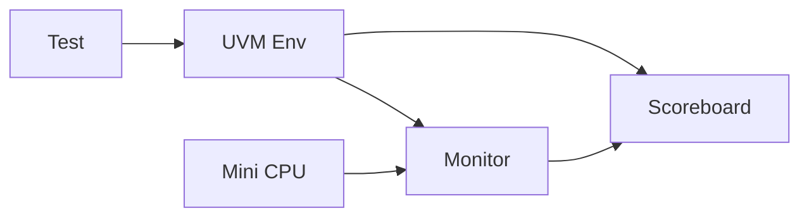

# 🧠 06 — Mini CPU UVM Project

Questa pagina raccoglie tutti i file del progetto:

👉 Mini CPU + ambiente UVM completo

📌 [Repository](https://github.com/gmorimac-droid/corso-microelettronica/tree/main/code/uvm/uvm_mini_CPU)

---

# 📁 Struttura del progetto

```text
uvm_mini_CPU/
├── rt/
│   └── mini_CPU.v
├── tb/
│   ├── mini_cpu_if.sv
│   ├── mini_cpu_bind.sv
│   ├── mini_cpu_pkg.sv
│   ├── mini_cpu_top.sv
│   └── tests/
│       ├── base_test.sv
│       ├── smoke_test.sv
│       ├── alu_test.sv
│       └── branch_test.sv
```

---

# 🔵 RTL — CPU

## 📄 mini_CPU.v

- 🔗 [mini CPU](https://github.com/gmorimac-droid/corso-microelettronica/blob/main/code/uvm/uvm_mini_CPU/rtl/mini_CPU.v)

### 🧠 Descrizione

La mini CPU implementa:

- Program Counter (PC)
- Instruction Memory (`imem`)
- Register File (4 registri)
- ALU
- Branch logic
- HALT

### ⚠️ Nota

Il DUT espone solo:

```text
clk, rst_n
```

👉 Tutto il resto è interno → si usa `bind` in UVM

---

# 🟡 Testbench — Infrastruttura UVM

📁 Cartella:
- 🔗 [Testbench](https://github.com/gmorimac-droid/corso-microelettronica/tree/main/code/uvm/uvm_mini_CPU/tb)

---

## 📄 [mini_cpu_if.sv](https://github.com/gmorimac-droid/corso-microelettronica/blob/main/code/uvm/uvm_mini_CPU/tb/mini_cpu_if.sv)

### 🧠 Ruolo

Interface che espone lo stato interno:

- PC
- opcode
- registri
- zero_flag
- halted

---

## 📄 [mini_cpu_bind.sv](https://github.com/gmorimac-droid/corso-microelettronica/blob/main/code/uvm/uvm_mini_CPU/tb/mini_cpu_bind.sv)

### 🧠 Ruolo

Collega i segnali interni del DUT all’interfaccia UVM.

### 🔥 Punto chiave

👉 Permette osservazione senza modificare il DUT

---

## 📄 [mini_cpu_pkg.sv](https://github.com/gmorimac-droid/corso-microelettronica/blob/main/code/uvm/uvm_mini_CPU/tb/mini_cpu_pkg.sv)

### 🧠 Contenuto

- transaction (state item)
- monitor
- scoreboard
- environment

### 🎯 Punto chiave

👉 Contiene il **reference model della CPU**

---

## 📄 [mini_cpu_top.sv](https://github.com/gmorimac-droid/corso-microelettronica/blob/main/code/uvm/uvm_mini_CPU/tb/mini_cpu_top.sv)

### 🧠 Ruolo

Top di simulazione:

- clock
- DUT
- interface
- bind
- avvio UVM (`run_test()`)

---

# 🟢 Tests — Programmi di verifica

📁 Cartella:
- 🔗 [Tests](https://github.com/gmorimac-droid/corso-microelettronica/tree/main/code/uvm/uvm_mini_CPU/tb/tests)

---

## 📄 [base_test.sv](https://github.com/gmorimac-droid/corso-microelettronica/blob/main/code/uvm/uvm_mini_CPU/tb/tests/base_test.sv)

### 🧠 Ruolo

Test base che gestisce:

- reset
- caricamento programma (`imem`)
- accesso all’ambiente UVM

---

## 📄 [smoke_test.sv](https://github.com/gmorimac-droid/corso-microelettronica/blob/main/code/uvm/uvm_mini_CPU/tb/tests/smoke_test.sv)

### 🧠 Obiettivo

Test base CPU:

- LOADI
- ADD
- MOV
- SUB
- JZ
- HALT

👉 Primo test da far passare sempre

---

## 📄 [alu_test.sv](https://github.com/gmorimac-droid/corso-microelettronica/blob/main/code/uvm/uvm_mini_CPU/tb/tests/alu_test.sv)

### 🧠 Obiettivo

Test ALU:

- AND
- OR
- XOR

---

## 📄 [branch_test.sv](https://github.com/gmorimac-droid/corso-microelettronica/blob/main/code/uvm/uvm_mini_CPU/tb/tests/branch_test.sv)

### 🧠 Obiettivo

Test branch:

- SUB → zero_flag
- JZ (jump taken)
- verifica salto corretto

---

# 🔴 Flusso di verifica



---

# 🧠 Come leggere il progetto

## Step consigliati

1. 👉 Parti da `mini_CPU.v`
2. 👉 Guarda `mini_cpu_bind.sv`
3. 👉 Capisci `mini_cpu_if.sv`
4. 👉 Studia `mini_cpu_pkg.sv`
5. 👉 Guarda i test

---

# ⚠️ Limite importante

Il DUT:

- non ha bus
- non ha interfacce esterne

👉 quindi:

- niente driver UVM classico
- solo monitor + scoreboard

---

# 🚀 Upgrade possibili

Per rendere il progetto più professionale:

- aggiungere **coverage**
- aggiungere **assertions**
- generazione random di programmi
- aggiungere interfaccia AXI o memoria esterna

---

# 🎯 Conclusione

Questo progetto è un esempio completo di:

- UVM applicato a una CPU
- verifica instruction-level
- uso di bind + monitor + scoreboard

👉 Ottima base per progetti più complessi

---