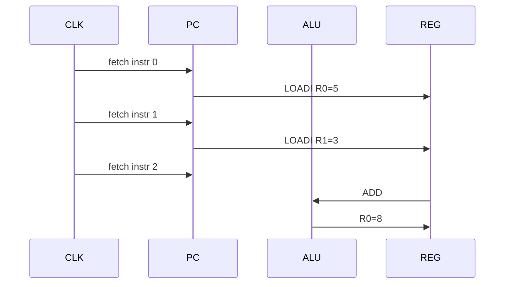

# 🔬 Esecuzione CPU passo passo (waveform-level)

Questa sezione mostra cosa succede **ciclo per ciclo** nella CPU.

👉 Obiettivo: capire come evolve lo stato interno:

- PC
- opcode
- registri
- ALU
- flag
- HALT

---

# 🧠 Modello mentale

Ogni ciclo di clock:

```text
FETCH → DECODE → EXECUTE → WRITEBACK → PC update
```

---

# 📊 Esempio programma

```text
0: LOADI R0, 5
1: LOADI R1, 3
2: ADD   R0, R1
3: SUB   R0, R1
4: HALT
```

---

# ⏱️ Timeline ciclo per ciclo

## Stato iniziale

| Segnale | Valore |
|--------|--------|
| PC | 0 |
| R0-R3 | 0 |
| zero_flag | 0 |
| halted | 0 |

---

# 🔵 Ciclo 1 — LOADI R0, 5

## Fetch

```text
PC = 0 → imem[0]
```

## Decode

```text
opcode = LOADI
rd = R0
imm = 5
```

## Execute

```text
R0 = 5
zero_flag = 0
```

## Fine ciclo

| Segnale | Valore |
|--------|--------|
| PC | 1 |
| R0 | 5 |

---

# 🔵 Ciclo 2 — LOADI R1, 3

## Execute

```text
R1 = 3
```

## Fine ciclo

| PC | R0 | R1 |
|----|----|----|
| 2  | 5  | 3  |

---

# 🔵 Ciclo 3 — ADD R0, R1

## Execute

```text
ALU = 5 + 3 = 8
R0 = 8
zero_flag = 0
```

## Fine ciclo

| PC | R0 |
|----|----|
| 3  | 8  |

---

# 🔵 Ciclo 4 — SUB R0, R1

## Execute

```text
ALU = 8 - 3 = 5
R0 = 5
zero_flag = 0
```

---

# 🔵 Ciclo 5 — HALT

## Execute

```text
halted = 1
PC fermo
```

---

# 📉 Waveform concettuale



---

# 🧠 Cosa vedere in simulazione

Apri waveform e osserva:

## 🔑 segnali fondamentali

- `pc`
- `opcode`
- `regfile[0..3]`
- `zero_flag`
- `halted`

---

# 🔍 Debug checklist

---

## ✔️ PC

```text
PC deve incrementare ogni ciclo
```

---

## ✔️ LOADI

```text
registro ← immediato
```

---

## ✔️ ADD/SUB

```text
usa valore aggiornato del registro
```

---

## ✔️ zero_flag

```text
= 1 solo se risultato == 0
```

---

## ✔️ HALT

```text
PC smette di cambiare
```

---

# ⚠️ Errori tipici (waveform-level)

---

## ❌ PC salta male

👉 bug in:

- JMP
- JZ

---

## ❌ registro non aggiornato

👉 problema in writeback

---

## ❌ zero_flag sbagliato

👉 ALU non corretta

---

## ❌ HALT non ferma

👉 manca gating su PC

---

# 🔥 Insight fondamentale

👉 Questa CPU è **single-cycle**

Quindi:

```text
1 istruzione = 1 ciclo
```

---

# 🧠 Differenza con CPU reali

| Questa CPU | CPU reale |
|-----------|----------|
| 1 ciclo | pipeline |
| semplice | hazard |
| debug facile | debug difficile |

---

# 🚀 Come usare questa sezione

1. lancia simulazione UVM
2. apri waveform
3. segui ciclo per ciclo
4. confronta con questa tabella

---

# 🎯 Frase chiave

👉 **Se capisci il waveform, hai capito la CPU**

---