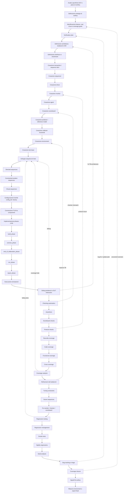

## Flusso di progettazione UVM

```mermaid

flowchart TD
    A[Analisi specifiche DUT e piano di verifica] --> B[Definizione strategia di verifica]
    B --> C[Identificazione feature, casi d'uso e coverage goals]
    C --> D[Verification plan]
    D --> E[Definizione architettura testbench UVM]

    E --> F[Definizione interfacce e clock/reset]
    F --> G[Creazione transaction / sequence item]
    G --> H[Creazione sequencer]
    H --> I[Creazione driver]
    I --> J[Creazione monitor]
    J --> K[Creazione agent]
    K --> L[Creazione scoreboard]
    L --> M[Creazione predictor / reference model]
    M --> N[Creazione collector funzionali]
    N --> O[Creazione environment]
    O --> P[Creazione test base]

    P --> Q[Sviluppo sequenze di test]
    Q --> Q1[Directed sequences]
    Q1 --> Q2[Constrained-random sequences]
    Q2 --> Q3[Virtual sequences]
    Q3 --> R[Configurazione tramite config_db / factory]

    R --> S[Connessione TLM tra componenti]
    S --> T[Implementazione phases UVM]
    T --> T1[build_phase]
    T1 --> T2[connect_phase]
    T2 --> T3[end_of_elaboration_phase]
    T3 --> T4[run_phase]
    T4 --> T5[report_phase]

    T5 --> U[Esecuzione simulazioni]
    U --> V[Debug testbench e DUT interaction]
    V --> W[Checking automatico]
    W --> W1[Assertions]
    W1 --> W2[Scoreboard checks]
    W2 --> W3[Protocol checks]

    W3 --> X[Raccolta coverage]
    X --> X1[Code coverage]
    X1 --> X2[Functional coverage]
    X2 --> X3[Cross coverage]
    X3 --> Y[Coverage analysis]

    Y --> Z[Refinement del testbench]
    Z --> Z1[Tuning constraints]
    Z1 --> Z2[Nuove sequences]
    Z2 --> Z3[Fix monitor / checker / scoreboard]
    Z3 --> AA[Regression testing]

    AA --> AB[Regression management]
    AB --> AB1[Smoke tests]
    AB1 --> AB2[Nightly regressions]
    AB2 --> AB3[Seed analysis]
    AB3 --> AC[Bug tracking e triage]

    AC --> AD[Coverage closure]
    AD --> AE[Signoff di verifica]
    AE --> AF[Rilascio environment e report finali]

    %% Feedback loops
    V -. debug .-> Q
    V -. fix TB architecture .-> E
    W -. checker mismatch .-> L
    W3 -. protocol issue .-> J
    Y -. coverage hole .-> Q
    Z -. improve TB .-> O
    AA -. failing tests .-> Q
    AC -. bug fix / update plan .-> D
    AD -. uncovered scenario .-> C
	
```