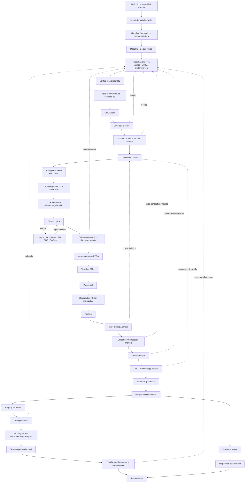

## Flusso di progettazione FPGA

```mermaid

flowchart TD
    A[Definizione requisiti di sistema] --> B[Architettura di alto livello]
    B --> C[Specifica funzionale e microarchitettura]
    C --> D[Modeling / Golden Model]
    D --> E[Progettazione RTL<br/>Verilog / VHDL / SystemVerilog]

    E --> F[Verifica funzionale RTL]
    F --> F1[Testbench / UVM / Self-checking TB]
    F1 --> F2[Simulazione]
    F2 --> F3[Coverage closure]
    F3 --> G[Lint / CDC / RDC / Static checks]

    G --> H[Definizione vincoli]
    H --> H1[Timing constraints<br/>XDC / SDC]
    H1 --> H2[Pin assignment / I/O constraints]
    H2 --> H3[Clock definition e false/multicycle paths]

    H3 --> I[Sintesi logica]
    I --> J[Ottimizzazione RTL / Synthesis reports]
    J --> K[Implementazione FPGA]

    K --> K1[Translate / Map]
    K1 --> K2[Placement]
    K2 --> K3[Clock routing / Clock optimization]
    K3 --> K4[Routing]

    K4 --> L[Static Timing Analysis]
    L --> M[Utilization / Congestion analysis]
    M --> N[Power analysis]
    N --> O[DRC / Methodology checks]

    O --> P[Bitstream generation]
    P --> Q[Programmazione FPGA]
    Q --> R[Bring-up hardware]
    R --> S[Debug on board]

    S --> S1[ILA / SignalTap / Embedded logic analyzer]
    S1 --> S2[Test con periferiche reali]
    S2 --> S3[Validazione funzionale e prestazionale]
    S3 --> T[Release finale]

    %% Optional / advanced steps
    I -. uso IP .-> U[Integrazione IP cores / PLL / DDR / SerDes]
    U -. rigenerazione .-> I

    Q --> V[Prototype testing]
    V --> W[Regression su hardware]
    W --> T

    %% Feedback loops
    F3 -. bug fix .-> E
    G -. fix RTL .-> E
    J -. ottimizzazione .-> E
    L -. timing violation .-> H
    M -. area congestion / risorse .-> E
    N -. ottimizzazione potenza .-> E
    O -. constraint / design fix .-> H
    S -. debug fix .-> E
    S3 -. issue found on board .-> E
	
```