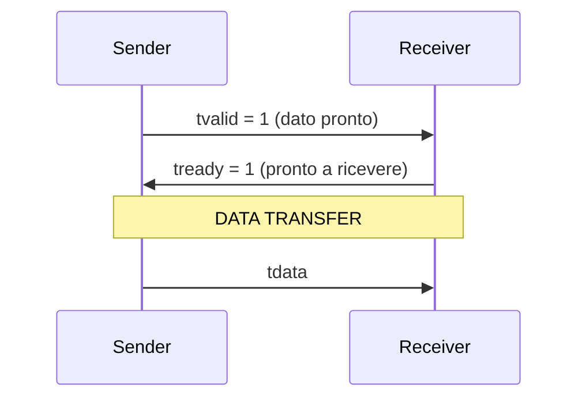
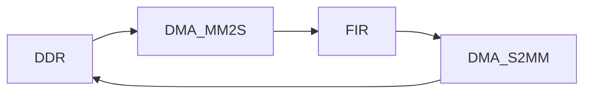

# 🧠 Zynq AXI & AXI-Stream — Comprensione Profonda

Questa pagina spiega:

- come funziona AXI (memory-mapped vs stream)
- handshake AXI-Stream
- timing diagram
- cosa succede **ciclo per ciclo**
- errori tipici di progettazione

---

# 🔵 1. AXI: i due mondi

## AXI Memory Mapped (AXI4)

👉 Usato tra:
- PS ↔ DDR
- PS ↔ AXI DMA (config)

Caratteristiche:
- indirizzi
- lettura/scrittura
- transazioni complesse

---

## AXI Stream (AXI4-Stream)

👉 Usato tra:
- DMA ↔ FIR
- acceleratori hardware

Caratteristiche:
- **NO indirizzi**
- dati continui
- handshake semplice

---

# 🎯 Differenza fondamentale

| AXI4 | AXI4-Stream |
|------|------------|
| indirizzi | stream continuo |
| CPU-like | pipeline-like |
| lento ma flessibile | veloce e deterministico |

---

# 🔁 2. Segnali AXI-Stream

Interfaccia base:

```text
tdata   → dato
tvalid  → dato valido
tready  → pronto a ricevere
tlast   → fine pacchetto
```

---

# ⚙️ 3. Handshake fondamentale

👉 Un trasferimento avviene SOLO quando:

```
tvalid == 1 AND tready == 1
```

---

# 📊 4. Timing diagram AXI-Stream



---

# 🧠 5. Ciclo per ciclo (IMPORTANTISSIMO)

Esempio reale:

| Clock | tvalid | tready | Trasferimento |
|------|--------|--------|--------------|
| 0 | 1 | 0 | ❌ NO |
| 1 | 1 | 1 | ✅ SI |
| 2 | 1 | 1 | ✅ SI |
| 3 | 0 | 1 | ❌ NO |

👉 Il dato passa SOLO nei cicli 1 e 2

---

# 🔥 Regola d’oro

👉 **Se manca uno dei due → il dato NON passa**

---

# ⚠️ 6. Errori tipici (IMPORTANTISSIMO)

---

## ❌ Ignorare tready

```verilog
if (tvalid)
    send_data();
```

👉 SBAGLIATO ❌

---

## ✅ Corretto

```verilog
if (tvalid && tready)
    send_data();
```

---

## ❌ Non gestire backpressure

Se `tready = 0`:

👉 devi fermarti

---

## ❌ Perdere dati

Se scrivi:

```verilog
if (tvalid)
    next_data();
```

👉 perdi dati quando `tready=0`

---

# 🔁 7. Backpressure

👉 Il receiver può dire:

```text
STOP → tready = 0
```

E il sender deve fermarsi.

---

# 📊 Esempio reale

| Clock | tvalid | tready | Azione |
|------|--------|--------|--------|
| 0 | 1 | 1 | trasferisci |
| 1 | 1 | 0 | STOP |
| 2 | 1 | 0 | STOP |
| 3 | 1 | 1 | riprendi |

---

# 🔵 8. AXI DMA nel dettaglio

## Due canali indipendenti

| Nome | Direzione |
|------|----------|
| MM2S | memoria → stream |
| S2MM | stream → memoria |

---

## Flusso completo



---

# 🧠 9. Cosa succede davvero (ciclo per ciclo)

---

## STEP 1 — PS prepara dati

```c
tx_buffer[i] = i;
```

---

## STEP 2 — DMA MM2S legge DDR

```text
DDR → AXI → DMA → stream
```

---

## STEP 3 — Stream entra nel FIR

Condizione:

```text
tvalid = 1
tready = 1
```

---

## STEP 4 — FIR elabora

Internamente:

```text
shift register
+
multiply
+
accumulate
```

---

## STEP 5 — FIR produce output

```text
m_axis_tvalid = 1
```

---

## STEP 6 — DMA riceve

```text
stream → DMA → DDR
```

---

## STEP 7 — PS legge risultato

```c
rx_buffer[i]
```

---

# 🔬 10. Pipeline reale

Nel FIR:

```text
Input → Delay line → MAC → Output
```

Ogni clock:

- entra un campione
- esce un campione (dopo latenza)

---

# ⚠️ 11. Problema classico: tlast

👉 `tlast` indica fine buffer

Se lo perdi:

- DMA non termina
- programma si blocca

---

## ✔️ Regola

```verilog
tlast deve seguire il dato
```

---

# ❌ Errore comune

```verilog
m_axis_tlast <= s_axis_tlast;
```

👉 sbagliato se hai pipeline

---

# ✅ Corretto

👉 pipeline anche `tlast`

---

# 🧠 12. Throughput vs Latency

---

## Throughput

👉 quanti dati per clock

- FIR = 1 sample / clock ✔️

---

## Latency

👉 ritardo

- FIR 8 tap → ~8 cicli

---

# 📊 Differenza

| Concetto | Significato |
|---------|------------|
| Throughput | velocità |
| Latency | ritardo |

---

# 🔥 13. Caso reale nel tuo progetto

---

## Loopback

- latenza ≈ 1 ciclo
- throughput = 1/ciclo

---

## FIR

- latenza > 1
- throughput = 1/ciclo

---

# 🧠 14. Debug mentale

Quando qualcosa non funziona:

👉 chiediti SEMPRE:

1. `tvalid` arriva?
2. `tready` è alto?
3. `tlast` passa?
4. clock/reset OK?

---

# 🧪 15. Metodo di debug professionale

---

## STEP 1
Loopback

## STEP 2
Controllo segnali AXI

## STEP 3
Inserire FIR

## STEP 4
Confronto SW vs HW

---

# 🚀 16. Livello successivo

Dopo questa pagina sei pronto per:

- pipeline complesse
- DSP accelerators
- AI accelerators
- video processing

---

# 🎯 Conclusione

Se capisci questa pagina:

👉 hai capito davvero AXI-Stream

👉 sei già oltre il 90% degli utenti FPGA base

---

# 🧠 Frase chiave finale

👉 **AXI-Stream = handshake + pipeline + disciplina**

---
