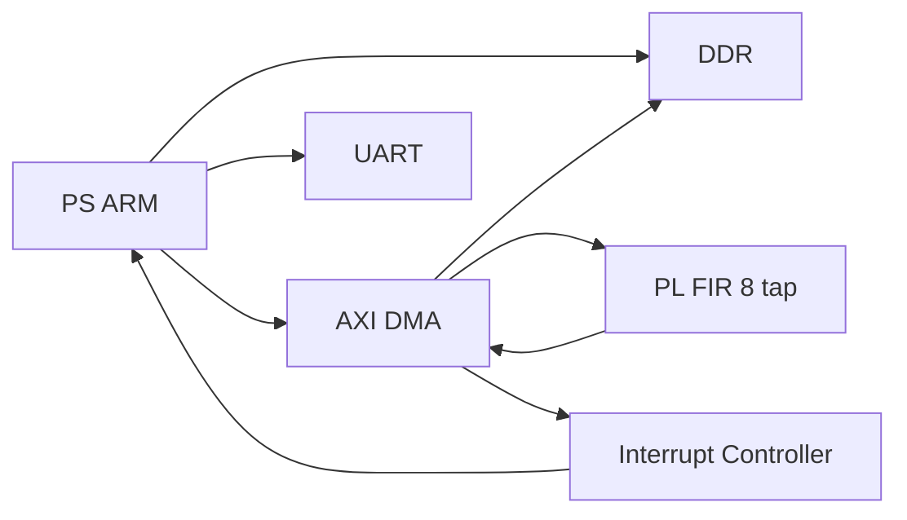

# 🚀 Zynq AXI DMA — Interrupt + misura performance HW vs SW

Questa pagina estende il progetto **Zynq + AXI DMA + FIR 8 tap** con:

- uso del **DMA in interrupt mode**
- misura delle prestazioni
- confronto **hardware vs software**

---

# 🎯 Obiettivi

Alla fine di questa estensione il sistema sarà capace di:

- trasferire i buffer usando **interrupt** invece del polling
- misurare il tempo di esecuzione del FIR software
- misurare il tempo di esecuzione del FIR hardware + DMA
- confrontare i risultati

---

# 🧠 Perché farlo

Nel progetto precedente usavi:

- DMA in **polling**
- nessuna misura quantitativa delle prestazioni

Questa versione è più realistica perché:

- libera la CPU dall’attesa attiva
- usa il DMA come periferca vera
- permette di quantificare il vantaggio dell’accelerazione hardware

---

# 🔵 1. Cosa supporta AXI DMA

L’AXI DMA supporta:

- **Simple DMA**
- **Interrupts**
- **Scatter-Gather** opzionale

Per il nostro progetto continuiamo a usare **Simple DMA**, ma in modalità **interrupt**. Il driver ufficiale AMD/Xilinx include esempi sia **simple poll** sia **simple interrupt**. :contentReference[oaicite:1]{index=1}

---

# 🔁 2. Architettura aggiornata



---

# 🧠 3. Linee interrupt del DMA

Il core AXI DMA espone due uscite interrupt dedicate:

- `mm2s_introut`
- `s2mm_introut`

Nel sistema tipico queste vanno al controller interrupt del PS. :contentReference[oaicite:2]{index=2}

---

# ⚙️ 4. Configurazione hardware in Vivado

---

## STEP 1 — Apri il block design

Riapri il progetto Vivado del FIR con DMA.

---

## STEP 2 — Verifica presenza AXI DMA

Il blocco `axi_dma_0` deve già essere presente.

---

## STEP 3 — Verifica che il PS abbia le interfacce interrupt abilitate

Nel blocco `ZYNQ7 Processing System`:

- apri la configurazione
- verifica che la porta **IRQ_F2P** sia abilitata, se la tua configurazione la richiede

---

## STEP 4 — Collega gli interrupt del DMA al PS

Collega:

- `axi_dma_0/mm2s_introut`
- `axi_dma_0/s2mm_introut`

verso il controller interrupt del PS, tipicamente tramite `IRQ_F2P`.

⚠️ In molte configurazioni Vivado usa un **concat** per unire più interrupt in un bus.

---

## STEP 5 — Validate Design

Click:

👉 **Validate Design**

---

## STEP 6 — Rigenera bitstream

Esegui:

- Synthesis
- Implementation
- Generate Bitstream

---

## STEP 7 — Esporta di nuovo `.xsa`

Esporta l’hardware aggiornato.

⚠️ Senza questo passaggio Vitis non vedrà la nuova configurazione interrupt.

---

# 💻 5. Strategia software

Il software farà queste cose:

1. inizializza il DMA
2. configura il controller interrupt
3. registra due ISR:
   - TX complete
   - RX complete
4. prepara i buffer
5. misura il FIR software
6. misura il FIR hardware
7. confronta tempi e risultati

---

# 📂 6. File software consigliati

```text
src/
├── main.c
├── fir_ref.c
├── fir_ref.h
├── dma_intr.c
└── dma_intr.h
```

---

# 📄 7. `dma_intr.h`

```c
#ifndef DMA_INTR_H
#define DMA_INTR_H

#include "xaxidma.h"
#include "xscugic.h"

extern volatile int TxDone;
extern volatile int RxDone;
extern volatile int Error;

int SetupIntrSystem(XScuGic *IntcInstancePtr, XAxiDma *AxiDmaPtr,
                    u16 TxIntrId, u16 RxIntrId);
void DisableIntrSystem(XScuGic *IntcInstancePtr,
                       u16 TxIntrId, u16 RxIntrId);

void TxIntrHandler(void *Callback);
void RxIntrHandler(void *Callback);

#endif
```

---

# 📄 8. `dma_intr.c`

Questo file gestisce gli interrupt del DMA.

```c
#include "xaxidma.h"
#include "xscugic.h"
#include "xil_exception.h"
#include "xil_printf.h"
#include "dma_intr.h"

volatile int TxDone;
volatile int RxDone;
volatile int Error;

static XScuGic *GicPtr;

void TxIntrHandler(void *Callback)
{
    XAxiDma *AxiDmaInst = (XAxiDma *)Callback;
    u32 IrqStatus;

    IrqStatus = XAxiDma_IntrGetIrq(AxiDmaInst, XAXIDMA_DMA_TO_DEVICE);
    XAxiDma_IntrAckIrq(AxiDmaInst, IrqStatus, XAXIDMA_DMA_TO_DEVICE);

    if (!(IrqStatus & XAXIDMA_IRQ_ALL_MASK))
        return;

    if ((IrqStatus & XAXIDMA_IRQ_ERROR_MASK)) {
        Error = 1;
        XAxiDma_Reset(AxiDmaInst);
        while (!XAxiDma_ResetIsDone(AxiDmaInst)) {
        }
        return;
    }

    if ((IrqStatus & XAXIDMA_IRQ_IOC_MASK))
        TxDone = 1;
}

void RxIntrHandler(void *Callback)
{
    XAxiDma *AxiDmaInst = (XAxiDma *)Callback;
    u32 IrqStatus;

    IrqStatus = XAxiDma_IntrGetIrq(AxiDmaInst, XAXIDMA_DEVICE_TO_DMA);
    XAxiDma_IntrAckIrq(AxiDmaInst, IrqStatus, XAXIDMA_DEVICE_TO_DMA);

    if (!(IrqStatus & XAXIDMA_IRQ_ALL_MASK))
        return;

    if ((IrqStatus & XAXIDMA_IRQ_ERROR_MASK)) {
        Error = 1;
        XAxiDma_Reset(AxiDmaInst);
        while (!XAxiDma_ResetIsDone(AxiDmaInst)) {
        }
        return;
    }

    if ((IrqStatus & XAXIDMA_IRQ_IOC_MASK))
        RxDone = 1;
}

int SetupIntrSystem(XScuGic *IntcInstancePtr, XAxiDma *AxiDmaPtr,
                    u16 TxIntrId, u16 RxIntrId)
{
    int Status;
    XScuGic_Config *IntcConfig;

    GicPtr = IntcInstancePtr;

    IntcConfig = XScuGic_LookupConfig(XPAR_SCUGIC_SINGLE_DEVICE_ID);
    if (NULL == IntcConfig)
        return XST_FAILURE;

    Status = XScuGic_CfgInitialize(IntcInstancePtr, IntcConfig,
                                   IntcConfig->CpuBaseAddress);
    if (Status != XST_SUCCESS)
        return XST_FAILURE;

    Xil_ExceptionInit();

    Xil_ExceptionRegisterHandler(XIL_EXCEPTION_ID_INT,
                                 (Xil_ExceptionHandler)XScuGic_InterruptHandler,
                                 IntcInstancePtr);

    Status = XScuGic_Connect(IntcInstancePtr, TxIntrId,
                             (Xil_ExceptionHandler)TxIntrHandler,
                             AxiDmaPtr);
    if (Status != XST_SUCCESS)
        return Status;

    Status = XScuGic_Connect(IntcInstancePtr, RxIntrId,
                             (Xil_ExceptionHandler)RxIntrHandler,
                             AxiDmaPtr);
    if (Status != XST_SUCCESS)
        return Status;

    XScuGic_Enable(IntcInstancePtr, TxIntrId);
    XScuGic_Enable(IntcInstancePtr, RxIntrId);

    XAxiDma_IntrDisable(AxiDmaPtr, XAXIDMA_IRQ_ALL_MASK, XAXIDMA_DMA_TO_DEVICE);
    XAxiDma_IntrDisable(AxiDmaPtr, XAXIDMA_IRQ_ALL_MASK, XAXIDMA_DEVICE_TO_DMA);

    XAxiDma_IntrEnable(AxiDmaPtr, XAXIDMA_IRQ_IOC_MASK | XAXIDMA_IRQ_ERROR_MASK,
                       XAXIDMA_DMA_TO_DEVICE);
    XAxiDma_IntrEnable(AxiDmaPtr, XAXIDMA_IRQ_IOC_MASK | XAXIDMA_IRQ_ERROR_MASK,
                       XAXIDMA_DEVICE_TO_DMA);

    Xil_ExceptionEnable();

    return XST_SUCCESS;
}

void DisableIntrSystem(XScuGic *IntcInstancePtr,
                       u16 TxIntrId, u16 RxIntrId)
{
    XScuGic_Disable(IntcInstancePtr, TxIntrId);
    XScuGic_Disable(IntcInstancePtr, RxIntrId);

    XScuGic_Disconnect(IntcInstancePtr, TxIntrId);
    XScuGic_Disconnect(IntcInstancePtr, RxIntrId);
}
```

---

# 🧠 9. Perché questi bit interrupt

In simple mode, per abilitare gli interrupt ti interessano soprattutto:

- `IOC_IrqEn` → interrupt on complete
- `Err_IrqEn` → interrupt on error

È esattamente quello che descrive PG021 per il **Direct Register Mode (Simple DMA)**. :contentReference[oaicite:3]{index=3}

---

# 📄 10. `fir_ref.h`

```c
#ifndef FIR_REF_H
#define FIR_REF_H

#include <stdint.h>

void fir8_reference(const int16_t *in, int16_t *out, int n);

#endif
```

---

# 📄 11. `fir_ref.c`

```c
#include "fir_ref.h"

void fir8_reference(const int16_t *in, int16_t *out, int n)
{
    static const int16_t h[8] = {-8, 0, 40, 96, 96, 40, 0, -8};

    for (int i = 0; i < n; i++) {
        int32_t acc = 0;

        for (int k = 0; k < 8; k++) {
            int idx = i - k;
            int16_t x = (idx >= 0) ? in[idx] : 0;
            acc += x * h[k];
        }

        out[i] = (int16_t)(acc >> 8);
    }
}
```

---

# 📄 12. `main.c`

Questa versione misura:

- FIR software
- FIR hardware via DMA interrupt

Per misurare il tempo usa `XTime_GetTime()`.

```c
#include <stdint.h>
#include "xparameters.h"
#include "xaxidma.h"
#include "xscugic.h"
#include "xil_cache.h"
#include "xil_printf.h"
#include "xtime_l.h"

#include "fir_ref.h"
#include "dma_intr.h"

#define DMA_DEV_ID           XPAR_AXIDMA_0_DEVICE_ID
#define INTC_DEVICE_ID       XPAR_SCUGIC_SINGLE_DEVICE_ID

#define TX_INTR_ID           XPAR_FABRIC_AXI_DMA_0_MM2S_INTROUT_INTR
#define RX_INTR_ID           XPAR_FABRIC_AXI_DMA_0_S2MM_INTROUT_INTR

#define NSAMPLES             256
#define BYTES_PER_SAMPLE     2
#define TX_SIZE_BYTES        (NSAMPLES * BYTES_PER_SAMPLE)
#define RX_SIZE_BYTES        (NSAMPLES * BYTES_PER_SAMPLE)

static XAxiDma AxiDma;
static XScuGic Intc;

static int16_t tx_buffer[NSAMPLES] __attribute__ ((aligned(64)));
static int16_t rx_buffer[NSAMPLES] __attribute__ ((aligned(64)));
static int16_t sw_buffer[NSAMPLES] __attribute__ ((aligned(64)));

static int init_dma(void)
{
    XAxiDma_Config *CfgPtr;
    int Status;

    CfgPtr = XAxiDma_LookupConfig(DMA_DEV_ID);
    if (!CfgPtr) {
        xil_printf("Errore: config DMA non trovata\r\n");
        return XST_FAILURE;
    }

    Status = XAxiDma_CfgInitialize(&AxiDma, CfgPtr);
    if (Status != XST_SUCCESS) {
        xil_printf("Errore: init DMA fallita\r\n");
        return XST_FAILURE;
    }

    if (XAxiDma_HasSg(&AxiDma)) {
        xil_printf("Errore: DMA in SG mode, atteso simple mode\r\n");
        return XST_FAILURE;
    }

    return XST_SUCCESS;
}

static void prepare_input(void)
{
    for (int i = 0; i < NSAMPLES; i++) {
        tx_buffer[i] = (int16_t)(i & 0xFF);
        rx_buffer[i] = 0;
        sw_buffer[i] = 0;
    }
}

static int run_hw_fir_interrupt(XTime *t_start, XTime *t_end)
{
    int Status;

    TxDone = 0;
    RxDone = 0;
    Error  = 0;

    Xil_DCacheFlushRange((UINTPTR)tx_buffer, TX_SIZE_BYTES);
    Xil_DCacheFlushRange((UINTPTR)rx_buffer, RX_SIZE_BYTES);

    XTime_GetTime(t_start);

    Status = XAxiDma_SimpleTransfer(&AxiDma,
                                    (UINTPTR)rx_buffer,
                                    RX_SIZE_BYTES,
                                    XAXIDMA_DEVICE_TO_DMA);
    if (Status != XST_SUCCESS) {
        xil_printf("Errore: avvio S2MM fallito\r\n");
        return XST_FAILURE;
    }

    Status = XAxiDma_SimpleTransfer(&AxiDma,
                                    (UINTPTR)tx_buffer,
                                    TX_SIZE_BYTES,
                                    XAXIDMA_DMA_TO_DEVICE);
    if (Status != XST_SUCCESS) {
        xil_printf("Errore: avvio MM2S fallito\r\n");
        return XST_FAILURE;
    }

    while ((!TxDone || !RxDone) && !Error) {
    }

    XTime_GetTime(t_end);

    if (Error) {
        xil_printf("Errore DMA interrupt\r\n");
        return XST_FAILURE;
    }

    Xil_DCacheInvalidateRange((UINTPTR)rx_buffer, RX_SIZE_BYTES);

    return XST_SUCCESS;
}

static void run_sw_fir(XTime *t_start, XTime *t_end)
{
    XTime_GetTime(t_start);
    fir8_reference(tx_buffer, sw_buffer, NSAMPLES);
    XTime_GetTime(t_end);
}

static int verify_output(void)
{
    int errors = 0;

    for (int i = 0; i < NSAMPLES; i++) {
        if (rx_buffer[i] != sw_buffer[i]) {
            xil_printf("Mismatch [%d]: HW=%d SW=%d\r\n",
                       i, rx_buffer[i], sw_buffer[i]);
            errors++;
            if (errors > 10)
                break;
        }
    }

    if (errors == 0) {
        xil_printf("Verifica OK\r\n");
        return XST_SUCCESS;
    } else {
        xil_printf("Verifica FALLITA: %d errori\r\n", errors);
        return XST_FAILURE;
    }
}

int main(void)
{
    int Status;
    XTime sw_start, sw_end;
    XTime hw_start, hw_end;
    u64 sw_cycles, hw_cycles;

    xil_printf("==== FIR 8 tap: SW vs HW + DMA interrupt ====\r\n");

    Status = init_dma();
    if (Status != XST_SUCCESS)
        return XST_FAILURE;

    Status = SetupIntrSystem(&Intc, &AxiDma, TX_INTR_ID, RX_INTR_ID);
    if (Status != XST_SUCCESS) {
        xil_printf("Errore: setup interrupt fallita\r\n");
        return XST_FAILURE;
    }

    prepare_input();

    run_sw_fir(&sw_start, &sw_end);

    Status = run_hw_fir_interrupt(&hw_start, &hw_end);
    if (Status != XST_SUCCESS)
        return XST_FAILURE;

    Status = verify_output();

    sw_cycles = (u64)(sw_end - sw_start);
    hw_cycles = (u64)(hw_end - hw_start);

    xil_printf("SW cycles: %llu\r\n", sw_cycles);
    xil_printf("HW cycles: %llu\r\n", hw_cycles);

    if (hw_cycles != 0) {
        xil_printf("Speedup approx: %d x\r\n", (int)(sw_cycles / hw_cycles));
    }

    xil_printf("Primi 16 campioni:\r\n");
    for (int i = 0; i < 16; i++) {
        xil_printf("[%d] in=%d hw=%d sw=%d\r\n",
                   i, tx_buffer[i], rx_buffer[i], sw_buffer[i]);
    }

    DisableIntrSystem(&Intc, TX_INTR_ID, RX_INTR_ID);

    return Status;
}
```

---

# 🧠 13. Nota sui simboli interrupt

I nomi:

```c
XPAR_FABRIC_AXI_DMA_0_MM2S_INTROUT_INTR
XPAR_FABRIC_AXI_DMA_0_S2MM_INTROUT_INTR
```

sono esempi molto comuni, ma devi sempre controllare i nomi reali generati nel tuo `xparameters.h`.

---

# ⏱️ 14. Come interpretare la misura dei tempi

Qui stai confrontando:

## Software
Tempo per eseguire il FIR in C sul PS

## Hardware
Tempo totale di:
- setup DMA
- trasferimento input
- elaborazione nel PL
- trasferimento output

Quindi il confronto è onesto solo se intendi il blocco hardware come **acceleratore completo di I/O**.

---

# 🔍 15. Cosa aspettarti davvero

Per buffer piccoli, il vantaggio hardware può essere modesto o persino nullo, perché pesano:

- overhead DMA
- setup interrupt
- gestione cache

Per buffer più grandi, il vantaggio del PL tende a diventare più evidente.

Questa osservazione è coerente con l’uso dell’AXI DMA: è pensato per trasferimenti di dati veri, non per micro-buffer minuscoli. :contentReference[oaicite:4]{index=4}

---

# 🧪 16. Strategia di test consigliata

## Test 1
loopback + interrupt

## Test 2
FIR + polling

## Test 3
FIR + interrupt

## Test 4
misura SW vs HW per:
- 256 campioni
- 1024 campioni
- 4096 campioni

---

# ❌ 17. Errori tipici e soluzioni

## DMA non genera interrupt
Controlla:
- linee `mm2s_introut` e `s2mm_introut`
- mapping a `IRQ_F2P`
- ID interrupt corretti in `xparameters.h`

## ISR chiamata ma transfer non finisce
Controlla:
- `tlast` propagato correttamente
- percorso stream completo

## Tempi HW peggiori del SW
Può essere normale con buffer piccoli.

## Error interrupt nel DMA
Il driver AMD/Xilinx raccomanda di fare reset del DMA in caso di errore nel gestore interrupt. Questo è anche il pattern usato negli esempi ufficiali. :contentReference[oaicite:5]{index=5}

---

# 📊 18. Tabella per annotare i risultati

| Campioni | SW cycles | HW cycles | Speedup |
|---------:|----------:|----------:|--------:|
| 256      |           |           |         |
| 1024     |           |           |         |
| 4096     |           |           |         |

---

# 🚀 19. Upgrade successivi

Dopo questa versione puoi fare:

- interrupt con callback più evolute
- timer hardware dedicato
- FIR a 16/32 tap
- coefficienti caricabili via AXI-Lite
- doppio buffering
- stream continuo

---

# 🎯 Conclusione

Con questa estensione hai trasformato il progetto in una piattaforma di accelerazione embedded molto più realistica:

- **PS** come orchestratore
- **DMA** come motore dati
- **PL** come acceleratore
- **interrupt** per completamento ed errori
- **benchmark HW vs SW**

👉 Questo è già un ottimo progetto da portfolio.

---