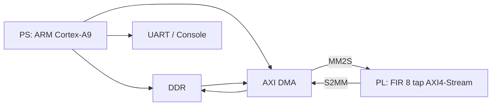

# 🔵 Progetto Zynq completo: PS + AXI DMA + FIR 8 tap in PL

Questa guida realizza un progetto Zynq realistico in cui:

- il **PS** prepara un buffer di campioni in DDR
- un **AXI DMA** invia i campioni al **PL**
- nel **PL** un filtro **FIR a 8 tap** elabora i campioni
- il risultato torna in DDR
- il **PS** confronta l'output hardware con una reference software

---

# 🎯 Obiettivo finale

Costruire un sistema:

- **PS (ARM)** → genera dati e gestisce il DMA
- **AXI DMA** → trasferisce i dati tra DDR e PL
- **PL (FIR 8 tap)** → elabora stream AXI4-Stream
- **UART** → stampa i risultati e il debug

---

# 🧠 Architettura del progetto



---

# 📦 Struttura delle cartelle consigliata

```text
zynq_fir_dma_project/
├── vivado/
│   ├── zynq_fir_dma.xpr
│   ├── design_1.bd
│   ├── design_1_wrapper.v
│   ├── hdl/
│   │   ├── fir8_core.sv
│   │   ├── fir8_axi_stream.sv
│   │   └── axis_loopback.sv
│   └── constraints/
│       └── optional_debug.xdc
│
└── vitis_workspace/
    ├── platform/
    └── fir_dma_app/
        └── src/
            ├── main.c
            ├── fir_ref.c
            └── fir_ref.h
```

---

# 🧰 Requisiti

- Vivado
- Vitis
- scheda Zynq
- collegamento JTAG / USB
- terminale seriale per vedere `xil_printf`

---

# ⚠️ Strategia consigliata

Prima di testare il FIR:

1. fai funzionare il **loopback AXI-Stream**
2. verifica che il DMA trasmetta e riceva correttamente
3. solo dopo sostituisci il loopback con il FIR

Questo ti evita di dover debuggare contemporaneamente:
- DMA
- AXI4-Stream
- algoritmo FIR

---

# PARTE 0 — Preparazione dei file HDL

---

## STEP 1 — Crea la cartella HDL

Nel progetto Vivado crea una cartella tipo:

```text
hdl/
```

Dentro ci metterai:

- `axis_loopback.sv`
- `fir8_core.sv`
- `fir8_axi_stream.sv`

---

## STEP 2 — Crea il modulo di loopback AXI-Stream

Questo serve per il primo test.

File:

```text
hdl/axis_loopback.sv
```

Codice:

```systemverilog
module axis_loopback #(
    parameter int DATA_W = 16
)(
    input  logic                  aclk,
    input  logic                  aresetn,

    input  logic [DATA_W-1:0]     s_axis_tdata,
    input  logic                  s_axis_tvalid,
    output logic                  s_axis_tready,
    input  logic                  s_axis_tlast,

    output logic [DATA_W-1:0]     m_axis_tdata,
    output logic                  m_axis_tvalid,
    input  logic                  m_axis_tready,
    output logic                  m_axis_tlast
);

    always_ff @(posedge aclk) begin
        if (!aresetn) begin
            m_axis_tdata  <= '0;
            m_axis_tvalid <= 1'b0;
            m_axis_tlast  <= 1'b0;
        end else begin
            if (m_axis_tvalid && m_axis_tready) begin
                m_axis_tvalid <= 1'b0;
            end

            if (s_axis_tvalid && (!m_axis_tvalid || m_axis_tready)) begin
                m_axis_tdata  <= s_axis_tdata;
                m_axis_tvalid <= 1'b1;
                m_axis_tlast  <= s_axis_tlast;
            end
        end
    end

    assign s_axis_tready = !m_axis_tvalid || m_axis_tready;

endmodule
```

---

## STEP 3 — Crea il core FIR

File:

```text
hdl/fir8_core.sv
```

Codice:

```systemverilog
module fir8_core #(
    parameter int DATA_W  = 16,
    parameter int COEFF_W = 16,
    parameter int ACC_W   = 40
)(
    input  logic                          clk,
    input  logic                          rstn,
    input  logic                          sample_valid,
    input  logic signed [DATA_W-1:0]      sample_in,
    output logic signed [DATA_W-1:0]      sample_out,
    output logic                          sample_out_valid
);

    logic signed [DATA_W-1:0] x [0:7];
    logic signed [COEFF_W-1:0] h [0:7];
    logic signed [ACC_W-1:0] acc;
    integer i;

    initial begin
        h[0] = -16'sd8;
        h[1] =  16'sd0;
        h[2] =  16'sd40;
        h[3] =  16'sd96;
        h[4] =  16'sd96;
        h[5] =  16'sd40;
        h[6] =  16'sd0;
        h[7] = -16'sd8;
    end

    always_ff @(posedge clk) begin
        if (!rstn) begin
            for (i = 0; i < 8; i++) begin
                x[i] <= '0;
            end
            sample_out       <= '0;
            sample_out_valid <= 1'b0;
        end else begin
            sample_out_valid <= 1'b0;

            if (sample_valid) begin
                for (i = 7; i > 0; i--) begin
                    x[i] <= x[i-1];
                end
                x[0] <= sample_in;

                acc = 0;
                for (i = 0; i < 8; i++) begin
                    acc = acc + x[i] * h[i];
                end

                sample_out       <= acc >>> 8;
                sample_out_valid <= 1'b1;
            end
        end
    end

endmodule
```

---

## STEP 4 — Crea il wrapper AXI4-Stream del FIR

File:

```text
hdl/fir8_axi_stream.sv
```

Codice:

```systemverilog
module fir8_axi_stream #(
    parameter int DATA_W = 16
)(
    input  logic                  aclk,
    input  logic                  aresetn,

    input  logic [DATA_W-1:0]     s_axis_tdata,
    input  logic                  s_axis_tvalid,
    output logic                  s_axis_tready,
    input  logic                  s_axis_tlast,

    output logic [DATA_W-1:0]     m_axis_tdata,
    output logic                  m_axis_tvalid,
    input  logic                  m_axis_tready,
    output logic                  m_axis_tlast
);

    logic signed [DATA_W-1:0] fir_out;
    logic                     fir_out_valid;
    logic                     tlast_pipe;

    assign s_axis_tready = (m_axis_tready || !m_axis_tvalid);

    fir8_core #(
        .DATA_W(DATA_W)
    ) u_fir8_core (
        .clk             (aclk),
        .rstn            (aresetn),
        .sample_valid    (s_axis_tvalid && s_axis_tready),
        .sample_in       (s_axis_tdata),
        .sample_out      (fir_out),
        .sample_out_valid(fir_out_valid)
    );

    always_ff @(posedge aclk) begin
        if (!aresetn) begin
            tlast_pipe    <= 1'b0;
            m_axis_tdata  <= '0;
            m_axis_tvalid <= 1'b0;
            m_axis_tlast  <= 1'b0;
        end else begin
            if (s_axis_tvalid && s_axis_tready) begin
                tlast_pipe <= s_axis_tlast;
            end

            if (m_axis_tvalid && m_axis_tready) begin
                m_axis_tvalid <= 1'b0;
            end

            if (fir_out_valid && (m_axis_tready || !m_axis_tvalid)) begin
                m_axis_tdata  <= fir_out;
                m_axis_tvalid <= 1'b1;
                m_axis_tlast  <= tlast_pipe;
            end
        end
    end

endmodule
```

---

## STEP 5 — Aggiungi i file HDL al progetto Vivado

In Vivado:

- **Add Sources**
- **Add or create design sources**
- aggiungi:
  - `axis_loopback.sv`
  - `fir8_core.sv`
  - `fir8_axi_stream.sv`

---

# PARTE 1 — Creazione del progetto Vivado

---

## STEP 6 — Avvia Vivado

Apri Vivado.

---

## STEP 7 — Create Project

- click **Create Project**
- nome: `zynq_fir_dma`
- scegli cartella progetto

---

## STEP 8 — Tipo progetto

- seleziona **RTL Project**
- spunta **Do not specify sources at this time**

---

## STEP 9 — Scegli board o part

Seleziona:

- la tua board Zynq, oppure
- il part Zynq corretto

---

## STEP 10 — Fine creazione progetto

Click **Finish**.

---

# PARTE 2 — Creazione del Block Design

---

## STEP 11 — Apri IP Integrator

Flow Navigator → **IP Integrator** → **Create Block Design**

---

## STEP 12 — Nome block design

Nome consigliato:

```text
design_1
```

---

## STEP 13 — Aggiungi ZYNQ7 Processing System

- click destro → **Add IP**
- cerca `ZYNQ7 Processing System`
- inseriscilo

---

## STEP 14 — Run Block Automation

Click **Run Block Automation**  
Lascia le opzioni di default.

👉 Questo configura il PS, il clock e l’infrastruttura minima.

---

## STEP 15 — Aggiungi AXI DMA

- click destro → **Add IP**
- cerca `AXI DMA`
- inseriscilo

---

## STEP 16 — Configura AXI DMA

Doppio click su `axi_dma_0`.

Configura così:

- abilita **MM2S**
- abilita **S2MM**
- usa **Simple Mode**
- disabilita **Scatter Gather**
- data width stream coerente con i tuoi dati

Per il primo progetto:
- stream width = 16 bit oppure 32 bit, ma conviene tenerla coerente col design

Se il DMA non accetta 16 bit nella tua configurazione/toolchain, usa 32 bit e impacchetta i tuoi dati a 16 bit nel lato PL e software. Per semplicità in questa guida assumiamo 16 bit end-to-end.

---

## STEP 17 — Aggiungi Processor System Reset

- Add IP
- cerca `Processor System Reset`
- inseriscilo

---

## STEP 18 — Test 1: aggiungi il loopback AXI-Stream

Per il primo test usa `axis_loopback.sv`.

Hai due possibilità:
- creare un IP package
- oppure usare un module reference

La via più semplice, se disponibile nella tua versione Vivado, è **Add Module** / **Add Module Reference**.

Aggiungi il modulo:

```text
axis_loopback
```

---

## STEP 19 — Collega il clock

Collega il clock del PS, per esempio `FCLK_CLK0`, a:

- `axi_dma_0`
- `proc_sys_reset_0`
- `axis_loopback_0`

---

## STEP 20 — Collega il reset

Usa il reset generator:

- ingresso reset da PS
- uscita reset sincronizzata verso:
  - DMA
  - loopback

Verifica che il segnale sia attivo basso/alto coerentemente con le porte:
- molti IP AXI usano `aresetn`

---

## STEP 21 — Collega AXI-Lite del DMA al PS

L’AXI DMA ha una porta di controllo AXI-Lite (`S_AXI_LITE`).

Usa **Run Connection Automation** e lascia che Vivado colleghi:

- porta master AXI del PS
- slave AXI-Lite del DMA

---

## STEP 22 — Collega il DMA alla DDR

Il DMA deve accedere alla memoria.

Con **Run Connection Automation** Vivado collegherà le interfacce memory-mapped del DMA verso il PS/DDR.

Controlla che siano collegati:

- `M_AXI_MM2S`
- `M_AXI_S2MM`

---

## STEP 23 — Collega lo stream MM2S al loopback

Collega:

- `axi_dma_0/M_AXIS_MM2S`
→ `axis_loopback_0/s_axis_*`

---

## STEP 24 — Collega lo stream di ritorno al DMA

Collega:

- `axis_loopback_0/m_axis_*`
→ `axi_dma_0/S_AXIS_S2MM`

---

## STEP 25 — Validate Design

Click:

👉 **Validate Design**

Deve risultare tutto corretto.

---

## STEP 26 — Create HDL Wrapper

- click destro su `design_1`
- **Create HDL Wrapper**
- **Let Vivado manage wrapper**

---

## STEP 27 — Run Synthesis

Esegui **Run Synthesis**.

---

## STEP 28 — Run Implementation

Esegui **Run Implementation**.

---

## STEP 29 — Generate Bitstream

Esegui **Generate Bitstream**.

---

## STEP 30 — Export Hardware

Esporta l’hardware:

- **File → Export Hardware**
- include bitstream

Otterrai un file `.xsa`.

---

# PARTE 3 — Creazione della platform e dell’app in Vitis

---

## STEP 31 — Apri Vitis

Apri Vitis e scegli un workspace.

---

## STEP 32 — Crea la platform

- **New Platform**
- importa il file `.xsa`

---

## STEP 33 — Crea l’applicazione

- **New Application Project**
- nome: `fir_dma_app`
- usa la platform appena creata
- template: **Empty Application**

---

# PARTE 4 — Test iniziale con loopback

---

## STEP 34 — Crea `fir_ref.h`

File:

```text
src/fir_ref.h
```

Codice:

```c
#ifndef FIR_REF_H
#define FIR_REF_H

#include <stdint.h>

void fir8_reference(const int16_t *in, int16_t *out, int n);

#endif
```

---

## STEP 35 — Crea `fir_ref.c`

Per il test di loopback questo file non è ancora necessario, ma lo prepariamo ora.

```c
#include "fir_ref.h"

void fir8_reference(const int16_t *in, int16_t *out, int n)
{
    static const int16_t h[8] = {-8, 0, 40, 96, 96, 40, 0, -8};

    for (int i = 0; i < n; i++) {
        int32_t acc = 0;

        for (int k = 0; k < 8; k++) {
            int idx = i - k;
            int16_t x = (idx >= 0) ? in[idx] : 0;
            acc += x * h[k];
        }

        out[i] = (int16_t)(acc >> 8);
    }
}
```

---

## STEP 36 — Scrivi `main.c` per il test loopback

File:

```text
src/main.c
```

Codice:

```c
#include <stdint.h>
#include "xparameters.h"
#include "xaxidma.h"
#include "xil_cache.h"
#include "xil_printf.h"

#define DMA_DEV_ID       XPAR_AXIDMA_0_DEVICE_ID
#define NSAMPLES         256
#define BYTES_PER_SAMPLE 2
#define BUF_SIZE_BYTES   (NSAMPLES * BYTES_PER_SAMPLE)

static XAxiDma AxiDma;

static int16_t tx_buffer[NSAMPLES] __attribute__ ((aligned(64)));
static int16_t rx_buffer[NSAMPLES] __attribute__ ((aligned(64)));

static int init_dma(void)
{
    XAxiDma_Config *CfgPtr;
    int status;

    CfgPtr = XAxiDma_LookupConfig(DMA_DEV_ID);
    if (!CfgPtr) {
        xil_printf("Errore: config DMA non trovata\r\n");
        return XST_FAILURE;
    }

    status = XAxiDma_CfgInitialize(&AxiDma, CfgPtr);
    if (status != XST_SUCCESS) {
        xil_printf("Errore: init DMA fallita\r\n");
        return XST_FAILURE;
    }

    if (XAxiDma_HasSg(&AxiDma)) {
        xil_printf("Errore: DMA in SG mode, atteso simple mode\r\n");
        return XST_FAILURE;
    }

    return XST_SUCCESS;
}

static void prepare_input(void)
{
    for (int i = 0; i < NSAMPLES; i++) {
        tx_buffer[i] = (int16_t)(i & 0xFF);
        rx_buffer[i] = 0;
    }
}

static int run_dma_transfer(void)
{
    int status;

    Xil_DCacheFlushRange((UINTPTR)tx_buffer, BUF_SIZE_BYTES);
    Xil_DCacheFlushRange((UINTPTR)rx_buffer, BUF_SIZE_BYTES);

    status = XAxiDma_SimpleTransfer(&AxiDma,
                                    (UINTPTR)rx_buffer,
                                    BUF_SIZE_BYTES,
                                    XAXIDMA_DEVICE_TO_DMA);
    if (status != XST_SUCCESS) {
        xil_printf("Errore: avvio S2MM fallito\r\n");
        return XST_FAILURE;
    }

    status = XAxiDma_SimpleTransfer(&AxiDma,
                                    (UINTPTR)tx_buffer,
                                    BUF_SIZE_BYTES,
                                    XAXIDMA_DMA_TO_DEVICE);
    if (status != XST_SUCCESS) {
        xil_printf("Errore: avvio MM2S fallito\r\n");
        return XST_FAILURE;
    }

    while (XAxiDma_Busy(&AxiDma, XAXIDMA_DMA_TO_DEVICE)) {
    }

    while (XAxiDma_Busy(&AxiDma, XAXIDMA_DEVICE_TO_DMA)) {
    }

    Xil_DCacheInvalidateRange((UINTPTR)rx_buffer, BUF_SIZE_BYTES);

    return XST_SUCCESS;
}

static int verify_loopback(void)
{
    int errors = 0;

    for (int i = 0; i < NSAMPLES; i++) {
        if (rx_buffer[i] != tx_buffer[i]) {
            xil_printf("Loopback mismatch [%d]: TX=%d RX=%d\r\n", i, tx_buffer[i], rx_buffer[i]);
            errors++;
            if (errors > 10) {
                break;
            }
        }
    }

    if (errors == 0) {
        xil_printf("Loopback OK\r\n");
        return XST_SUCCESS;
    } else {
        xil_printf("Loopback FALLITO\r\n");
        return XST_FAILURE;
    }
}

int main(void)
{
    int status;

    xil_printf("==== Test AXI DMA loopback ====\r\n");

    status = init_dma();
    if (status != XST_SUCCESS) {
        return XST_FAILURE;
    }

    prepare_input();

    status = run_dma_transfer();
    if (status != XST_SUCCESS) {
        return XST_FAILURE;
    }

    status = verify_loopback();

    for (int i = 0; i < 16; i++) {
        xil_printf("[%d] tx=%d rx=%d\r\n", i, tx_buffer[i], rx_buffer[i]);
    }

    return status;
}
```

---

## STEP 37 — Build dell’applicazione

Compila il progetto.

---

## STEP 38 — Programma la FPGA

Carica il bitstream sulla scheda.

---

## STEP 39 — Esegui il test loopback

Lancia l’applicazione su hardware.

### Risultato atteso
Devi vedere:

```text
Loopback OK
```

Se questo non funziona, non passare ancora al FIR.

---

# PARTE 5 — Sostituire il loopback con il FIR

---

## STEP 40 — Riapri Vivado

Torna al progetto hardware.

---

## STEP 41 — Rimuovi il loopback dal block design

Elimina `axis_loopback_0`.

---

## STEP 42 — Aggiungi `fir8_axi_stream`

Inserisci il modulo:

```text
fir8_axi_stream
```

come module reference o IP.

---

## STEP 43 — Collega il clock al FIR

Collega:

- `aclk`
- `aresetn`

agli stessi segnali del DMA.

---

## STEP 44 — Collega ingresso stream del FIR

Collega:

- `axi_dma_0/M_AXIS_MM2S`
→ `fir8_axi_stream_0/s_axis_*`

---

## STEP 45 — Collega uscita stream del FIR

Collega:

- `fir8_axi_stream_0/m_axis_*`
→ `axi_dma_0/S_AXIS_S2MM`

---

## STEP 46 — Validate Design

Valida di nuovo il design.

---

## STEP 47 — Rebuild hardware

Esegui:

- Synthesis
- Implementation
- Generate Bitstream

---

## STEP 48 — Riesporta `.xsa`

Esporta nuovamente l’hardware aggiornato.

⚠️ Questo è fondamentale.

---

## STEP 49 — Aggiorna la platform in Vitis

Aggiorna la platform con il nuovo `.xsa`.

---

# PARTE 6 — Software finale per FIR 8 tap

---

## STEP 50 — Aggiorna `main.c` per il FIR

Sostituisci `main.c` con questo:

```c
#include <stdint.h>
#include "xparameters.h"
#include "xaxidma.h"
#include "xil_cache.h"
#include "xil_printf.h"
#include "fir_ref.h"

#define DMA_DEV_ID          XPAR_AXIDMA_0_DEVICE_ID
#define NSAMPLES            256
#define BYTES_PER_SAMPLE    2
#define TX_SIZE_BYTES       (NSAMPLES * BYTES_PER_SAMPLE)
#define RX_SIZE_BYTES       (NSAMPLES * BYTES_PER_SAMPLE)

static XAxiDma AxiDma;

static int16_t tx_buffer[NSAMPLES] __attribute__ ((aligned(64)));
static int16_t rx_buffer[NSAMPLES] __attribute__ ((aligned(64)));
static int16_t sw_buffer[NSAMPLES] __attribute__ ((aligned(64)));

static int init_dma(void)
{
    XAxiDma_Config *CfgPtr;
    int status;

    CfgPtr = XAxiDma_LookupConfig(DMA_DEV_ID);
    if (!CfgPtr) {
        xil_printf("Errore: config DMA non trovata\r\n");
        return XST_FAILURE;
    }

    status = XAxiDma_CfgInitialize(&AxiDma, CfgPtr);
    if (status != XST_SUCCESS) {
        xil_printf("Errore: init DMA fallita\r\n");
        return XST_FAILURE;
    }

    if (XAxiDma_HasSg(&AxiDma)) {
        xil_printf("Errore: DMA in SG mode, atteso simple mode\r\n");
        return XST_FAILURE;
    }

    return XST_SUCCESS;
}

static void prepare_input(void)
{
    for (int i = 0; i < NSAMPLES; i++) {
        tx_buffer[i] = (int16_t)(i & 0xFF);
        rx_buffer[i] = 0;
        sw_buffer[i] = 0;
    }
}

static int run_dma_transfer(void)
{
    int status;

    Xil_DCacheFlushRange((UINTPTR)tx_buffer, TX_SIZE_BYTES);
    Xil_DCacheFlushRange((UINTPTR)rx_buffer, RX_SIZE_BYTES);

    status = XAxiDma_SimpleTransfer(&AxiDma,
                                    (UINTPTR)rx_buffer,
                                    RX_SIZE_BYTES,
                                    XAXIDMA_DEVICE_TO_DMA);
    if (status != XST_SUCCESS) {
        xil_printf("Errore: avvio S2MM fallito\r\n");
        return XST_FAILURE;
    }

    status = XAxiDma_SimpleTransfer(&AxiDma,
                                    (UINTPTR)tx_buffer,
                                    TX_SIZE_BYTES,
                                    XAXIDMA_DMA_TO_DEVICE);
    if (status != XST_SUCCESS) {
        xil_printf("Errore: avvio MM2S fallito\r\n");
        return XST_FAILURE;
    }

    while (XAxiDma_Busy(&AxiDma, XAXIDMA_DMA_TO_DEVICE)) {
    }

    while (XAxiDma_Busy(&AxiDma, XAXIDMA_DEVICE_TO_DMA)) {
    }

    Xil_DCacheInvalidateRange((UINTPTR)rx_buffer, RX_SIZE_BYTES);

    return XST_SUCCESS;
}

static int verify_output(void)
{
    int errors = 0;

    fir8_reference(tx_buffer, sw_buffer, NSAMPLES);

    for (int i = 0; i < NSAMPLES; i++) {
        if (rx_buffer[i] != sw_buffer[i]) {
            xil_printf("Mismatch [%d]: HW=%d SW=%d\r\n", i, rx_buffer[i], sw_buffer[i]);
            errors++;
            if (errors > 10) {
                break;
            }
        }
    }

    if (errors == 0) {
        xil_printf("Verifica OK\r\n");
        return XST_SUCCESS;
    } else {
        xil_printf("Verifica FALLITA: %d errori\r\n", errors);
        return XST_FAILURE;
    }
}

int main(void)
{
    int status;

    xil_printf("==== FIR 8 tap con AXI DMA ====\r\n");

    status = init_dma();
    if (status != XST_SUCCESS) {
        return XST_FAILURE;
    }

    prepare_input();

    status = run_dma_transfer();
    if (status != XST_SUCCESS) {
        return XST_FAILURE;
    }

    status = verify_output();

    xil_printf("Primi 16 campioni:\r\n");
    for (int i = 0; i < 16; i++) {
        xil_printf("[%d] in=%d out=%d sw=%d\r\n", i, tx_buffer[i], rx_buffer[i], sw_buffer[i]);
    }

    return status;
}
```

---

## STEP 51 — Ricompila l’app

Build del progetto Vitis.

---

## STEP 52 — Programma di nuovo la FPGA

Carica il nuovo bitstream.

---

## STEP 53 — Esegui il test FIR

Lancia l’applicazione.

### Risultato atteso
Dovresti vedere:

```text
Verifica OK
```

oppure, se ci sono mismatch, i primi errori.

---

# PARTE 7 — Debug dettagliato

---

## STEP 54 — Se il loopback funziona ma il FIR no

Allora il problema è quasi certamente nel blocco FIR:

- gestione di `tvalid/tready`
- pipeline di `tlast`
- temporizzazione dell’uscita
- allineamento con la reference software

---

## STEP 55 — Se né loopback né FIR funzionano

Controlla in quest’ordine:

### A. DMA
- simple mode attivo?
- MM2S attivo?
- S2MM attivo?

### B. cache
- flush prima del trasferimento?
- invalidate dopo la ricezione?

### C. platform
- `.xsa` aggiornato?
- platform Vitis aggiornata?

### D. connessioni AXI-Stream
- MM2S verso input corretto?
- output corretto verso S2MM?

---

## STEP 56 — Se il programma si blocca in `Busy()`

Probabili cause:

- stream di ritorno non valido
- `tready/tvalid` bloccati
- `tlast` non propagato correttamente
- reset/clock mal collegati

---

## STEP 57 — Se i dati sono tutti zero

Possibili cause:

- reset sempre attivo
- FIR non riceve `sample_valid`
- errore nel wrapper AXI-Stream
- cache non invalidata

---

## STEP 58 — Se i primi campioni sono strani

Questo può essere normale, perché il FIR parte con la delay line a zero.

La reference software data nella guida usa la stessa convenzione, quindi l’output dovrebbe comunque combaciare.

---

# PARTE 8 — Estensioni consigliate

---

## STEP 59 — Aggiungere misura prestazioni HW vs SW

Puoi aggiungere un timer nel PS e confrontare:

- FIR software puro
- FIR hardware via DMA

---

## STEP 60 — Aggiungere coefficienti configurabili

Versione avanzata:

- AXI-Lite per scrivere i coefficienti
- stream per i campioni

---

## STEP 61 — Aggiungere interrupt DMA

Per ora usiamo polling.  
Passo successivo naturale: interrupt.

---

## STEP 62 — Aggiungere visualizzazione dati

Puoi stampare:

- input
- output hardware
- output software

oppure esportare i dati per plotting.

---

# 🎯 Conclusione

Con questo progetto hai realizzato un sistema Zynq completo con:

- **PS**
- **DDR**
- **AXI DMA**
- **PL custom AXI4-Stream**
- **verifica HW vs SW**

Hai quindi fatto un vero progetto embedded accelerato, molto più rappresentativo di un uso reale di Zynq rispetto a LED o PWM.

---

# ✅ Checklist finale

- [ ] loopback AXI-Stream testato
- [ ] FIR inserito nel PL
- [ ] DMA in simple mode
- [ ] cache gestita correttamente
- [ ] output hardware verificato contro software
- [ ] `.xsa` riesportato dopo ogni modifica hardware

---