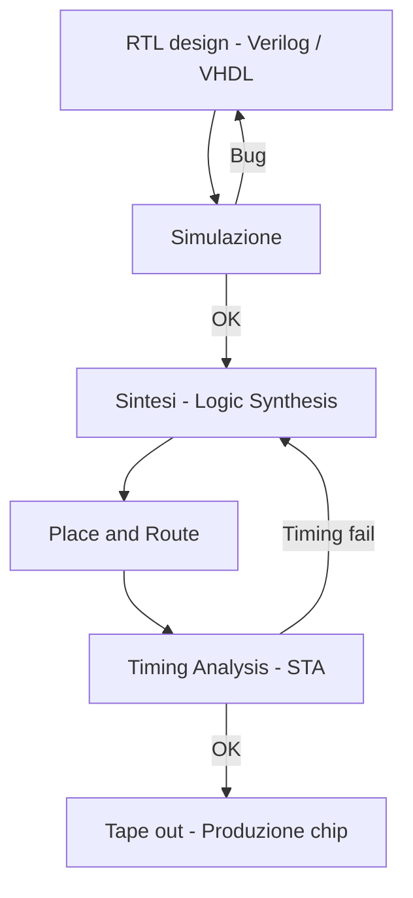

# 08 — ASIC Flow

## 🎯 Obiettivi

* Comprendere il flusso completo ASIC
* Capire la differenza con FPGA
* Introdurre strumenti e metodologie industriali
* Collegare design e physical design

---

## 🧠 1. Cos’è un ASIC

Un ASIC (Application-Specific Integrated Circuit) è un circuito progettato per uno scopo specifico.

👉 a differenza dell’FPGA:

* non è programmabile
* è fisso dopo la fabbricazione

---

## ⚖️ 2. FPGA vs ASIC

| FPGA                  | ASIC                     |
| --------------------- | ------------------------ |
| programmabile         | fisso                    |
| più lento             | più veloce               |
| più costoso per unità | economico su larga scala |
| sviluppo rapido       | sviluppo lungo           |

---

## 🔁 3. Flusso ASIC completo

```text
RTL → Simulation → Synthesis → STA → Physical Design → Signoff → Tape-out
```



---

## 🔍 4. Fasi del flusso

---

### 🧩 4.1 RTL Design

* scritto in VHDL / Verilog / SystemVerilog

---

### 🧪 4.2 Simulation

* verifica funzionale

---

### ⚙️ 4.3 Synthesis

* conversione in gate-level netlist

👉 strumenti:

* Synopsys Design Compiler
* Cadence Genus

---

### ⏱️ 4.4 STA (Static Timing Analysis)

Verifica timing senza simulazione:

* setup
* hold
* path critici

---

### 🧱 4.5 Physical Design

Include:

* floorplanning
* placement
* clock tree synthesis (CTS)
* routing

---

### 🔍 4.6 Signoff

Verifiche finali:

* timing
* potenza
* integrità

---

### 📦 4.7 Tape-out

👉 invio del design alla fabbrica

---

## 🧰 5. Tool principali

* Synopsys
* Cadence
* Siemens (Mentor Graphics)

---

## ⚠️ 6. Errori comuni

❌ ignorare timing
❌ progettare senza constraints
❌ sottovalutare potenza
❌ mancanza di verifica

---

## 🧪 7. Esercizi

1. Descrivere flusso completo
2. Confrontare FPGA vs ASIC
3. Identificare path critico

---

## 🚀 Collegamento al prossimo modulo

👉 Nel prossimo capitolo: **Progetti completi**

## 💻 Codice di riferimento

- [SDC Example](https://github.com/gmorimac-droid/corso-microelettronica/blob/main/code/constraints/counter_example.sdc)

