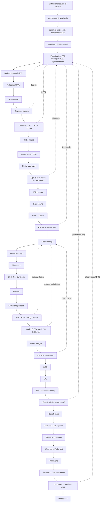

## Flusso di progettazione ASIC

```mermaid

flowchart TD
    A[Definizione requisiti di sistema] --> B[Architettura di alto livello]
    B --> C[Specifica funzionale e microarchitettura]
    C --> D[Modeling / Golden Model]
    D --> E[Progettazione RTL<br/>Verilog / VHDL / SystemVerilog]

    E --> F[Verifica funzionale RTL]
    F --> F1[Testbench / UVM]
    F1 --> F2[Simulazione]
    F2 --> F3[Coverage closure]
    F3 --> G[Lint / CDC / RDC / Static checks]

    G --> H[Sintesi logica]
    H --> H1[Vincoli timing / SDC]
    H1 --> H2[Netlist gate-level]
    H2 --> I[Equivalence check<br/>RTL vs Netlist]

    I --> J[DFT insertion]
    J --> J1[Scan chains]
    J1 --> J2[MBIST / LBIST]
    J2 --> K[ATPG e test coverage]

    K --> L[Floorplanning]
    L --> M[Power planning]
    M --> N[Placement]
    N --> O[Clock Tree Synthesis]
    O --> P[Routing]

    P --> Q[Estrazione parassiti]
    Q --> R[STA - Static Timing Analysis]
    R --> S[Analisi SI / Crosstalk / IR Drop / EM]
    S --> T[Power analysis]
    T --> U[Physical Verification]

    U --> U1[DRC]
    U1 --> U2[LVS]
    U2 --> U3[ERC / Antenna / Density]
    U3 --> V[Gate-level simulation + SDF]
    V --> W[Signoff finale]

    W --> X[GDSII / OASIS tapeout]
    X --> Y[Fabbricazione wafer]
    Y --> Z[Wafer sort / Probe test]
    Z --> AA[Packaging]
    AA --> AB[Final test / Characterization]
    AB --> AC[Bring-up e validazione silicio]
    AC --> AD[Produzione]

    %% Feedback loops
    F3 -. bug fix .-> E
    G -. fix RTL .-> E
    I -. mismatch .-> E
    K -. fix testability .-> E
    R -. timing violation .-> L
    S -. physical optimization .-> L
    U -. DRC/LVS fix .-> L
    V -. post-layout bug .-> E
    AC -. silicon issue / ECO .-> E
	
```