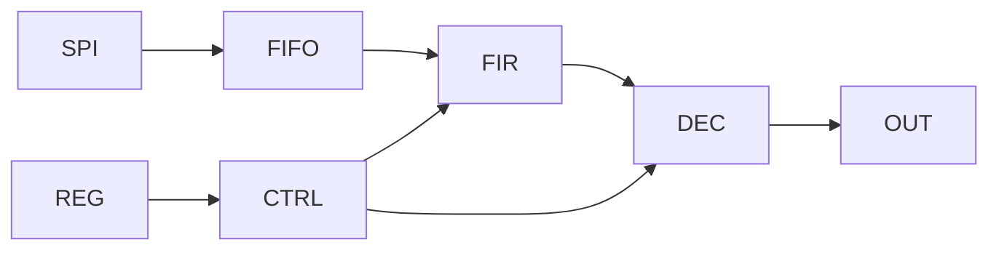
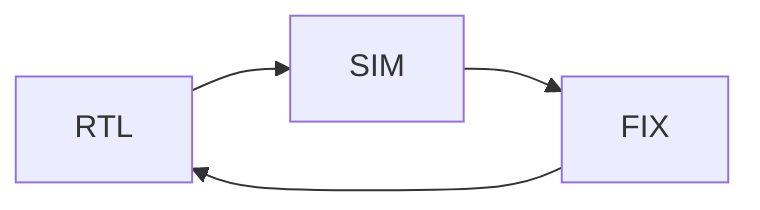

# 🧠 Progettazione ASIC — Flusso completo (pratico)

Questa guida descrive il flusso di progettazione ASIC **end-to-end**, basato su un progetto reale:

👉 [**OpenASIC Signal Processor**](https://github.com/gmorimac-droid/corso-microelettronica/blob/main/code/systemverilog/openasic_signal_processor/)
- FIR 8 tap
- Decimatore programmabile
- SPI slave
- Register bank
- FIFO

L’obiettivo è passare da:
👉 idea → RTL → verifica → sintesi → layout → GDS

---

# 🔵 1. Visione generale del flusso


---

# 🟢 2. SPECIFICA (SPEC.md)

## 🎯 Obiettivo

Definire cosa deve fare il chip.

## Contenuto minimo

- funzionalità
- interfacce (SPI, output, clock)
- parametri:
  - bit-width
  - frequenza target
- mappa registri
- datapath
- test plan

## Esempio progetto

```text
SPI → FIFO → FIR → Decimator → Output
```

👉 Questa fase è critica: errori qui costano moltissimo dopo.

---

# 🟡 3. RTL DESIGN

## 📁 Cartella

```text
rtl/
```

## Moduli principali

- `top.sv`
- `spi_slave.sv`
- `reg_bank.sv`
- `control_fsm.sv`
- `fifo_sync.sv`
- `fir8_core.sv`
- `decimator.sv`
- `output_stage.sv`

---

## 🧠 Architettura



---

## Regole fondamentali ASIC

- no `#delay`
- no costrutti FPGA-specifici
- reset chiaro
- niente latch involontari
- width coerenti

---

# 🔬 4. SIMULAZIONE (RTL Verification)

## 📁 Cartella

```text
tb/
```

## Tool

- Icarus Verilog / Verilator
- GTKWave

---

## Tipi di test

### 🧪 Smoke test
- reset
- flusso base

### 🧪 FIR test
- impulso
- rampa

### 🧪 Decimation test
- N = 1, 2, 4, 8

### 🧪 SPI test
- read/write registri

---

## Esempio flusso

```bash
make fir_impulse
gtkwave waves.vcd
```

---

# ⚠️ Regola critica

👉 NON passare alla sintesi finché la simulazione non è stabile

---

# 🔵 5. SINTESI (Yosys)

## Tool

- Yosys

## Obiettivo

Convertire RTL → netlist gate-level

---

## Script tipico

```tcl
read_verilog rtl/*.sv
synth -top top
write_verilog netlist/top.v
```

---

## Output

- netlist
- report area
- warning

---

## ⚠️ Problemi tipici

- latch
- segnali non assegnati
- combinational loop

---

# 🔴 6. PLACE & ROUTE (OpenLane / OpenROAD)

## Toolchain

- OpenLane 2
- OpenROAD
- Sky130 PDK

---

## Input principali

📁 `asic/`

- `config.json`
- `constraints.sdc`
- `pin_order.cfg`

---

## Flow


---

## Comando

```bash
openlane config.json
```

---

# 🧠 7. TIMING ANALYSIS (STA)

## Tool

- OpenSTA

## Obiettivo

Verificare che:

```text
t_clock > t_path
```

---

## Metriche

- WNS (Worst Negative Slack)
- TNS (Total Negative Slack)

---

## Target progetto

```text
Clock: 10 MHz
```

---

# 🟣 8. SIGNOFF

## Tool

- Magic → DRC
- Netgen → LVS

---

## Verifiche

### ✔️ DRC
- nessuna violazione layout

### ✔️ LVS
- netlist == layout

---

# ⚫ 9. GDS (Tape-out)

Output finale:

```text
gds/top.gds
```

👉 rappresenta fisicamente il chip

---

# 🧠 10. Workflow reale usato

## Iterazioni fatte

| Versione | Contenuto |
|---------|----------|
| v1 | blocchi base (FIR, decimator) |
| v2 | integrazione iniziale |
| v3 | top-level |
| v4 | pulizia RTL |
| v5 | preparazione OpenLane |

---

# 🔥 Insight importante

👉 ASIC design NON è lineare

È iterativo:



---

# ⚠️ Errori tipici

## ❌ Saltare simulazione
👉 porta a debug impossibile dopo

## ❌ Andare subito su OpenLane
👉 senza RTL stabile → fallimento

## ❌ Non versionare
👉 perdi debug storico

---

# 🧠 Regole d’oro

1. **Spec chiara**
2. **RTL pulito**
3. **Simulazione completa**
4. **Sintesi controllata**
5. **Physical flow solo dopo**

---

# 🚀 Stato del progetto

Attualmente:

✔ RTL completo  
✔ integrazione top  
✔ test base  
✔ configurazione OpenLane pronta  

👉 prossimo step:

- run OpenLane
- debug timing
- DRC/LVS

---

# 🎯 Conclusione

Questo flusso rappresenta un vero ciclo ASIC:

👉 **idea → RTL → verifica → layout → chip**

Se padroneggi questo:

👉 sei già oltre il livello FPGA base  
👉 stai facendo progettazione ASIC reale  

---

# 🧠 Frase chiave finale

👉 **“Simula prima, sintetizza dopo, layout solo quando sei sicuro.”**

---