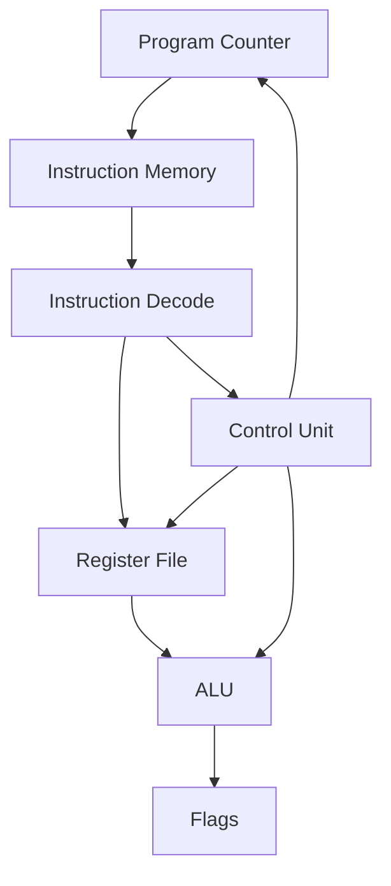
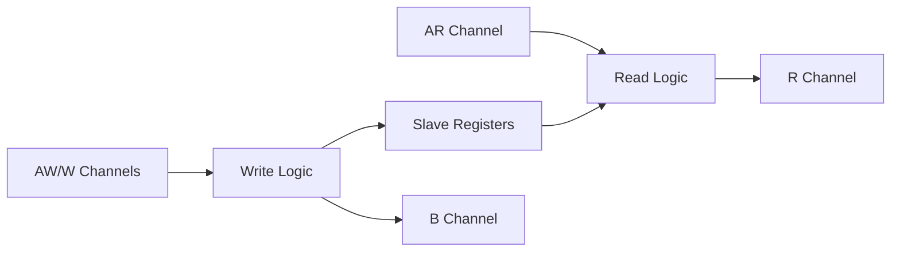
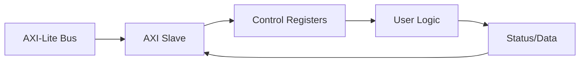
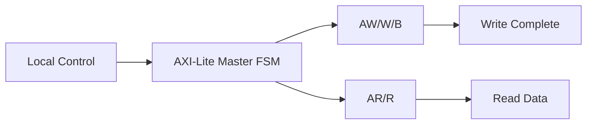
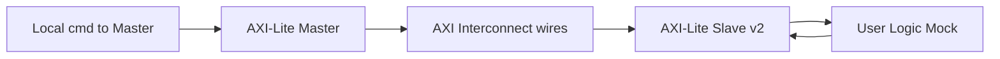
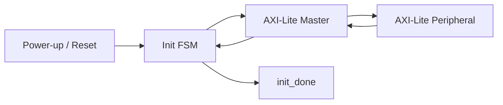

## 💻 Codice di riferimento

## VHDL

- [FSM](https://github.com/gmorimac-droid/corso-microelettronica/blob/main/code/vhdl/FSM/FSM_traffic_light.vhd)
- [Testbench FSM](https://github.com/gmorimac-droid/corso-microelettronica/blob/main/code/vhdl/FSM/TB_FSM.vhd)

- [FSM2](https://github.com/gmorimac-droid/corso-microelettronica/blob/main/code/vhdl/FSM/FSM2.vhd)
- [Testbench FSM2](https://github.com/gmorimac-droid/corso-microelettronica/blob/main/code/vhdl/FSM/TB_FSM2.vhd)

- [ALU](https://github.com/gmorimac-droid/corso-microelettronica/blob/main/code/vhdl/ALU/ALU.vhd)
- [Testbench ALU](https://github.com/gmorimac-droid/corso-microelettronica/blob/main/code/vhdl/ALU/TB_ALU.vhd)

- [FIFO](https://github.com/gmorimac-droid/corso-microelettronica/blob/main/code/vhdl/FIFO/FIFO.vhd)
- [Testbench FIFO](https://github.com/gmorimac-droid/corso-microelettronica/blob/main/code/vhdl/FIFO/TB_FIFO.vhd)

## Verilog

- [FSM](https://github.com/gmorimac-droid/corso-microelettronica/blob/main/code/verilog/FSM/FSM_traffic_light.v)
- [Testbench FSM](https://github.com/gmorimac-droid/corso-microelettronica/blob/main/code/verilog/FSM/TB_FSM.v)

- [FSM2](https://github.com/gmorimac-droid/corso-microelettronica/blob/main/code/verilog/FSM/FSM2.v)
- [Testbench FSM2](https://github.com/gmorimac-droid/corso-microelettronica/blob/main/code/verilog/FSM/TB_FSM2.v)

- [ALU](https://github.com/gmorimac-droid/corso-microelettronica/blob/main/code/verilog/ALU/ALU.v)
- [Testbench ALU](https://github.com/gmorimac-droid/corso-microelettronica/blob/main/code/verilog/ALU/TB_ALU.v)

- [ALU2](https://github.com/gmorimac-droid/corso-microelettronica/blob/main/code/verilog/ALU/ALU2.v)
- [Testbench ALU2](https://github.com/gmorimac-droid/corso-microelettronica/blob/main/code/verilog/ALU/TB_ALU2.v)

- [FIFO](https://github.com/gmorimac-droid/corso-microelettronica/blob/main/code/verilog/FIFO/FIFO.v)
- [Testbench FIFO](https://github.com/gmorimac-droid/corso-microelettronica/blob/main/code/verilog/FIFO/TB_FIFO.v)

- [FIFO2](https://github.com/gmorimac-droid/corso-microelettronica/blob/main/code/verilog/FIFO/FIFO2.v)
- [Testbench FIFO2](https://github.com/gmorimac-droid/corso-microelettronica/blob/main/code/verilog/FIFO/TB_FIFO2.v)

## CPU flowchart

- [mini CPU](https://github.com/gmorimac-droid/corso-microelettronica/blob/main/code/verilog/CPU/mini_CPU.v)
- [Testbench mini CPU](https://github.com/gmorimac-droid/corso-microelettronica/blob/main/code/verilog/CPU/TB_mini_CPU.v)

## UART

- [UART TX](https://github.com/gmorimac-droid/corso-microelettronica/blob/main/code/verilog/UART/UART_TX.v)
- [UART RX](https://github.com/gmorimac-droid/corso-microelettronica/blob/main/code/verilog/UART/UART_RX.v)
- [UART RX-TX](https://github.com/gmorimac-droid/corso-microelettronica/blob/main/code/verilog/UART/uart_loopback_top.v)
- [Testbench UART TX](https://github.com/gmorimac-droid/corso-microelettronica/blob/main/code/verilog/UART/TB_UART_TX.v)
- [Testbench UART RX](https://github.com/gmorimac-droid/corso-microelettronica/blob/main/code/verilog/UART/TB_UART_RX.v)
- [Testbench UART RX-TX](https://github.com/gmorimac-droid/corso-microelettronica/blob/main/code/verilog/UART/TB_uart_loopback_top.v)

## AXI

## Schema a blocchi AXI Lite Slave Base

- [AXI LITE SLAVE BASE](https://github.com/gmorimac-droid/corso-microelettronica/blob/main/code/verilog/AXI_LITE/AXI_Lite_slave_base.v)
- [Testbench AXI LITE SLAVE BASE](https://github.com/gmorimac-droid/corso-microelettronica/blob/main/code/verilog/AXI_LITE/TB_AXI_Lite_slave_base.v)

## Scehma a blocchi AXI Lite Slave

- [AXI LITE SLAVE](https://github.com/gmorimac-droid/corso-microelettronica/blob/main/code/verilog/AXI_LITE/AXI_Lite_slave.v)
- [Testbench AXI LITE SLAVE](https://github.com/gmorimac-droid/corso-microelettronica/blob/main/code/verilog/AXI_LITE/TB_AXI_Lite_slave.v)

## Scehma a blocchi AXI Lite Master Base

- [AXI LITE MASTER BASE](https://github.com/gmorimac-droid/corso-microelettronica/blob/main/code/verilog/AXI_LITE/AXI_Lite_master_base.v)
- [Testbench AXI LITE MASTER BASE](https://github.com/gmorimac-droid/corso-microelettronica/blob/main/code/verilog/AXI_LITE/TB_AXI_Lite_master_base.v)

## Scehma a blocchi AXI Lite Master-Slave

- [AXI MASTER SLAVE](https://github.com/gmorimac-droid/corso-microelettronica/blob/main/code/verilog/AXI_LITE/AXI_master_slave_top.v)
- [Testbench AXI MASTER SLAVE](https://github.com/gmorimac-droid/corso-microelettronica/blob/main/code/verilog/AXI_LITE/TB_AXI_master_slave_top.v)

## Scehma a blocchi AXI Lite Master-FSM

- [AXI MASTER FSM](https://github.com/gmorimac-droid/corso-microelettronica/blob/main/code/verilog/AXI_LITE/AXI_master_FSM.v)
- [AXI MASTER TOP](https://github.com/gmorimac-droid/corso-microelettronica/blob/main/code/verilog/AXI_LITE/AXI_master_FSM_top.v)
- [Testbench AXI MASTER FSM](https://github.com/gmorimac-droid/corso-microelettronica/blob/main/code/verilog/AXI_LITE/TB_AXI_master_FSM.v)
