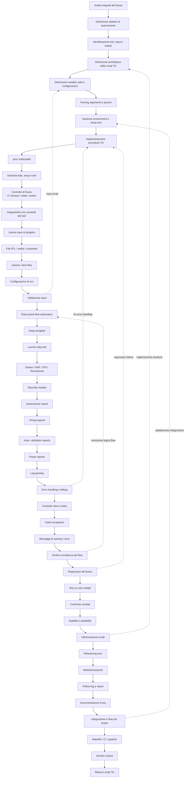

## Flusso di progettazione TCL

```mermaid

flowchart TD
    A[Analisi requisiti del flusso] --> B[Definizione obiettivi di automazione]
    B --> C[Identificazione tool, input e output]
    C --> D[Definizione architettura dello script Tcl]

    D --> E[Definizione variabili, path e configurazioni]
    E --> F[Parsing argomenti e opzioni]
    F --> G[Gestione environment e setup tool]
    G --> H[Implementazione procedure Tcl]

    H --> H1[proc riutilizzabili]
    H1 --> H2[Gestione liste, array e dict]
    H2 --> H3[Controllo di flusso<br/>if / foreach / while / switch]
    H3 --> I[Integrazione con comandi del tool]

    I --> J[Lettura input di progetto]
    J --> J1[File RTL / netlist / constraint]
    J1 --> J2[Librerie / tech files]
    J2 --> J3[Configurazioni di run]
    J3 --> K[Validazione input]

    K --> L[Esecuzione flow automatico]
    L --> L1[Setup progetto]
    L1 --> L2[Launch step tool]
    L2 --> L3[Sintesi / P&R / STA / Simulazione]
    L3 --> L4[Raccolta risultati]
    L4 --> M[Generazione report]

    M --> M1[Timing reports]
    M1 --> M2[Area / utilization reports]
    M2 --> M3[Power reports]
    M3 --> M4[Log parsing]
    M4 --> N[Error handling e debug]

    N --> N1[Controllo return codes]
    N1 --> N2[Catch exceptions]
    N2 --> N3[Messaggi di warning / error]
    N3 --> O[Verifica correttezza del flow]

    O --> P[Regression del flusso]
    P --> P1[Test su casi multipli]
    P1 --> P2[Confronto risultati]
    P2 --> P3[Stabilità e ripetibilità]
    P3 --> Q[Ottimizzazione script]

    Q --> Q1[Refactoring proc]
    Q1 --> Q2[Modularizzazione]
    Q2 --> Q3[Pulizia log e report]
    Q3 --> R[Documentazione d'uso]

    R --> S[Integrazione in flow più ampio]
    S --> S1[Makefile / CI / pipeline]
    S1 --> S2[Version control]
    S2 --> T[Rilascio script Tcl]

    %% Feedback loops
    K -. input errati .-> E
    N -. fix error handling .-> H
    O -. correzione logica flow .-> L
    P -. regression failure .-> H
    Q -. miglioramento struttura .-> D
    S -. adattamento integrazione .-> G

```