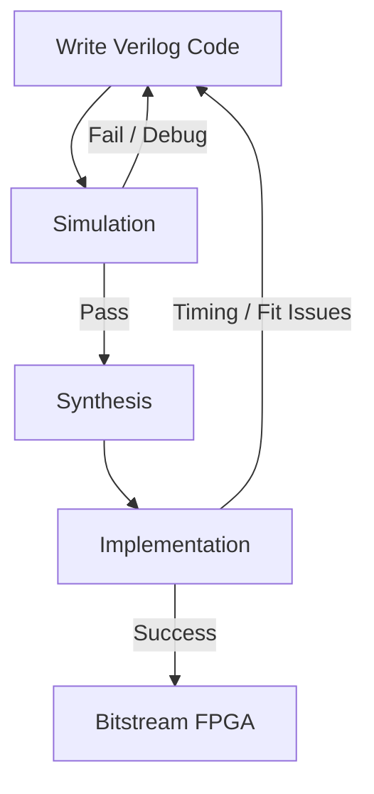
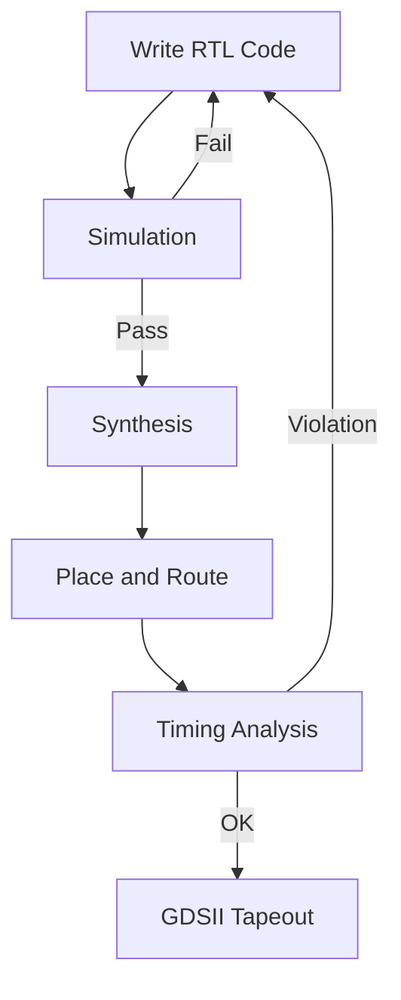

# ⚙️ The Tool Flow

In digital design, both FPGA and ASIC development follow a structured flow that transforms a hardware description into a working device.

---

## 📊 FPGA Tool Flow

---

### 🧠 Description

The FPGA design flow consists of the following steps:

- **Coding**  
  Writing the hardware description in Verilog or VHDL.

- **Simulation**  
  Verifying functionality using testbenches before hardware implementation.

- **Synthesis**  
  Translating RTL code into a gate-level representation.

- **Implementation**  
  Mapping the design onto FPGA resources (placement & routing).

- **Bitstream Generation**  
  Producing the binary file used to configure the FPGA.

---

## 🧰 FPGA Tools

| Vendor | Tool | Purpose |
|--------|------|--------|
| AMD (Xilinx) | Vivado | Complete FPGA design suite |
| Intel | Quartus Prime | FPGA design and compilation |
| Lattice | Radiant / Diamond | Low-power FPGA tools |
| Generic | ModelSim / Questa | Simulation |
| Open-source | Verilator | Fast simulation |

---

## 📊 ASIC Tool Flow

---

### 🧠 Description

ASIC design is more complex and involves additional physical design steps:

- **Synthesis**  
  Converts RTL into standard cell logic.

- **Place & Route (P&R)**  
  Physically arranges logic on silicon.

- **Timing Analysis**  
  Ensures timing constraints are met.

- **GDSII Generation**  
  Final layout sent for fabrication.

---

## 🧰 ASIC Tools

| Category | Tool |
|----------|------|
| Synthesis | Synopsys Design Compiler |
| Synthesis | Cadence Genus |
| Place & Route | Synopsys IC Compiler II |
| Place & Route | Cadence Innovus |
| Timing | Synopsys PrimeTime |
| Timing | Cadence Tempus |
| Simulation | Synopsys VCS |
| Simulation | Cadence Xcelium |

---

## 🔍 FPGA vs ASIC Comparison

| Feature | FPGA | ASIC |
|--------|------|------|
| Flexibility | Reprogrammable | Fixed |
| Cost | Low (no fabrication) | Very high |
| Performance | Moderate | Very high |
| Time to market | Fast | Slow |
| Tools | Often free | Expensive (EDA) |

---

## 🧠 Key Takeaways

- FPGA flow is faster and ideal for prototyping and development  
- ASIC flow is more complex but provides higher performance  
- Simulation is critical in both flows  
- Timing closure is one of the hardest challenges in hardware design  

---