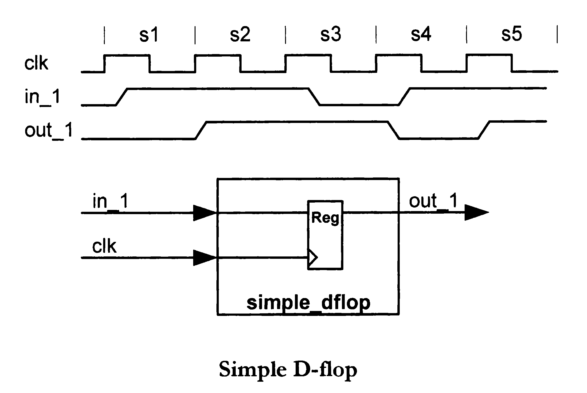
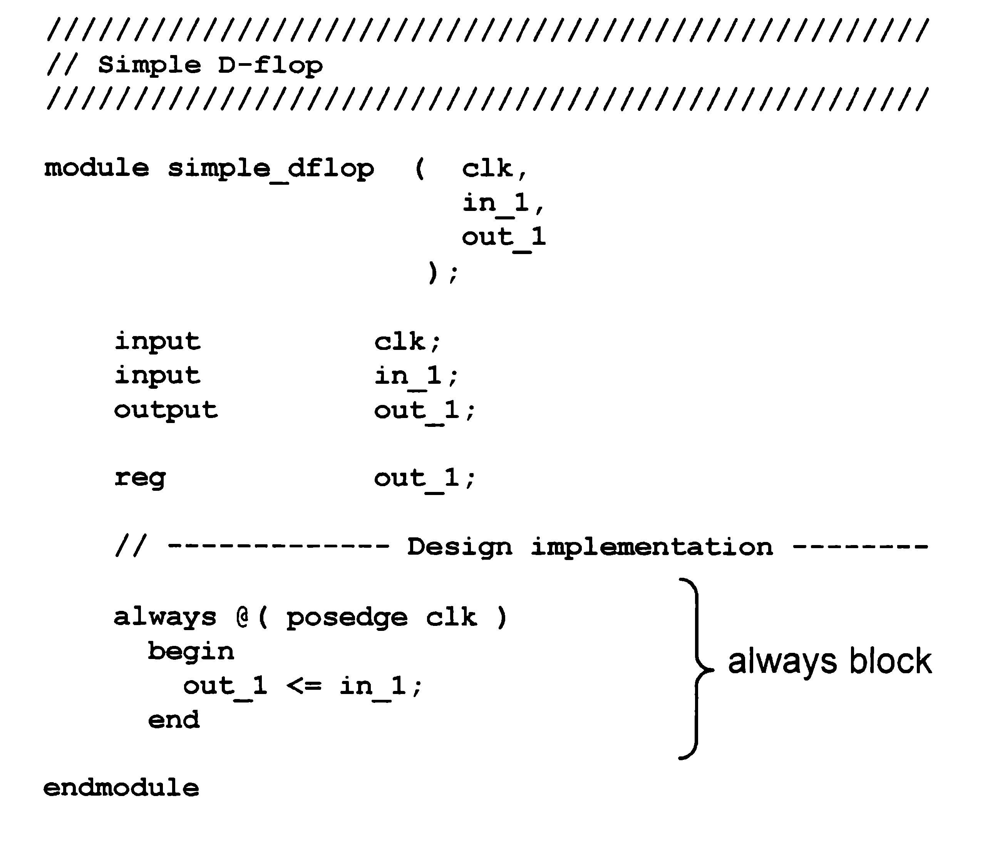
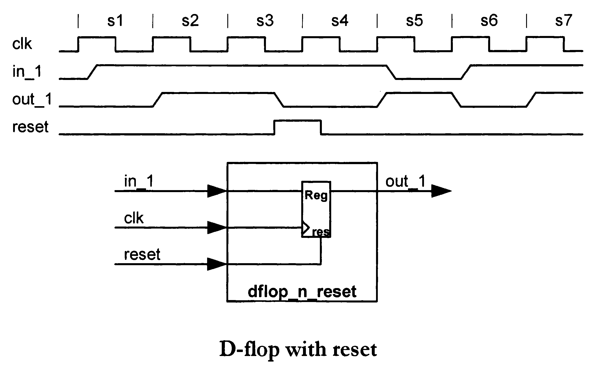
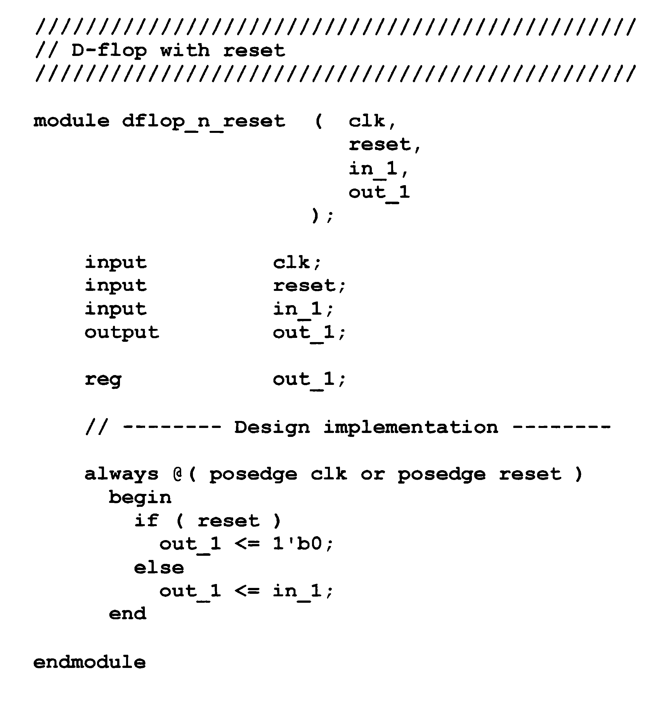
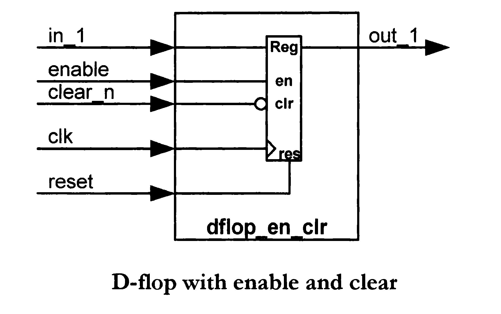
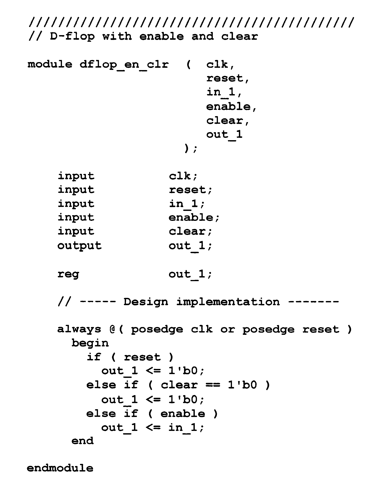
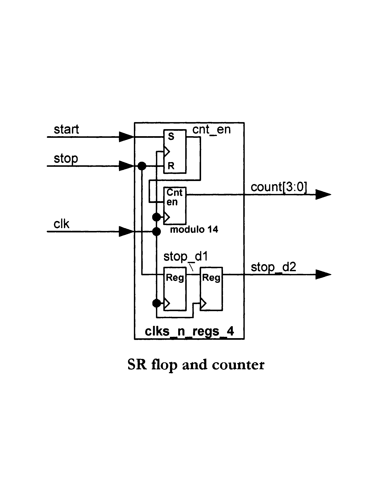
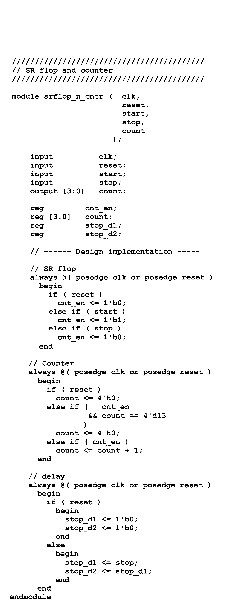

# ⏱️ Clocks and Registers

In this chapter we explore flip-flops and sequential logic elements.

---

## 🔹 Simple D Flip-Flop

| Schema | Codice |
|--------|--------|
|  |  |

---

## 🔹 D Flip-Flop with Reset

| Schema | Codice |
|--------|--------|
|  |  |

---

## 🔹 D Flip-Flop with Enable and Clear

| Schema | Codice |
|--------|--------|
|  |  |

---

## 🔹 SR Flip-Flop and Counter

| Schema | Codice |
|--------|--------|
|  |  |

---

## 📌 Notes

- All flip-flops are edge-triggered  
- Reset initializes the system  
- Enable controls when data is updated  
- Counters build sequential behavior  