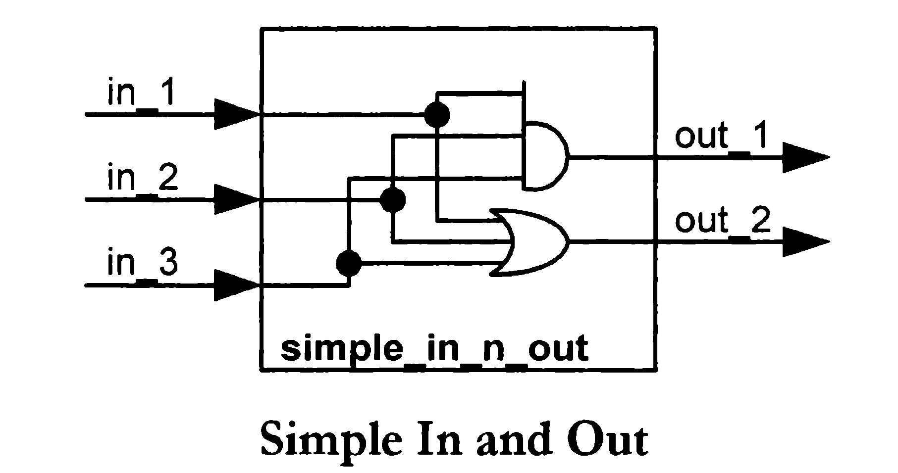
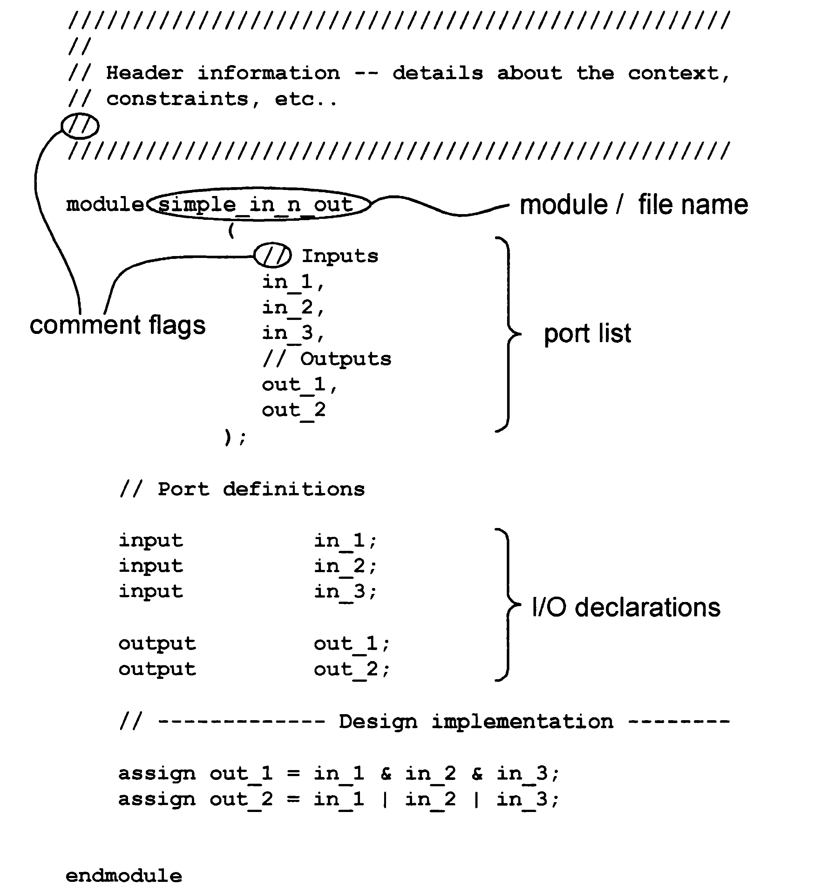
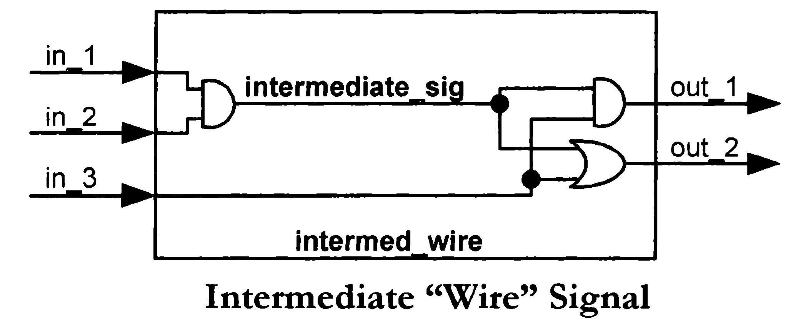
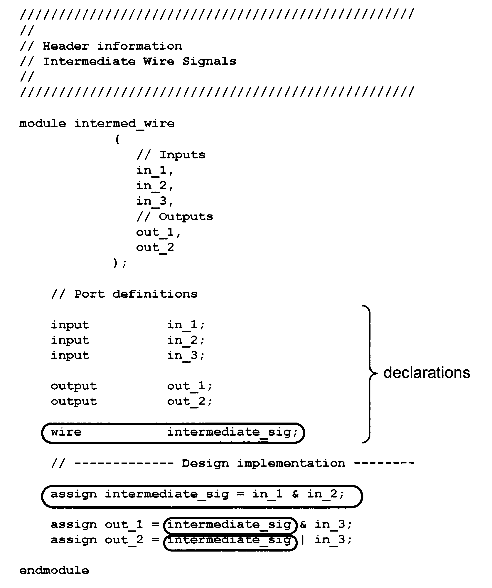
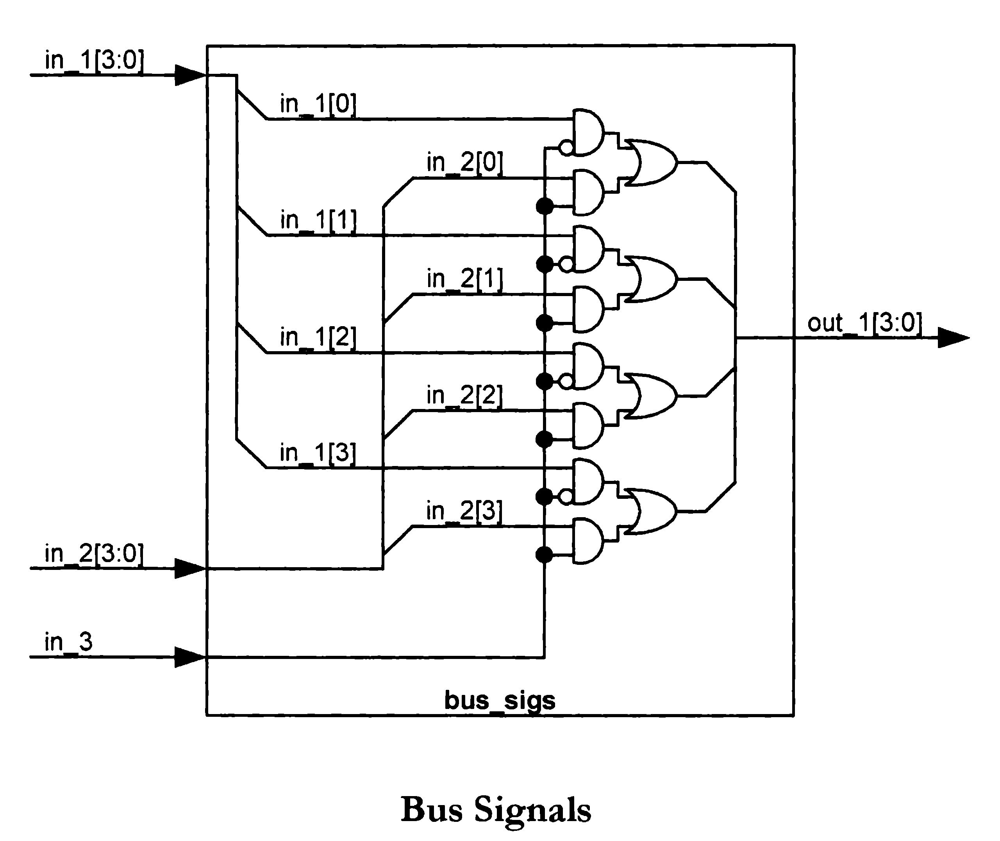
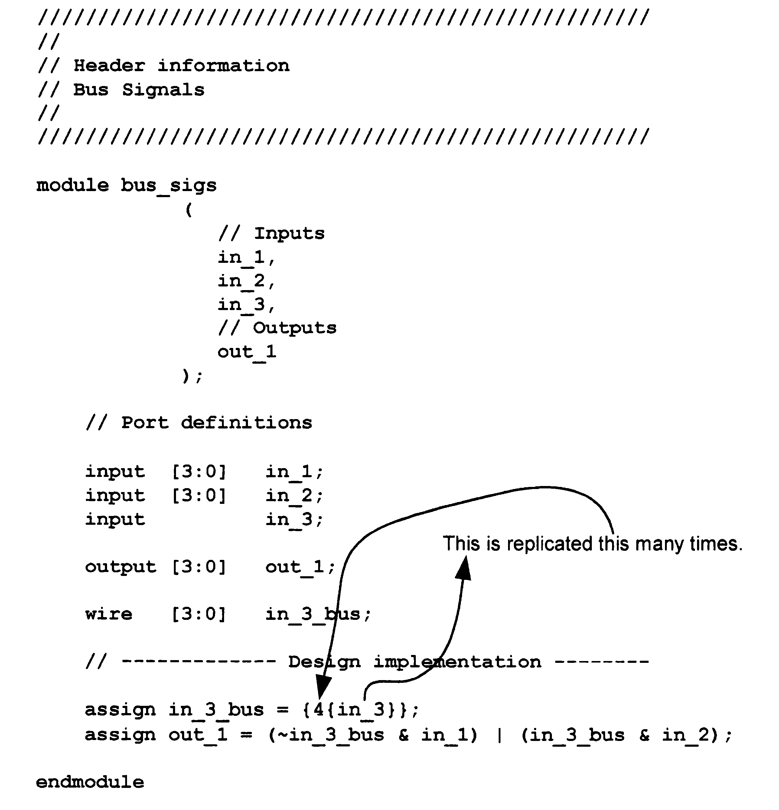
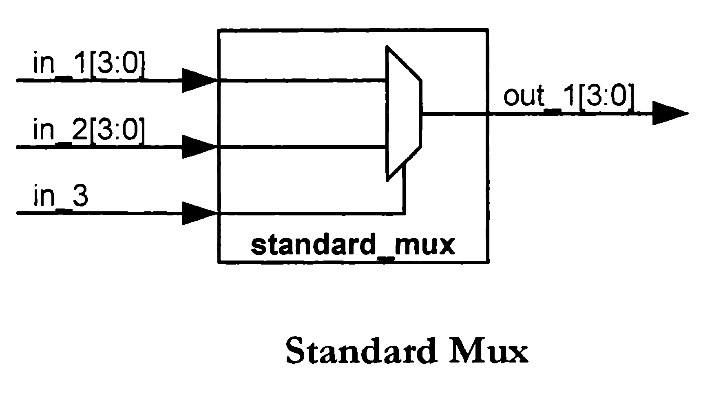
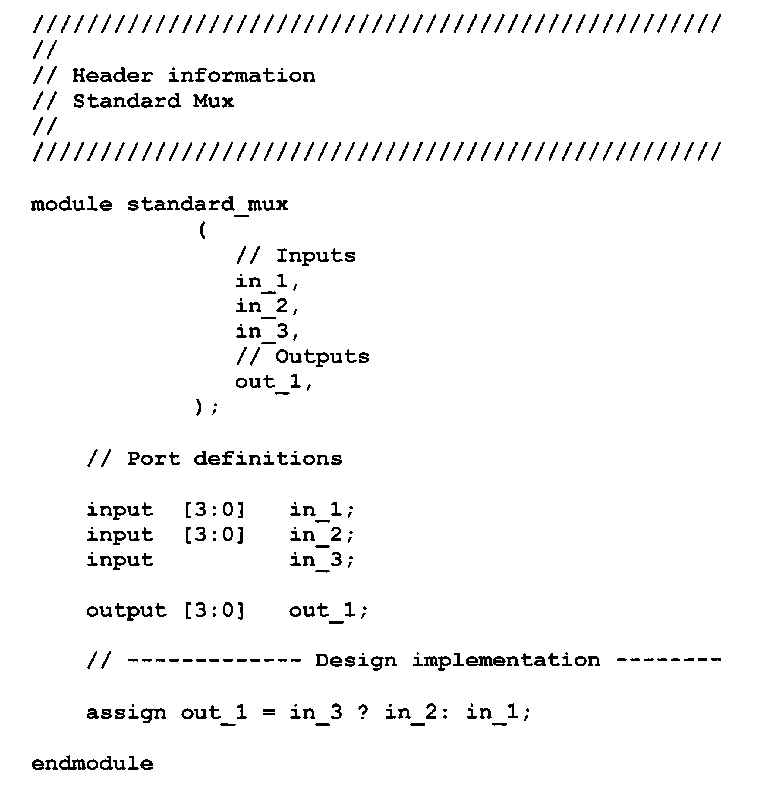
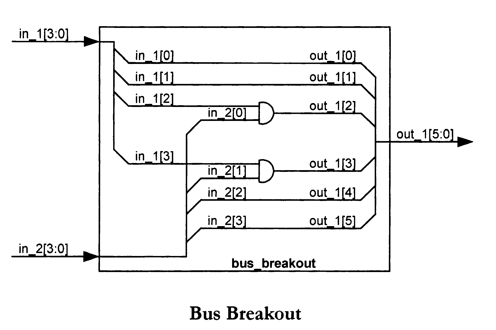
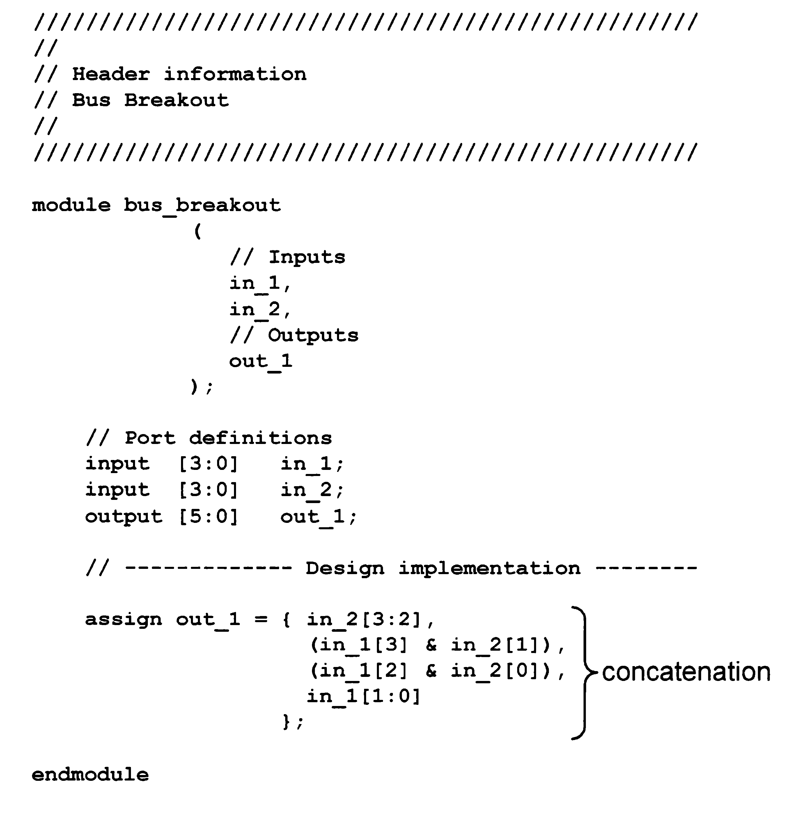

# LIBRO VERILOG (Blaine Readler)

## 🔄 Simple In/Out

| Schema | Codice |
|--------|--------|
|  |  |

---

## 🔗 Intermediate Wire

| Schema | Codice |
|--------|--------|
|  |  |

---

## 🔌 Bus Signals

| Schema | Codice |
|--------|--------|
|  |  |

---

## 🔀 Standard Mux

| Schema | Codice |
|--------|--------|
|  |  |

---

## 🔀 Bus Breakout

| Schema | Codice |
|--------|--------|
|  |  |
