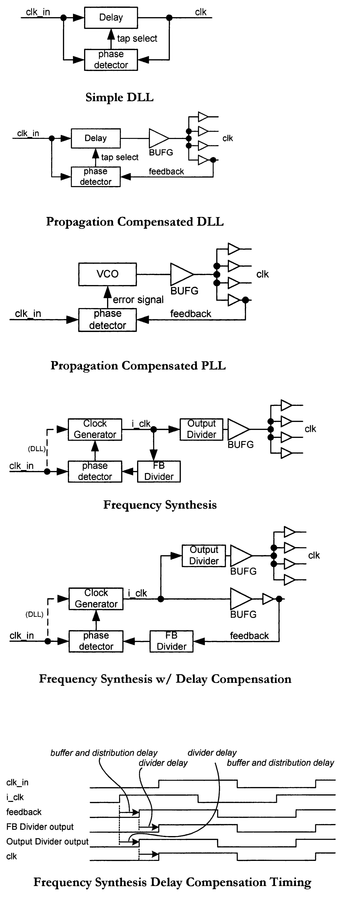
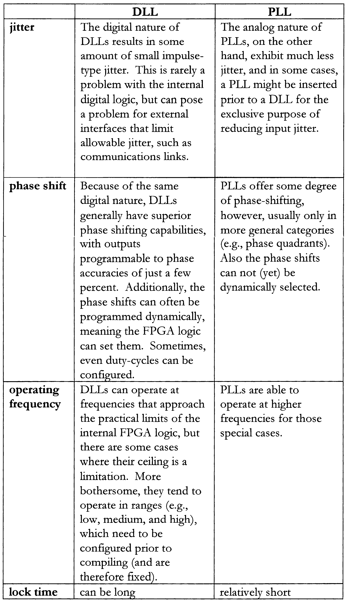

Clock management in FPGA is typically handled using DLLs and PLLs.

- DLL (Delay Locked Loop): used for phase alignment
- PLL (Phase Locked Loop): used for frequency synthesis and jitter reduction

## 🔄 Clock Management Architectures

| Schema | Codice |
|--------|--------|
|  |  |