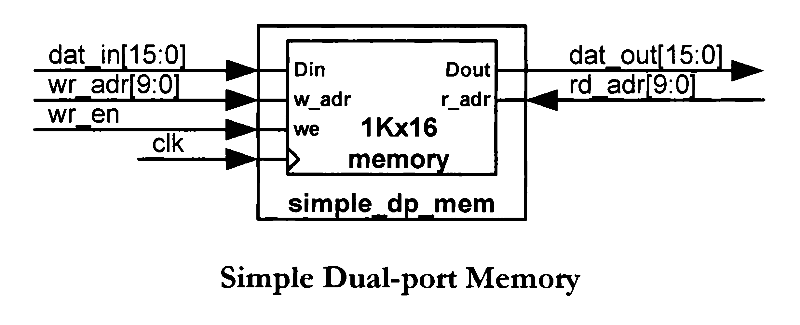
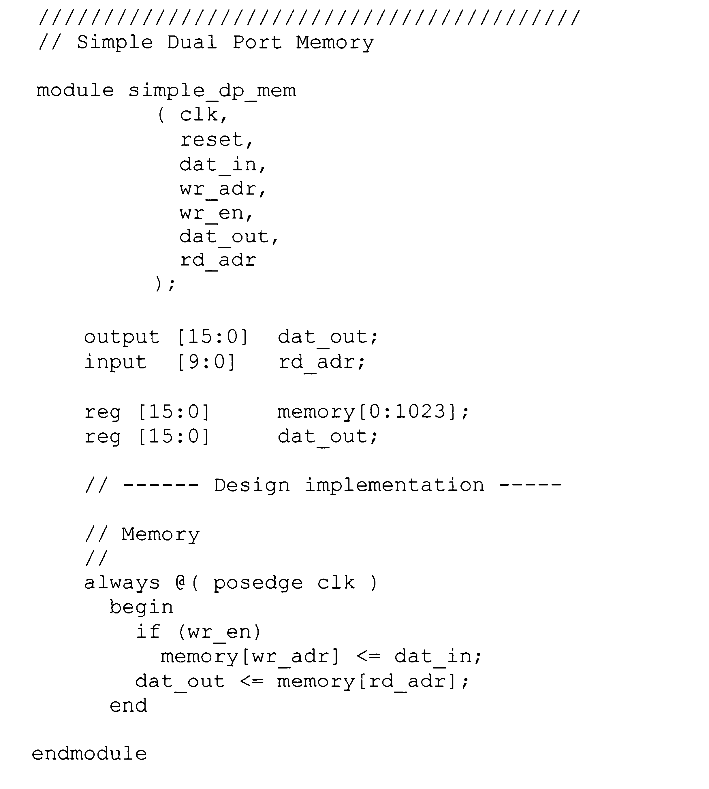
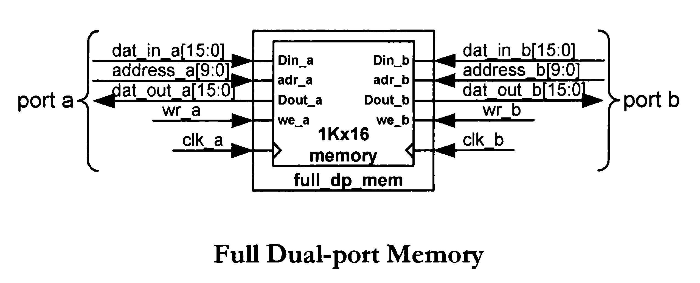
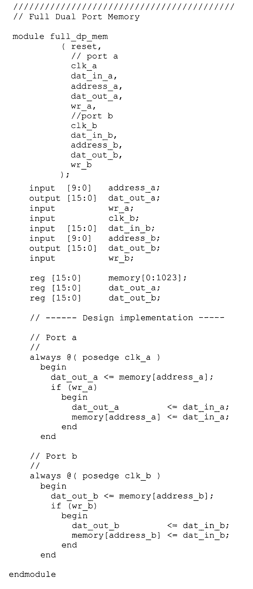
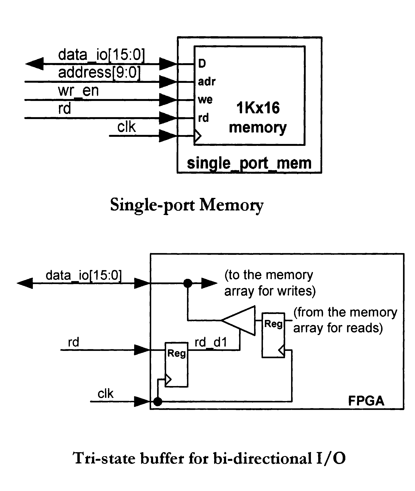
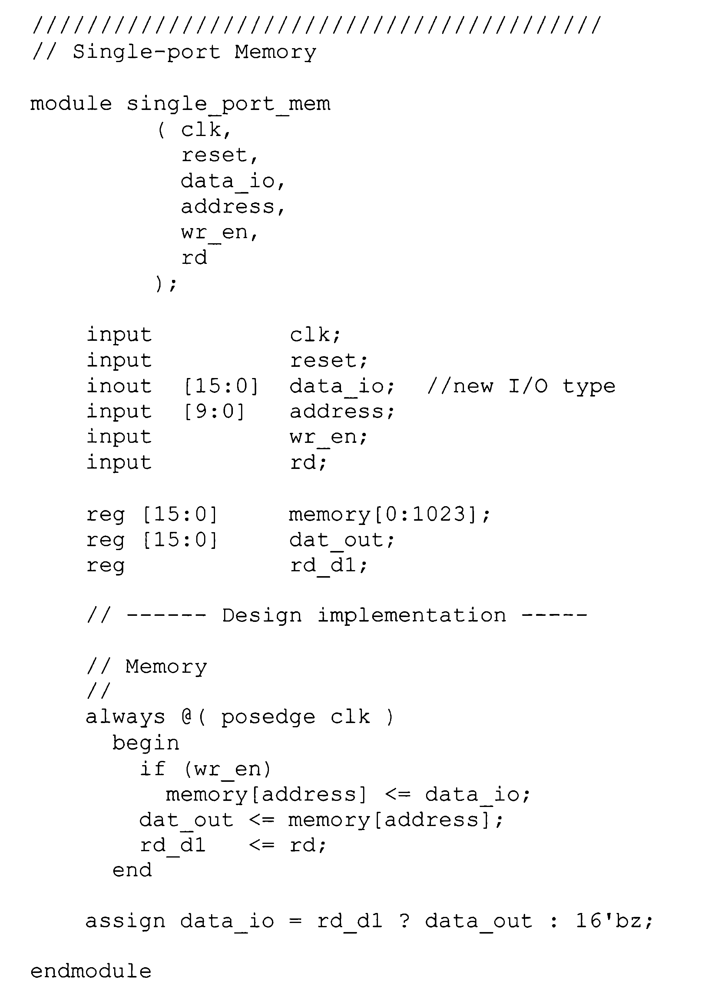

# 🧠 Memories

## 🔄 Simple Dual-port Memory

| Schema | Codice |
|--------|--------|
|  |  |

---

## 🔄 Full Dual-port Memory

| Schema | Codice |
|--------|--------|
|  |  |

---

## 🔄 Single-port Memory

| Schema | Codice |
|--------|--------|
|  |   |

---