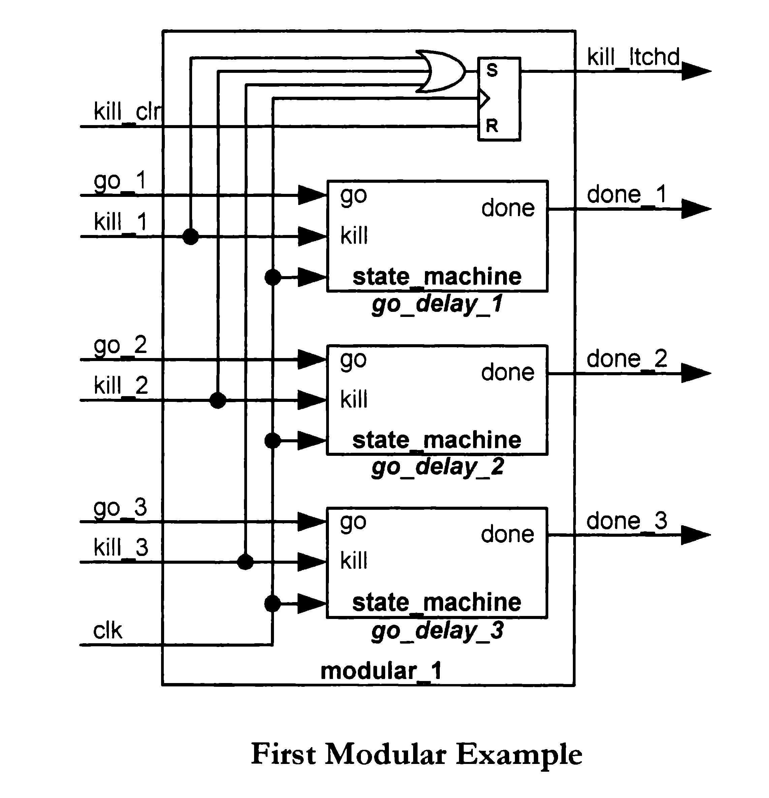
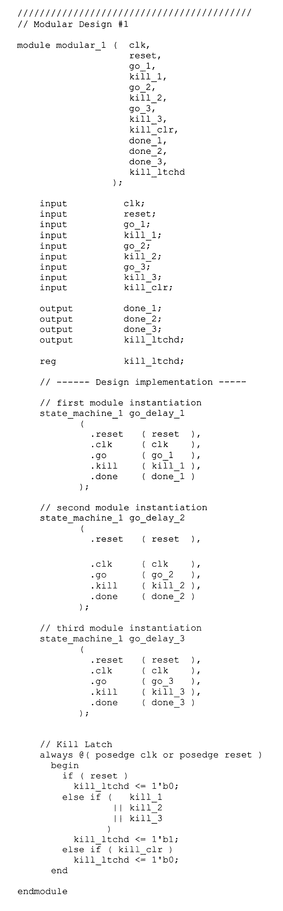

# 🧩 Modular Design

Modular design allows complex systems to be built by connecting
simpler blocks. Each module can be reused, tested independently,
and combined to create scalable architectures.

## 🔄 First Modular Example

| Schema | Codice |
|--------|--------|
|  |  |

---