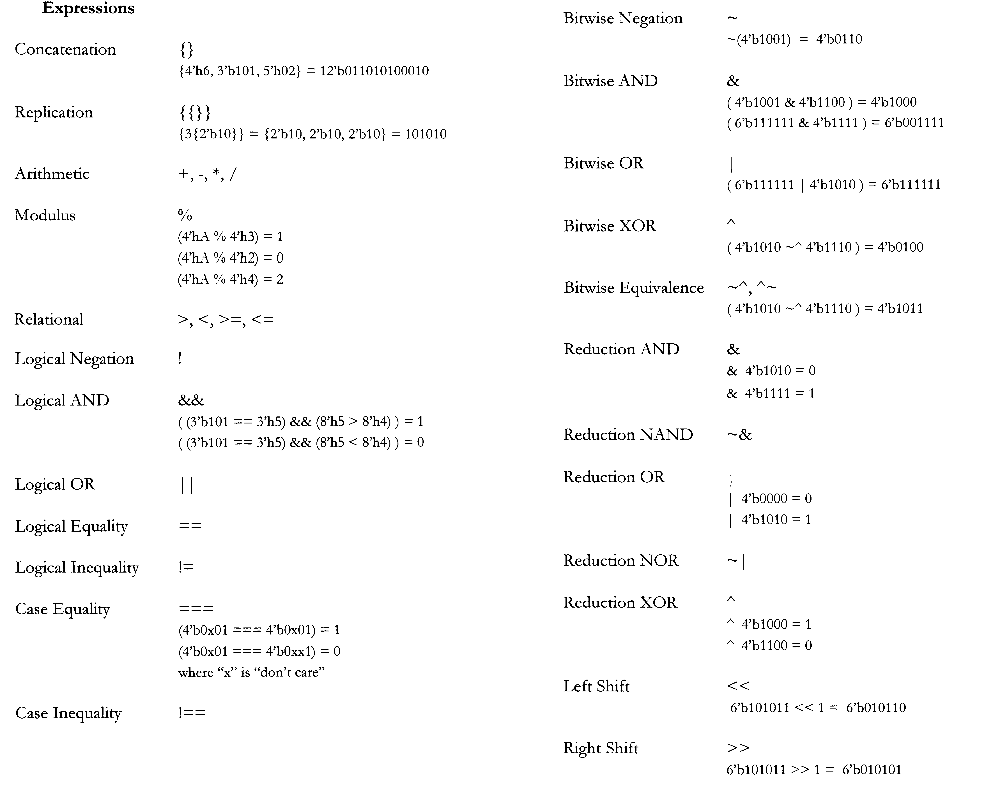
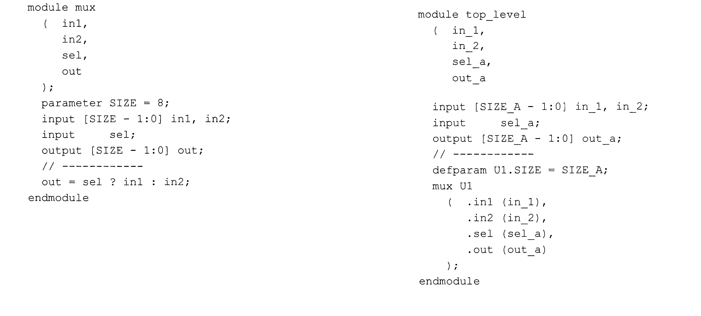
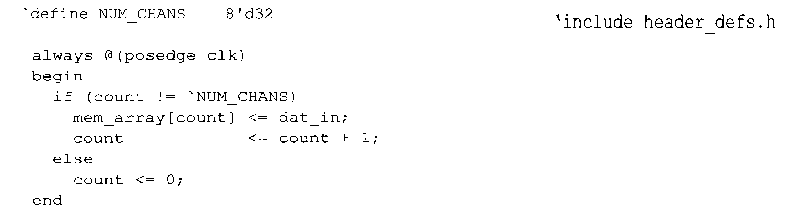
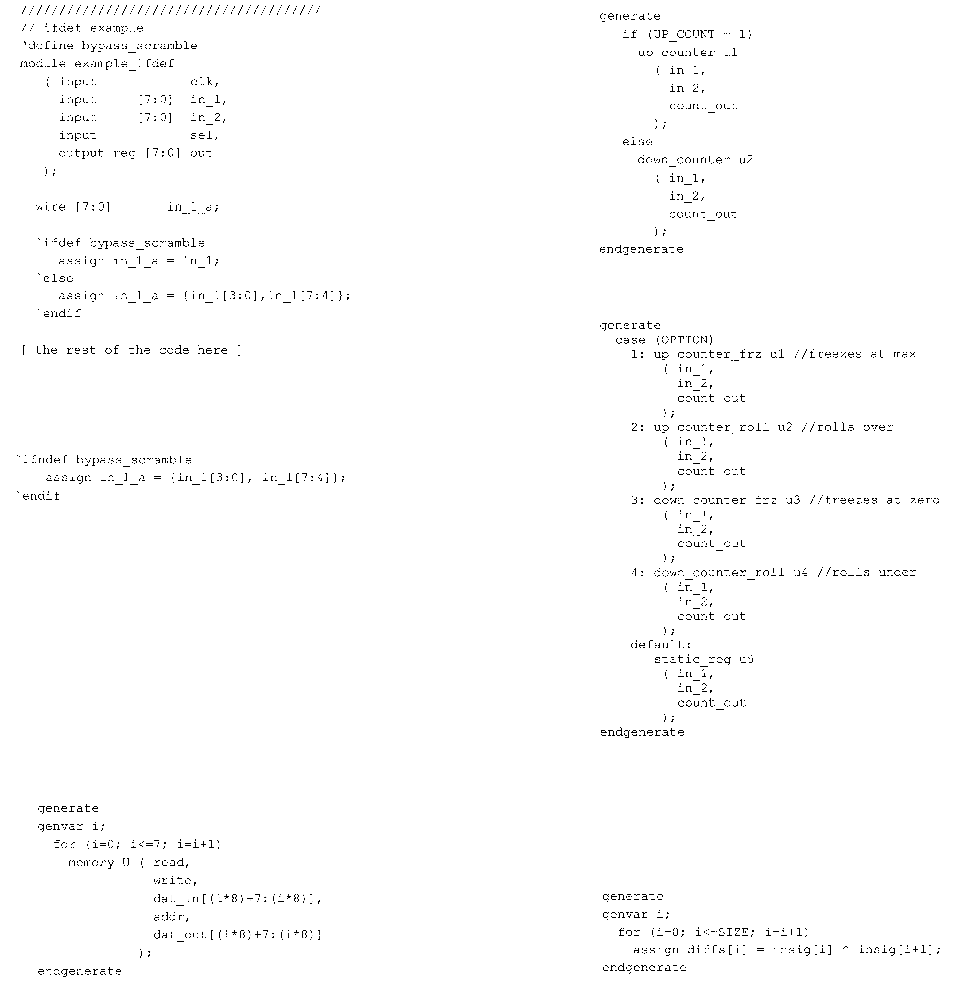
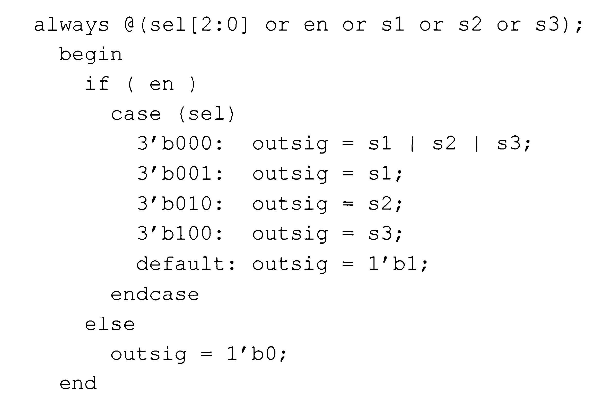
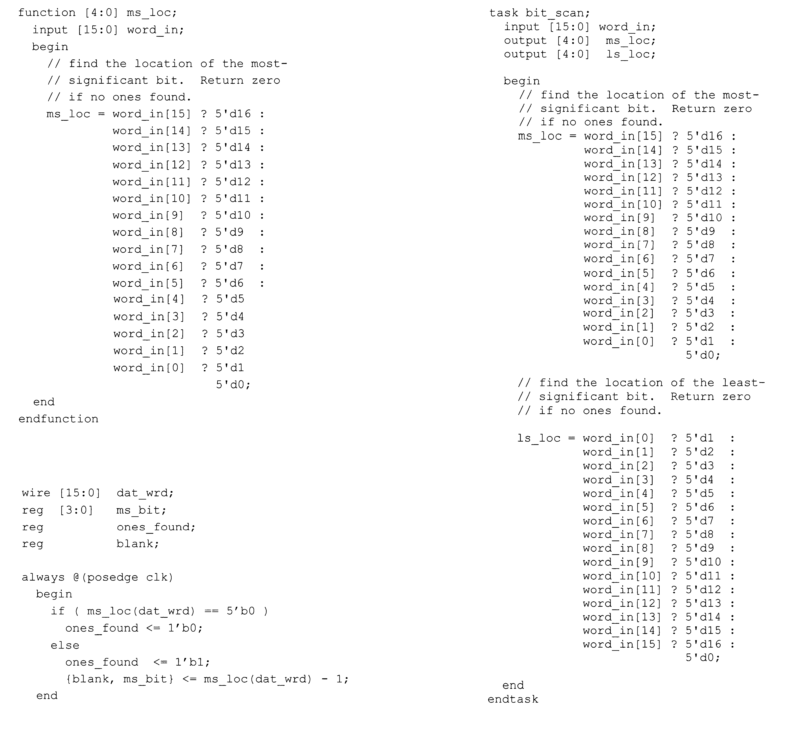

# 📚 Reference Verilog

Raccolta di esempi pratici e pattern comuni utilizzati nello sviluppo FPGA.

---

## 🧮 Operatori ed Espressioni

---

## 📏 Parametri e Moduli

---

## 📦 Define e Include

---

## ⚙️ Conditional Compilation (`ifdef / endif`)

---

## 🔀 Combinational Always Block

{ width="400" }

---

## 🔍 Function vs Task

---