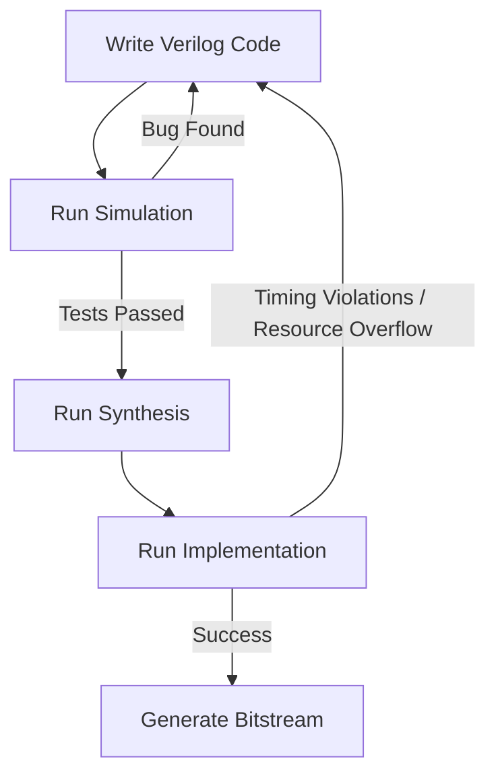

## 🧠 Introduzione al Tool Flow

Il tool flow potrebbe essere un intero libro a sé, ma in questo capitolo lo limiteremo a ciò che è necessario per comprendere come viene utilizzato il codice Verilog.

Verilog, come VHDL, è un **Hardware Description Language (HDL)** e descrive completamente il comportamento di un circuito digitale.

Insieme a file specifici del dispositivo (che definiscono package, pin I/O, vincoli di timing, ecc.), il codice Verilog è sufficiente per generare un sistema FPGA funzionante.

Il risultato finale è un **file binario** che viene caricato nel dispositivo all’accensione.

Gli strumenti descritti in questo capitolo permettono di trasformare il codice Verilog in questo file eseguibile.

## ⚙️ Il Tool Flow

Il processo per passare dal codice Verilog a un FPGA funzionante può essere suddiviso in quattro step principali.

---

## 🧩 Step 1: Coding

This is simply the process of translating your ideas into Verilog code, which is just a text file.

If you have done software coding, you are already familiar with this step. Any text editor will work, but professional editors can help by:
- syntax highlighting  
- error detection  
- code navigation  

---

## 🧪 Step 2: Simulation

Although not strictly necessary to generate a compiled load file, simulation should be considered essential in practice.

Skipping this step would be like designing, building, and packing a parachute—and then jumping out of a plane without ever testing it.

👉 There is a small chance your design will work, but as complexity increases, that probability drops rapidly.

Without simulation, you may power up your FPGA and find that it does absolutely nothing.

---

## ⚙️ Step 3: Synthesis

The first two steps are your creative contribution. From here, the process becomes automated.

Synthesis translates your Verilog code into a hardware representation.

👉 Think of it as a bridge between:
- human-readable code  
- hardware logic  

This includes:
- logic gates  
- multiplexers  
- flip-flops  

At this stage, we verify whether the design can actually be implemented in hardware.

The output of synthesis is similar to a **netlist**.

Many FPGA tools include built-in synthesis engines that are sufficient for most designs.

---

## 🧱 Step 4: Compile (Implementation)

In this final step, the synthesized design is mapped onto the actual FPGA device.

This includes:
- placement (where logic goes)  
- routing (how signals are connected)  

You can:
- manually assign pins  
- or let the tool assign them (rarely recommended)

👉 This step determines whether the design fits and works on the selected FPGA.

The output is a **binary configuration file**, used to program the FPGA at power-up.

---

## 🔁 Riepilogo

```text
Coding → Simulation → Synthesis → Compile → FPGA


👉 `TD` = Top → Down (verticale)

```
---

## 📊 Tool Flow with Debug Loop


```