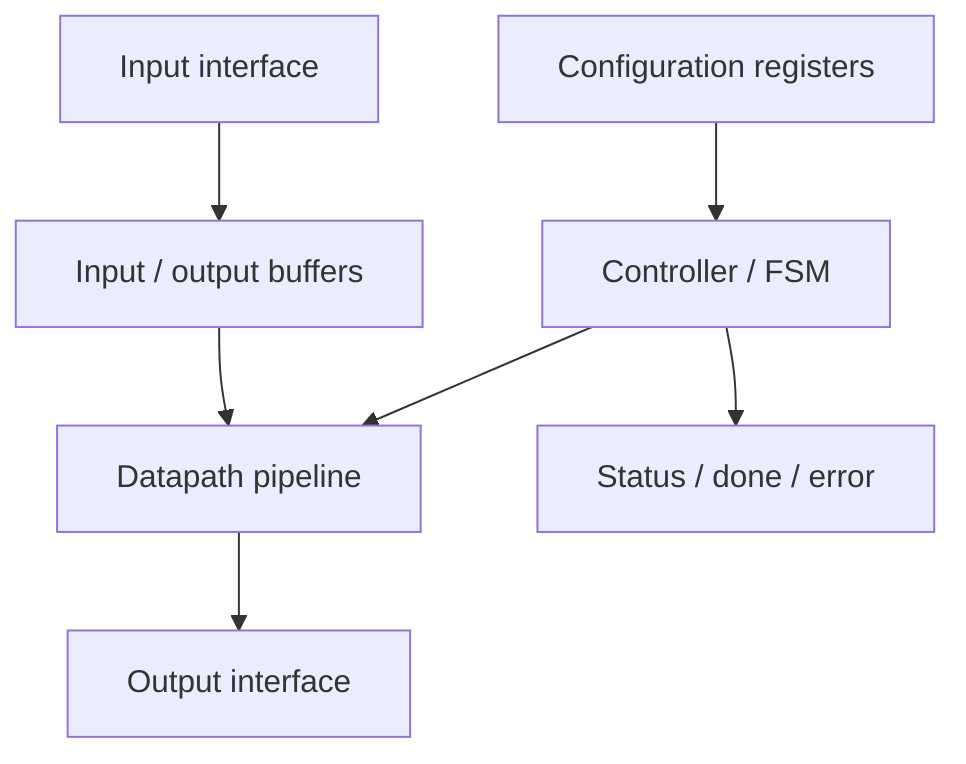
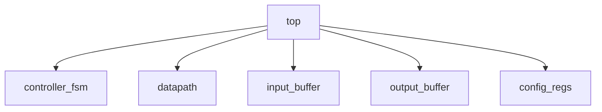
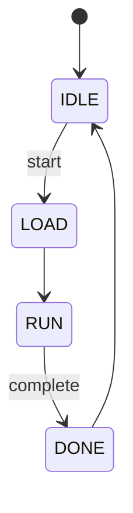
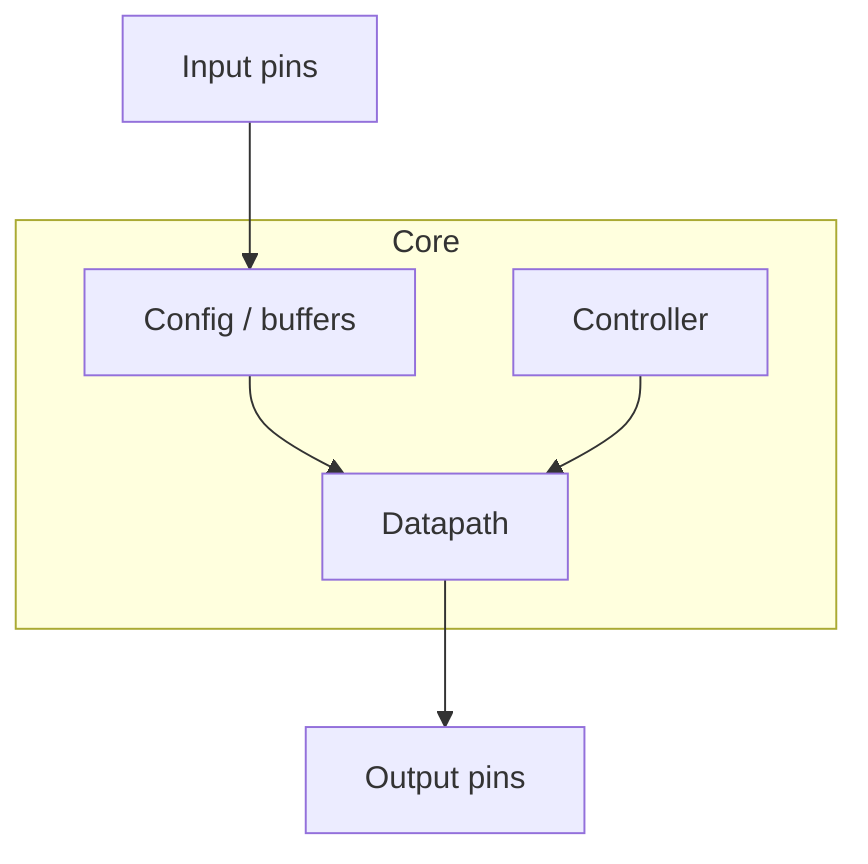

# Caso di studio: un ASIC didattico completo

Dopo aver introdotto le principali fasi del flow ASIC, è utile raccogliere i concetti in un **caso di studio concreto**.  
L'obiettivo di questa pagina non è descrivere un chip industriale complesso, ma costruire un esempio semplice, coerente e didatticamente efficace che permetta di vedere come:

- specifica;
- architettura;
- RTL;
- vincoli;
- sintesi;
- DFT;
- backend;
- signoff;
- tape-out;

si colleghino in un unico percorso progettuale.

Per questo proponiamo un **ASIC didattico di elaborazione dati**, sufficientemente semplice da essere compreso e sufficientemente realistico da mostrare le principali sfide del flow.

---

## 1. Obiettivo del caso di studio

Il caso di studio deve permettere di visualizzare in modo integrato:

- come nasce la specifica di un chip;
- come si definisce l'architettura;
- come si scrive una RTL coerente;
- come si impongono i vincoli temporali;
- come si interpretano sintesi e timing;
- perché servono DFT e signoff;
- come il progetto diventa un layout;
- come si arriva al tape-out.

In altre parole, deve servire da ponte tra teoria del flow e comprensione pratica del progetto.

---

## 2. Scelta del design: un piccolo acceleratore dedicato

Per il caso di studio scegliamo un **ASIC dedicato a una semplice elaborazione vettoriale su blocchi di dati**.

Il chip riceve dati in ingresso, li elabora secondo una funzione predefinita e fornisce il risultato in uscita.

Questa scelta è didatticamente efficace perché il design include:

- datapath;
- controllo;
- registri;
- pipeline;
- interfaccia di ingresso/uscita;
- gestione di start e done;
- una struttura sufficientemente ricca per mostrare i temi del flow.

### Esempio di funzione

A livello astratto, si può immaginare un blocco che:

- legge una sequenza di campioni;
- applica una trasformazione semplice;
- produce una sequenza di risultati.

Non serve fissare una funzione matematica troppo dettagliata: quello che conta è la struttura del progetto.

---

## 3. Specifica iniziale

La specifica del chip può essere formulata così, in forma semplificata.

### Requisiti funzionali

Il chip deve:

- ricevere dati da un'interfaccia di input;
- elaborare blocchi di dati secondo una funzione deterministica;
- fornire i risultati in uscita;
- segnalare l'inizio e la fine dell'elaborazione;
- supportare reset;
- offrire una modalità di test coerente con il flow ASIC.

### Requisiti prestazionali

Il chip deve:

- sostenere una frequenza target definita;
- elaborare un blocco di dati entro un numero massimo di cicli;
- mantenere una latenza compatibile con l'applicazione didattica.

### Requisiti fisici

Il progetto deve:

- rimanere compatto;
- avere consumo ragionevole;
- essere sintetizzabile in una libreria standard-cell realistica;
- essere fisicamente implementabile con un flow backend standard.

Questa specifica non è ancora il design: è la definizione del problema.

---

## 4. Architettura del chip

A partire dalla specifica, si può definire una prima architettura a blocchi.

Questa architettura include:

- un'interfaccia di ingresso;
- registri di configurazione;
- una FSM di controllo;
- un datapath pipeline-izzato;
- buffer di ingresso/uscita;
- segnali di stato.

### Perché è una buona architettura didattica

Permette di trattare:

- separazione tra controllo e datapath;
- pipeline;
- timing;
- gestione dei registri;
- reset;
- testabilità;
- implementazione fisica ragionevolmente semplice.

---

## 5. Interfaccia del chip

Per rendere il caso di studio concreto, è utile definire un'interfaccia semplificata.

### Segnali principali

- `clk`
- `rst_n`
- `start`
- `data_in`
- `data_in_valid`
- `data_out`
- `data_out_valid`
- `done`
- `error`, opzionale

### Funzionamento generale

1. il sistema esterno porta i dati e i segnali di validità;
2. il chip cattura i dati nei buffer o nei registri necessari;
3. il controller attiva il datapath;
4. il risultato viene prodotto dopo una latenza determinata dalla pipeline;
5. il chip segnala `done`.

Questa struttura è semplice, ma sufficiente per affrontare molti aspetti del flow ASIC.

---

## 6. Scelte architetturali principali

Per rendere il design compatibile con una frequenza target ragionevole, si può decidere di:

- separare chiaramente controllo e datapath;
- usare una pipeline a più stadi nel datapath;
- mantenere un set minimo di registri di configurazione;
- evitare strutture troppo generiche o pesanti;
- usare una FSM semplice per la gestione della sequenza operativa.

### Trade-off scelti

- più registri di pipeline per facilitare il timing;
- area leggermente maggiore ma migliore chiusura temporale;
- maggiore leggibilità e modularità della RTL;
- minore rischio di architettura troppo complessa.

---

## 7. RTL del caso di studio

La fase RTL può tradursi in una gerarchia semplice come:

- `top`
- `controller_fsm`
- `datapath`
- `input_buffer`
- `output_buffer`
- `config_regs`

### Aspetti importanti della RTL

- reset ben definito;
- pipeline esplicita;
- interfacce pulite;
- segnali di controllo ben nominati;
- nessuna logica superflua o poco sintetizzabile.

Questo rende il design leggibile, verificabile e adatto alla sintesi.

---

## 8. FSM di controllo

La FSM del controller può essere volutamente semplice.

### Stati tipici

- `IDLE`
- `LOAD`
- `RUN`
- `DONE`

### Funzionamento

- in `IDLE` il chip aspetta `start`;
- in `LOAD` acquisisce i dati o prepara il datapath;
- in `RUN` esegue l'elaborazione;
- in `DONE` segnala la conclusione e poi torna a `IDLE`.

Questa FSM è sufficiente per mostrare come il controllo si leghi al datapath e ai segnali esterni.

---

## 9. Datapath e pipeline

Il datapath può essere modellato come una pipeline a più stadi.

### Esempio concettuale

- stadio 1: acquisizione e pre-elaborazione;
- stadio 2: operazione principale;
- stadio 3: registrazione del risultato.

### Benefici della pipeline nel caso di studio

- percorso combinatorio più corto;
- migliore timing;
- struttura leggibile;
- buon esempio per il flow ASIC.

---

## 10. Vincoli temporali del progetto

Per rendere il caso di studio coerente con la sezione timing, si assumono vincoli temporali ben definiti.

### Vincoli principali

- un clock principale con periodo target;
- reset non trattato come normale segnale dati;
- input/output delay coerenti con un sistema esterno semplice;
- nessun falso path non giustificato;
- eventuale multicycle solo se chiaramente motivato dall'architettura.

### Obiettivo didattico

Mostrare che la qualità del progetto dipende anche da vincoli correttamente definiti, non solo dalla struttura RTL.

---

## 11. Sintesi del progetto

Applicando la sintesi al design, il team ottiene:

- netlist gate-level;
- report di timing;
- report di area;
- prima stima della potenza.

### Possibili risultati attesi

- la pipeline aiuta a chiudere timing;
- il controller occupa poca area;
- il datapath è la parte principale del costo logico;
- i registri di pipeline contribuiscono in modo significativo sia all'area sia alla potenza dinamica.

### Insegnamento del caso di studio

La sintesi rende visibile la relazione concreta tra scelte RTL e metriche del progetto.

---

## 12. DFT sul caso di studio

Il progetto viene poi reso testabile attraverso una struttura DFT semplice.

### Interventi tipici

- inserzione di scan flip-flop;
- costruzione di una o più scan chain;
- preparazione dell'ATPG;
- stima della test coverage.

### Effetti osservabili

- lieve aumento di area;
- impatto moderato su timing;
- migliore osservabilità e controllabilità;
- coerenza con il wafer test futuro.

Questo passaggio mostra bene perché la DFT è parte integrante del flow e non un'aggiunta opzionale.

---

## 13. Floorplanning del caso di studio

Essendo un design semplice, il floorplan può essere organizzato in modo ordinato.

### Possibile struttura

- regioni standard-cell centrali per controller e datapath;
- eventuale macro piccola o area buffer dedicata, se presenti memorie;
- pin di input da un lato;
- pin di output dal lato opposto o comunque coerenti con il flusso dati;
- rete di clock e power distribuita in modo semplice.

### Obiettivo didattico

Mostrare che anche un design relativamente piccolo beneficia di una disposizione fisica ragionata.

---

## 14. Place and Route del caso di studio

Durante il PnR, il design viene:

- collocato;
- instradato;
- ottimizzato;
- preparato alla CTS.

### Problemi tipici da osservare

- eventuale congestione nelle regioni del datapath;
- lunghezza dei percorsi verso input e output;
- bilanciamento delle regioni di standard cells;
- qualità del routing attorno ai registri di pipeline.

### Lezione principale

Anche un blocco relativamente semplice mostra già la differenza tra:

- netlist logica;
- realizzazione fisica concreta.

---

## 15. CTS del caso di studio

Con la Clock Tree Synthesis, il clock viene distribuito a:

- controller;
- datapath;
- registri di configurazione;
- registri di pipeline.

### Osservazioni utili

- il datapath pipeline-izzato genera numerosi sink di clock;
- la distribuzione del clock ha impatto diretto su timing e potenza;
- lo skew deve restare controllato;
- eventuali hold issue possono emergere dopo la CTS.

Questo rende il caso di studio utile anche per capire il ruolo reale del clock nel flow ASIC.

---

## 16. Timing closure del caso di studio

Dopo PnR e CTS si esegue la STA.

### Cosa ci si aspetta di analizzare

- setup sui percorsi del datapath;
- hold sui registri vicini o cammini troppo rapidi;
- margini del controller;
- eventuali percorsi di I/O.

### Possibili fix

- resizing di celle;
- buffering;
- piccoli aggiustamenti di placement;
- eventuale raffinamento della pipeline, se il progetto non chiude timing.

Questo mostra bene la natura iterativa del backend.

---

## 17. Potenza nel caso di studio

L'analisi della potenza permette di osservare:

- impatto dei registri di pipeline;
- contributo della clock tree;
- switching activity del datapath;
- peso relativamente minore del controller.

### Possibili ottimizzazioni

- introduzione di enable più rigorosi;
- riduzione di attività inutile nei registri;
- clock gating del datapath se il chip ha lunghi periodi di inattività.

Questo è un ottimo esempio di collegamento tra architettura, RTL e low-power design.

---

## 18. Signoff del caso di studio

Prima del tape-out, il caso di studio deve superare:

- timing signoff;
- DRC;
- LVS;
- equivalence checking;
- controlli di DFT.

### Obiettivo didattico

Far capire che anche un progetto apparentemente "semplice" non è pronto per la produzione finché:

- il layout non è corretto;
- il timing non è chiuso;
- la logica trasformata dal flow non è stata verificata;
- il chip non è testabile.

---

## 19. Tape-out del caso di studio

Una volta completato il signoff, il progetto può essere considerato pronto per il tape-out.

### Deliverable concettuali

- layout finale;
- netlist finale;
- dati di test;
- documentazione di rilascio;
- risultati delle verifiche.

Questo passaggio consente di introdurre il concetto che il chip, da questo momento, non è più solo "progetto", ma entra nel percorso che porta al silicio reale.

---

## 20. Post-silicon nel caso di studio

Immaginando la fabbricazione del chip, le prime attività sul silicio sarebbero:

- accesso al clock e reset;
- test DFT;
- verifica della funzionalità base;
- applicazione di pattern semplici;
- controllo dell'uscita del datapath;
- caratterizzazione di frequenza e consumo.

### Perché è utile didatticamente

Permette di collegare il flow di progetto all'idea concreta di chip che deve essere:

- acceso;
- testato;
- osservato;
- validato.

---

## 21. Errori che il caso di studio aiuta a capire

Questo esempio aiuta a visualizzare errori tipici del flow ASIC, ad esempio:

- specifica troppo debole;
- pipeline insufficiente per il timing target;
- reset poco chiaro;
- vincoli errati;
- floorplan troppo aggressivo;
- sottovalutazione della DFT;
- timing closure difficile dopo CTS;
- power budget trascurato.

Il valore del caso di studio non sta solo nel mostrare il percorso corretto, ma anche nel far vedere dove i problemi possono nascere.

---

## 22. Collegamento con FPGA

Questo caso di studio è ottimo anche come ponte verso FPGA, perché la stessa funzione può essere:

- prima prototipata su FPGA;
- poi raffinata in ottica ASIC.

In FPGA si possono validare:

- funzionalità del datapath;
- correttezza della FSM;
- comportamento del reset;
- interfacce;
- primi aspetti di timing.

Successivamente, il flow ASIC mostra come lo stesso progetto richieda disciplina molto maggiore in:

- sintesi;
- DFT;
- backend;
- signoff;
- tape-out.

---

## 23. Collegamento con SoC

Anche se questo caso di studio riguarda un ASIC relativamente semplice e non un intero SoC, molti concetti sono perfettamente collegabili alla sezione SoC.

Ad esempio:

- il chip può essere visto come un acceleratore dedicato;
- l'interfaccia di input/output può ricordare un blocco integrato in un sistema maggiore;
- il datapath e il controller sono analoghi a un IP custom all'interno di un SoC;
- la consapevolezza fisica è la stessa che serve per integrare un acceleratore in un chip più grande.

Questo rende il caso di studio utile anche come ponte metodologico fra ASIC e SoC.

---

## 24. Perché questo caso di studio è efficace

Questo esempio funziona bene didatticamente perché:

- è abbastanza piccolo da essere comprensibile;
- include specifica, architettura, RTL e backend;
- permette di parlare di timing, DFT e signoff;
- si presta a una possibile prototipazione FPGA;
- evidenzia il valore del flow ASIC senza richiedere la complessità di un chip industriale completo.

È quindi un ottimo esempio conclusivo per la sezione ASIC.

---

## 25. In sintesi

Il caso di studio proposto mostra come un ASIC didattico, anche relativamente semplice, debba attraversare tutte le fasi fondamentali del flow:

- specifica;
- architettura;
- RTL;
- verifica;
- vincoli;
- sintesi;
- DFT;
- floorplanning;
- place and route;
- CTS;
- signoff;
- tape-out.

Attraverso questo percorso diventa chiaro che la progettazione ASIC non consiste solo nello scrivere hardware, ma nel trasformare un'idea funzionale in un chip reale, verificabile, testabile e producibile.

---

## 26. Conclusione della sezione ASIC

Con questo caso di studio si chiude la panoramica introduttiva sulla progettazione ASIC.

Le pagine precedenti hanno descritto il flow e i suoi strumenti concettuali; questo esempio li ricompone in un percorso unitario, mostrando come le diverse fasi cooperino nel portare un progetto:

- dalla specifica al layout;
- dal layout al tape-out;
- dal tape-out al silicio.

Il passo successivo, se si vuole estendere ulteriormente il materiale, può essere uno dei seguenti:

- costruire una versione RTL di esempio del caso di studio;
- aggiungere una mini-sezione su strumenti e deliverable pratici;
- creare collegamenti espliciti con il prototipo FPGA o con un acceleratore inserito in un SoC.
