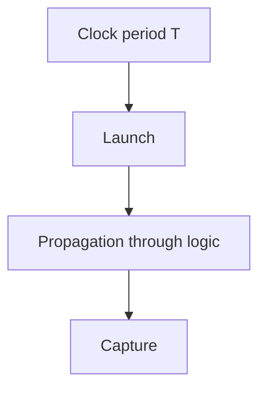
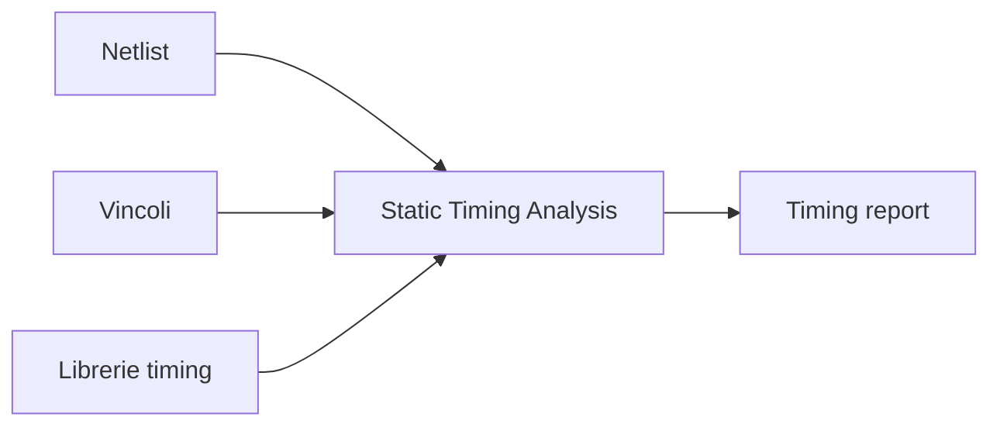
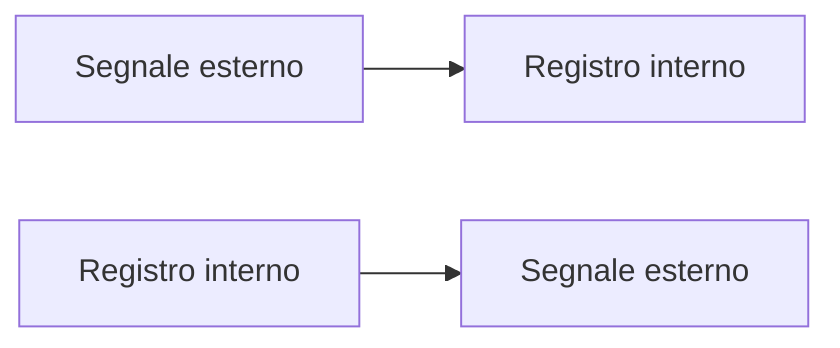
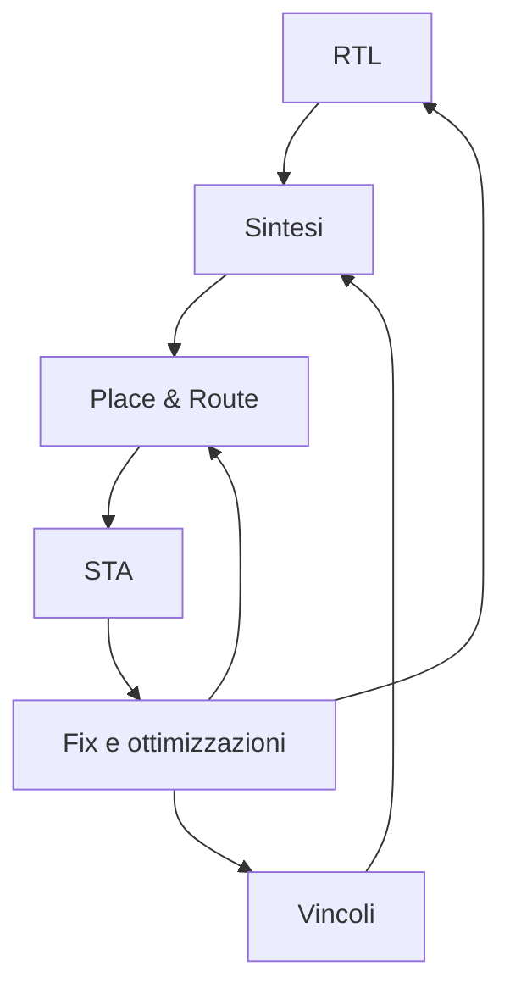

# Vincoli e timing in un progetto ASIC

Nel flow ASIC, i **vincoli temporali** hanno un ruolo centrale.  
Non basta che un design sia logicamente corretto: deve anche funzionare entro i limiti di tempo richiesti dal sistema reale.

Per questo motivo, la progettazione ASIC non si limita a descrivere:

- registri;
- combinazioni logiche;
- FSM;
- datapath;

ma richiede anche di definire in modo esplicito **quando** i segnali devono essere validi e **quali percorsi temporali** il design deve rispettare.

La gestione di vincoli e timing è fondamentale perché collega:

- architettura;
- RTL;
- sintesi;
- implementazione fisica;
- signoff.

---

## 1. Perché il timing è così importante

Un ASIC può essere perfettamente corretto dal punto di vista funzionale e tuttavia non essere utilizzabile se:

- non raggiunge la frequenza target;
- viola i margini di setup o hold;
- presenta percorsi critici troppo lunghi;
- dipende da assunzioni temporali non realistiche.

Il **timing** è quindi una proprietà essenziale del progetto, non un controllo secondario.

In pratica, un chip funziona correttamente solo se:

- i dati arrivano nel momento giusto;
- i registri campionano valori stabili;
- i percorsi interni rispettano i limiti richiesti;
- le interfacce esterne sono coerenti con il contesto di sistema.

---

## 2. Cosa si intende per vincoli

I **vincoli** sono informazioni che descrivono le condizioni temporali e strutturali entro cui il design deve operare.

Nel contesto ASIC, includono tipicamente:

- definizione dei clock;
- periodi di clock;
- relazioni tra clock;
- ritardi di input e output;
- carichi e drive assumptions;
- percorsi da escludere o trattare in modo speciale;
- condizioni operative e corner.

I vincoli permettono agli strumenti di:

- analizzare correttamente il timing;
- ottimizzare la sintesi;
- guidare placement e routing;
- verificare la chiusura temporale finale.

---

## 3. Il concetto di percorso temporale

Un **timing path** è il percorso che un'informazione percorre nel circuito da un punto di partenza a un punto di arrivo.

In modo semplificato, un percorso tipico può essere:

- da un registro sorgente;
- attraverso logica combinatoria;
- fino a un registro destinazione.

Il timing del progetto dipende dal fatto che il dato prodotto dal registro sorgente e trasformato dalla logica combinatoria arrivi al registro destinazione entro il tempo richiesto.

---

## 4. Percorsi sincroni tipici

In un design ASIC, i percorsi temporali più comuni sono:

- **register-to-register**;
- **input-to-register**;
- **register-to-output**;
- **input-to-output**, in alcuni casi.

## 4.1 Register-to-register

È il caso classico:

- un registro lancia il dato;
- il dato attraversa la logica combinatoria;
- un altro registro lo campiona.

## 4.2 Input-to-register

Un segnale esterno entra nel chip e deve arrivare correttamente a un registro interno.

## 4.3 Register-to-output

Un dato parte da un registro interno e deve essere disponibile in uscita entro un certo tempo.

Questi percorsi vengono trattati con vincoli diversi, ma il principio di base è lo stesso: definire quando il dato è valido e quando deve essere catturato.

---

## 5. Clock e periodo di clock

Il riferimento fondamentale per il timing è il **clock**.

## 5.1 Perché il clock è il riferimento temporale

Nel design sincrono, i registri campionano i dati in corrispondenza di eventi di clock.  
Il periodo di clock definisce quindi il tempo massimo disponibile per i percorsi tra registri.

## 5.2 Periodo di clock

Se il clock ha periodo `T`, allora il dato deve propagarsi dal registro sorgente al registro destinazione in un intervallo compatibile con tale periodo, tenendo conto di:

- ritardi dei registri;
- ritardi della logica combinatoria;
- skew del clock;
- margini di setup.

In termini progettuali, la frequenza target del chip si traduce in un periodo di clock massimo disponibile.

---

## 6. Setup time

Il **setup time** è uno dei concetti fondamentali del timing.

## 6.1 Definizione intuitiva

Perché un registro campioni correttamente un dato, il dato in ingresso deve essere stabile per un certo intervallo **prima** dell'evento di clock che lo cattura.

Questo intervallo minimo richiesto è il setup time.

## 6.2 Implicazioni

Se il dato arriva troppo tardi al registro destinazione, il setup viene violato e il comportamento del circuito può diventare errato o non deterministico.

### Cause tipiche di violazione di setup

- logica combinatoria troppo profonda;
- frequenza di clock troppo alta;
- routing lungo;
- pipeline insufficiente;
- pessimo floorplan;
- clock skew sfavorevole.

---

## 7. Hold time

Il **hold time** è complementare al setup time.

## 7.1 Definizione intuitiva

Dopo l'evento di clock che cattura il dato, il valore in ingresso al registro deve restare stabile per un certo intervallo minimo.

Questo intervallo è l'hold time.

## 7.2 Implicazioni

Se il dato cambia troppo presto dopo il fronte di clock, si verifica una violazione di hold.

### Cause tipiche di violazione di hold

- percorsi troppo veloci;
- skew del clock;
- bilanciamento non corretto della distribuzione del clock;
- ottimizzazioni fisiche che rendono alcuni cammini troppo brevi.

Molti progettisti alle prime armi si concentrano solo sul setup, ma anche l'hold è essenziale.

---

## 8. Slack

Lo **slack** è una misura sintetica della qualità temporale di un percorso.

In modo intuitivo:

- slack positivo → il percorso soddisfa il vincolo;
- slack negativo → il percorso viola il vincolo.

## 8.1 Setup slack

Indica quanto margine c'è rispetto al setup.

## 8.2 Hold slack

Indica quanto margine c'è rispetto all'hold.

Lo slack è uno degli indicatori più letti nei report di sintesi e STA.

---

## 9. Analisi temporale statica

La **Static Timing Analysis (STA)** è la tecnica principale con cui si analizza il timing di un progetto ASIC.

## 9.1 Perché "statica"

Viene chiamata statica perché non dipende da una simulazione funzionale vettoriale tradizionale: analizza il circuito come rete temporale, considerando:

- clock;
- ritardi;
- vincoli;
- librerie;
- corner.

## 9.2 Cosa controlla

La STA verifica:

- setup;
- hold;
- percorsi critici;
- relazioni tra clock;
- margini di timing;
- casi operativi diversi.

La STA accompagna più fasi del flow:

- post-sintesi;
- post-CTS;
- post-route;
- signoff.

---

## 10. File di vincoli

Nel flow ASIC, i vincoli vengono spesso raccolti in file dedicati, tipicamente nel formato **SDC** (*Synopsys Design Constraints*) o equivalenti.

Questi file descrivono, ad esempio:

- clock;
- input/output delay;
- false path;
- multicycle path;
- casi particolari di timing;
- condizioni di analisi.

Anche senza entrare nel dettaglio sintattico, è importante capire che il file di vincoli è uno dei documenti tecnici più importanti del progetto.

---

## 11. Definizione dei clock

La definizione dei clock è il primo e più importante elemento dei vincoli.

## 11.1 Cosa bisogna definire

Per ogni clock è necessario chiarire almeno:

- periodo;
- eventuale duty cycle;
- origine o sorgente;
- relazione con altri clock;
- eventuali clock derivati.

## 11.2 Perché è fondamentale

Se il clock è definito male:

- la sintesi ottimizza in modo scorretto;
- la STA analizza percorsi in modo non realistico;
- il progetto può sembrare "chiuso" ma non esserlo davvero;
- alcune violazioni possono essere nascoste o inventate.

La definizione del clock è quindi il punto di partenza di tutta l'analisi temporale.

---

## 12. Input delay e output delay

Non tutto il timing del chip è interno.  
Il design deve anche rispettare i tempi di comunicazione con l'esterno.

## 12.1 Input delay

Descrive quando un segnale in ingresso può essere considerato valido rispetto al clock di riferimento.

## 12.2 Output delay

Descrive entro quando un segnale in uscita deve essere disponibile per il sistema esterno.

Questi vincoli sono cruciali per modellare correttamente le interfacce reali del chip.

Senza input/output delay realistici, il progetto può risultare corretto solo "nel vuoto", ma non nel sistema reale.

---

## 13. False path

Non tutti i percorsi nel design devono essere analizzati come cammini temporali normali.

Un **false path** è un percorso che, pur esistendo logicamente, non deve essere considerato per il timing funzionale normale.

## 13.1 Perché esistono

Può capitare che alcuni segnali:

- non vengano mai usati in certe combinazioni;
- attraversino strutture di configurazione;
- facciano parte di logiche che non hanno vincolo temporale diretto nel caso funzionale.

## 13.2 Attenzione

Dichiarare un false path in modo errato è pericoloso, perché può nascondere una violazione reale.

Il false path va usato con molta disciplina e solo quando il comportamento del sistema lo giustifica davvero.

---

## 14. Multicycle path

Un **multicycle path** è un percorso che, per progetto, dispone di più di un singolo ciclo di clock per completare la propagazione del dato.

## 14.1 Quando si usa

Si applica quando l'architettura prevede esplicitamente che un certo trasferimento o calcolo si completi in più cicli.

## 14.2 Perché è utile

Permette di modellare correttamente percorsi che non devono rispettare il vincolo di un singolo ciclo.

## 14.3 Attenzione

Come per i false path, anche i multicycle path vanno definiti con grande cautela: un uso scorretto può mascherare veri problemi di timing.

---

## 15. Percorsi critici

Un **percorso critico** è un percorso che si avvicina di più al limite temporale imposto dal progetto, o lo supera.

I percorsi critici sono importanti perché:

- limitano la frequenza massima del chip;
- indicano i punti deboli dell'architettura o dell'implementazione;
- guidano ottimizzazioni di RTL, sintesi e backend.

## 15.1 Cause tipiche

- logica combinatoria troppo lunga;
- fanout elevato;
- struttura poco pipeline-izzata;
- interconnessioni lunghe;
- congestione;
- pessimo bilanciamento tra datapath e controllo.

Identificare correttamente i percorsi critici è una parte essenziale della timing closure.

---

## 16. Timing closure

La **timing closure** è il processo con cui si porta il design a soddisfare tutti i vincoli temporali richiesti.

Non è un singolo controllo, ma un'attività iterativa che coinvolge:

- architettura;
- RTL;
- vincoli;
- sintesi;
- floorplanning;
- placement;
- CTS;
- routing.

## 16.1 Obiettivo

Raggiungere:

- setup slack non negativo;
- hold slack non negativo;
- margini adeguati ai corner considerati.

## 16.2 Perché è difficile

Perché il timing dipende contemporaneamente da:

- struttura logica;
- qualità dei vincoli;
- librerie;
- distribuzione del clock;
- posizione fisica dei blocchi;
- parassitici reali del layout.

---

## 17. Timing post-sintesi e timing post-layout

Il timing viene analizzato in più momenti del flow.

## 17.1 Post-sintesi

Qui si ottiene una prima stima utile, ma ancora incompleta rispetto alla realtà fisica finale.

Serve per:

- capire se l'RTL è plausibile;
- identificare grossi problemi di timing;
- guidare le prime correzioni.

## 17.2 Post-layout

Dopo placement, routing e CTS si ottiene una visione più realistica, perché entrano in gioco:

- lunghezze effettive delle interconnessioni;
- parassitici;
- effetti del clock tree;
- congestione fisica.

Il timing post-layout è molto più vicino a quello reale del silicio.

---

## 18. Corner e condizioni operative

Il timing di un ASIC non viene verificato in una sola condizione ideale.

Si considerano diverse condizioni, ad esempio relative a:

- tensione;
- temperatura;
- variabilità del processo;
- modelli di libreria.

Questo perché il chip reale deve funzionare in un insieme di condizioni plausibili, non solo nel caso "nominale".

La necessità di analizzare più corner rende ancora più importante:

- avere vincoli chiari;
- mantenere margini adeguati;
- non chiudere il timing in modo troppo fragile.

---

## 19. Impatto dei vincoli sulla sintesi

I vincoli guidano direttamente il comportamento della sintesi.

Se i vincoli sono:

- realistici e corretti, la sintesi ottimizza in modo utile;
- troppo rilassati, il risultato può essere lento o poco robusto;
- troppo aggressivi, si rischiano area e potenza eccessive;
- sbagliati, il progetto può apparire corretto ma non esserlo davvero.

Per questo i vincoli non sono "parametri secondari", ma parte del progetto stesso.

---

## 20. Impatto dei vincoli sul backend

Anche il backend dipende fortemente dai vincoli.

Essi influenzano:

- placement;
- buffering;
- ottimizzazione del routing;
- costruzione del clock tree;
- fix di setup e hold;
- priorità sulle regioni critiche del chip.

Vincoli poco credibili possono portare a:

- sforzi inutili del backend;
- congestione eccessiva;
- timing closure apparente ma fragile;
- uso inefficiente dell'area.

---

## 21. Errori frequenti nella gestione dei vincoli

Tra gli errori più comuni:

- definire male il clock;
- dimenticare input/output delay;
- usare false path per "nascondere" violazioni;
- dichiarare multicycle non giustificati dall'architettura;
- non aggiornare i vincoli quando cambia il design;
- usare ipotesi temporali non coerenti con il sistema reale;
- trascurare l'hold timing;
- considerare il timing solo alla fine del progetto.

---

## 22. Buone pratiche concettuali

Una buona gestione di vincoli e timing segue alcune linee guida:

- definire i clock in modo preciso;
- documentare le assunzioni;
- mantenere coerenza tra architettura, RTL e vincoli;
- trattare con cautela false path e multicycle;
- analizzare setup e hold in tutte le fasi importanti;
- usare il timing come feedback progettuale, non solo come check finale.

---

## 23. Collegamento con FPGA

Anche in FPGA esistono vincoli e analisi temporale, ma nel mondo ASIC la loro importanza è ancora maggiore.

Studiare il timing in ottica ASIC aiuta a capire meglio anche perché, in FPGA, certi design:

- non chiudano la frequenza attesa;
- richiedano pipeline;
- soffrano di percorsi critici imprevisti;
- dipendano fortemente dai vincoli del progetto.

La cultura del timing ASIC rende più disciplinato l'intero approccio al design digitale.

---

## 24. Collegamento con SoC

Nel contesto SoC, il timing si estende a:

- interconnect;
- memory subsystem;
- acceleratori;
- clock domain multipli;
- reset domain;
- integrazione hardware/software.

Nel contesto ASIC, questi elementi vengono però tradotti in vincoli e verifiche molto concrete, che devono guidare sintesi e implementazione fisica.

---

## 25. Esempio concettuale

Immaginiamo un blocco ASIC con:

- clock target di periodo `T`;
- un percorso tra due registri;
- logica combinatoria abbastanza profonda.

Se il percorso non chiude timing, le soluzioni possibili possono includere:

- introdurre una pipeline;
- ridurre la complessità combinatoria;
- migliorare il floorplan;
- correggere i vincoli se non realistici;
- ottimizzare il backend.

Questo esempio mostra che il timing non è solo un numero in un report: è un criterio che orienta concretamente le scelte di progetto.

---

## 26. In sintesi

Vincoli e timing sono una parte essenziale della progettazione ASIC.  
Servono a definire quando il chip deve funzionare correttamente e a guidare tutte le fasi del flow rispetto a questo obiettivo.

In particolare, è fondamentale comprendere:

- il ruolo del clock;
- setup e hold;
- i percorsi temporali;
- la STA;
- il significato dei file di vincoli;
- false path e multicycle;
- il processo di timing closure.

Un progetto ASIC non è completo quando "funziona in simulazione", ma quando rispetta in modo robusto anche i propri vincoli temporali.

---

## Prossimo passo

Dopo aver chiarito il ruolo dei vincoli e del timing, il passo successivo naturale è approfondire la **sintesi logica**, cioè il processo con cui la RTL e i vincoli vengono trasformati in una netlist di celle standard ottimizzata per area, timing e potenza.
