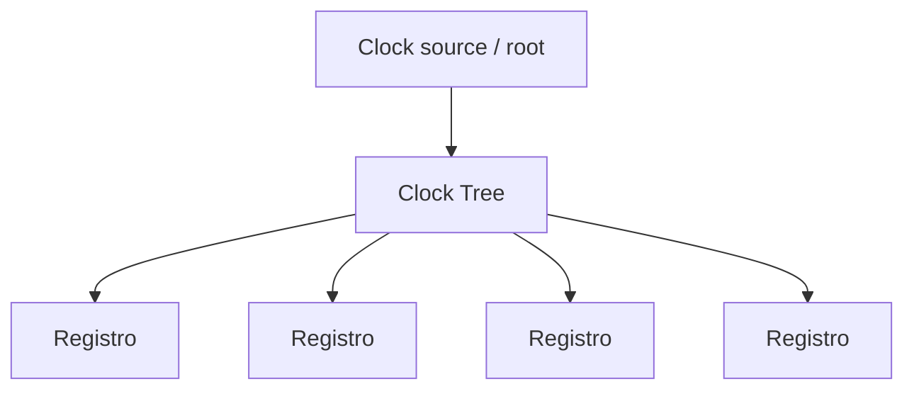
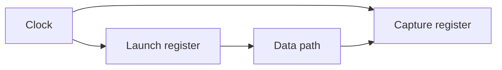
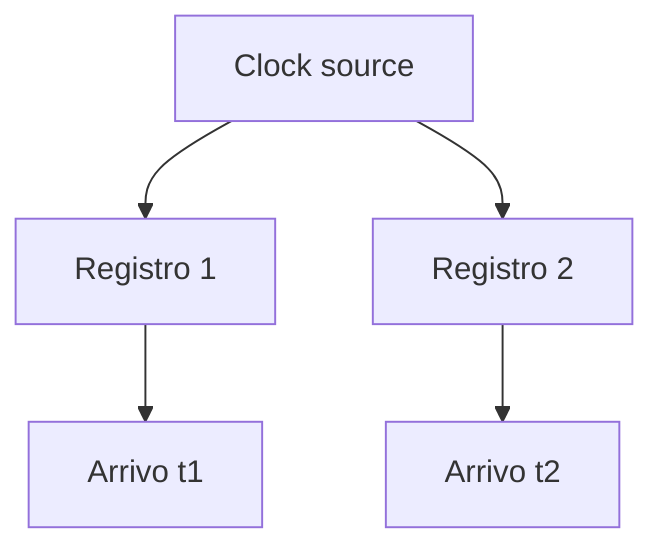
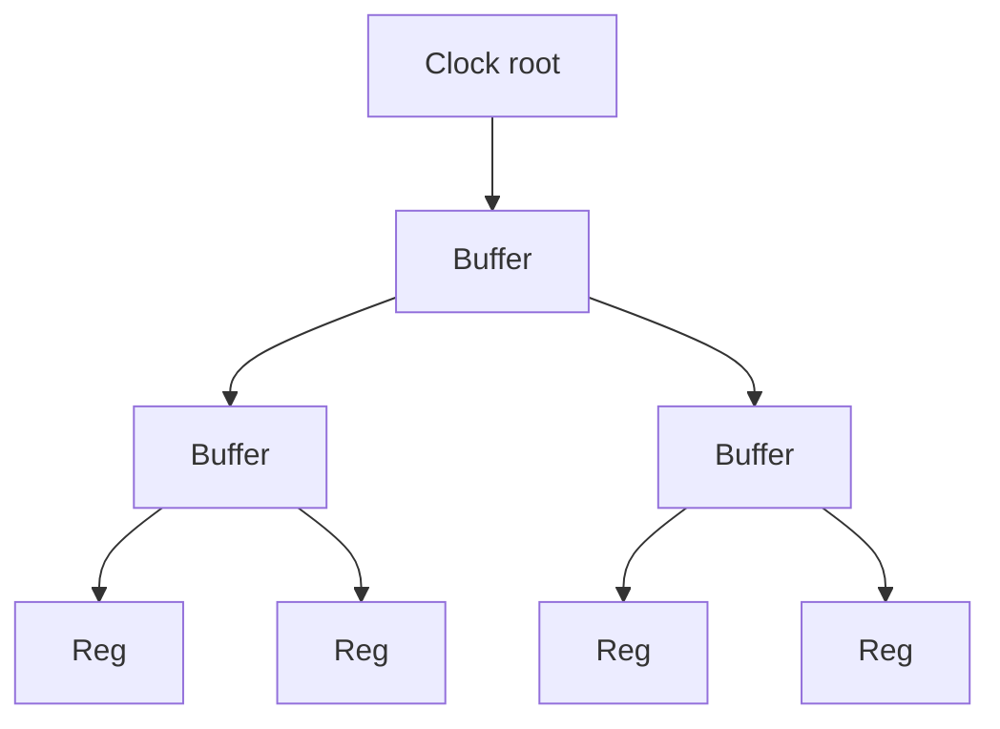
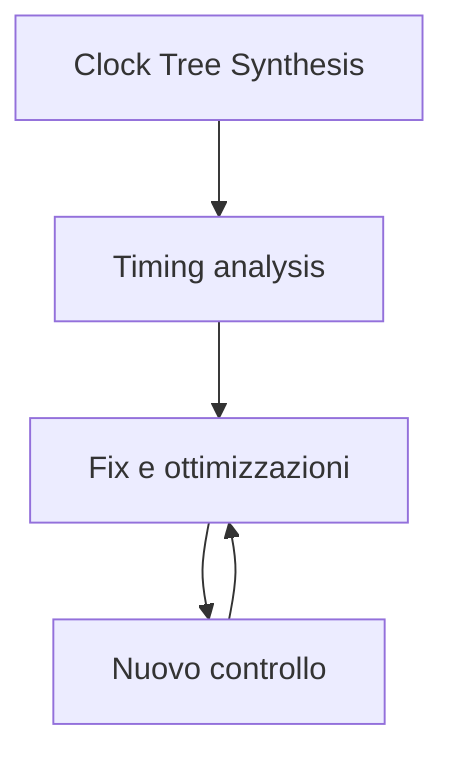

# Clock Tree Synthesis in un progetto ASIC

La **Clock Tree Synthesis (CTS)** è la fase del flow ASIC in cui la rete di distribuzione del clock viene costruita fisicamente all'interno del chip.  
Dopo il placement e prima del completamento del backend finale, il progetto deve essere dotato di una struttura che porti il segnale di clock a tutti gli elementi sequenziali in modo:

- controllato;
- bilanciato;
- compatibile con il timing;
- sostenibile dal punto di vista fisico;
- ragionevole in termini di potenza.

Il clock è una delle reti più importanti del chip.  
Non è solo un segnale di controllo: è l'infrastruttura temporale fondamentale del design digitale sincrono.

Per questo la CTS è una fase critica del flow ASIC e ha impatto diretto su:

- setup timing;
- hold timing;
- skew;
- latency;
- consumo dinamico;
- robustezza del chip;
- qualità del signoff.

---

## 1. Che cos'è la Clock Tree Synthesis

La Clock Tree Synthesis è il processo con cui si realizza la rete di distribuzione del clock a partire da una sorgente o da un insieme di sorgenti definite nei vincoli di progetto.

Lo scopo è connettere il clock a:

- flip-flop;
- registri;
- latch, se presenti;
- macro clocked;
- blocchi sequenziali del design.

L'obiettivo non è solo "far arrivare il clock ovunque", ma farlo arrivare in modo compatibile con i requisiti temporali del progetto.

---

## 2. Perché il clock richiede una fase dedicata

Nel chip, il clock è un segnale speciale per diversi motivi:

- raggiunge un numero enorme di elementi;
- ha un impatto diretto sul timing del circuito;
- contribuisce significativamente al consumo dinamico;
- è sensibile a ritardi, carichi e distribuzione fisica;
- non può essere trattato come una normale rete di segnale.

Senza una progettazione dedicata della rete di clock, il design rischia di:

- avere skew eccessivo;
- mostrare violazioni di setup o hold;
- consumare più del necessario;
- diventare fragile rispetto alle variazioni fisiche.

Per questo la CTS è una fase specifica del backend.

---

## 3. Il ruolo del clock nel timing

Il clock definisce il riferimento temporale del sistema.  
Il modo in cui esso viene distribuito influenza direttamente quando i registri:

- lanciano i dati;
- li catturano;
- li considerano validi.

Se il clock arriva a tempi molto diversi in punti diversi del chip, il timing del design viene alterato in modo significativo.

Questo mostra perché la rete di clock non è indipendente dal resto del timing: ne è parte integrante.

---

## 4. Skew

Uno dei concetti più importanti legati alla CTS è lo **skew**.

## 4.1 Definizione intuitiva

Lo skew è la differenza di tempo con cui il clock arriva a due elementi sequenziali diversi.

Se il clock raggiunge un registro prima e un altro dopo, tra i due esiste skew.

## 4.2 Perché conta

Lo skew altera la finestra temporale disponibile per il percorso dati tra registri e può:

- aiutare o peggiorare il setup;
- aiutare o peggiorare l'hold;
- rendere il timing meno prevedibile;
- introdurre criticità nei percorsi sensibili.

La CTS cerca di controllare questo fenomeno, non di ignorarlo.

---

## 5. Latency

Un altro concetto chiave è la **clock latency**.

## 5.1 Che cos'è

È il ritardo totale tra la sorgente del clock e il punto in cui il clock arriva a un determinato registro o sink.

## 5.2 Perché è importante

La latenza del clock:

- influisce sul timing del progetto;
- dipende dalla struttura della clock tree;
- può cambiare tra diversi sink;
- contribuisce al comportamento reale del chip.

La CTS non cerca necessariamente di minimizzare ogni latenza in assoluto, ma di renderla coerente e compatibile con i vincoli del design.

---

## 6. Clock tree

La distribuzione del clock avviene di norma tramite una struttura gerarchica detta **clock tree**.

## 6.1 Idea generale

A partire dalla sorgente del clock, il segnale viene distribuito attraverso:

- buffer;
- inverter, se necessari;
- ramificazioni;
- segmenti di rete dedicati.

## 6.2 Obiettivi della struttura ad albero

- distribuire il carico;
- controllare il ritardo;
- ridurre lo skew;
- mantenere una topologia ragionevole per il layout.

La parola "tree" è importante: il clock viene distribuito attraverso una struttura organizzata, non con connessioni casuali.

---

## 7. Sink del clock

I **sink** del clock sono i punti finali in cui il segnale di clock deve arrivare.

Tipicamente includono:

- flip-flop;
- latch;
- macro sincrone;
- alcuni blocchi interni speciali.

La CTS deve tenere conto del numero, della posizione e del carico dei sink.  
Un design con molti sink distribuiti in aree lontane rende la CTS più complessa.

---

## 8. Buffering del clock

Per distribuire il clock si usano spesso celle dedicate di buffering.

## 8.1 Perché servono i buffer

Il clock deve pilotare molti carichi. Senza buffering:

- il segnale perderebbe qualità;
- i ritardi crescerebbero;
- lo skew sarebbe difficile da controllare.

## 8.2 Effetti del buffering

I buffer aiutano a:

- distribuire il carico;
- bilanciare i percorsi;
- controllare ritardi e transizioni.

Tuttavia, introducono anche:

- area;
- potenza;
- complessità fisica;
- nuove dipendenze dal placement.

Per questo la CTS è sempre un esercizio di compromesso.

---

## 9. Bilanciamento della clock tree

Uno degli obiettivi principali della CTS è il **bilanciamento** della rete.

## 9.1 Cosa significa bilanciare

Significa costruire i percorsi del clock in modo che i sink ricevano il clock con ritardi coerenti e controllati.

## 9.2 Perché serve

Un bilanciamento ragionevole riduce:

- skew eccessivo;
- differenze problematiche tra register launch e capture;
- instabilità temporale nei cammini critici.

Il bilanciamento non implica che tutti i percorsi siano identici, ma che il comportamento temporale del clock sia compatibile con il design.

---

## 10. CTS e setup timing

La CTS ha un forte impatto sul **setup timing**.

Se il clock arriva al registro di cattura troppo presto o troppo tardi rispetto al registro di lancio, il margine temporale utile per il percorso dati cambia.

### Possibili effetti

- miglioramento di alcuni percorsi;
- peggioramento di altri;
- emersione di nuovi cammini critici;
- necessità di ottimizzare placement o buffering.

Per questo il timing va sempre rianalizzato dopo la CTS.

---

## 11. CTS e hold timing

La CTS ha anche un forte impatto sull'**hold timing**, spesso ancora più delicato.

## 11.1 Perché

Piccole differenze nel tempo di arrivo del clock possono far sì che il dato cambi troppo presto rispetto al fronte di cattura di un altro registro.

## 11.2 Conseguenze

- comparsa di hold violations;
- necessità di fix locali;
- inserzione di ritardi o buffering;
- ulteriore iterazione nel backend.

Molti percorsi che sembravano tranquilli prima della CTS possono diventare problematici proprio per l'hold.

---

## 12. CTS e potenza

Il clock è una delle reti che contribuisce di più al consumo dinamico del chip.

## 12.1 Perché il clock consuma molto

- commuta a ogni ciclo;
- raggiunge molti sink;
- attraversa buffer e reti estese;
- pilota carichi elevati.

## 12.2 Implicazioni

Una CTS molto aggressiva o troppo estesa può aumentare significativamente:

- area della rete di clock;
- potenza dinamica;
- carico complessivo del design.

Per questo la CTS non deve essere pensata solo in ottica di timing, ma anche di consumo energetico.

---

## 13. CTS e floorplanning

La qualità della CTS dipende molto dal floorplan.

Un floorplan ben organizzato aiuta perché:

- i sink del clock sono distribuiti in modo più regolare;
- i blocchi logicamente affini sono fisicamente raggruppati;
- i percorsi della rete di clock sono più controllabili;
- la congestione è meno severa.

Un floorplan debole può invece rendere la CTS molto più costosa e meno efficace.

---

## 14. CTS e placement

Anche il placement delle standard cells influenza profondamente la clock tree.

Se il placement è:

- troppo disperso;
- troppo congestionato;
- poco bilanciato;

la CTS può dover introdurre:

- molti buffer;
- percorsi lunghi;
- soluzioni meno efficienti;
- clock skew più difficile da controllare.

Per questo la CTS si basa su un placement sufficientemente stabile e ragionevole.

---

## 15. CTS e routing

Dopo la costruzione della clock tree, anche il routing reale della rete di clock influenza il risultato finale.

Aspetti rilevanti:

- lunghezza effettiva delle connessioni;
- uso dei layer;
- interazione con altre reti;
- capacità parassite;
- integrità del segnale.

Il comportamento temporale del clock non dipende quindi solo dalla topologia logica della tree, ma anche dalla sua realizzazione fisica concreta.

---

## 16. CTS e clock domains

Se il design ha più **clock domain**, la CTS può dover gestire più reti di clock separate.

Questo comporta:

- strutture multiple;
- obiettivi diversi di skew e latency;
- sink differenti;
- maggiore complessità di implementazione;
- necessità di trattare correttamente i crossing tra domini.

Aumentare il numero di clock domain può essere utile architetturalmente, ma rende più complessa la CTS.

---

## 17. CTS e clock gating

Nei design con strategie di **clock gating**, la CTS deve convivere con la presenza di elementi che:

- abilitano o disabilitano porzioni della rete di clock;
- separano sottosistemi;
- cambiano il carico visto localmente.

Questo rende ancora più importante avere:

- una clock architecture disciplinata;
- una buona definizione dei domini e delle gerarchie;
- una gestione coerente dei vincoli.

---

## 18. CTS e macro

Le macro sincrone, come memorie o blocchi hard, possono essere sink o sottosistemi importanti per la rete di clock.

La loro presenza complica la CTS perché:

- hanno posizioni fisse o fortemente vincolate;
- possono essere fisicamente lontane tra loro;
- introducono carichi importanti;
- possono generare regioni di routing difficili.

La CTS deve quindi rispettare non solo la logica, ma anche la geografia fisica del chip.

---

## 19. Ottimizzazione dopo CTS

Una volta costruita la clock tree, il design viene normalmente rianalizzato e ottimizzato.

Possibili attività successive:

- fixing di hold violations;
- fixing di setup violations;
- resizing;
- buffering locale;
- correzioni di placement;
- raffinamenti del routing.

Questo dimostra che la CTS non è una fase isolata, ma parte di un ciclo di raffinamento del backend.

---

## 20. Errori frequenti nella CTS

Tra gli errori concettuali più comuni:

- considerare il clock una rete qualsiasi;
- pensare che la CTS serva solo a "tirare fili";
- ignorare l'impatto della CTS su hold timing;
- trascurare il costo in potenza della rete di clock;
- non collegare i problemi di CTS a floorplan e placement;
- introdurre troppi clock domain senza necessità;
- sottovalutare l'importanza della qualità del buffering.

---

## 21. Buone pratiche concettuali

Una buona gestione della CTS segue alcune regole di fondo:

- progettare il design con clock architecture chiara;
- usare floorplan e placement ragionevoli;
- controllare skew e latency insieme;
- valutare setup e hold dopo la CTS;
- considerare il clock anche come problema di potenza;
- ridurre la complessità dei clock domain quando possibile.

---

## 22. Relazione con il signoff

La CTS è una delle fasi che preparano direttamente il **signoff temporale** del design.

Dopo la CTS, i report di timing diventano più realistici perché il comportamento del clock è molto più vicino a quello che avrà il chip reale.

Per questo le analisi di timing successive alla CTS sono tra le più importanti del flow backend.

---

## 23. Collegamento con FPGA

Anche nei flussi FPGA esiste il tema della distribuzione del clock, ma nel mondo ASIC la CTS è molto più esplicita e centrale.

Studiare la CTS ASIC aiuta a capire meglio anche in FPGA:

- il ruolo dello skew;
- l'importanza dei domini di clock;
- il peso della distribuzione del clock sul timing;
- il legame tra clocking e floorplanning.

In ASIC, però, la rete di clock viene costruita direttamente sul layout, e questo ne aumenta drasticamente la rilevanza progettuale.

---

## 24. Collegamento con SoC

Nel contesto SoC, la CTS può diventare particolarmente complessa per la presenza di:

- molti sink distribuiti;
- macro di memoria;
- più clock domain;
- domini di potenza;
- blocchi con esigenze temporali diverse.

La CTS è quindi uno dei punti in cui il design SoC incontra più direttamente le difficoltà del backend ASIC reale.

---

## 25. Esempio concettuale

Immaginiamo un ASIC con:

- un datapath centrale;
- una macro SRAM;
- un controller;
- vari registri distribuiti in più regioni del chip.

Se il placement è ben organizzato, la CTS può costruire una rete di clock relativamente bilanciata.  
Se invece i sink del clock sono troppo dispersi o separati da macro mal posizionate, la tree può richiedere:

- più buffer;
- percorsi più lunghi;
- maggiore potenza;
- maggiore skew;
- più difficoltà nel closure del timing.

Questo esempio mostra che la CTS non è un dettaglio finale, ma un passaggio fortemente dipendente dalla qualità dell'intero backend.

---

## 26. In sintesi

La Clock Tree Synthesis è la fase del flow ASIC in cui il clock viene distribuito fisicamente ai sink del design in modo controllato e bilanciato.

I concetti fondamentali da comprendere sono:

- clock tree;
- sink;
- skew;
- latency;
- buffering;
- impatto su setup e hold;
- consumo della rete di clock;
- relazione con floorplan, placement e routing.

La CTS è una fase centrale perché rende il comportamento temporale del chip molto più vicino alla realtà fisica e prepara il design alle verifiche finali di timing e signoff.

---

## Prossimo passo

Dopo la Clock Tree Synthesis, il passo successivo naturale è approfondire il tema del **signoff fisico e temporale**, cioè l'insieme delle verifiche finali che determinano se il chip è davvero pronto per il tape-out.
