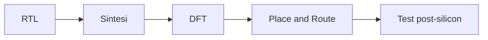
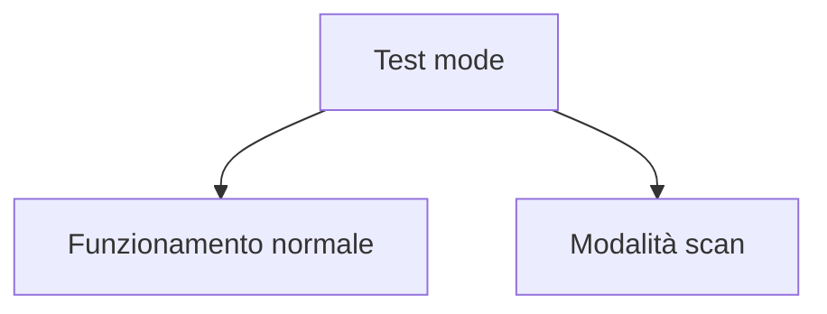
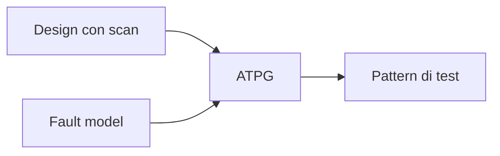
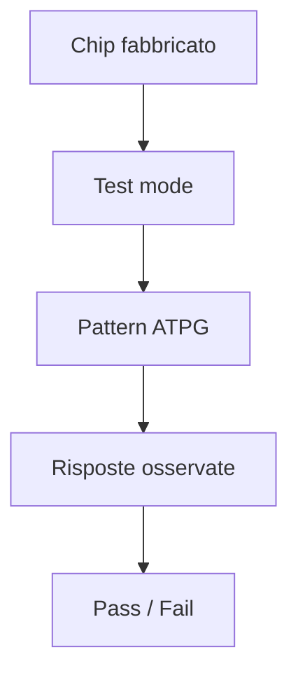

# DFT e testabilità in un progetto ASIC

La **DFT** (*Design for Testability* o *Design for Test*) è l'insieme di tecniche che rendono un chip **testabile dopo la fabbricazione**.  
In un progetto ASIC, non basta che il circuito sia corretto in simulazione o che chiuda timing: il chip reale deve anche poter essere collaudato in modo sistematico, ripetibile ed economicamente sostenibile.

Per questo, la DFT è una parte essenziale del flow ASIC e non una fase accessoria.  
Essa collega progettazione logica, verifica, backend e test post-silicon.

Un progetto non testabile è industrialmente debole, perché anche un chip corretto dal punto di vista funzionale può risultare inutilizzabile se non esiste un modo affidabile per:

- rilevare difetti di fabbricazione;
- isolare fault;
- verificare il comportamento dei registri;
- misurare la qualità del lotto produttivo;
- scartare dispositivi difettosi.

---

## 1. Perché serve la DFT

La fabbricazione di un chip reale può introdurre difetti fisici che non erano presenti nel progetto logico.

Esempi possibili:

- linee interrotte;
- cortocircuiti;
- contatti imperfetti;
- difetti localizzati nel silicio;
- problemi nei via o nel routing;
- guasti dovuti al processo produttivo.

La DFT serve a garantire che questi difetti possano essere rilevati con test sistematici.

### Domanda centrale della DFT

> Come posso osservare e controllare i nodi interni del chip in modo da verificare che il circuito fisico realizzato corrisponda ragionevolmente al progetto atteso?

---

## 2. Il problema della osservabilità e controllabilità

La testabilità dipende da due concetti fondamentali:

- **controllabilità**;
- **osservabilità**.

## 2.1 Controllabilità

È la facilità con cui si può imporre a un nodo interno del circuito un valore desiderato, direttamente o indirettamente.

## 2.2 Osservabilità

È la facilità con cui si può osservare, tramite uscite o strutture dedicate, il valore di un nodo interno.

In un circuito combinatorio piccolo questo problema può essere gestibile.  
In un circuito sequenziale grande, con molti registri e poca visibilità interna, diventa rapidamente molto difficile.

La DFT nasce proprio per migliorare osservabilità e controllabilità del design.

---

## 3. DFT nel contesto del flow ASIC

Nel flow ASIC, la DFT si colloca tipicamente dopo la sintesi logica e prima delle fasi avanzate di implementazione fisica, anche se i suoi effetti devono essere considerati già in fase RTL e architetturale.

La DFT non è un'aggiunta isolata: modifica il design e ha impatto su:

- area;
- timing;
- reset;
- clocking;
- floorplanning;
- power;
- verifica.

---

## 4. Obiettivi della DFT

La DFT ha più obiettivi simultanei.

### 4.1 Rilevare difetti di fabbricazione

Il primo scopo è intercettare chip difettosi.

### 4.2 Aumentare la copertura di test

Si vuole rilevare il maggior numero possibile di fault rilevanti.

### 4.3 Ridurre il costo del collaudo

Il test deve essere efficace ma anche compatibile con tempi e costi industriali.

### 4.4 Rendere il design accessibile ai pattern di test

Questo richiede strutture dedicate, soprattutto per i circuiti sequenziali.

### 4.5 Supportare debug e bring-up

Alcune infrastrutture di test aiutano anche nelle prime fasi di validazione del silicio.

---

## 5. Perché il test di un circuito sequenziale è difficile

In un design sequenziale, i registri introducono stato interno e dipendenze temporali.  
Senza tecniche DFT, per testare un nodo profondo del circuito potrebbe essere necessario:

- applicare una lunga sequenza di stimoli;
- attraversare molte condizioni interne;
- osservare indirettamente l'effetto solo dopo numerosi cicli.

Questo rende il test molto complesso, fragile e costoso.

La DFT semplifica il problema trasformando, in parte, il circuito sequenziale in una struttura più facile da controllare e osservare.

---

## 6. Scan design

La tecnica DFT più comune negli ASIC digitali è lo **scan design**.

## 6.1 Idea di base

I registri del design vengono resi accessibili anche in una modalità di test, in modo da poter essere concatenati e utilizzati come una o più **scan chain**.

In modalità di test, i flip-flop non vengono usati soltanto come registri funzionali, ma anche come elementi di una catena seriale attraverso cui:

- caricare uno stato interno desiderato;
- propagare il circuito per uno o pochi cicli;
- osservare il contenuto dei registri risultanti.

## 6.2 Vantaggio concettuale

Lo scan design rende il circuito molto più testabile, perché trasforma il problema del test sequenziale in un problema più vicino al test combinatorio tra registri caricabili e osservabili.

---

## 7. Scan chain

Una **scan chain** è una catena di flip-flop collegati tra loro in modalità test.

## 7.1 Modalità funzionale

I flip-flop si comportano come normali registri del progetto.

## 7.2 Modalità scan

I flip-flop vengono collegati serialmente, in modo da permettere:

- shift-in di dati di test;
- shift-out dei risultati;
- caricamento e osservazione dello stato interno.

## 7.3 Più scan chain

Nei design più grandi non si usa una sola catena, ma più catene parallele, per ridurre il tempo complessivo di test.

---

## 8. Scan flip-flop

Per realizzare una scan chain si usano flip-flop speciali o strutture equivalenti, spesso detti **scan flip-flop**.

Questi elementi hanno tipicamente:

- ingresso dati funzionale;
- ingresso scan;
- selezione tra modalità funzionale e test;
- uscita normale e/o collegamento alla catena.

L'uso dei scan flip-flop modifica il design rispetto alla netlist puramente funzionale, e questo spiega perché la DFT ha impatto su area e timing.

---

## 9. Fault models

Per testare un circuito è necessario definire **quali tipi di fault** si vogliono rilevare.

La DFT e l'ATPG si basano su modelli astratti di difetto.

## 9.1 Stuck-at faults

È uno dei modelli più classici.

### Idea

Un nodo del circuito è modellato come se fosse permanentemente bloccato a:

- `0` (*stuck-at-0*);
- `1` (*stuck-at-1*).

### Perché è utile

È un modello semplice ma molto importante storicamente e metodologicamente, perché consente di costruire pattern di test efficaci per una grande classe di difetti.

## 9.2 Altri modelli

A livello introduttivo, è utile sapere che esistono anche altri fault model, ad esempio per:

- ritardi;
- transizioni;
- bridging faults;
- difetti specifici più sofisticati.

Per una sezione introduttiva, però, il modello stuck-at è il punto di partenza più utile.

---

## 10. ATPG

L'**ATPG** (*Automatic Test Pattern Generation*) è il processo con cui si generano automaticamente i pattern di test da applicare al circuito.

## 10.1 Cosa fa l'ATPG

Dato:

- il design con strutture DFT;
- il fault model scelto;

l'ATPG cerca pattern capaci di:

- attivare un fault;
- propagarne l'effetto verso punti osservabili;
- permettere il rilevamento del difetto.

## 10.2 Perché l'ATPG è importante

Senza ATPG, il numero di pattern necessari e la complessità del test diventerebbero ingestibili per design di media o grande dimensione.

---

## 11. Test coverage

Una metrica molto importante nella DFT è la **test coverage**.

## 11.1 Che cosa misura

Misura la percentuale di fault modellati che possono essere effettivamente rilevati dai pattern di test generati.

## 11.2 Perché conta

Una coverage elevata indica che il design è ben testabile rispetto al modello adottato.  
Una coverage bassa può segnalare:

- scarsa controllabilità;
- scarsa osservabilità;
- strutture difficili da testare;
- reset o clock problematici;
- porzioni di logica non adeguatamente coperte.

La coverage di test è quindi uno degli indicatori principali della qualità DFT del progetto.

---

## 12. Test mode e funzionamento normale

La DFT introduce nel chip una distinzione importante tra:

- **modalità funzionale**;
- **modalità di test**.

In modalità funzionale, il circuito deve comportarsi come previsto dalla specifica.  
In modalità test, alcune strutture cambiano comportamento per permettere:

- caricamento degli stati;
- shift dei dati di scan;
- applicazione dei pattern;
- osservazione dei risultati.

Questa dualità richiede attenzione sia nella progettazione sia nella verifica.

---

## 13. Impatto della DFT su area

La DFT ha un costo in area.

Le cause principali sono:

- sostituzione dei flip-flop normali con scan flip-flop;
- logica di selezione test/funzionale;
- wiring aggiuntivo per le scan chain;
- eventuali controller o strutture di supporto.

Questo overhead è normalmente accettabile, perché la testabilità è essenziale per poter produrre e qualificare il chip.

---

## 14. Impatto della DFT su timing

La DFT ha anche un impatto sul timing.

Possibili effetti:

- aumento del ritardo su certi percorsi;
- maggiore carico dovuto ai flip-flop di scan;
- complessità aggiuntiva su reset e clock;
- necessità di controllare timing in modalità funzionale e talvolta anche in modalità test.

Per questo la DFT non può essere trattata come fase completamente indipendente: deve essere integrata con il resto del flow.

---

## 15. Impatto della DFT su clock e reset

Clock e reset hanno un ruolo molto importante nella DFT.

## 15.1 Clock

Occorre capire come:

- clock funzionali;
- clock di test;
- eventuali scan clock;

siano gestiti durante i pattern di test.

## 15.2 Reset

Reset troppo aggressivi o poco disciplinati possono complicare la controllabilità del design in modalità scan.

Una strategia di reset ben pensata rende più semplice:

- scan insertion;
- ATPG;
- bring-up;
- debug post-silicon.

---

## 16. DFT e architettura

Anche se la DFT viene implementata più avanti nel flow, alcune scelte devono essere considerate già a livello architetturale.

Esempi:

- numero di clock domain;
- struttura dei reset;
- presenza di blocchi difficili da osservare;
- eventuali macro o IP con esigenze specifiche di test;
- interfacce che devono supportare modalità diagnostiche.

Un'architettura che ignora del tutto la testabilità può rendere la DFT molto costosa o inefficace.

---

## 17. DFT e RTL

Anche a livello RTL è utile avere consapevolezza della futura DFT.

Scelte che possono aiutare:

- reset disciplinati;
- clocking chiaro;
- strutture di controllo leggibili;
- gerarchia ordinata;
- evitare costrutti che creino logiche opache o difficili da testare.

La DFT non richiede necessariamente che tutta la logica sia visibile in RTL, ma una buona RTL può facilitare enormemente il lavoro successivo.

---

## 18. DFT e verifica

Le strutture DFT introdotte nel design vanno verificate.

Occorre controllare almeno che:

- la modalità funzionale non sia stata compromessa;
- le scan chain siano corrette;
- la modalità test sia attivabile come previsto;
- i pattern e la controllabilità siano coerenti con la struttura inserita;
- eventuali segnali di test non interferiscano con il comportamento normale.

In molti flow reali, la verifica della DFT è una parte importante del percorso verso il signoff.

---

## 19. DFT e backend

La DFT ha anche conseguenze fisiche.

Le scan chain, ad esempio, influenzano:

- wiring;
- placement dei flip-flop;
- timing locale;
- congestione;
- distribuzione del clock di test.

Per questo la DFT non è solo una disciplina logica: interagisce anche con il floorplanning e con il place and route.

---

## 20. Test post-fabbricazione

Una volta fabbricato il chip, le strutture DFT vengono usate per il collaudo.

Il processo tipico è:

1. si entra in modalità test;
2. si applicano pattern generati via ATPG;
3. si osservano le risposte;
4. si decide se il dispositivo è conforme o difettoso.

Questo è uno dei passaggi che trasformano un progetto ASIC in un prodotto realmente industrializzabile.

---

## 21. Fault diagnosis e debug

Oltre al puro pass/fail, le infrastrutture di test possono aiutare anche a:

- localizzare fault;
- identificare pattern problematici;
- supportare analisi di yield;
- agevolare il debug dei primi campioni di silicio.

Questo aumenta ulteriormente il valore della DFT nel ciclo di vita del chip.

---

## 22. Errori frequenti nella DFT

Tra gli errori più comuni:

- considerare la DFT troppo tardi nel flow;
- trattarla come un'aggiunta puramente automatica;
- trascurare l'impatto su timing e area;
- ignorare la struttura dei clock domain;
- usare reset poco compatibili con la testabilità;
- non monitorare la test coverage;
- verificare poco la modalità test;
- pensare che la simulazione funzionale basti a garantire la qualità del chip prodotto.

---

## 23. Buone pratiche concettuali

Una buona strategia DFT segue alcune regole di fondo:

- pensare alla testabilità già in architettura;
- mantenere clock e reset disciplinati;
- introdurre scan in modo coerente con il flow;
- leggere coverage e report con spirito critico;
- verificare sia modalità funzionale sia modalità test;
- considerare l'impatto fisico e non solo logico.

---

## 24. Collegamento con FPGA

Nel mondo FPGA, la DFT classica è meno centrale rispetto all'ASIC, perché il dispositivo è già fabbricato e la logica viene configurata a posteriori.

Tuttavia, i concetti di:

- osservabilità;
- controllabilità;
- debug strutturato;
- test dei sottosistemi;

restano molto utili anche in FPGA.

Studiare la DFT ASIC aiuta quindi a sviluppare una cultura più matura del test digitale, anche quando si lavora su piattaforme programmabili.

---

## 25. Collegamento con SoC

Nel contesto SoC, la DFT si estende a sistemi più complessi, in cui bisogna considerare:

- molti clock domain;
- più sottosistemi;
- memorie;
- interconnect;
- CPU e periferiche;
- IP di terze parti.

In un SoC, la testabilità diventa ancora più importante perché il numero di blocchi e la complessità complessiva aumentano fortemente.

La DFT ASIC fornisce quindi uno dei pilastri metodologici che rendono un SoC realizzabile come prodotto.

---

## 26. Esempio concettuale

Immaginiamo un piccolo acceleratore con:

- datapath;
- FSM;
- registri di configurazione;
- registri di pipeline.

Senza DFT, testare internamente il chip richiederebbe sequenze di stimoli complesse e poca visibilità sui nodi interni.

Con lo scan design, invece, è possibile:

- caricare uno stato noto nei registri;
- applicare uno o pochi cicli di clock;
- leggere il contenuto risultante;
- confrontare il comportamento atteso con quello osservato.

Questo esempio mostra bene il valore concettuale della DFT.

---

## 27. In sintesi

La DFT è l'insieme di tecniche che rendono un ASIC testabile dopo la fabbricazione.  
Nel flow digitale, la forma più comune di DFT è lo **scan design**, che migliora osservabilità e controllabilità del circuito, permettendo la generazione di pattern tramite **ATPG** e la misura della **test coverage**.

La DFT ha un impatto reale su:

- area;
- timing;
- clock e reset;
- verifica;
- backend;
- costi industriali del prodotto.

Per questo è una componente fondamentale della progettazione ASIC e non un'aggiunta opzionale.

---

## Prossimo passo

Dopo DFT e testabilità, il passo successivo naturale è approfondire il tema del **floorplanning**, cioè la prima organizzazione fisica del chip che prepara il design alle fasi di place and route, CTS e signoff.
