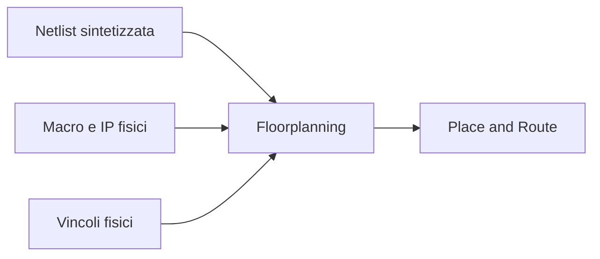
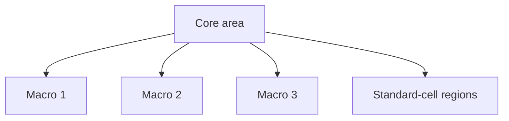
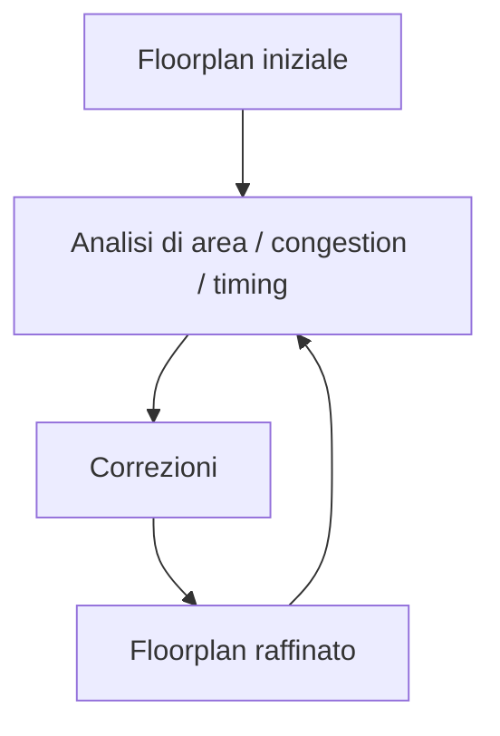

# Floorplanning in un progetto ASIC

Il **floorplanning** è una delle prime e più importanti fasi della progettazione fisica di un ASIC.  
Dopo la sintesi e l'eventuale inserzione delle strutture DFT, il design deve iniziare a prendere una forma fisica concreta: occorre decidere **come organizzare lo spazio del chip**, dove collocare i blocchi principali e come preparare il terreno per:

- placement;
- routing;
- distribuzione del clock;
- power distribution;
- timing closure;
- verifiche fisiche finali.

Il floorplanning non è ancora il layout dettagliato del chip, ma è il momento in cui si definisce la **geografia iniziale del progetto**.

Una buona scelta in questa fase può facilitare fortemente il backend.  
Una cattiva scelta può introdurre problemi di:

- congestione;
- percorsi troppo lunghi;
- clock tree complessa;
- area inefficiente;
- difficoltà di chiusura temporale;
- rischio elevato di iterazioni costose.

---

## 1. Che cos'è il floorplanning

Il floorplanning è la fase in cui si definiscono le linee guida fisiche di base del chip, ad esempio:

- dimensioni e forma dell'area di progetto;
- posizione delle macro;
- collocazione iniziale dei sottoblocchi;
- struttura del power grid;
- posizione dei pin;
- aree riservate per determinate funzioni;
- prime ipotesi su congestion e distribuzione del traffico.

In altri termini, è la fase in cui il design logico comincia a diventare uno spazio fisico organizzato.

---

## 2. Perché il floorplanning è così importante

Il floorplan influenza direttamente molte proprietà del design finale.

### Impatto sul timing

Blocchi logicamente connessi ma fisicamente lontani possono generare percorsi lunghi e difficili da chiudere.

### Impatto sulla congestione

Una disposizione sbagliata di macro e logica può concentrare troppo traffico in regioni ristrette.

### Impatto sul clock tree

La distribuzione del clock dipende fortemente dalla struttura fisica del chip.

### Impatto sulla potenza

La posizione dei blocchi influisce su:

- power grid;
- densità di switching;
- hot spots;
- IR drop, a livello introduttivo.

### Impatto sul routing

Una topologia fisica poco ordinata rende il routing più difficile e meno efficiente.

Per questo il floorplanning è una fase strategica e non una mera attività "geometrica".

---

## 3. Input del floorplanning

Per costruire un floorplan servono diversi elementi.

## 3.1 Netlist del design

La netlist sintetizzata fornisce la struttura logica da implementare.

## 3.2 Macro fisiche

Molti design contengono macro come:

- memorie;
- PLL;
- hard IP;
- PHY;
- blocchi analogici;
- macro specializzate.

## 3.3 Vincoli fisici

Possono includere:

- area target;
- aspect ratio;
- posizione dei pin;
- regioni vietate;
- domini di alimentazione;
- zone riservate.

## 3.4 Informazioni architetturali

Conoscere:

- quali blocchi comunicano molto;
- quali sottosistemi sono fortemente accoppiati;
- quali interfacce sono critiche;

aiuta a fare scelte fisiche più intelligenti.

---

## 4. Area del chip e area del core

Nel floorplanning è importante distinguere concettualmente tra:

- area totale del chip;
- area del core logico;
- eventuali regioni I/O o periferiche.

In molti casi il floorplan si concentra soprattutto sull'area del core, cioè la regione destinata a contenere:

- standard cells;
- macro;
- reti interne;
- clocking infrastructure;
- power structures.

La disponibilità di area non deve essere pensata solo come "spazio sufficiente a contenere le celle", ma anche come spazio necessario per:

- routing;
- buffering;
- alimentazione;
- margini di implementazione.

---

## 5. Shape del core e aspect ratio

Uno degli aspetti iniziali del floorplan è scegliere la forma del core.

## 5.1 Aspect ratio

L'**aspect ratio** è il rapporto tra larghezza e altezza dell'area di progetto.

### Perché conta

Una forma troppo estrema può causare:

- percorsi lunghi in una direzione;
- routing sbilanciato;
- clock tree meno efficiente;
- uso poco omogeneo dello spazio.

### Scelta tipica

Molto spesso si cerca una forma ragionevolmente compatta e regolare, salvo esigenze specifiche legate a:

- pad ring;
- macro;
- interfacce;
- packaging.

---

## 6. Utilization

Nel floorplanning si valuta anche l'**utilization**, cioè quanto dell'area disponibile è occupata dalla logica e dalle strutture previste.

## 6.1 Perché non si usa il 100%

Un design non può essere floorplannato con utilization troppo alta, perché serve spazio anche per:

- routing;
- buffering;
- clock tree;
- power straps;
- fix fisici successivi.

## 6.2 Utilization troppo alta

Può portare a:

- routing congestion;
- peggioramento del timing;
- difficoltà di placement;
- iterazioni di backend molto più difficili.

## 6.3 Utilization troppo bassa

Può sprecare area e peggiorare alcune metriche, ma in molti casi è comunque meno rischiosa di una utilization eccessiva.

Il floorplanning è quindi anche un esercizio di equilibrio fra compattezza e implementabilità.

---

## 7. Macro placement

Una parte cruciale del floorplan è il posizionamento delle **macro**.

## 7.1 Cosa sono le macro

Le macro sono blocchi fisici relativamente rigidi, ad esempio:

- SRAM;
- ROM;
- hard IP;
- PLL;
- PHY;
- blocchi analogici.

## 7.2 Perché il loro posizionamento è importante

Le macro:

- occupano molto spazio;
- non sono facilmente deformabili;
- hanno pin specifici;
- influenzano fortemente il routing circostante;
- possono creare barriere fisiche.

Un cattivo posizionamento delle macro può compromettere l'intero design.

---

## 8. Criteri di placement delle macro

Una macro dovrebbe essere posizionata considerando almeno:

- intensità del traffico con altri blocchi;
- vicinanza a interfacce o pin pertinenti;
- impatto sulla congestion;
- disponibilità di power grid;
- facilità di routing;
- relazione con clock e reset.

### Esempi di buone pratiche

- mettere una memoria vicino al blocco che la usa intensamente;
- collocare una PHY verso il bordo del chip, se interagisce con I/O esterni;
- evitare che una macro tagli in modo sfavorevole una regione centrale del routing.

### Rischi comuni

- macro troppo centrali senza motivazione;
- macro molto vicine con canali di routing insufficienti;
- macro che separano blocchi logicamente fortemente connessi.

---

## 9. Standard-cell regions

Dopo aver posizionato le macro, occorre lasciare aree ben strutturate per le **standard cells**.

Queste aree devono consentire:

- placement regolare;
- distribuzione del clock;
- routing dei segnali;
- inserzione di buffer;
- ottimizzazioni di timing.

Un floorplan efficace non consiste solo nel "trovare posto" per le macro, ma nel lasciare spazio utile e ordinato per tutta la logica sintetizzata.

---

## 10. Canali di routing

Le macro e le regioni logiche devono essere disposte tenendo conto dei **canali di routing**, cioè dello spazio attraverso cui i segnali potranno essere instradati.

## 10.1 Perché servono

Se due macro sono troppo vicine o male orientate, il routing dei segnali che le circondano può diventare molto difficile.

## 10.2 Conseguenze di canali insufficienti

- forte congestione;
- ritardi aggiuntivi;
- uso eccessivo di layer e buffer;
- difficoltà nel closure del timing;
- aumento del rischio di DRC.

Questa è una delle ragioni per cui un floorplan apparentemente "compatto" può in realtà essere dannoso.

---

## 11. Pin placement

Il floorplanning deve tenere conto anche della posizione dei **pin** e delle interfacce con l'esterno o con blocchi adiacenti.

## 11.1 Perché il pin placement conta

La posizione dei pin influenza:

- lunghezza dei percorsi in ingresso e uscita;
- distribuzione del traffico;
- routing ai bordi del chip;
- organizzazione delle macro vicine;
- qualità del timing delle interfacce.

## 11.2 Buone pratiche

- collocare i pin in modo coerente con i blocchi che li usano;
- evitare percorsi inutilmente lunghi verso il centro del chip;
- raggruppare segnali logicamente affini.

Un pin placement poco ragionato può generare problemi che si ripercuotono su tutto il backend.

---

## 12. Floorplanning e connettività

Una delle idee chiave del floorplanning è rispettare la **prossimità logica** anche a livello fisico.

Blocchi che si parlano molto dovrebbero, se possibile, essere anche vicini fisicamente.

### Esempi

- datapath e memoria locale;
- controller e macro che gestiscono;
- blocchi che condividono traffico intenso;
- sottosistemi con molte interfacce reciproche.

Se invece due blocchi fortemente accoppiati risultano lontani nel floorplan, si crea facilmente un problema di timing e routing.

---

## 13. Congestione

La **congestion** è uno dei temi principali del floorplanning.

## 13.1 Che cos'è

La congestione si verifica quando troppe connessioni devono attraversare la stessa regione del layout.

## 13.2 Cause tipiche

- macro mal posizionate;
- utilization troppo alta;
- interconnect centrata in una zona troppo piccola;
- pin placement sfavorevole;
- troppi percorsi globali che attraversano la stessa area.

## 13.3 Effetti

- routing difficile;
- aumento dei ritardi;
- peggioramento del timing;
- più iterazioni di backend;
- rischio di DRC.

Il floorplanning ha proprio il compito di prevenire questi problemi quanto più possibile.

---

## 14. Floorplanning e timing

Il floorplanning influisce direttamente sul timing perché determina, almeno in prima approssimazione:

- distanza tra blocchi;
- lunghezza potenziale delle interconnessioni;
- zone critiche di distribuzione del clock;
- facilità di bilanciamento del design.

Una cattiva disposizione fisica può rendere difficile la chiusura temporale anche quando la RTL e la sintesi sono ragionevoli.

Per questo il floorplanning va letto come una fase che ha impatto diretto anche sui report di timing futuri.

---

## 15. Floorplanning e power grid

Il chip ha bisogno di una distribuzione di alimentazione robusta, e il floorplan prepara anche questa infrastruttura.

## 15.1 Cosa bisogna considerare

- regioni ad alta attività;
- macro energivore;
- domini di alimentazione diversi;
- spazio per straps o strutture di alimentazione;
- distribuzione omogenea della corrente.

## 15.2 Effetti di un floorplan debole sul power

- hot spots;
- maggiore sensibilità a IR drop;
- routing di alimentazione più difficile;
- minore robustezza del design.

Anche se l'analisi completa di potenza avverrà più avanti, il floorplanning deve già preparare una struttura fisicamente sensata.

---

## 16. Power domain e floorplanning

Se il design ha più **power domain**, il floorplan deve rispettarli.

Ciò può richiedere:

- regioni separate;
- margini dedicati;
- isolamento fisico;
- spazio per celle di isolation o retention;
- compatibilità con sequenziamento e distribuzione dell'alimentazione.

I power domain rendono il floorplanning più complesso, ma anche più importante.

---

## 17. Floorplanning e clock distribution

Il floorplan influenza fortemente la futura distribuzione del clock.

## 17.1 Perché

Il clock tree dovrà raggiungere:

- registri;
- sottosistemi;
- macro clocked;
- eventuali domini multipli.

## 17.2 Impatti di un floorplan sfavorevole

- skew più difficile da controllare;
- clock tree più lunga;
- maggiore consumo;
- difficoltà di timing su percorsi sensibili.

Per questo una progettazione fisica ordinata aiuta anche la CTS.

---

## 18. Floorplanning e DFT

Le strutture DFT, come le scan chain, influenzano anch'esse il floorplan.

Considerazioni tipiche:

- vicinanza dei flip-flop collegati in scan;
- organizzazione delle catene;
- routing di segnali di test;
- impatto delle strutture scan sulla congestione.

Un floorplan che ignora completamente la presenza delle strutture DFT rischia di rendere più difficile il place and route finale.

---

## 19. Feedback dal floorplanning

Il floorplanning non è solo una fase esecutiva: produce feedback molto preziosi per il progetto.

Può mettere in luce:

- area insufficiente;
- macro troppo numerose o troppo grandi;
- blocchi logicamente mal organizzati;
- traffico eccessivo tra regioni;
- power domain mal concepiti;
- interfacce collocate in modo sfavorevole.

Per questo il floorplanning può portare a iterazioni verso:

- architettura;
- RTL;
- budgeting;
- strategia di backend.

---

## 20. Floorplanning iterativo

Nella pratica, il floorplan non è quasi mai perfetto al primo tentativo.

Il processo tipico è:

1. si crea un floorplan iniziale;
2. si osservano:
   - congestione;
   - timing preliminare;
   - difficoltà di placement;
   - problemi di macro placement;
3. si correggono:
   - shape;
   - posizioni;
   - utilization;
   - regioni riservate;
4. si rilancia l'analisi.

Questa iterazione è normale e spesso molto utile per ridurre il rischio del backend.

---

## 21. Errori frequenti nel floorplanning

Tra gli errori più comuni:

- scegliere utilization troppo alta;
- posizionare le macro senza considerare il traffico;
- ignorare canali di routing e spazi di manovra;
- collocare male i pin;
- non considerare abbastanza presto power grid e clock distribution;
- creare forme del core poco favorevoli;
- trattare il floorplan come fase puramente geometrica;
- non usare il feedback del floorplanning per migliorare architettura o netlist.

---

## 22. Buone pratiche concettuali

Una buona strategia di floorplanning tende a seguire questi principi:

- mantenere il design fisicamente leggibile;
- raggruppare blocchi logicamente affini;
- lasciare spazio sufficiente al routing;
- non esasperare la densità;
- posizionare le macro con criterio architetturale;
- pensare fin da subito a clock, power e DFT;
- usare il floorplan come strumento di comprensione del design.

---

## 23. Collegamento con FPGA

Nel mondo FPGA il floorplanning è spesso meno esplicito o meno centrale rispetto all'ASIC, ma i concetti restano utili.

Aiuta infatti a capire perché:

- certi blocchi dovrebbero stare vicini;
- alcune scelte migliorano il timing;
- memorie e DSP influenzano l'implementazione;
- il partizionamento fisico conta anche su dispositivi programmabili.

Studiare il floorplanning ASIC aiuta a sviluppare una consapevolezza fisica più matura anche in FPGA.

---

## 24. Collegamento con SoC

Nel contesto SoC, il floorplanning è il punto in cui le scelte architetturali di sistema diventano vincoli fisici reali.

La presenza di:

- memorie;
- interconnect;
- periferiche;
- domini di clock;
- power domain;
- acceleratori;

rende il floorplanning di un SoC particolarmente delicato e importante.

Questa pagina costituisce quindi anche un ponte forte tra la sezione ASIC e la sezione SoC.

---

## 25. Esempio concettuale

Immaginiamo un ASIC con:

- una macro SRAM;
- un datapath centrale;
- un controller;
- una periferia di interfaccia;
- alcuni pin concentrati su un lato del chip.

Un floorplan sensato potrebbe:

- mettere la SRAM vicino al datapath;
- collocare il controller vicino ai blocchi che coordina;
- porre la periferia verso il lato dei pin pertinenti;
- lasciare canali di routing adeguati tra le regioni.

Un floorplan poco pensato potrebbe invece:

- separare troppo SRAM e datapath;
- creare congestion al centro del chip;
- allungare percorsi critici verso le interfacce.

Questo esempio mostra come il floorplanning sia una disciplina di organizzazione tecnica, non solo di disposizione geometrica.

---

## 26. In sintesi

Il floorplanning è la fase in cui il design ASIC inizia a prendere una forma fisica concreta.  
Qui si definiscono:

- shape e area del core;
- utilization;
- posizione delle macro;
- regioni per standard cells;
- canali di routing;
- pin placement;
- prime strutture di power e clock awareness.

Un buon floorplan migliora:

- timing;
- congestion;
- routing;
- robustezza del backend;
- probabilità di closure del progetto.

Per questo è una delle fasi più strategiche dell'intero flow ASIC.

---

## Prossimo passo

Dopo il floorplanning, il passo successivo naturale è approfondire il **place and route**, cioè la fase in cui la netlist viene realmente collocata e connessa nel layout, affrontando in modo concreto placement, routing, congestione e ottimizzazioni fisiche.
