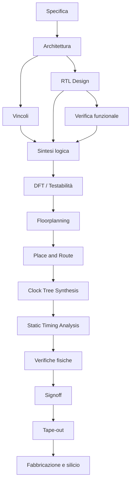
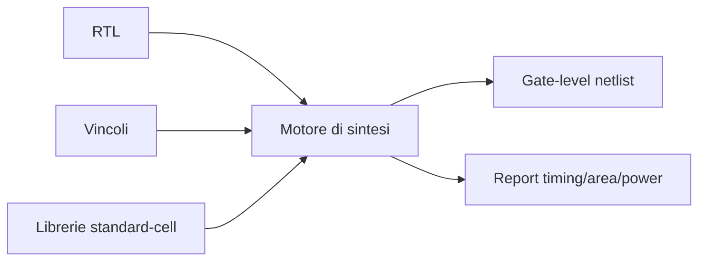
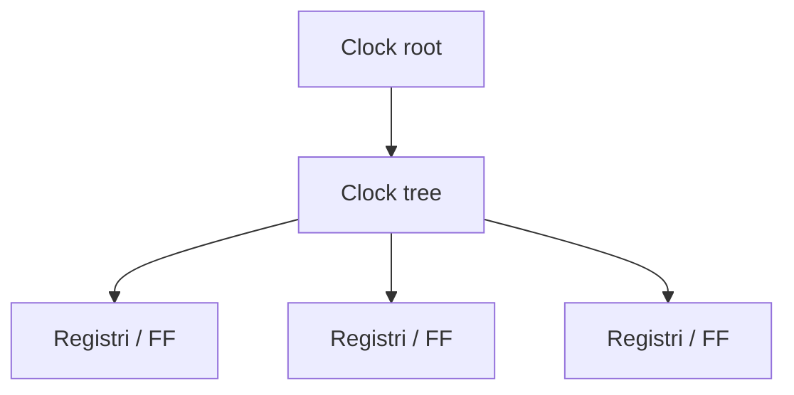
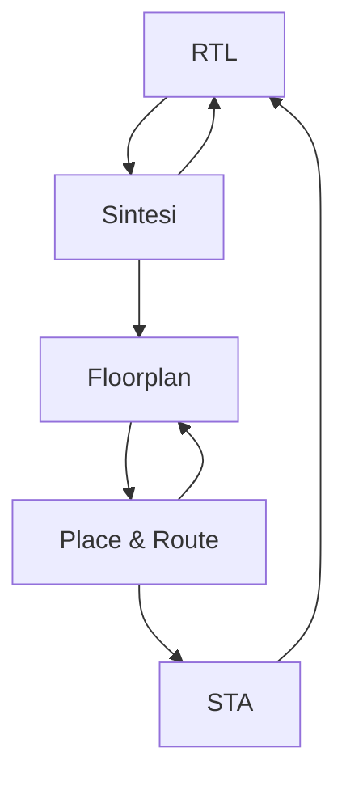

# Flusso di progettazione ASIC

La progettazione di un **ASIC** non consiste in un singolo passaggio dalla descrizione hardware al chip finito, ma in una sequenza articolata di fasi tecniche, ciascuna con:

- obiettivi specifici;
- input ben definiti;
- deliverable intermedi;
- verifiche dedicate;
- possibili iterazioni.

Comprendere il **flow ASIC** è fondamentale perché permette di collocare correttamente ogni attività del progetto, evitando di considerare RTL, sintesi o backend come mondi separati.

In realtà, il progetto ASIC è una **catena di trasformazioni controllate** che porta da una specifica iniziale a un layout pronto per il tape-out.

---

## 1. Visione generale del flow

Una vista semplificata ma utile del flusso ASIC è la seguente:

Questa rappresentazione è intenzionalmente ordinata, ma nella pratica il flow è **iterativo**.  
Molte fasi generano risultati che obbligano a tornare indietro per correggere:

- architettura;
- RTL;
- vincoli;
- floorplan;
- strategia di clock;
- budgeting di area o potenza.

---

## 2. Perché il flow è così importante

Nel contesto ASIC, ogni fase prepara la successiva.  
Un errore o una scelta debole fatta all'inizio può propagarsi e diventare molto costosa nelle fasi finali.

Ad esempio:

- vincoli temporali errati compromettono la sintesi;
- una RTL poco pulita rende difficile timing closure e DFT;
- un floorplan debole aumenta congestione e rischio di fallire il signoff;
- una verifica incompleta può portare a errori scoperti solo dopo il tape-out.

Per questo il flow ASIC non è solo una sequenza tecnica: è una **strategia di riduzione del rischio progettuale**.

---

## 3. Struttura del flusso: dal concetto al chip

Si può dividere il flow ASIC in grandi aree:

- definizione del problema;
- progettazione logica;
- verifica;
- implementazione fisica;
- signoff;
- produzione.

Questa struttura aiuta a leggere il flow in modo progressivo.

---

## 4. Fase 1: specifica

La **specifica** è il punto di partenza del progetto.

Qui si definiscono:

- funzione del chip;
- casi d'uso;
- interfacce;
- obiettivi prestazionali;
- frequenza target;
- budget di area;
- budget di potenza;
- vincoli esterni;
- condizioni operative;
- eventuali requisiti di safety, security e test.

### Input tipici

- requisiti di sistema;
- esigenze applicative;
- vincoli di prodotto;
- obiettivi di costo e volume.

### Output tipici

- documento di specifica;
- lista delle funzionalità;
- metriche quantitative;
- assunzioni progettuali.

### Errori frequenti

- requisiti ambigui;
- obiettivi incompatibili;
- assenza di vincoli quantitativi chiari;
- scarsa definizione delle interfacce.

---

## 5. Fase 2: architettura

Dalla specifica si passa alla **definizione architetturale**.

Questa fase stabilisce:

- organizzazione dei blocchi;
- datapath;
- controller;
- gerarchia interna;
- memoria;
- interfacce;
- strategie di pipeline;
- suddivisione in moduli;
- primi compromessi fra area, timing e potenza.

### Input tipici

- documento di specifica;
- vincoli prestazionali;
- casi d'uso principali.

### Output tipici

- block diagram;
- definizione dei moduli;
- scelte architetturali;
- primi budget di timing/area/potenza.

### Errori frequenti

- architettura troppo ottimistica;
- scarsa attenzione alla physical awareness;
- mancata stima dei colli di bottiglia;
- eccessiva complessità inutile.

---

## 6. Fase 3: RTL design

La funzione architetturale viene trasformata in una descrizione **RTL sintetizzabile**.

Qui si progettano:

- moduli;
- FSM;
- pipeline;
- datapath;
- registri;
- interfacce;
- reset strategy;
- parametrizzazione;
- logiche di controllo.

### Input tipici

- specifica;
- architettura;
- convenzioni di codifica;
- metodologia progettuale.

### Output tipici

- file RTL;
- gerarchia del design;
- package/include;
- documentazione tecnica di base.

### Criteri importanti

- sintetizzabilità;
- leggibilità;
- modularità;
- verificabilità;
- compatibilità con timing e DFT.

### Errori frequenti

- RTL corretta funzionalmente ma poco adatta alla sintesi;
- uso poco disciplinato del reset;
- eccessiva dipendenza da costrutti non ottimali;
- architettura poco pipeline-izzata rispetto alla frequenza target.

---

## 7. Fase 4: verifica funzionale

La verifica funzionale controlla che l'RTL implementi correttamente il comportamento previsto.

Può includere:

- testbench;
- simulazioni directed;
- simulazioni random o constrained;
- coverage;
- checker;
- regressioni;
- test a livello di sottosistema.

### Input tipici

- RTL;
- specifica;
- piano di verifica;
- modelli di riferimento.

### Output tipici

- testbench;
- risultati di simulazione;
- coverage report;
- bug list e fix.

### Obiettivo

Dimostrare con buon livello di confidenza che il progetto è corretto prima delle fasi più costose del flow.

### Errori frequenti

- coverage elevata ma scenari importanti mancanti;
- test poco rappresentativi;
- verifiche iniziate troppo tardi;
- scarso allineamento tra specifica e test.

---

## 8. Fase 5: vincoli

Prima della sintesi è necessario definire i **vincoli di progetto**, in particolare temporali.

Si definiscono ad esempio:

- clock;
- frequenze target;
- input delay;
- output delay;
- false path;
- multicycle path;
- condizioni operative;
- load e drive assumptions.

### Input tipici

- architettura;
- specifica di interfaccia;
- obiettivi temporali;
- librerie di riferimento.

### Output tipici

- file di vincoli, ad esempio SDC;
- timing assumptions documentate.

### Errori frequenti

- vincoli mancanti o eccessivamente ottimistici;
- definizione errata dei clock;
- paths speciali non classificati correttamente;
- mismatch tra realtà architetturale e vincoli usati.

---

## 9. Fase 6: sintesi logica

La **sintesi** traduce l'RTL in una **gate-level netlist** usando una libreria standard-cell.

L'obiettivo è ottenere un circuito logicamente equivalente, ottimizzato rispetto a:

- timing;
- area;
- potenza;
- testabilità, se integrata nel flusso.

### Input tipici

- RTL;
- vincoli;
- librerie;
- setup di sintesi.

### Output tipici

- netlist sintetizzata;
- report timing;
- report area;
- stime di potenza.

### Errori frequenti

- violazioni temporali sottovalutate;
- area eccessiva;
- sintesi formalmente corretta ma poco robusta per il backend;
- mismatch tra intenzione architetturale e risultato sintetizzato.

---

## 10. Fase 7: DFT

La **Design for Testability (DFT)** introduce strutture che permettono di testare il chip dopo la fabbricazione.

Questa fase può includere:

- scan insertion;
- definizione delle scan chain;
- preparazione per ATPG;
- strategie di test clock e reset;
- supporto a debug e collaudo.

### Input tipici

- netlist sintetizzata;
- architettura dei reset/clock;
- requisiti di test.

### Output tipici

- netlist con DFT;
- report di coverage di test;
- struttura di scan.

### Errori frequenti

- inserimento DFT troppo tardivo;
- impatto su timing non valutato;
- reset e clock non compatibili con il test;
- copertura di test insufficiente.

---

## 11. Fase 8: floorplanning

Il **floorplanning** definisce la prima organizzazione fisica del chip.

Qui si stabiliscono:

- area complessiva;
- forma del die o del core;
- collocazione di macro e memorie;
- distribuzione preliminare di sottosistemi;
- power grid iniziale;
- collocazione dei pin;
- organizzazione gerarchica fisica.

### Input tipici

- netlist;
- macro fisiche;
- librerie;
- stime di area;
- obiettivi fisici.

### Output tipici

- floorplan iniziale;
- area plan;
- prima visione della distribuzione fisica.

### Errori frequenti

- macro posizionate male;
- scarsa attenzione al traffico tra blocchi;
- congestione potenziale non considerata;
- shape fisica poco favorevole a routing e clock tree.

---

## 12. Fase 9: place and route

La fase di **Place and Route (PnR)** comprende:

- placement delle standard cells;
- ottimizzazione del placement;
- routing globale;
- routing dettagliato;
- inserzione di buffer e ottimizzazioni fisiche;
- riduzione della congestione.

### Input tipici

- floorplan;
- netlist;
- librerie fisiche;
- vincoli;
- macro già collocate.

### Output tipici

- design fisicamente connesso;
- stime di timing post-route;
- report di congestione;
- report fisici intermedi.

### Errori frequenti

- placement troppo denso;
- routing congestion;
- degrado inatteso del timing;
- eccessivo numero di buffer;
- area finale peggiore del previsto.

---

## 13. Fase 10: Clock Tree Synthesis

La **Clock Tree Synthesis (CTS)** realizza la rete di distribuzione del clock.

Obiettivi principali:

- distribuire il clock ai registri;
- controllare skew e latency;
- bilanciare i percorsi;
- rendere il network compatibile con timing e potenza.

### Input tipici

- design post-placement;
- clock definiti nei vincoli;
- librerie di clock cells.

### Output tipici

- clock tree implementata;
- report di skew;
- nuovi dati di timing.

### Errori frequenti

- skew troppo elevato;
- impatto eccessivo sull'area;
- consumo dinamico del clock non trascurabile;
- difficoltà nel timing dopo CTS.

---

## 14. Fase 11: analisi temporale

L'analisi temporale, in particolare la **Static Timing Analysis (STA)**, verifica se il design soddisfa i vincoli di tempo.

Si controllano:

- setup;
- hold;
- latenze dei percorsi;
- casi ai diversi corner;
- effetti post-route e post-CTS.

### Input tipici

- netlist;
- parassitici estratti;
- vincoli;
- librerie ai corner.

### Output tipici

- timing report;
- slack;
- lista dei percorsi critici;
- analisi dei margini.

### Errori frequenti

- percorsi critici non risolti;
- hold violations trascurate;
- eccessiva dipendenza da assumptions ottimistiche;
- chiusura timing raggiunta solo in casi troppo favorevoli.

---

## 15. Fase 12: verifiche fisiche

Prima del signoff, il design deve superare una serie di verifiche fisiche.

Tra le più importanti:

- DRC (*Design Rule Check*);
- LVS (*Layout Versus Schematic*);
- verifiche di connessione;
- controlli geometrici e tecnologici;
- eventuali controlli addizionali come antenna, IR drop o affidabilità, a livello introduttivo.

### Input tipici

- layout finale;
- netlist di riferimento;
- regole del processo.

### Output tipici

- report di violazioni;
- conferma di coerenza fra layout e netlist;
- stato di pulizia del design.

### Errori frequenti

- violazioni geometriche;
- mismatch tra layout e schematic/netlist;
- dettagli fisici sottovalutati fino a fasi troppo tarde.

---

## 16. Fase 13: signoff

Il **signoff** è la fase in cui si decide se il progetto è pronto per il tape-out.

In questa fase si raccolgono e si consolidano le evidenze che il chip:

- è corretto funzionalmente;
- rispetta i vincoli di timing;
- soddisfa i controlli fisici;
- è testabile;
- è sufficientemente robusto per andare in produzione.

### Input tipici

- risultati finali di STA;
- risultati DRC/LVS;
- report di potenza;
- stato DFT;
- checklist di progetto.

### Output tipici

- approvazione al tape-out;
- pacchetto finale di consegna;
- chiusura delle ultime issue.

### Errori frequenti

- considerare il signoff come solo una formalità;
- ignorare warning critici;
- non avere un criterio chiaro di accettazione finale.

---

## 17. Fase 14: tape-out

Il **tape-out** è il momento in cui il progetto viene consegnato alla fonderia o al flusso produttivo per la realizzazione del chip.

Storicamente il termine derivava dalla consegna fisica del materiale. Oggi indica la chiusura del progetto e la produzione dei dati necessari alla fabbricazione.

### Deliverable tipici

- layout finale;
- netlist finale;
- documentazione;
- file richiesti dal processo produttivo;
- eventuali dati di test e packaging.

Il tape-out è un punto di non ritorno nella maggior parte dei casi: eventuali errori residui possono tradursi in costi molto elevati.

---

## 18. Fase 15: silicio, test e bring-up

Dopo la fabbricazione, il chip viene:

- testato;
- caratterizzato;
- portato in bring-up;
- confrontato con le attese progettuali.

Questa fase permette di osservare il comportamento reale del silicio e verificare:

- correttezza di funzionamento;
- qualità della resa produttiva;
- prestazioni reali;
- consumi;
- efficacia della DFT;
- robustezza del chip.

---

## 19. La natura iterativa del flow

Sebbene spesso venga mostrato come lineare, il flow ASIC è in realtà fortemente iterativo.

Esempi tipici di iterazione:

- dalla sintesi si torna all'RTL per migliorare timing o area;
- dal floorplan si torna all'architettura per ridurre congestione;
- dalla STA si torna ai vincoli o alla pipeline;
- dalla DFT si torna ai reset o all'organizzazione dei clock;
- dalle verifiche fisiche si torna al layout o al floorplan.

Questa iterazione non è un segno di fallimento: è una parte normale del progetto ASIC.

---

## 20. Input e output sintetici per fase

La tabella seguente riassume in modo compatto il flow.

| Fase | Input principali | Output principali |
|---|---|---|
| Specifica | requisiti | documento di specifica |
| Architettura | specifica | block diagram, scelte architetturali |
| RTL | architettura | codice RTL |
| Verifica | RTL, specifica | testbench, coverage, bug fix |
| Vincoli | architettura, target | file di vincoli |
| Sintesi | RTL, vincoli, librerie | netlist, report |
| DFT | netlist, test strategy | netlist con scan/DFT |
| Floorplan | netlist, macro | floorplan iniziale |
| Place & Route | floorplan, netlist | layout fisico |
| CTS | design placed | clock tree |
| STA | netlist, parassitici, vincoli | timing report |
| Verifiche fisiche | layout, regole | DRC/LVS report |
| Signoff | risultati finali | approvazione al tape-out |
| Tape-out | design finale | consegna alla fab |
| Silicio | chip fabbricato | test e validazione |

---

## 21. Errori di impostazione nel leggere il flow

Quando si studia il flow ASIC, alcuni equivoci sono molto frequenti.

### Pensare che ogni fase sia indipendente

In realtà le fasi si influenzano fortemente.

### Pensare che la sintesi sia il punto finale del progetto logico

La sintesi è solo una transizione, non il traguardo.

### Considerare il backend come solo esecuzione fisica

Molte decisioni backend dipendono da qualità di architettura, RTL e vincoli.

### Ignorare il ruolo di DFT, STA e signoff

Sono fasi essenziali, non dettagli accessori.

---

## 22. Collegamento con FPGA

Nel mondo FPGA, molte fasi del flow appaiono in forma più semplificata:

- sintesi;
- place and route;
- timing analysis;
- uso di vincoli;
- prototipazione.

Studiare il flow ASIC permette di capire più profondamente anche perché certi problemi emergano già in FPGA, ma in forma meno rigida e meno costosa da correggere.

---

## 23. Collegamento con SoC

Nel contesto SoC, il flow ASIC è il percorso con cui un sistema architetturalmente definito viene trasformato in un chip reale.

Il SoC fornisce la visione di:

- integrazione;
- sottosistemi;
- bus;
- memorie;
- software/hardware co-design.

Il flow ASIC mostra invece come tutto questo venga:

- sintetizzato;
- implementato fisicamente;
- verificato;
- portato al tape-out.

---

## 24. In sintesi

Il flow ASIC è la sequenza strutturata di fasi che conduce dalla specifica iniziale fino al silicio.  
Ogni fase produce artefatti tecnici precisi e prepara la successiva, in un processo fortemente iterativo e guidato da metriche come:

- timing;
- area;
- potenza;
- testabilità;
- implementabilità fisica.

Capire il flow significa capire davvero che cosa voglia dire progettare un ASIC.

---

## Prossimo passo

Dopo aver visto il quadro completo del flusso, il passo successivo naturale è approfondire il tema di **specifiche e architettura**, cioè il punto in cui il progetto inizia a prendere forma tecnica e vengono fissati i compromessi fondamentali del chip.
