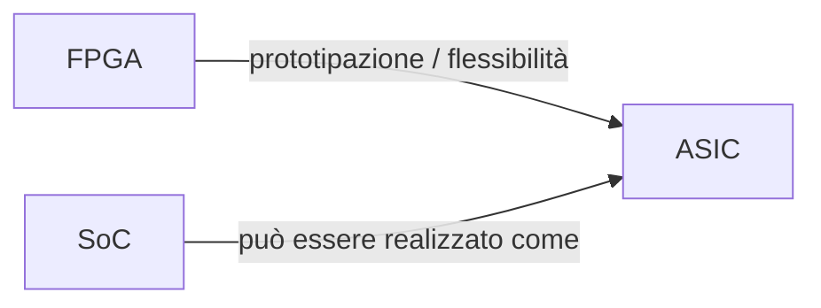
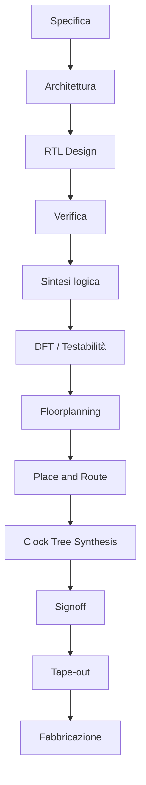

# Introduzione agli ASIC

Gli **ASIC** (*Application-Specific Integrated Circuits*) sono circuiti integrati progettati per svolgere una funzione specifica o una famiglia ben definita di funzioni.  
A differenza dei dispositivi programmabili come le FPGA, un ASIC non viene configurato dopo la fabbricazione per implementare logiche diverse: viene invece **progettato, verificato e realizzato fisicamente** per uno scopo preciso.

Questa caratteristica rende gli ASIC particolarmente interessanti quando si vogliono ottenere:

- elevate prestazioni;
- alta efficienza energetica;
- integrazione spinta;
- costo unitario ridotto su grandi volumi;
- proprietà fisiche e temporali più controllate rispetto a una piattaforma programmabile.

D'altra parte, la progettazione ASIC richiede un flusso molto più rigoroso e costoso rispetto a un progetto FPGA, perché il risultato finale è destinato alla **fabbricazione del chip**.

---

## 1. Che cos'è un ASIC

Un ASIC è un circuito integrato progettato per una specifica applicazione.  
Può trattarsi, ad esempio, di:

- un acceleratore hardware;
- un controller di comunicazione;
- un processore dedicato;
- un blocco di elaborazione del segnale;
- un sottosistema completo inserito in un SoC;
- un chip interamente dedicato a una funzione applicativa.

Il termine "specifico" non implica necessariamente semplicità: un ASIC può essere un piccolo controller oppure un sistema estremamente complesso.

---

## 2. Perché progettare un ASIC

La scelta di sviluppare un ASIC nasce quando i vantaggi di una soluzione dedicata superano quelli di una piattaforma programmabile o general-purpose.

### 2.1 Prestazioni

Un ASIC può essere ottimizzato per:

- un determinato datapath;
- una specifica frequenza di lavoro;
- una precisa gerarchia di memoria;
- un determinato protocollo o carico applicativo.

Questo consente di raggiungere prestazioni spesso superiori a quelle ottenibili con una FPGA o con una CPU general-purpose.

### 2.2 Efficienza energetica

Poiché l'hardware viene progettato ad hoc, è possibile evitare molte delle risorse generiche presenti nelle piattaforme programmabili.  
Questo porta spesso a una migliore efficienza energetica.

### 2.3 Integrazione

Un ASIC può integrare in un unico chip:

- logica digitale;
- memorie;
- interfacce;
- moduli di controllo;
- talvolta anche blocchi analogici o mixed-signal, a seconda del contesto.

### 2.4 Costo per grandi volumi

Il costo iniziale di sviluppo di un ASIC è elevato, ma su produzioni molto grandi il costo per unità può diventare molto competitivo.

---

## 3. Quando un ASIC non è la scelta giusta

Non sempre un ASIC è la soluzione migliore.  
Può essere poco conveniente quando:

- i volumi sono bassi;
- i requisiti cambiano spesso;
- serve massima flessibilità;
- si vuole ridurre drasticamente il time-to-market;
- si è ancora in una fase esplorativa del progetto.

In questi casi, spesso una **FPGA** è una scelta più adatta.

---

## 4. Differenza tra ASIC, FPGA e SoC

È utile distinguere chiaramente questi tre concetti.

### 4.1 ASIC

È il **circuito integrato custom** realizzato per una funzione specifica.

### 4.2 FPGA

È un dispositivo programmabile dopo la fabbricazione, utile per:

- prototipazione;
- sperimentazione;
- implementazioni flessibili;
- validazione rapida.

### 4.3 SoC

Un **System on Chip** è un sistema integrato su singolo chip che può contenere:

- CPU;
- memorie;
- interconnect;
- periferiche;
- acceleratori;
- moduli di sicurezza;
- sottosistemi di controllo.

Un SoC può essere realizzato come ASIC.  
In altre parole: **ASIC** descrive la natura implementativa del chip, mentre **SoC** descrive il livello architetturale del sistema integrato.

---

## 5. Il flusso di progettazione ASIC

Uno degli aspetti distintivi della progettazione ASIC è il **flow**.  
Un ASIC non nasce direttamente dall'RTL: passa attraverso molte fasi intermedie, ciascuna con obiettivi, vincoli e artefatti specifici.

Una visione semplificata del flusso è la seguente:

Questa rappresentazione è volutamente lineare, ma nella pratica il flusso è iterativo: molte fasi si influenzano reciprocamente e richiedono correzioni o raffinamenti.

---

## 6. Caratteristiche del flow ASIC

Rispetto ad altri contesti progettuali, il flow ASIC si distingue per:

- forte dipendenza dai vincoli di timing;
- attenzione a area e potenza;
- necessità di testabilità;
- dipendenza da librerie di celle e tecnologia di processo;
- forte collegamento tra progetto logico e implementazione fisica;
- verifiche rigorose prima della fabbricazione.

Questa combinazione rende il progetto ASIC molto più vicino alla realizzazione industriale del chip.

---

## 7. Le fasi principali, in breve

Questa sezione ASIC verrà sviluppata in più pagine. Qui anticipiamo il senso delle fasi principali.

### 7.1 Specifica e architettura

Si definiscono:

- funzione del chip;
- interfacce;
- frequenza target;
- vincoli di area e potenza;
- metriche principali;
- organizzazione generale del sistema.

### 7.2 RTL design

La funzione viene descritta in linguaggio hardware sintetizzabile, tipicamente tramite:

- moduli;
- FSM;
- datapath;
- pipeline;
- registri;
- interfacce.

### 7.3 Verifica funzionale

Si controlla che la descrizione RTL realizzi correttamente il comportamento voluto.

### 7.4 Sintesi logica

L'RTL viene trasformato in una netlist di celle logiche appartenenti a una libreria standard-cell.

### 7.5 DFT

Si introducono strutture per rendere il chip testabile dopo la fabbricazione.

### 7.6 Implementazione fisica

Comprende:

- floorplanning;
- placement;
- routing;
- clock tree synthesis;
- ottimizzazioni fisiche.

### 7.7 Signoff

Si eseguono le verifiche finali di correttezza fisica e temporale prima del tape-out.

### 7.8 Tape-out e fabbricazione

Il progetto viene consegnato per la produzione del chip.

---

## 8. Input, output e responsabilità nel flow

Un modo molto utile per capire la progettazione ASIC è pensare a ogni fase come a una trasformazione di artefatti.

### Esempi di input

- specifica;
- diagrammi architetturali;
- codice RTL;
- vincoli temporali;
- librerie;
- file tecnologici.

### Esempi di output

- netlist;
- report di sintesi;
- struttura DFT;
- floorplan;
- layout;
- report STA;
- file di tape-out.

Questo approccio aiuta a comprendere che il flow ASIC è anche una **catena di produzione di deliverable tecnici**.

---

## 9. Metriche fondamentali

Nel progetto ASIC si lavora quasi sempre con alcune metriche chiave.

### 9.1 Area

Quanto spazio logico e fisico occupa il design.

### 9.2 Timing

Se il progetto soddisfa la frequenza target e i vincoli temporali.

### 9.3 Potenza

Include sia consumo dinamico sia consumo statico.

### 9.4 Testabilità

Quanto è facile verificare il chip dopo la fabbricazione.

### 9.5 Rischio di implementazione

Quanto il progetto è realistico da chiudere correttamente entro i vincoli.

Queste metriche non sono indipendenti: migliorare una può peggiorare un'altra.

---

## 10. Il ruolo delle librerie e della tecnologia

Un ASIC non viene realizzato "nel vuoto".  
Dipende sempre da:

- una tecnologia di processo;
- una libreria di celle standard;
- modelli temporali;
- modelli di potenza;
- vincoli fisici;
- regole geometriche.

Per questo la progettazione ASIC è profondamente legata al contesto tecnologico in cui il chip verrà realizzato.

---

## 11. Il ruolo della verifica

Un ASIC deve essere verificato con estrema attenzione, perché una volta fabbricato non può essere corretto con la stessa libertà con cui si corregge un progetto FPGA o software.

Per questo la verifica accompagna tutto il flow:

- verifica RTL;
- verifica di integrazione;
- equivalence checking;
- timing verification;
- verifiche fisiche finali.

La progettazione ASIC è quindi tanto una disciplina di implementazione quanto una disciplina di controllo del rischio.

---

## 12. Il legame tra logica e fisica

Una delle differenze culturali più importanti rispetto a molti corsi introduttivi di digitale è che, in ASIC, **la struttura fisica conta moltissimo**.

Le decisioni logiche influenzano:

- floorplanning;
- congestione;
- clock tree;
- timing closure;
- potenza;
- testabilità;
- probabilità di successo del tape-out.

Per questo il progettista ASIC deve sviluppare una forte sensibilità non solo verso il comportamento funzionale, ma anche verso le conseguenze fisiche delle proprie scelte.

---

## 13. Errori concettuali frequenti

Quando si inizia a studiare gli ASIC, alcuni errori di impostazione sono molto comuni.

### Pensare che l'RTL basti

L'RTL è solo una parte del progetto. L'ASIC nasce dal collegamento tra RTL, vincoli, librerie, backend e verifiche.

### Pensare che il backend "risolva tutto"

Molte difficoltà fisiche derivano da scelte architetturali o RTL poco consapevoli.

### Trascurare DFT e signoff

Un chip che funziona in simulazione ma non è testabile o non chiude timing non è pronto per la fabbricazione.

### Confondere SoC e ASIC

Un SoC può essere realizzato come ASIC, ma la progettazione ASIC riguarda il **come si realizza il chip**, non solo **come si organizza il sistema**.

---

## 14. Collegamenti con FPGA e SoC

Questa sezione ASIC si collega naturalmente alle altre due sezioni del corso.

### Collegamento con FPGA

La FPGA è spesso usata per:

- prototipare il design;
- validare sottosistemi;
- sviluppare firmware di bring-up;
- ridurre il rischio prima del tape-out.

### Collegamento con SoC

La sezione SoC descrive il sistema integrato dal punto di vista architetturale.  
La sezione ASIC descrive invece il flusso che porta quel sistema a diventare un chip reale.

---

## 15. Obiettivo della sezione ASIC

L'obiettivo di questa sezione è fornire una visione strutturata e progressiva del flow ASIC, chiarendo:

- cosa avviene in ogni fase;
- quali artefatti vengono prodotti;
- quali problemi tipici emergono;
- come si collegano progetto logico, vincoli e implementazione fisica;
- quali sono i passaggi che portano al tape-out.

La sezione non sostituisce i manuali di tool o i corsi specialistici di backend, ma vuole offrire una base concettuale forte e coerente.

---

## 16. In sintesi

Un ASIC è un circuito integrato progettato per una funzione specifica e realizzato attraverso un flusso rigoroso che collega:

- specifica;
- architettura;
- RTL;
- verifica;
- sintesi;
- DFT;
- implementazione fisica;
- signoff;
- tape-out.

Studiare gli ASIC significa comprendere non solo come descrivere l'hardware, ma come trasformarlo in un chip reale, verificato e producibile.

---

## Prossimo passo

Dopo questa introduzione, il passo naturale successivo è approfondire il **flusso di progettazione ASIC**, cioè la sequenza completa delle fasi che porta dalla specifica iniziale fino al tape-out.
