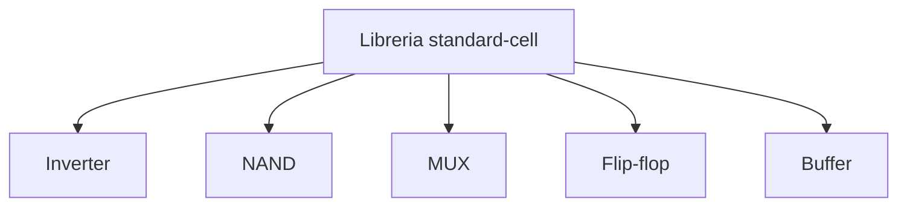
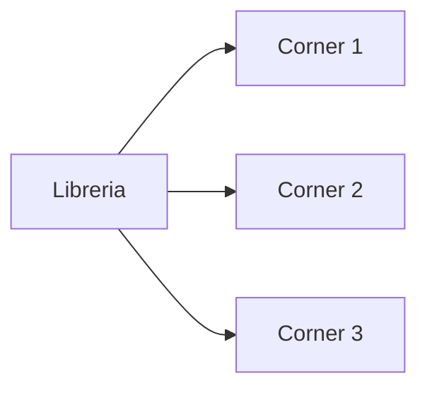
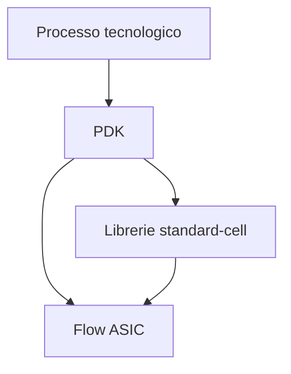

# Librerie standard-cell e PDK in un progetto ASIC

La progettazione di un ASIC non avviene mai in astratto.  
Ogni flow di sintesi, backend e signoff si basa su un insieme di risorse tecnologiche che definiscono **che cosa è realmente implementabile** nel processo scelto.

Due concetti sono quindi fondamentali:

- **librerie standard-cell**;
- **PDK** (*Process Design Kit*).

Le librerie standard-cell descrivono le celle logiche e fisiche utilizzabili nel progetto.  
Il PDK fornisce invece il contesto tecnologico più ampio che permette di progettare, verificare e realizzare il chip.

Senza queste basi, il flow ASIC non potrebbe esistere in modo concreto, perché:

- la sintesi non saprebbe su quali celle mappare la logica;
- il backend non conoscerebbe le regole fisiche del processo;
- il signoff non avrebbe modelli affidabili per timing, geometria e verifiche finali.

---

## 1. Perché librerie e PDK sono centrali

Nel mondo FPGA, il dispositivo è già definito e il progettista usa una piattaforma esistente.  
Nel mondo ASIC, invece, il progetto viene costruito all'interno di una **tecnologia di processo** specifica.

Questo significa che il design dipende da elementi concreti come:

- celle standard disponibili;
- modelli di timing;
- modelli di potenza;
- geometrie fisiche;
- layer del processo;
- regole di layout;
- macro e dispositivi supportati.

Per questo il flow ASIC è sempre legato a un contesto tecnologico ben preciso.

---

## 2. Che cos'è una libreria standard-cell

Una **standard-cell library** è un insieme di celle logiche predefinite, progettate per essere usate come blocchi base nella realizzazione del chip.

Esempi tipici di celle:

- inverter;
- NAND;
- NOR;
- XOR;
- multiplexer;
- flip-flop;
- latch, se previsti;
- buffer;
- celle complesse AOI/OAI;
- celle speciali per clock o power management.

Queste celle costituiscono il vocabolario hardware con cui la sintesi costruisce la netlist del progetto.

---

## 3. Perché si usano celle standard

Le celle standard permettono di progettare ASIC in modo scalabile e industrialmente sostenibile.

### Vantaggi principali

- riuso di elementi già caratterizzati;
- compatibilità con sintesi e backend;
- timing e area noti;
- flusso automatizzabile;
- qualità fisica e temporale già studiata.

Senza librerie standard-cell, ogni design richiederebbe uno sforzo molto più vicino al full-custom design, con costi e complessità molto maggiori.

---

## 4. Informazioni contenute in una libreria

Una libreria standard-cell non è solo un elenco di funzioni logiche.  
Per ogni cella sono disponibili diverse informazioni fondamentali.

## 4.1 Funzione logica

Descrive il comportamento della cella:

- inversione;
- AND;
- OR;
- flip-flop con reset;
- mux, ecc.

## 4.2 Area

Indica il costo fisico della cella.

## 4.3 Timing

Include modelli dei ritardi e delle condizioni di uso temporale.

## 4.4 Potenza

Descrive, in varie forme, il contributo energetico della cella.

## 4.5 Vista fisica

Permette ai tool di placement e routing di sapere come collocarla e collegarla.

Queste informazioni rendono la cella utilizzabile in tutto il flow, dalla sintesi fino al signoff.

---

## 5. Celle combinatorie e celle sequenziali

Le librerie contengono in genere due grandi famiglie di celle.

## 5.1 Celle combinatorie

Implementano trasformazioni logiche senza memoria interna stabile.  
Esempi:

- inverter;
- NAND;
- NOR;
- mux;
- XOR;
- AOI/OAI.

## 5.2 Celle sequenziali

Implementano stato e memoria temporale.  
Esempi:

- flip-flop;
- latch;
- registri con reset o set;
- versioni speciali per scan o test.

Questa distinzione è importante perché le celle sequenziali sono cruciali per:

- timing;
- reset;
- DFT;
- clock tree.

---

## 6. Varianti di drive strength

Molte librerie forniscono più versioni della stessa funzione logica, con diversa **drive strength**.

## 6.1 Perché esistono

Un inverter, ad esempio, può esistere in più taglie:

- piccolo;
- medio;
- grande.

## 6.2 A cosa serve

La disponibilità di diverse taglie permette di bilanciare meglio:

- timing;
- area;
- potenza;
- fanout.

Una cella più forte può pilotare meglio un carico elevato, ma in genere:

- occupa più area;
- consuma di più.

Questo è uno dei meccanismi con cui sintesi e backend ottimizzano il design.

---

## 7. Celle speciali

Oltre alle celle logiche base, le librerie possono includere celle specializzate, ad esempio per:

- clock buffering;
- clock gating;
- isolamento;
- retention;
- scan e test;
- tie cells;
- filler cells;
- decap cells, a livello introduttivo;
- power management.

Queste celle sono molto importanti nel backend e nel low-power design.

---

## 8. Librerie e sintesi

La sintesi usa la libreria per capire **come mappare** la logica descritta in RTL.

## 8.1 Ruolo della libreria in sintesi

- fornisce le funzioni disponibili;
- indica area e ritardi;
- permette di ottimizzare timing, area e potenza;
- determina il risultato del technology mapping.

## 8.2 Perché la scelta della libreria conta

Una stessa RTL, sintetizzata con librerie diverse, può produrre risultati differenti in termini di:

- frequenza raggiungibile;
- area;
- potenza;
- struttura complessiva della netlist.

Questo mostra che il risultato della sintesi non dipende solo dall'RTL, ma anche dal contesto tecnologico.

---

## 9. Librerie e backend

Anche il backend usa informazioni di libreria, perché deve sapere:

- come sono fatte fisicamente le celle;
- come possono essere collocate;
- dove si trovano i pin;
- come instradarle;
- come si comportano temporalmente e fisicamente nel layout.

La libreria è quindi un punto di contatto tra:

- sintesi;
- placement;
- routing;
- CTS;
- STA;
- verifiche fisiche.

---

## 10. Corner e viste multiple della libreria

Le librerie non sono usate in una sola forma.  
Spesso esistono viste o modelli differenti per condizioni operative diverse, i cosiddetti **corner**.

## 10.1 Perché servono i corner

Il chip reale non lavora sempre in condizioni ideali.  
Timing e potenza cambiano in funzione di:

- processo;
- tensione;
- temperatura.

## 10.2 Implicazioni

Per avere un'analisi credibile, il flow utilizza modelli di libreria coerenti con gli scenari di verifica considerati.

Questo è essenziale per:

- STA;
- power analysis;
- signoff.

---

## 11. Timing libraries

Una delle viste più importanti della libreria è quella usata per il timing.

Essa contiene informazioni come:

- ritardi di propagazione;
- timing arcs;
- setup e hold dei flip-flop;
- dipendenza dal carico;
- dipendenza dalla slope dei segnali;
- modelli ai diversi corner.

Queste informazioni sono fondamentali per:

- sintesi;
- STA;
- timing closure;
- signoff temporale.

---

## 12. Power libraries

Le librerie contengono anche modelli utili alla stima della potenza.

Possono includere, a livello concettuale:

- contributi dinamici;
- contributi statici;
- dipendenze dal tipo di commutazione;
- dipendenze dalle condizioni operative.

Senza questi modelli, la power analysis sarebbe troppo approssimativa per guidare davvero il progetto.

---

## 13. Viste fisiche della libreria

Oltre ai modelli logici e temporali, le librerie devono includere anche informazioni fisiche.

Queste servono per sapere:

- dimensioni della cella;
- forma;
- posizione dei pin;
- compatibilità con le row di placement;
- uso dei layer;
- vincoli geometrici rilevanti.

Grazie a queste viste, il backend può collocare correttamente le celle e collegarle nel layout.

---

## 14. LEF e DEF a livello introduttivo

Nel flow fisico ASIC compaiono spesso sigle come **LEF** e **DEF**.

## 14.1 LEF

A livello introduttivo, il **LEF** descrive aspetti fisici astratti di librerie e blocchi, utili per placement e routing.

## 14.2 DEF

Il **DEF** descrive aspetti dell'implementazione fisica del design, come:

- posizioni;
- connessioni;
- stato del layout.

Per una sezione introduttiva non è necessario entrare nel dettaglio del formato, ma è importante capire che LEF e DEF sono parte del linguaggio con cui i tool di backend si scambiano informazioni fisiche.

---

## 15. Che cos'è il PDK

Il **PDK** (*Process Design Kit*) è l'insieme di file, modelli, regole e documentazione che descrive il processo tecnologico e rende possibile la progettazione su quella tecnologia.

Il PDK fornisce il quadro completo entro cui il design può essere:

- sintetizzato;
- implementato fisicamente;
- verificato;
- preparato al tape-out.

Senza PDK non esiste un flow ASIC reale, perché mancherebbero le regole e i modelli necessari per interagire con il processo di fabbricazione.

---

## 16. Cosa contiene un PDK

A livello concettuale, un PDK può includere:

- regole di processo;
- layer disponibili;
- design rules;
- modelli per verifiche fisiche;
- modelli elettrici;
- informazioni su dispositivi;
- viste e file per il backend;
- documentazione tecnica del processo.

Nei flussi mixed-signal o più complessi, il PDK può includere anche supporto a dispositivi analogici, ma in una sezione introduttiva ASIC digitale il punto centrale è capire che il PDK è il **ponte tra progetto e tecnologia di fabbricazione**.

---

## 17. PDK e verifiche fisiche

Il PDK è fondamentale per tutte le verifiche fisiche finali, perché contiene le regole che permettono di eseguire:

- DRC;
- LVS;
- altri controlli geometrici o tecnologici.

Se il layout non viene valutato rispetto alle regole del PDK, non è possibile stabilire se il chip sia davvero fabbricabile.

---

## 18. PDK e signoff

Anche il signoff dipende dal PDK.

Infatti le verifiche di signoff usano modelli e regole derivati dal contesto tecnologico per valutare:

- timing;
- correttezza fisica;
- coerenza tra layout e netlist;
- robustezza generale del progetto.

Questo mostra che il PDK non è un semplice "pacchetto di supporto", ma uno degli elementi centrali dell'intero flow.

---

## 19. PDK, librerie e processo tecnologico

È utile capire la relazione tra questi tre concetti:

- il **processo tecnologico** è la tecnologia di fabbricazione scelta;
- il **PDK** è la descrizione tecnica e progettuale di quel processo;
- le **librerie standard-cell** sono una collezione di blocchi costruiti e caratterizzati per quel processo.

Questa relazione è fondamentale per capire perché un progetto ASIC è sempre legato a una tecnologia concreta.

---

## 20. Scelta della tecnologia e conseguenze progettuali

La scelta del processo e delle librerie influenza direttamente:

- area;
- prestazioni;
- leakage;
- potenza dinamica;
- costo;
- complessità di implementazione;
- disponibilità di macro e IP.

Questo significa che la stessa architettura può avere comportamenti molto diversi a seconda del contesto tecnologico.

Per questo, specifica, architettura e budgeting devono sempre essere letti insieme alla tecnologia target.

---

## 21. Impatto su RTL e architettura

Anche se librerie e PDK sembrano temi "di backend", in realtà influenzano anche le fasi più alte del progetto.

### Esempi

- una frequenza target plausibile dipende dalla tecnologia;
- il costo dell'area dipende dalle celle disponibili;
- il consumo statico dipende dal processo;
- alcune strategie low-power dipendono dal supporto delle librerie;
- la disponibilità di macro può influenzare l'architettura.

Per questo l'ASIC design richiede una cultura che colleghi tecnologia e progettazione logica fin dall'inizio.

---

## 22. Errori frequenti

Tra gli errori concettuali più comuni:

- pensare che la sintesi dipenda solo dall'RTL;
- considerare la libreria come un dettaglio del tool;
- ignorare il ruolo dei corner;
- non capire la differenza tra funzione logica e vista fisica di una cella;
- trattare il PDK come un insieme di file "magici" senza significato progettuale;
- separare troppo architettura e contesto tecnologico.

---

## 23. Buone pratiche concettuali

Una buona comprensione di librerie e PDK si basa su alcuni principi:

- sapere che ogni design ASIC vive dentro una tecnologia specifica;
- leggere area, timing e potenza sempre in relazione alla libreria usata;
- considerare i corner come parte normale del flow;
- comprendere che la vista logica e la vista fisica delle celle sono entrambe essenziali;
- vedere il PDK come fondamento di verifiche e implementazione.

---

## 24. Collegamento con FPGA

Nel mondo FPGA il progettista usa risorse già integrate nel dispositivo e ha meno visibilità diretta sui dettagli del processo.

Nel mondo ASIC, invece, il rapporto con librerie e tecnologia è molto più esplicito.  
Studiare librerie standard-cell e PDK aiuta quindi a capire una delle differenze culturali più profonde tra flow ASIC e flow FPGA.

---

## 25. Collegamento con SoC

Nel contesto SoC, librerie e PDK restano centrali perché il sistema integrato deve essere costruito su:

- celle standard;
- macro;
- memorie;
- eventuali IP hard;
- domini fisici coerenti col processo.

La prospettiva SoC mostra l'organizzazione del sistema; la prospettiva ASIC mostra il contesto tecnologico che rende quel sistema realizzabile come chip.

---

## 26. Esempio concettuale

Immaginiamo di voler sintetizzare un piccolo acceleratore ASIC.

Il risultato della sintesi dipenderà da:

- quali flip-flop sono disponibili;
- quali buffer e celle combinatorie esistono;
- quali drive strength può usare il tool;
- quali ritardi vengono modellati nei corner;
- quanto area occupano le celle;
- quanto consuma ciascuna struttura.

Tutte queste informazioni non vengono "inventate" dal tool, ma provengono dalle librerie e dal contesto tecnologico definito dal PDK.

Questo esempio mostra perché la progettazione ASIC non è mai indipendente dalla tecnologia scelta.

---

## 27. In sintesi

Le librerie standard-cell e il PDK costituiscono il fondamento tecnologico del flow ASIC.

Le librerie forniscono:

- celle logiche;
- celle sequenziali;
- modelli di timing;
- modelli di potenza;
- viste fisiche.

Il PDK fornisce invece:

- regole di processo;
- modelli e verifiche fisiche;
- contesto tecnologico completo per il design.

Comprendere questi due elementi significa capire che il progetto ASIC non è solo una descrizione logica, ma un design inserito in una tecnologia reale, con vincoli, modelli e regole precise.

---

## Prossimo passo

Dopo librerie e PDK, il passo successivo naturale è approfondire il tema del **tape-out e della fabbricazione**, cioè il passaggio finale dal progetto verificato alla consegna in fonderia e alla produzione del chip reale.
