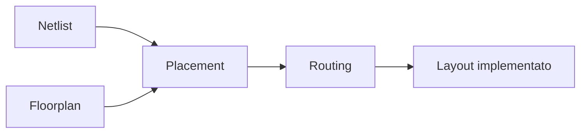
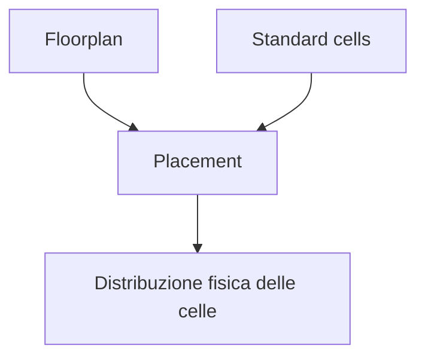
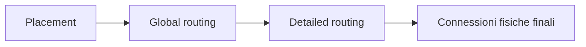
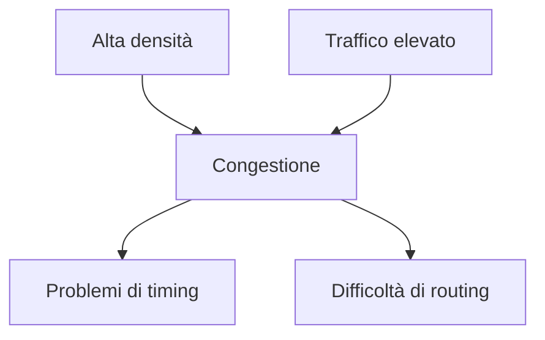
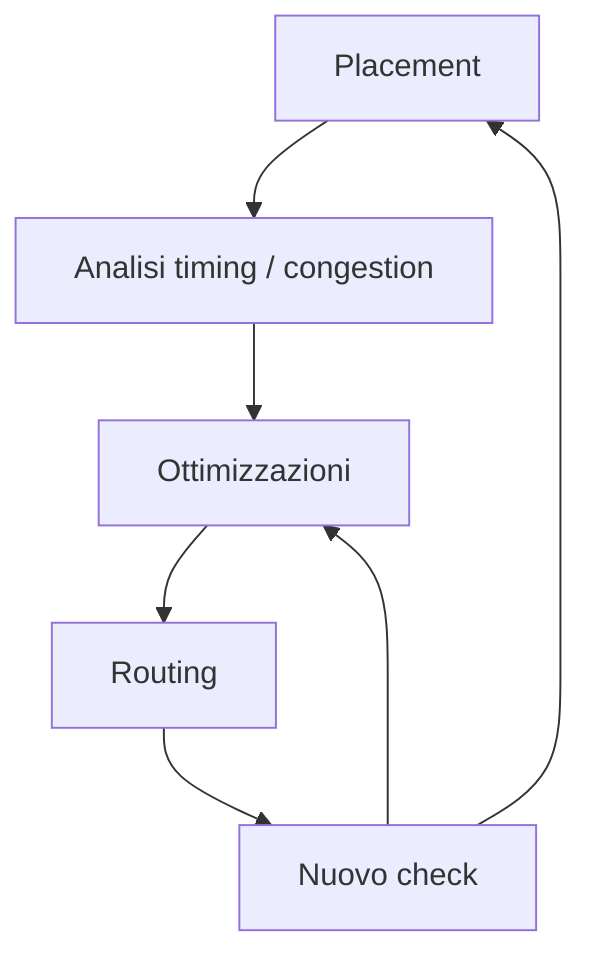

# Place and Route in un progetto ASIC

La fase di **Place and Route (PnR)** è il momento in cui la netlist del progetto viene trasformata in una realizzazione fisica concreta all'interno del layout del chip.  
Dopo il floorplanning, che definisce la struttura generale dello spazio fisico, il Place and Route si occupa di:

- collocare le standard cells;
- rispettare la posizione delle macro;
- costruire le connessioni tra i blocchi;
- gestire la congestione;
- preparare il design alla distribuzione del clock;
- migliorare il timing;
- rendere il layout compatibile con le verifiche finali.

Nel flow ASIC, questa è una fase cruciale perché il progetto smette di essere soltanto una struttura logica e diventa una rete fisica realmente instradabile e analizzabile.

---

## 1. Che cos'è il Place and Route

Il Place and Route è l'insieme delle attività che portano dalla netlist e dal floorplan a un design fisicamente collocato e interconnesso.

In modo semplificato, comprende due grandi attività:

- **placement**: decidere dove collocare le celle standard;
- **routing**: decidere come collegarle sui layer di metallo.

In realtà, il PnR è molto più di una semplice sequenza lineare: è un processo iterativo di ottimizzazione fisica.

---

## 2. Perché il Place and Route è così importante

Il Place and Route determina concretamente:

- le lunghezze delle interconnessioni;
- i ritardi fisici del design;
- il livello di congestione;
- la qualità del timing post-layout;
- la fattibilità del clock tree;
- l'efficienza del routing;
- una parte rilevante del consumo dinamico.

Anche se architettura, RTL e sintesi sono buone, un PnR debole può compromettere:

- timing closure;
- qualità del layout;
- signoff;
- probabilità di successo del tape-out.

Per questo, il PnR è uno dei punti in cui tutte le scelte precedenti vengono messe alla prova in modo estremamente concreto.

---

## 3. Input del Place and Route

Per avviare il PnR servono diversi input.

## 3.1 Netlist

La netlist sintetizzata, eventualmente arricchita con strutture DFT, rappresenta la logica del progetto.

## 3.2 Floorplan

Il floorplan definisce:

- area disponibile;
- posizione delle macro;
- shape del core;
- regioni riservate;
- pin placement;
- prime strutture di power e vincoli fisici.

## 3.3 Librerie fisiche

Servono informazioni sulle celle e sui vincoli di implementazione fisica.

## 3.4 Vincoli temporali e fisici

Sono necessari per guidare placement e ottimizzazione.

## 3.5 Strutture di alimentazione e contesto tecnologico

Il PnR deve rispettare il processo tecnologico e la struttura di alimentazione prevista.

---

## 4. Obiettivi del Place and Route

Il Place and Route non cerca soltanto di "far stare tutto nel chip".  
I suoi obiettivi includono:

- realizzare il design in modo fisicamente corretto;
- ridurre la congestione;
- favorire la chiusura temporale;
- preparare il clock tree;
- rispettare l'area disponibile;
- contenere il consumo e la complessità del routing;
- evitare problemi nelle verifiche fisiche successive.

In pratica, il PnR deve trovare una soluzione bilanciata tra:

- qualità del layout;
- timing;
- area;
- robustezza fisica.

---

## 5. Placement: idea generale

Il **placement** consiste nel collocare le standard cells all'interno delle aree disponibili del floorplan.

Le macro sono già normalmente fissate o fortemente vincolate dal floorplan, mentre le celle standard devono essere distribuite in modo da:

- rispettare la connettività logica;
- minimizzare la lunghezza dei percorsi;
- limitare la congestione;
- favorire il timing;
- lasciare spazio al routing.

Il placement è quindi la fase in cui la logica sintetizzata assume una vera topologia fisica interna.

---

## 6. Placement globale e placement dettagliato

Concettualmente, il placement si può leggere in due livelli.

## 6.1 Placement globale

Decide in modo approssimato dove collocare gruppi di celle o regioni logiche.

### Obiettivi

- distribuire bene la densità;
- rispettare la vicinanza tra blocchi correlati;
- ridurre i costi globali di connessione.

## 6.2 Placement dettagliato

Raffina la posizione delle singole celle rispettando:

- griglie fisiche;
- regole di layout;
- spacing;
- legalità del placement.

Questo secondo passaggio è essenziale per passare da una soluzione concettualmente valida a una realizzazione legalmente implementabile.

---

## 7. Legalizzazione del placement

Una volta trovata una disposizione promettente, il placement deve essere **legalizzato**.

Questo significa che tutte le celle devono essere collocate in posizioni:

- ammesse dalla tecnologia;
- compatibili con le row di standard cells;
- non sovrapposte;
- coerenti con i vincoli geometrici.

La legalizzazione può modificare leggermente il placement ottimale teorico, introducendo compromessi che poi influenzano timing e routing.

---

## 8. Densità e distribuzione delle celle

Uno dei temi più delicati del placement è la **densità**.

## 8.1 Densità troppo alta

Può causare:

- routing congestion;
- difficoltà di buffering;
- peggioramento del timing;
- aumento delle iterazioni di backend.

## 8.2 Densità troppo bassa

Può portare a:

- percorsi più lunghi;
- uso inefficiente dell'area;
- distribuzione del clock meno efficiente.

Il placement cerca quindi di ottenere una distribuzione equilibrata, evitando sia concentrazioni eccessive sia dispersione inutile.

---

## 9. Placement e connettività

Una buona regola di base è che celle o sottoblocchi logicamente fortemente connessi dovrebbero restare fisicamente vicini, per quanto possibile.

### Benefici

- connessioni più corte;
- ritardi ridotti;
- minore congestione globale;
- miglior preparazione per il routing.

### Rischi di un placement incoerente

- percorsi critici allungati;
- fanout difficili da gestire;
- più buffering;
- consumo maggiore.

Per questo il placement è fortemente guidato dalla topologia della netlist.

---

## 10. Ottimizzazione durante il placement

Il placement non è un posizionamento statico una sola volta.  
Durante questa fase il tool esegue spesso varie ottimizzazioni, ad esempio per:

- migliorare timing;
- ridurre lunghezze di connessione;
- distribuire meglio la densità;
- limitare la congestione;
- preparare il design alle fasi successive.

In alcuni casi si introducono anche:

- buffer;
- resizing di celle;
- duplicazioni di logica;
- correzioni locali alla struttura della netlist.

Questo mostra che il PnR è già una fase di ottimizzazione logico-fisica, non solo geometrica.

---

## 11. Routing: idea generale

Il **routing** consiste nel creare le connessioni fisiche tra celle, macro e pin usando i layer di metallo disponibili nel processo.

Le connessioni devono essere:

- corrette elettricamente;
- compatibili con le regole fisiche;
- efficienti in termini di spazio e ritardo;
- coerenti con timing, alimentazione e clocking.

Il routing è spesso una delle attività più sensibili a congestione, area e complessità del design.

---

## 12. Global routing

Il **global routing** costruisce una soluzione preliminare ad alto livello su come i segnali attraverseranno il layout.

## 12.1 A cosa serve

- stimare la congestion;
- capire quali regioni saranno più cariche;
- indirizzare le connessioni principali;
- anticipare problemi di instradamento.

## 12.2 Perché è importante

Il global routing permette di vedere abbastanza presto se il placement e il floorplan stanno generando una struttura fisica sostenibile oppure no.

---

## 13. Detailed routing

Il **detailed routing** realizza concretamente le connessioni, rispettando le regole del processo.

## 13.1 Obiettivi

- completare tutte le connessioni;
- evitare violazioni geometriche;
- usare correttamente i layer;
- rispettare spacing e vincoli tecnologici.

## 13.2 Difficoltà tipiche

- regioni congestionate;
- percorsi difficili attorno alle macro;
- vie e cambi di layer numerosi;
- interazioni con power grid e clock tree.

Il detailed routing è quindi la fase in cui il design viene realmente "chiuso" dal punto di vista delle connessioni.

---

## 14. Congestione nel Place and Route

La **congestion** è uno dei nemici principali del PnR.

## 14.1 Cause tipiche

- floorplan debole;
- densità troppo alta;
- macro mal posizionate;
- molti segnali che attraversano la stessa regione;
- pin placement sfavorevole;
- forte centralizzazione dell'interconnect.

## 14.2 Effetti

- routing difficile o incompleto;
- aumento del ritardo;
- maggiore uso di buffer;
- peggioramento del timing;
- più iterazioni di fixing;
- rischio di violazioni fisiche.

Gestire bene la congestione è uno degli obiettivi centrali del PnR.

---

## 15. Place and Route e timing

Il PnR influisce pesantemente sul timing, perché determina:

- lunghezza effettiva delle interconnessioni;
- buffering reale;
- parassitici;
- relazioni tra blocchi;
- distribuzione fisica del carico.

## 15.1 Setup timing

Può peggiorare se i percorsi diventano più lunghi o congestionati.

## 15.2 Hold timing

Può richiedere interventi specifici, ad esempio su cammini troppo veloci.

Il PnR è quindi una fase in cui il timing viene continuamente misurato e corretto.

---

## 16. Ottimizzazione fisica del timing

Durante il PnR, per migliorare il timing si possono applicare varie strategie, ad esempio:

- riposizionamento di celle;
- resizing;
- buffering;
- riduzione del fanout;
- ottimizzazioni locali del percorso;
- miglioramenti della topologia fisica.

Queste attività sono guidate dai report di timing e dai dati di congestion.

Il timing closure non è quindi separato dal PnR: ne è una parte integrante.

---

## 17. Relazione con il Clock Tree Synthesis

Il PnR prepara direttamente la fase di **Clock Tree Synthesis (CTS)**.

Prima della CTS è importante che:

- il placement sia sufficientemente stabile;
- la distribuzione delle celle sia ragionevole;
- la congestione sia sotto controllo;
- i percorsi principali siano già in una struttura fisica sensata.

Se il placement è debole, la CTS può diventare molto più difficile e costosa.

---

## 18. Relazione con power grid e alimentazione

Il PnR deve convivere con l'infrastruttura di alimentazione.

Questo significa che routing e placement devono rispettare:

- power straps;
- power rails;
- aree dedicate all'alimentazione;
- eventuali power domain;
- regioni sensibili a IR drop.

Una cattiva interazione tra segnale e alimentazione può rendere il design più difficile da instradare e meno robusto.

---

## 19. Relazione con macro e hard blocks

Le macro influenzano fortemente il PnR.

Possono creare:

- ostacoli geometrici;
- strettoie di routing;
- vincoli sui canali disponibili;
- aree con pin molto densi;
- zone critiche per il timing.

Per questo il PnR dipende molto dalla qualità del floorplanning iniziale e dal posizionamento intelligente delle macro.

---

## 20. Relazione con DFT

Anche le strutture DFT, come le scan chain, interagiscono con il PnR.

Aspetti rilevanti:

- distribuzione fisica dei flip-flop;
- lunghezza delle scan chain;
- routing dei segnali di test;
- impatto su congestione e timing locale.

Un PnR ben organizzato tiene conto anche di queste connessioni, non solo dei percorsi funzionali principali.

---

## 21. Place and Route iterativo

Il PnR è quasi sempre un processo iterativo.

Il ciclo tipico è:

1. placement iniziale;
2. stima di congestion e timing;
3. ottimizzazioni;
4. routing;
5. nuova analisi di timing;
6. fix locali o ritorno a scelte precedenti.

Questa iterazione è necessaria perché il layout fisico reale introduce sempre effetti che le fasi precedenti potevano solo stimare.

---

## 22. Errori frequenti nel Place and Route

Tra gli errori più comuni:

- considerare il PnR come semplice fase automatica;
- ignorare la congestione fino a quando diventa critica;
- usare un floorplan troppo aggressivo;
- non leggere abbastanza i report di timing post-placement e post-routing;
- inseguire solo il setup trascurando l'hold;
- non considerare abbastanza l'impatto di macro, pin e power grid;
- non usare il feedback del PnR per correggere scelte precedenti.

---

## 23. Buone pratiche concettuali

Una buona gestione del PnR tende a seguire queste linee guida:

- partire da un floorplan solido;
- mantenere la densità sotto controllo;
- leggere insieme congestion, timing e struttura fisica;
- usare il PnR come fase di apprendimento sul design;
- non separare troppo logica e fisica;
- preparare bene il design alla CTS;
- accettare l'iterazione come parte normale del flow.

---

## 24. Collegamento con FPGA

Molti concetti di place and route esistono anche in FPGA, ma nell'ASIC diventano più profondi e determinanti.

Studiare il PnR ASIC aiuta a capire meglio anche in FPGA:

- perché certi placement chiudono meglio timing;
- perché alcune interconnessioni sono costose;
- perché la densità influisce;
- perché la fisicità del design conta.

La differenza è che, in ASIC, l'intero spazio fisico viene costruito ad hoc e il margine di errore è molto minore.

---

## 25. Collegamento con SoC

Nel contesto SoC, il PnR diventa ancora più complesso per la presenza di:

- molte macro;
- interconnect estese;
- più domini di clock;
- power domain;
- periferiche e memorie;
- sottosistemi eterogenei.

Per questo la cultura del PnR ASIC è fondamentale anche per comprendere come un SoC possa essere realmente implementato come chip fisico.

---

## 26. Esempio concettuale

Immaginiamo un design con:

- una macro SRAM;
- un blocco datapath;
- una FSM di controllo;
- una catena di registri;
- interfacce verso i pin di un lato del chip.

Un buon PnR dovrebbe:

- tenere il datapath vicino alla memoria;
- evitare che il controllo attraversi inutilmente regioni congestionate;
- distribuire i registri in modo da facilitare il timing;
- lasciare percorsi di routing ordinati verso i pin.

Un PnR debole potrebbe invece:

- allungare i percorsi critici;
- generare congestione attorno alla macro;
- complicare CTS e timing closure;
- aumentare il rischio di iterazioni tardive.

---

## 27. In sintesi

Il Place and Route è la fase del flow ASIC in cui il design viene realmente collocato e interconnesso nel layout del chip.

Comprende:

- placement;
- legalizzazione;
- ottimizzazioni fisiche;
- global routing;
- detailed routing;
- gestione di congestione e timing.

La qualità del PnR influenza direttamente:

- timing closure;
- routing efficiency;
- CTS;
- power behavior;
- robustezza del layout;
- probabilità di successo del signoff.

Per questo il PnR è una delle fasi più tecnicamente decisive dell'intero progetto ASIC.

---

## Prossimo passo

Dopo il Place and Route, il passo successivo naturale è approfondire la **Clock Tree Synthesis**, cioè il modo in cui il clock viene distribuito fisicamente al design, controllando skew, latency e impatto sul timing del chip.
