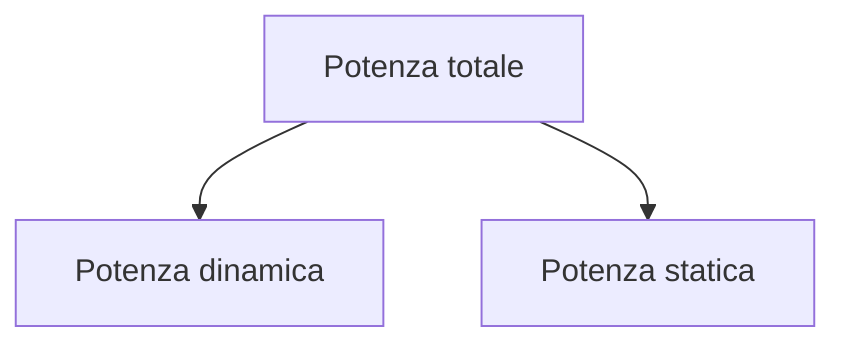
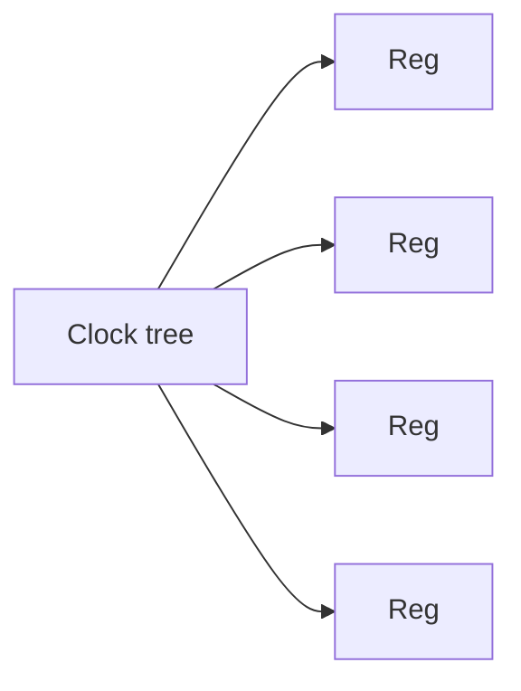
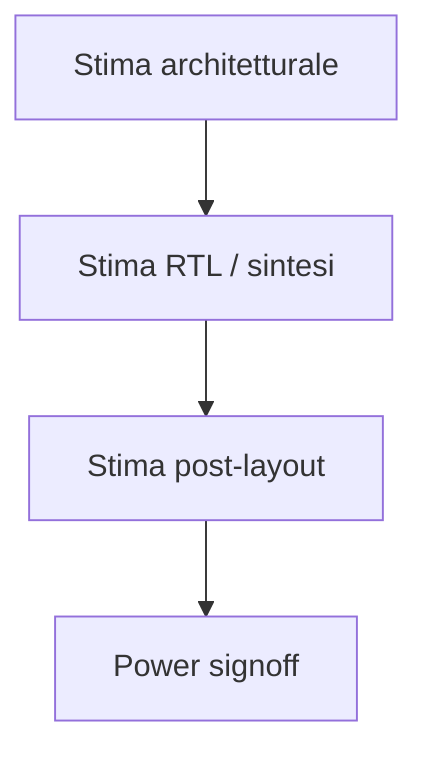
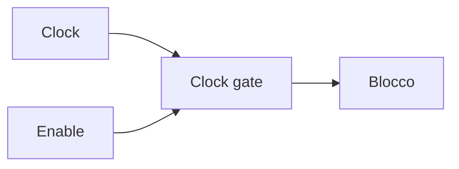

# Power analysis e low-power design in un progetto ASIC

La **potenza** è una delle metriche fondamentali nella progettazione ASIC.  
Un chip non deve solo essere corretto e rispettare il timing: deve anche consumare in modo compatibile con i requisiti del prodotto e con i vincoli fisici del sistema in cui sarà inserito.

Nel flow ASIC, il tema della potenza attraversa più livelli del progetto:

- specifica;
- architettura;
- RTL;
- sintesi;
- backend;
- signoff.

Per questo parlare di **power analysis** e **low-power design** non significa soltanto fare una stima numerica finale del consumo, ma comprendere come le scelte progettuali influenzino:

- consumo dinamico;
- consumo statico;
- densità di potenza;
- comportamento termico;
- robustezza dell'alimentazione;
- sostenibilità fisica del chip.

---

## 1. Perché la potenza è così importante

La potenza è importante per più ragioni.

### 1.1 Vincoli di prodotto

Molti ASIC operano in sistemi con limiti precisi di consumo, ad esempio:

- dispositivi portatili;
- sistemi embedded;
- applicazioni automotive;
- nodi edge;
- apparati ad alta densità.

### 1.2 Vincoli termici

Maggiore consumo significa anche maggiore dissipazione termica, che può generare:

- aumento della temperatura;
- degrado dell'affidabilità;
- necessità di raffreddamento;
- limiti sulla frequenza o sull'uso del chip.

### 1.3 Vincoli di alimentazione

La distribuzione della corrente nel chip deve restare robusta e sostenibile.

### 1.4 Costo e packaging

Un chip che consuma troppo può richiedere:

- package più complessi;
- sistemi di raffreddamento più costosi;
- infrastrutture di alimentazione più gravose.

Per questo la potenza non è una metrica secondaria, ma uno dei pilastri del progetto ASIC.

---

## 2. Le due grandi componenti della potenza

In modo concettuale, la potenza di un ASIC viene spesso letta come somma di due contributi principali:

- **potenza dinamica**;
- **potenza statica**.

Questa distinzione è molto utile perché i due contributi hanno cause, sintomi e tecniche di riduzione differenti.

---

## 3. Potenza dinamica

La **potenza dinamica** è legata alle commutazioni dei nodi del circuito.

## 3.1 Quando si genera

Si genera quando:

- i segnali cambiano valore;
- le capacità interne ed esterne vengono caricate e scaricate;
- i registri commutano a ogni fronte utile di clock;
- la rete di clock distribuisce il segnale a un grande numero di sink.

## 3.2 Da cosa dipende

In modo qualitativo, la potenza dinamica cresce con:

- frequenza di clock;
- attività di switching;
- capacità totale coinvolta;
- tensione di alimentazione.

Questo significa che un design con molta attività e molte commutazioni può consumare molto anche se l'area non è enorme.

---

## 4. Potenza statica

La **potenza statica** è il contributo che il chip dissipa anche quando la logica non sta commutando attivamente.

## 4.1 Origine

È associata principalmente a fenomeni di leakage e correnti residue nei dispositivi fisici.

## 4.2 Perché conta

Con la riduzione delle tecnologie e l'aumento della densità, il contributo statico può diventare molto importante, soprattutto in chip:

- molto grandi;
- sempre alimentati;
- con lunghi tempi di inattività;
- progettati in nodi tecnologici avanzati.

La potenza statica è quindi un tema fortemente legato alla tecnologia e all'implementazione fisica.

---

## 5. Switching activity

Uno dei concetti centrali del power analysis è la **switching activity**, cioè quanto spesso i segnali cambiano stato.

## 5.1 Perché è cruciale

La potenza dinamica dipende direttamente dal numero di commutazioni effettive nel circuito.

## 5.2 Dove si concentra spesso l'attività

- datapath ad alta frequenza;
- registri di pipeline;
- interconnect con traffico elevato;
- reti di controllo molto attive;
- clock tree.

## 5.3 Perché conta in fase di stima

Anche un blocco piccolo può consumare molto se commuta continuamente, mentre un blocco più grande ma poco attivo può avere un impatto inferiore.

Per questo la semplice area non basta a stimare correttamente la potenza.

---

## 6. La rete di clock come sorgente di consumo

Il clock è spesso uno dei contributori più importanti alla potenza dinamica totale del chip.

## 6.1 Perché il clock pesa molto

- commuta a ogni ciclo;
- raggiunge moltissimi registri;
- attraversa una rete ampia e bufferizzata;
- ha elevato fanout;
- contribuisce a una quota importante dello switching complessivo.

## 6.2 Implicazioni

La progettazione della rete di clock è quindi anche un problema di potenza, non solo di timing.

Questo è uno dei motivi per cui le tecniche di riduzione del consumo spesso passano proprio attraverso una migliore gestione del clock.

---

## 7. Power budgeting

Già nelle fasi iniziali del progetto è utile definire un **budget di potenza**.

## 7.1 Che cos'è

È una suddivisione preliminare del consumo ammissibile tra:

- sottoblocchi;
- datapath;
- memoria;
- clocking;
- interfacce;
- macro o IP particolarmente costosi.

## 7.2 Perché è utile

Aiuta a capire:

- se l'architettura è plausibile;
- quali blocchi sono più critici;
- dove concentrare ottimizzazioni;
- se i requisiti di prodotto siano compatibili con il design.

Senza budgeting, il rischio è accorgersi troppo tardi che il chip consuma molto più del previsto.

---

## 8. Analisi della potenza nel flow ASIC

La potenza viene stimata e raffinata in più momenti del progetto.

## 8.1 Fase architetturale

Si fanno stime di ordine alto, basate su:

- numero di operazioni;
- parallelismo;
- frequenze;
- uso previsto dei blocchi;
- modelli semplificati.

## 8.2 Fase RTL e sintesi

Si ottengono stime più concrete grazie a:

- struttura della logica;
- registri effettivi;
- prime informazioni di switching;
- librerie.

## 8.3 Backend e signoff

Le stime diventano più realistiche perché entrano in gioco:

- parassitici;
- clock tree reale;
- routing fisico;
- carichi effettivi;
- distribuzione concreta dell'alimentazione.

La potenza, quindi, non è un numero fisso ma una grandezza che viene raffinata lungo il flow.

---

## 9. Analisi preliminare vs analisi di signoff

È importante distinguere fra:

- **stima preliminare**;
- **analisi finale o di signoff**.

## 9.1 Stime preliminari

Sono utili per guidare il progetto, ma possono essere ancora lontane dal comportamento reale.

## 9.2 Analisi finale

Tiene conto di molti più dettagli fisici e permette una valutazione molto più credibile del consumo effettivo del chip.

Non bisogna quindi trattare la prima stima di potenza come un verdetto definitivo, ma neppure ignorarla: è un segnale progettuale molto importante.

---

## 10. Tecniche di riduzione della potenza dinamica

Una gran parte del low-power design mira a ridurre la potenza dinamica.

### Tecniche tipiche

- riduzione della frequenza, se compatibile con le prestazioni richieste;
- riduzione dello switching inutile;
- miglior località dei dati;
- semplificazione del datapath;
- riduzione del fanout;
- uso efficiente delle memorie;
- clock gating.

Tra tutte, il **clock gating** è una delle tecniche più note e diffuse.

---

## 11. Clock gating

Il **clock gating** consiste nel disabilitare il clock in porzioni del design che in un certo momento non devono lavorare.

## 11.1 Perché funziona

Se un blocco non riceve il clock:

- i suoi registri non commutano;
- si riduce lo switching interno;
- si abbassa il contributo dinamico della regione interessata.

## 11.2 Dove è utile

- periferiche inattive;
- sottoblocchi opzionali;
- pipeline ferme;
- acceleratori non usati;
- regioni di controllo non attive.

## 11.3 Attenzioni

Il clock gating deve essere progettato con disciplina, perché influisce su:

- timing;
- testabilità;
- CTS;
- reset;
- verifica funzionale.

---

## 12. Riduzione dello switching inutile

Molti consumi derivano da attività che non producono valore reale.

Esempi di switching inutile:

- datapath che commuta anche quando il risultato non serve;
- segnali di controllo che oscillano senza motivo;
- registri aggiornati inutilmente;
- mux e blocchi attivi anche in modalità idle.

Ridurre questo tipo di attività può portare benefici significativi senza necessariamente modificare in modo radicale l'architettura.

---

## 13. Power-aware architecture

Le scelte architetturali hanno un impatto enorme sulla potenza.

## 13.1 Parallelismo

Maggiore parallelismo può aumentare throughput, ma anche area e switching.

## 13.2 Pipeline

Le pipeline aiutano il timing, ma introducono più registri e quindi più commutazioni.

## 13.3 Memoria

Centralizzare o distribuire i buffer cambia:

- traffico;
- lunghezza dei percorsi;
- costi energetici del movimento dati.

## 13.4 Interconnect

Bus, crossbar e strutture di comunicazione influenzano notevolmente il consumo.

Una buona architettura ASIC deve quindi essere **power-aware** già nelle prime fasi del progetto.

---

## 14. Power-aware RTL

Anche a livello RTL ci sono scelte che influenzano direttamente il consumo.

### Esempi

- aggiornare un registro solo quando necessario;
- strutturare il controllo per evitare attività superflue;
- usare enable coerenti;
- separare chiaramente modalità attive e inattive;
- ridurre propagazioni inutili nel datapath.

Una RTL che "funziona" ma produce molta attività inutile può generare risultati di potenza molto deludenti.

---

## 15. Memorie e potenza

Le memorie sono spesso una componente importante del consumo.

## 15.1 Perché

- possono essere grandi;
- sono accedute frequentemente;
- richiedono interfacce e buffering;
- influenzano anche il traffico di interconnessione.

## 15.2 Scelte rilevanti

- numero di memorie;
- dimensione;
- località;
- accessi concorrenti;
- uso di buffer locali;
- riduzione di letture/scritture inutili.

In molti design, ottimizzare il movimento dei dati è tanto importante quanto ottimizzare il calcolo stesso.

---

## 16. Leakage e low-power design

Per contenere la **potenza statica**, l'attenzione si sposta su temi come:

- scelta della tecnologia;
- dimensione del design;
- domini di potenza;
- strategie di spegnimento parziale;
- isolamento e retention, nei casi più avanzati.

A livello introduttivo, è importante capire che il leakage non si riduce solo con "meno attività", perché è presente anche quando il chip non commuta molto.

Per questo il low-power design include sia tecniche dinamiche sia tecniche legate alla gestione dell'alimentazione.

---

## 17. Power domains

In design più avanzati, una tecnica importante è la suddivisione in **power domain**.

## 17.1 Idea di base

Regioni diverse del chip possono essere alimentate o gestite in modo relativamente indipendente.

## 17.2 Benefici

- spegnere sottoblocchi inattivi;
- ridurre consumo statico;
- adattare il chip a diverse modalità operative.

## 17.3 Complessità introdotta

- isolation;
- retention;
- power sequencing;
- verifica più complessa;
- impatto sul backend.

Questa tecnica è molto potente, ma richiede forte disciplina architetturale e fisica.

---

## 18. Potenza e timing: un compromesso continuo

Ridurre la potenza può entrare in conflitto con il timing.

### Esempi

- celle più piccole consumano meno, ma possono essere più lente;
- ridurre il buffering può limitare il consumo, ma peggiorare i ritardi;
- diminuire l'attività può richiedere controllo aggiuntivo;
- clock gating può introdurre complessità su CTS e test.

Per questo il power optimization non va vista isolatamente: deve essere coordinata con timing, area e testabilità.

---

## 19. Potenza e area

Anche il rapporto tra area e potenza non è banale.

### Più area può voler dire

- più capacità;
- più leakage;
- più clock sinks;
- più costi energetici complessivi.

### Ma meno area non garantisce sempre meno potenza

Una logica troppo compressa può:

- aumentare il fanout;
- creare percorsi più difficili;
- richiedere celle più aggressive;
- peggiorare la struttura del clock.

Quindi il design low-power richiede equilibrio, non solo miniaturizzazione.

---

## 20. Potenza e backend

Il backend influisce fortemente sulla potenza finale.

Aspetti rilevanti:

- lunghezza reale delle interconnessioni;
- clock tree effettiva;
- buffering;
- routing congestion;
- densità fisica;
- distribuzione dell'alimentazione.

Per questo la potenza finale del chip non può essere valutata credibilmente senza considerare il layout e la struttura fisica realizzata.

---

## 21. Potenza e signoff

Il **power signoff** rappresenta la valutazione finale della potenza del design in condizioni realistiche.

Si vuole capire almeno se:

- il budget globale è rispettato;
- i blocchi più attivi sono coerenti con le attese;
- il comportamento energetico del chip è compatibile con il prodotto;
- il layout non introduce criticità non previste.

Anche senza entrare nel dettaglio di tutti i tool e modelli, è importante capire che il signoff della potenza è una parte reale del processo finale di approvazione del chip.

---

## 22. Errori frequenti nella gestione della potenza

Tra gli errori più comuni:

- considerare la potenza solo come verifica finale;
- ignorare la switching activity reale;
- sottostimare il peso del clock;
- non definire budget per i sottoblocchi;
- introdurre clock gating senza metodo;
- trascurare l'impatto di memorie e interconnect;
- guardare solo la potenza totale senza capire dove si concentra;
- non usare la potenza come guida progettuale nelle fasi iniziali.

---

## 23. Buone pratiche concettuali

Una buona strategia di low-power design tende a seguire queste regole:

- definire budget di potenza fin dall'inizio;
- considerare la potenza già in architettura e RTL;
- osservare attentamente la switching activity;
- trattare il clock come un problema energetico centrale;
- usare clock gating con disciplina;
- correlare sempre potenza, timing e area;
- raffinare progressivamente le stime lungo il flow.

---

## 24. Collegamento con FPGA

Nel mondo FPGA la potenza è anch'essa importante, ma in ASIC il tema è spesso più incisivo perché:

- il chip è progettato ad hoc;
- non esistono le stesse strutture programmabili general-purpose;
- il margine di ottimizzazione è maggiore, ma anche la responsabilità progettuale;
- leakage, clock tree e distribuzione fisica pesano in modo diverso.

Studiare la potenza in ambito ASIC aiuta comunque anche a sviluppare una migliore sensibilità progettuale su FPGA.

---

## 25. Collegamento con SoC

Nel contesto SoC, la potenza diventa ancora più centrale per via della presenza di:

- CPU;
- memorie;
- interconnect;
- acceleratori;
- periferiche;
- power domain;
- software che può gestire stati di attività e idle.

La prospettiva ASIC aiuta a vedere come questi elementi si traducano poi in consumi reali e in vincoli fisici del chip integrato.

---

## 26. Esempio concettuale

Immaginiamo un ASIC con:

- datapath molto pipeline-izzata;
- memoria locale;
- rete di clock estesa;
- acceleratore attivo solo in alcune modalità.

Una buona analisi di potenza potrebbe mostrare che:

- il clock pesa più del previsto;
- la pipeline aumenta l'attività dei registri;
- la memoria è acceduta più spesso del necessario;
- l'acceleratore consuma poco quando è fermo, ma molto in fase attiva.

Da qui potrebbero nascere decisioni come:

- miglior clock gating;
- riduzione di attività inutile nei registri;
- riorganizzazione degli accessi ai buffer;
- raffinamento dell'architettura di controllo.

Questo esempio mostra come la potenza sia un feedback progettuale concreto, non solo una misura finale.

---

## 27. In sintesi

La power analysis e il low-power design sono una parte fondamentale del flow ASIC.  
Per comprendere e controllare il consumo del chip è necessario distinguere tra:

- potenza dinamica;
- potenza statica;

e ragionare su:

- switching activity;
- clock tree;
- budget di potenza;
- architettura;
- RTL;
- backend;
- tecniche di riduzione come il clock gating.

Un buon progetto ASIC non si limita a "funzionare" e "chiudere timing": deve anche consumare in modo coerente con gli obiettivi del prodotto e con la realtà fisica del chip.

---

## Prossimo passo

Dopo la potenza, il passo successivo naturale è approfondire il tema della **verifica funzionale e dell'equivalenza**, cioè il modo in cui si dimostra che il design è corretto lungo tutto il flow, dall'RTL fino alle trasformazioni di sintesi e backend.
