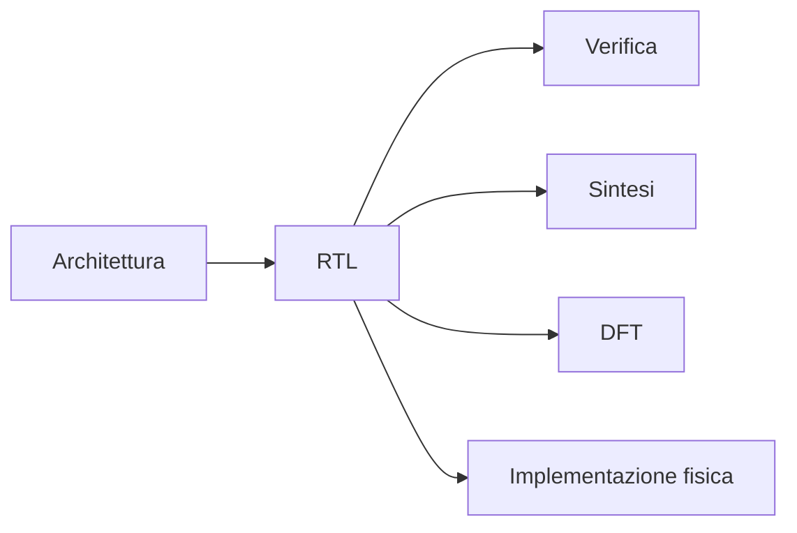
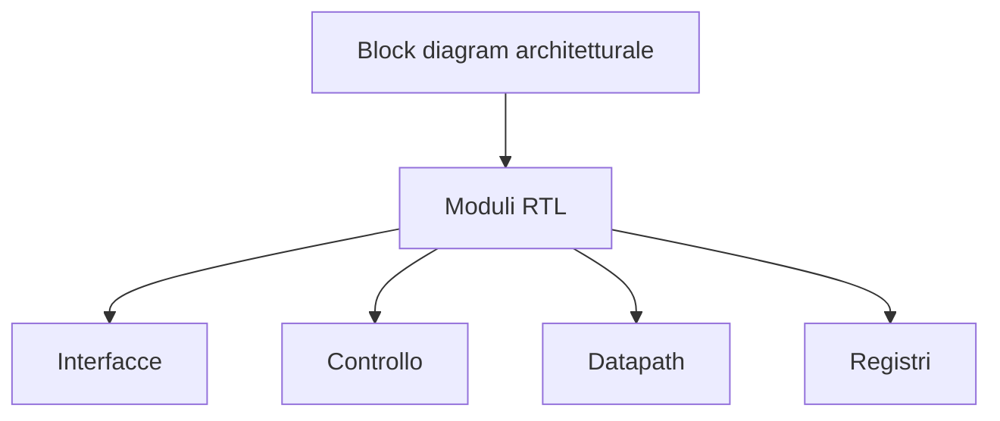
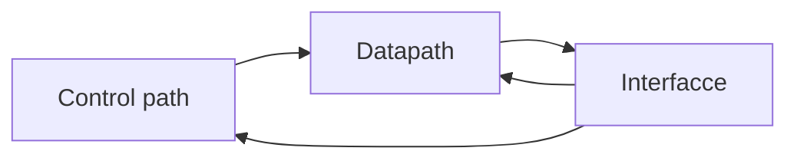
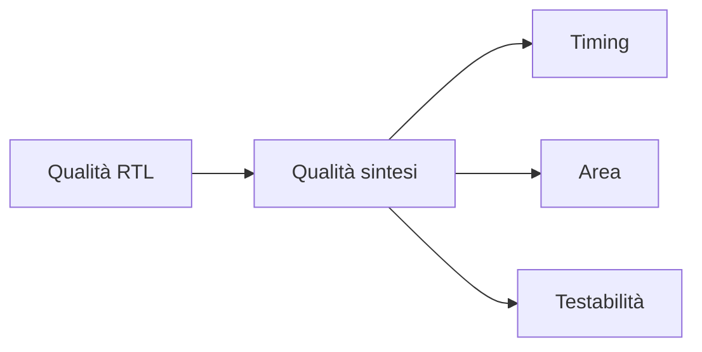

# RTL design per ASIC

La fase di **RTL design** è il momento in cui l'architettura del chip viene tradotta in una descrizione hardware concreta, sintetizzabile e verificabile.  
Nel contesto ASIC, scrivere RTL non significa soltanto "far funzionare" un comportamento in simulazione: significa produrre una rappresentazione che sia adatta a tutto il flow successivo:

- sintesi logica;
- verifica;
- DFT;
- implementazione fisica;
- timing closure;
- signoff.

Per questo il codice RTL per ASIC deve essere progettato con particolare attenzione a:

- chiarezza strutturale;
- sintetizzabilità;
- controllabilità del timing;
- qualità della gerarchia;
- compatibilità con test e backend;
- robustezza del comportamento di reset e clock.

---

## 1. Il ruolo dell'RTL nel flow ASIC

L'RTL è il ponte fra:

- la **definizione architetturale** del progetto;
- la **realizzazione logica** che sarà sintetizzata in standard cells.

Dal punto di vista del flow, l'RTL è uno dei deliverable più importanti perché da esso derivano:

- la netlist di sintesi;
- la qualità del timing;
- la struttura della verifica;
- la testabilità del design;
- una parte rilevante della qualità finale del chip.

Una RTL progettata male può compromettere molte fasi successive, anche se la funzionalità nominale è corretta.

---

## 2. Obiettivi della progettazione RTL

Il codice RTL per ASIC dovrebbe soddisfare contemporaneamente più obiettivi.

## 2.1 Correttezza funzionale

Il comportamento deve realizzare quanto previsto dalla specifica e dall'architettura.

## 2.2 Sintetizzabilità

Il codice deve essere compatibile con il flusso di sintesi e tradursi in hardware reale nel modo atteso.

## 2.3 Leggibilità

La gerarchia e il codice devono essere comprensibili e manutenibili.

## 2.4 Verificabilità

La struttura deve facilitare testbench, debug e coverage.

## 2.5 Timing awareness

Il codice deve riflettere una struttura compatibile con la frequenza target.

## 2.6 Compatibilità con DFT e backend

Scelte di reset, clock, strutture di controllo e modularità devono essere coerenti con il flow ASIC.

---

## 3. Dall'architettura ai moduli RTL

L'architettura definisce i blocchi principali e le loro responsabilità.  
La fase RTL li traduce in moduli con:

- interfacce;
- segnali interni;
- processi combinatori e sequenziali;
- registri;
- datapath;
- FSM;
- parametri, se utili.

Questa traduzione non deve essere meccanica: spesso richiede scelte di raffinamento strutturale.

---

## 4. Stile di codifica sintetizzabile

Uno dei principi fondamentali del design ASIC è scrivere una RTL con stile chiaro e orientato all'hardware.

## 4.1 Pensare in termini di hardware, non di software

Il codice HDL non va pensato come software da eseguire, ma come descrizione di:

- registri;
- logica combinatoria;
- percorsi dati;
- transizioni di stato;
- interconnessioni.

Questo significa che ogni costrutto dovrebbe essere letto in termini di struttura hardware risultante.

## 4.2 Separare logica combinatoria e logica sequenziale

È una buona pratica mantenere concettualmente chiara la distinzione tra:

- logica combinatoria;
- registri e stato sequenziale.

Questo aiuta sia la leggibilità sia la sintesi.

## 4.3 Evitare ambiguità

Costrutti che in simulazione appaiono ragionevoli ma corrispondono a hardware poco chiaro o non desiderato devono essere evitati.

Esempi di problemi comuni:

- latch involontari;
- assegnazioni incomplete;
- logiche troppo implicite;
- dipendenze poco trasparenti.

---

## 5. Organizzazione modulare

Una buona RTL ASIC è quasi sempre fortemente **modulare**.

## 5.1 Perché modularizzare

La modularità aiuta a:

- isolare responsabilità;
- semplificare la verifica;
- rendere il progetto più leggibile;
- favorire il riuso;
- facilitare debug e sintesi;
- migliorare la manutenibilità.

## 5.2 Criteri di modularità

Una buona partizione in moduli dovrebbe riflettere:

- funzioni architetturali chiare;
- interfacce pulite;
- responsabilità ben definite;
- complessità locale gestibile.

## 5.3 Rischi di una modularità sbagliata

### Modularità troppo fine

Può introdurre:

- troppi segnali;
- gerarchie inutilmente profonde;
- overhead di integrazione;
- visione dispersa del progetto.

### Modularità troppo grossolana

Può portare a:

- moduli enormi e difficili da verificare;
- percorsi critici difficili da localizzare;
- minore leggibilità;
- minore controllabilità.

---

## 6. Interfacce RTL

Ogni modulo dovrebbe avere un'interfaccia ben progettata.

Un'interfaccia RTL di qualità dovrebbe chiarire:

- direzione dei segnali;
- ruolo di ciascun segnale;
- timing atteso;
- validità dei dati;
- segnali di handshake;
- segnali di reset e clock.

### Buone pratiche

- nomi coerenti;
- grouping logico dei segnali;
- separazione tra control e data;
- semantica documentata.

Interfacce poco chiare rendono più difficile sia la verifica sia l'integrazione dei moduli.

---

## 7. Datapath e controllo in RTL

Molti blocchi ASIC possono essere rappresentati come combinazione di:

- **datapath**;
- **control path**.

## 7.1 Datapath

Nel codice RTL, il datapath contiene:

- operatori aritmetici e logici;
- mux;
- registri di pipeline;
- percorsi di calcolo;
- buffer e registri dati.

## 7.2 Control path

Nel codice RTL, il controllo contiene:

- FSM;
- enable;
- selezioni di mux;
- condizioni di avanzamento;
- gestione di start, done, busy, error.

Una chiara separazione fra datapath e controllo tende a rendere il progetto più leggibile e verificabile.

---

## 8. FSM: macchine a stati

Le **Finite State Machines** sono molto comuni nella RTL ASIC, soprattutto per:

- protocolli;
- sequenziamento;
- gestione del controllo;
- bring-up di sottoblocchi;
- orchestrazione di pipeline o buffer.

## 8.1 Requisiti di una FSM ben progettata

Una FSM dovrebbe avere:

- stati ben definiti;
- transizioni comprensibili;
- condizioni d'ingresso e uscita chiare;
- uscite controllate in modo leggibile;
- comportamento di reset definito.

## 8.2 Errori frequenti nelle FSM

- stati poco documentati;
- transizioni implicite o ridondanti;
- uscite dipendenti da troppe condizioni sparse;
- reset ambiguo;
- eccessiva complessità della logica di next-state.

Le FSM sono un punto in cui una buona disciplina di codifica migliora molto la qualità del progetto.

---

## 9. Pipeline e timing awareness

Nel contesto ASIC, la RTL deve essere scritta con forte consapevolezza del timing.

## 9.1 Perché la pipeline è importante

Se la frequenza target è elevata, la logica combinatoria per ciclo deve essere controllata.  
La pipeline aiuta a:

- spezzare percorsi lunghi;
- aumentare la frequenza massima;
- rendere il timing più trattabile.

## 9.2 Cosa deve riflettere la RTL

Il codice dovrebbe evidenziare chiaramente:

- stadi di pipeline;
- registri di separazione;
- segnali valid/ready o equivalenti, se presenti;
- allineamento dei dati tra stadi.

## 9.3 Errori frequenti

- pipeline introdotte troppo tardi;
- profondità combinatoria eccessiva;
- percorsi di controllo più lenti del datapath;
- segnali di validità disallineati rispetto ai dati.

---

## 10. Reset strategy

Il reset è un aspetto centrale del design RTL ASIC.

## 10.1 Cosa deve chiarire il codice RTL

- quali registri vengono resettati;
- quali no;
- tipo di reset previsto;
- stato iniziale dei blocchi;
- comportamento all'uscita dal reset.

## 10.2 Perché il reset è delicato

Una strategia di reset poco disciplinata può creare problemi in:

- verifica;
- DFT;
- timing closure;
- bring-up;
- integrazione di sottosistemi.

## 10.3 Buone pratiche concettuali

- resettare ciò che è davvero necessario;
- definire con chiarezza gli stati iniziali;
- evitare logiche di reset inutilmente diffuse;
- mantenere coerenza di stile.

Un reset eccessivamente invasivo può peggiorare area e timing, mentre uno troppo minimale può rendere il comportamento iniziale poco robusto.

---

## 11. Clock awareness

La RTL ASIC dovrebbe essere progettata in modo coerente con la struttura dei clock del sistema.

Occorre avere almeno consapevolezza di:

- clock domain presenti;
- segnali attraversanti domini diversi;
- blocchi sempre attivi vs blocchi controllabili;
- enable e possibili strategie di clock gating.

### Attenzione

La RTL non deve fingere che tutti i segnali siano nello stesso dominio se l'architettura non lo prevede.  
Una mancata consapevolezza del clock domain crossing può portare a problemi gravi e difficili da diagnosticare.

---

## 12. Parametrizzazione

La parametrizzazione può essere utile in RTL per:

- riuso;
- scalabilità;
- configurazioni diverse;
- adattamento della larghezza dati;
- regolazione di profondità o numero di elementi.

### Vantaggi

- maggiore flessibilità;
- minore duplicazione di codice;
- possibilità di esplorare varianti.

### Rischi

- aumento della complessità di verifica;
- configurazioni formalmente ammesse ma poco testate;
- interfacce meno immediate da leggere.

In un progetto ASIC reale conviene parametricizzare con disciplina, evitando di trasformare il codice in una struttura eccessivamente generica.

---

## 13. Gestione dei dati e buffering

Molti problemi ASIC nascono non dalla funzione logica principale, ma da come i dati vengono:

- ricevuti;
- immagazzinati;
- riallineati;
- inoltrati;
- consumati.

La RTL deve quindi rendere chiaro:

- dove si trovano i registri dati;
- quando il dato è valido;
- quando viene consumato;
- come si evita perdita o duplicazione;
- come si gestiscono stall o backpressure, se presenti.

Questo è particolarmente importante in blocchi stream-oriented o con forte parallelismo interno.

---

## 14. Lettura e scrittura di memorie

Se il design usa memorie o buffer, la RTL deve riflettere chiaramente:

- porte di accesso;
- timing di lettura e scrittura;
- arbitraggi o priorità;
- sequenze di accesso;
- inizializzazione o comportamento dopo reset.

Scelte poco chiare sulla gestione delle memorie si ripercuotono facilmente su:

- timing;
- area;
- floorplanning;
- verifica funzionale.

---

## 15. Evitare costrutti problematici

Nel design ASIC conviene evitare costrutti che possano:

- essere ambigui in sintesi;
- generare hardware inatteso;
- rendere difficile il timing;
- dipendere da comportamenti simulator-specific.

Senza entrare nei dettagli sintattici di un linguaggio specifico, i rischi tipici includono:

- assegnazioni incomplete;
- dipendenze combinatorie nascoste;
- inferenza involontaria di latch;
- logiche troppo annidate;
- uso disordinato di reset e enable.

La regola generale è: **il codice deve descrivere in modo esplicito e leggibile l'hardware desiderato**.

---

## 16. RTL e sintesi

La qualità della RTL ha un impatto diretto sul risultato di sintesi.

Una RTL ben progettata tende a produrre:

- netlist più leggibili;
- migliori report di timing;
- uso più prevedibile dell'area;
- minori sorprese nel mapping su standard cells.

Una RTL debole può invece causare:

- percorsi critici non previsti;
- area eccessiva;
- proliferazione di logica non necessaria;
- struttura difficile da ottimizzare.

---

## 17. RTL e verifica

Una buona RTL non aiuta solo la sintesi: aiuta moltissimo anche la verifica.

Elementi che migliorano la verificabilità:

- gerarchia chiara;
- interfacce pulite;
- FSM leggibili;
- segnali di stato ben nominati;
- datapath riconoscibile;
- comportamenti di reset chiari.

Questo rende più semplice:

- scrivere testbench;
- fare debug;
- definire coverage significativa;
- isolare i bug.

---

## 18. RTL e DFT

Anche se la DFT viene introdotta in una fase successiva, l'RTL deve essere compatibile con la testabilità.

Scelte che possono influenzare la DFT:

- uso eccessivamente disordinato dei reset;
- clocking poco chiaro;
- strutture difficili da controllare o osservare;
- logica di gating non ben disciplinata;
- blocchi interni poco accessibili.

Una RTL progettata senza alcuna attenzione alla testabilità può complicare molto il lavoro successivo.

---

## 19. RTL e physical awareness

Pur essendo una descrizione logica, la RTL non è indipendente dal mondo fisico.

Alcune scelte RTL influenzano direttamente:

- profondità dei percorsi critici;
- quantità di registri;
- località dei dati;
- densità di interconnessione;
- congestione potenziale;
- clock tree e distribuzione dei reset.

Per questo il progettista ASIC dovrebbe scrivere RTL con una certa **physical design awareness**, evitando di considerare il backend come una fase separata che "sistemerà tutto".

---

## 20. Deliverable tipici della fase RTL

Alla fine della fase RTL ci si aspetta di avere:

- codice RTL sintetizzabile;
- gerarchia dei moduli;
- definizione delle interfacce;
- documentazione tecnica minima;
- allineamento con architettura e specifica;
- primi test o smoke test di verifica;
- piano coerente per la sintesi.

---

## 21. Errori frequenti nella progettazione RTL ASIC

Tra gli errori più comuni:

- scrivere codice pensando alla sola simulazione;
- ignorare il timing target;
- introdurre pipeline troppo tardi;
- usare reset poco disciplinati;
- costruire moduli troppo grandi o troppo opachi;
- non separare chiaramente controllo e datapath;
- interfacce poco leggibili;
- parametrizzazione eccessiva e poco verificata;
- trascurare clock domain e crossing;
- considerare la sintetizzabilità come dettaglio secondario.

---

## 22. Collegamento con FPGA

Molte buone pratiche RTL sono valide anche in FPGA, ad esempio:

- modularità;
- pipeline;
- chiarezza delle FSM;
- attenzione al timing;
- interfacce pulite.

Tuttavia, in ASIC l'impatto di queste scelte è spesso più severo, perché:

- il chip sarà fabbricato;
- il costo di errore è molto più alto;
- timing, DFT e fisicità del design pesano di più.

La FPGA resta comunque un ambiente molto utile per prototipare e validare scelte RTL prima di un eventuale flow ASIC completo.

---

## 23. Collegamento con SoC

Nel contesto SoC, la RTL può descrivere:

- CPU;
- periferiche;
- interconnect;
- acceleratori;
- controller di sistema.

Nel contesto ASIC, la stessa RTL deve però essere anche compatibile con:

- sintesi realistica;
- DFT;
- backend;
- signoff.

Per questo la cultura ASIC arricchisce la scrittura RTL con una forte consapevolezza di implementazione.

---

## 24. Esempio concettuale

Immaginiamo di dover implementare un piccolo acceleratore.

L'architettura ha definito:

- un'interfaccia di input;
- un datapath a più stadi;
- una FSM di controllo;
- registri di configurazione;
- un segnale `done`.

La fase RTL dovrà allora tradurre questi elementi in:

- moduli ben separati;
- stadi di pipeline espliciti;
- logica di controllo leggibile;
- reset coerente;
- interfaccia sintetizzabile;
- comportamento facilmente verificabile.

Questo esempio mostra che l'RTL non è una mera "traduzione di codice", ma la concretizzazione strutturale dell'architettura.

---

## 25. In sintesi

La progettazione RTL per ASIC è una fase centrale del flow, perché traduce l'architettura in una descrizione hardware sintetizzabile, verificabile e implementabile.

Una buona RTL dovrebbe essere:

- corretta funzionalmente;
- leggibile;
- modulare;
- timing-aware;
- coerente con reset e clock;
- compatibile con sintesi, DFT e backend.

In un progetto ASIC, scrivere bene l'RTL significa ridurre il rischio in tutte le fasi successive del flow.

---

## Prossimo passo

Dopo l'RTL design, il passo successivo naturale è affrontare il tema di **vincoli e timing**, cioè il modo in cui il progetto viene reso misurabile e guidato rispetto agli obiettivi temporali che la sintesi e il backend dovranno soddisfare.
