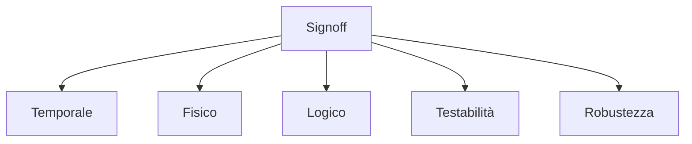
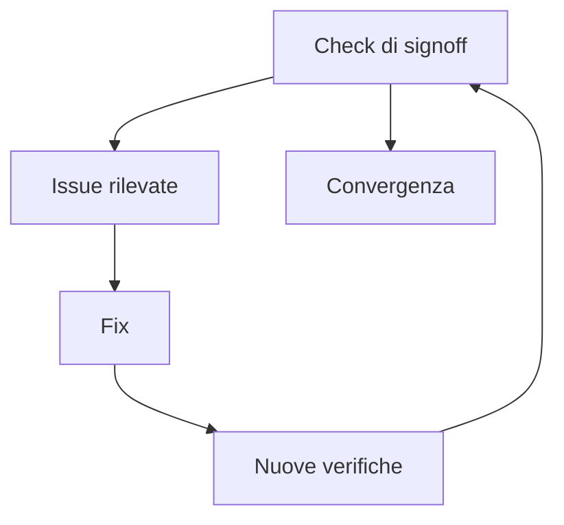

# Signoff fisico e temporale in un progetto ASIC

Il **signoff** è la fase finale del flow ASIC in cui si decide se il progetto è realmente pronto per il **tape-out**.  
Dopo RTL, sintesi, DFT, floorplanning, place and route e Clock Tree Synthesis, il chip deve superare una serie di verifiche finali che dimostrino, con sufficiente confidenza, che:

- il design è corretto dal punto di vista funzionale;
- i vincoli temporali sono rispettati;
- il layout è fisicamente conforme;
- la netlist e il layout sono coerenti;
- la testabilità è adeguata;
- il chip è abbastanza robusto da essere consegnato alla fabbricazione.

Il signoff non è una formalità amministrativa, ma il punto in cui il progetto viene giudicato dal punto di vista **ingegneristico e produttivo**.

---

## 1. Che cos'è il signoff

Con il termine **signoff** si indica il processo finale di verifica e approvazione del progetto ASIC prima del tape-out.

In questa fase si raccolgono i risultati delle analisi più importanti e si valuta se il chip soddisfa tutti i criteri minimi di accettazione.

Il signoff è quindi:

- una fase tecnica;
- una fase decisionale;
- una sintesi di tutto il lavoro di progettazione e implementazione.

---

## 2. Perché il signoff è cruciale

Nel flow ASIC, il tape-out è un punto molto costoso e difficilmente reversibile.  
Eventuali errori che sfuggono al signoff possono trasformarsi in:

- chip non funzionanti;
- yield scarsa;
- problemi di test;
- prestazioni inferiori al previsto;
- ritardi di progetto;
- costi molto elevati di re-spin.

Per questo il signoff serve a ridurre il rischio residuo al livello più basso possibile ragionevolmente raggiungibile.

---

## 3. Le grandi aree del signoff

Il signoff raccoglie tipicamente verifiche in più aree.

### Signoff temporale

Controlla che il design soddisfi i vincoli di timing.

### Signoff fisico

Controlla che il layout sia compatibile con le regole della tecnologia.

### Signoff logico

Controlla la coerenza tra descrizioni del design in fasi diverse.

### Signoff di testabilità

Controlla che il chip sia testabile secondo le attese del progetto.

### Signoff elettrico e di robustezza

Include, a livello introduttivo, verifiche che aumentano la fiducia nel comportamento reale del chip.

---

## 4. Signoff temporale

Uno dei pilastri del signoff è il controllo finale del timing del progetto.

## 4.1 Obiettivo

Verificare che il chip rispetti i vincoli temporali in condizioni realistiche, dopo che:

- il layout è stato costruito;
- la rete di clock è stata sintetizzata;
- il routing è stato completato;
- i parassitici sono stati considerati.

## 4.2 Analisi principale

La tecnica principale è la **Static Timing Analysis (STA)** finale, eseguita sul design post-layout.

### Cosa si controlla

- setup timing;
- hold timing;
- percorsi critici;
- relazioni tra clock;
- corner e modalità operative.

Il signoff temporale è spesso considerato uno dei criteri più visibili di maturità del design.

---

## 5. Setup e hold al signoff

Le due famiglie principali di controlli temporali restano:

- **setup**;
- **hold**.

## 5.1 Setup

Verifica che il dato arrivi al registro di cattura entro il tempo utile.

## 5.2 Hold

Verifica che il dato non cambi troppo presto dopo il fronte di clock.

Al signoff, queste analisi vengono svolte sul design più realistico disponibile, quindi con un livello di affidabilità molto superiore rispetto ai controlli post-sintesi.

---

## 6. Corner e condizioni operative

Il signoff non viene eseguito in una singola condizione ideale.

Il progetto deve essere controllato in più scenari, che possono variare per:

- processo;
- tensione;
- temperatura;
- modalità di funzionamento;
- condizioni di carico.

Questo approccio è necessario perché il chip reale non opererà in una sola situazione nominale, ma in un insieme di condizioni plausibili.

### Perché i corner sono fondamentali

Un design che chiude timing solo in condizioni ideali non è realmente pronto per la produzione.

---

## 7. Estrazione dei parassitici

Per ottenere un timing realistico è necessario considerare i **parassitici** introdotti dal layout.

Questi derivano da:

- lunghezza delle interconnessioni;
- capacità dei fili;
- resistenze;
- accoppiamenti;
- struttura reale del routing.

L'estrazione dei parassitici rende il modello temporale molto più vicino al comportamento fisico del chip.

Senza questo passaggio, il timing finale sarebbe troppo ottimistico.

---

## 8. Signoff fisico

Oltre al timing, il signoff deve garantire che il layout sia fisicamente valido.

Questo significa verificare che il chip rispetti le regole geometriche e strutturali imposte dal processo tecnologico.

Le due verifiche più classiche sono:

- **DRC** (*Design Rule Check*);
- **LVS** (*Layout Versus Schematic*).

---

## 9. DRC: Design Rule Check

La verifica **DRC** controlla che il layout rispetti le regole geometriche della tecnologia.

## 9.1 Esempi di aspetti controllati

- distanze minime;
- larghezze minime;
- overlap corretti;
- spacing tra forme;
- uso dei layer;
- vincoli geometrici del processo.

## 9.2 Perché è importante

Un layout che viola le design rules può:

- essere non fabbricabile;
- produrre difetti;
- ridurre l'affidabilità;
- causare problemi non prevedibili nel silicio.

Per questo un design non può andare a tape-out con DRC violati non giustificati.

---

## 10. LVS: Layout Versus Schematic

La verifica **LVS** controlla la coerenza tra:

- il layout implementato;
- la netlist di riferimento.

## 10.1 Obiettivo

Assicurarsi che ciò che è stato disegnato fisicamente corrisponda realmente al circuito che si intendeva implementare.

## 10.2 Errori tipici rilevabili

- connessioni mancanti;
- connessioni errate;
- mismatch tra istanze;
- errori di netlist/layout;
- corti o aperture.

La LVS è quindi una delle verifiche fondamentali per stabilire che il chip fisico rappresenti davvero il design logico previsto.

---

## 11. Verifiche fisiche aggiuntive

Oltre a DRC e LVS, nel signoff possono essere incluse altre verifiche importanti.

A livello introduttivo, è utile sapere che si possono controllare anche aspetti come:

- antenna effects;
- robustezza elettrica;
- integrità dell'alimentazione;
- integrità del clock;
- effetti legati a routing e densità.

Non tutti questi aspetti vengono sempre discussi in un'introduzione al flow, ma è importante capire che il signoff fisico è più ampio di un semplice "DRC/LVS pulito".

---

## 12. Antenna checks

Durante la fabbricazione, alcune strutture di metallo possono accumulare carica in modo dannoso per certi nodi sensibili.

Gli **antenna checks** servono a individuare questi casi e a richiedere eventuali correzioni.

### Perché sono rilevanti

Un design funzionalmente corretto e DRC-clean può comunque presentare problemi di fabbricazione se questi effetti non vengono controllati.

---

## 13. Integrità dell'alimentazione

Anche se una trattazione completa richiederebbe approfondimenti specifici, al signoff è importante avere fiducia che la rete di alimentazione sia abbastanza robusta.

Aspetti concettuali importanti:

- distribuzione della corrente;
- regioni ad alta attività;
- eventuali cadute di tensione locali;
- robustezza delle power structures;
- bilanciamento tra densità logica e alimentazione.

In alcuni flow, ciò si traduce in verifiche dedicate su power integrity.

---

## 14. Robustezza del clock

Il signoff deve anche confermare che la rete di clock sia coerente con i requisiti del design.

Aspetti rilevanti:

- skew controllato;
- latenza accettabile;
- distribuzione fisica robusta;
- assenza di anomalie gravi dovute al routing;
- comportamento coerente nelle modalità analizzate.

La CTS, da sola, non basta: il comportamento finale della rete di clock va validato nel contesto del layout completo.

---

## 15. Signoff logico

Il signoff non è solo fisico e temporale.  
Serve anche a garantire coerenza logica tra le varie rappresentazioni del design.

Un controllo molto importante è il confronto tra:

- RTL;
- netlist sintetizzata;
- netlist post-DFT o post-layout, dove richiesto dal flow.

Questo riduce il rischio che trasformazioni di sintesi o successive modifiche abbiano alterato il comportamento funzionale atteso.

---

## 16. Equivalence checking

Uno degli strumenti concettualmente più importanti in questa fase è il **logic equivalence checking**.

## 16.1 Obiettivo

Verificare che due rappresentazioni del design siano logicamente equivalenti.

## 16.2 Esempi di confronti possibili

- RTL vs netlist sintetizzata;
- netlist pre-DFT vs netlist post-DFT;
- versioni diverse del design dopo alcune trasformazioni.

Questo controllo rafforza la fiducia nel fatto che il design realizzato sia ancora lo stesso progetto descritto in origine.

---

## 17. Signoff della testabilità

Un ASIC pronto per il tape-out deve anche essere **testabile**.

Per questo il signoff include normalmente verifiche legate alla DFT, ad esempio su:

- presenza e correttezza delle scan chain;
- copertura di test;
- qualità della scan insertion;
- coerenza della modalità di test;
- compatibilità del design con ATPG e collaudo.

Un design non testabile può essere impossibile da qualificare correttamente dopo la fabbricazione.

---

## 18. Signoff e checklist di progetto

Nella pratica, il signoff si basa spesso anche su una **checklist** strutturata.

Essa può includere domande del tipo:

- il timing è chiuso in tutti i corner rilevanti?
- il layout è DRC-clean?
- la LVS è pulita?
- la DFT soddisfa i requisiti minimi?
- i report di potenza sono accettabili?
- i path critici sono compresi e giustificati?
- i warning residui sono stati valutati?
- esistono issue aperte non risolte?

Questa checklist è importante perché evita di considerare il signoff come una valutazione solo intuitiva o informale.

---

## 19. Warning e violazioni residue

Non tutti i report finali sono perfettamente "vuoti".  
In alcuni casi possono restare:

- warning;
- eccezioni;
- limitazioni note;
- punti da monitorare in bring-up.

La vera questione è capire se questi residui siano:

- accettabili e documentati;
- marginali e ben compresi;
- oppure indizi di un rischio ancora troppo alto.

Il signoff non richiede sempre un mondo ideale, ma richiede chiarezza e controllo del rischio residuo.

---

## 20. Signoff come decisione di rischio

Dal punto di vista metodologico, il signoff può essere visto come una **decisione di rischio informato**.

Il team deve poter dire:

- abbiamo controllato le aree principali di rischio;
- sappiamo quali limiti restano;
- riteniamo il progetto sufficientemente robusto per il tape-out.

Questa consapevolezza è fondamentale, perché nessun progetto reale è privo di incertezza assoluta.

---

## 21. Iterazione prima del signoff

Molto spesso il signoff non viene raggiunto direttamente, ma dopo più iterazioni.

Tipico flusso:

1. analisi finale;
2. individuazione di violazioni o warning rilevanti;
3. fix di:
   - timing;
   - routing;
   - clock;
   - alimentazione;
   - DFT;
4. nuova esecuzione delle verifiche;
5. progressiva convergenza.

Questo processo è normale e fa parte della maturazione del design.

---

## 22. Errori frequenti nel signoff

Tra gli errori più comuni:

- considerare il signoff come una formalità finale;
- guardare solo il worst slack senza analizzare il quadro complessivo;
- sottovalutare warning fisici o temporali;
- affidarsi troppo a risultati ottenuti in condizioni troppo favorevoli;
- ignorare la coerenza logica dopo trasformazioni del design;
- non usare checklist chiare;
- non documentare le eccezioni residue.

---

## 23. Buone pratiche concettuali

Una buona gestione del signoff tende a seguire questi principi:

- verificare il design in modo multidimensionale;
- non limitarsi a timing o DRC da soli;
- correlare tra loro risultati temporali, fisici e logici;
- trattare ogni warning con attenzione proporzionata;
- usare corner realistici;
- mantenere tracciabilità delle decisioni;
- entrare nel tape-out solo con rischio residuo compreso e accettato.

---

## 24. Collegamento con FPGA

Nel mondo FPGA esistono forme di "chiusura" del progetto, ma il signoff ASIC è molto più severo e strutturato perché il risultato finale sarà fabbricato.

Studiare il signoff ASIC aiuta a capire meglio anche in FPGA:

- l'importanza del timing reale;
- la relazione tra fisico e logico;
- il valore dei check finali;
- il significato di chiudere un progetto in modo disciplinato.

La differenza è che, in ASIC, il costo dell'errore dopo la chiusura è molto più alto.

---

## 25. Collegamento con SoC

Nel contesto SoC, il signoff diventa ancora più complesso perché il chip contiene:

- più sottosistemi;
- molte macro;
- interconnect estese;
- domini di clock;
- domini di alimentazione;
- IP eterogenei.

Per questo il signoff di un SoC realizzato come ASIC è uno dei momenti di maggiore integrazione tra:

- architettura;
- backend;
- DFT;
- timing;
- verifica di sistema.

---

## 26. Esempio concettuale

Immaginiamo un ASIC in cui:

- il timing è quasi chiuso ma con alcuni margini deboli;
- il layout è quasi pulito ma restano warning minori;
- la DFT coverage è buona ma non perfetta;
- la power integrity mostra zone da monitorare.

Il signoff richiede di capire se:

- questi problemi siano compatibili con il rischio di progetto;
- esistano fix realistici a costo contenuto;
- sia meglio iterare ancora oppure procedere.

Questo esempio mostra che il signoff è un'attività tecnica ma anche decisionale.

---

## 27. In sintesi

Il signoff è la fase finale del flow ASIC in cui si verifica che il progetto sia davvero pronto per il tape-out.

Include, in forma integrata:

- signoff temporale;
- signoff fisico;
- verifiche logiche;
- controlli di testabilità;
- valutazioni di robustezza del design.

Le verifiche chiave comprendono:

- STA finale;
- DRC;
- LVS;
- equivalence checking;
- check della DFT;
- controlli aggiuntivi di integrità e affidabilità, a livello introduttivo.

Un ASIC non è pronto quando "sembra finito", ma quando ha superato con sufficiente rigore il proprio signoff.

---

## Prossimo passo

Dopo il signoff, il passo successivo naturale è approfondire il tema della **power analysis e del low-power design**, cioè il modo in cui si stimano, controllano e riducono i consumi del chip lungo il flow ASIC.
