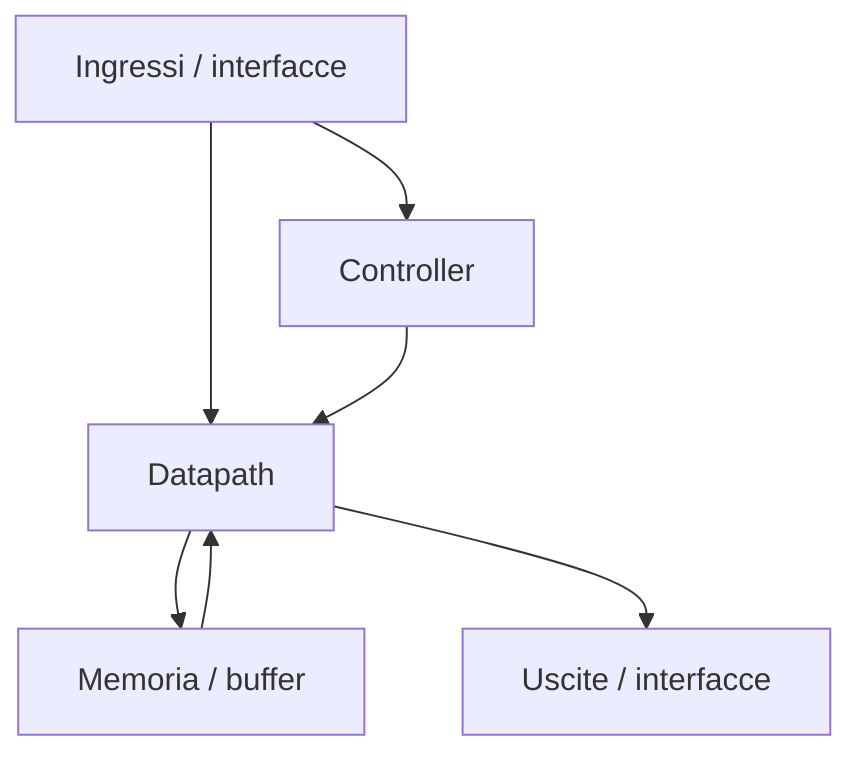
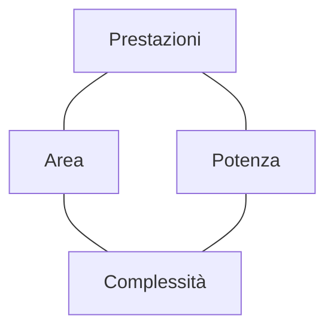

# Specifiche e architettura di un ASIC

La progettazione di un **ASIC** inizia molto prima della scrittura dell'RTL.  
Prima di descrivere moduli, FSM o datapath, occorre chiarire **che cosa il chip deve fare**, in quali condizioni deve operare e quali vincoli deve rispettare.

Per questo, le fasi di **specifica** e **architettura** sono il fondamento dell'intero progetto.  
Una specifica ambigua o un'architettura debole possono compromettere tutte le fasi successive:

- RTL design;
- verifica;
- sintesi;
- implementazione fisica;
- signoff;
- tape-out.

In questa pagina analizziamo il ruolo delle specifiche e il modo in cui esse si trasformano in un'architettura concreta e implementabile.

---

## 1. Perché specifica e architettura sono decisive

Nel flow ASIC, la qualità delle fasi iniziali determina in larga misura:

- la fattibilità del progetto;
- la probabilità di rispettare timing e area;
- la complessità della verifica;
- la robustezza del backend;
- il rischio complessivo del tape-out.

Una specifica incompleta o poco quantitativa porta facilmente a:

- requisiti contraddittori;
- stime poco realistiche;
- frequenti cambiamenti in RTL;
- problemi scoperti troppo tardi;
- ritardi di progetto.

L'architettura ha invece il compito di trasformare i requisiti in una struttura tecnica coerente.

---

## 2. Che cos'è una specifica

La **specifica** è il documento, o l'insieme di documenti, che descrive ciò che il chip deve realizzare.

Può includere:

- funzionalità richieste;
- interfacce;
- protocolli;
- requisiti temporali;
- requisiti di potenza;
- condizioni operative;
- modalità di test;
- vincoli di area;
- scenari d'uso;
- aspetti di safety e security, se pertinenti.

La specifica non è ancora una soluzione architetturale: è la definizione del problema progettuale.

---

## 3. Tipi di requisiti

Per scrivere una buona specifica è utile distinguere chiaramente i diversi tipi di requisiti.

## 3.1 Requisiti funzionali

Descrivono **che cosa deve fare** il chip.

Esempi:

- eseguire una determinata elaborazione;
- supportare un protocollo;
- pilotare un'interfaccia;
- elaborare flussi di dati;
- generare eventi o segnali di controllo.

## 3.2 Requisiti prestazionali

Descrivono **quanto bene** il chip deve farlo.

Esempi:

- throughput;
- latenza;
- frequenza massima;
- numero di operazioni per secondo;
- tempo massimo di risposta.

## 3.3 Requisiti fisici

Descrivono i vincoli hardware del progetto.

Esempi:

- area massima;
- budget di potenza;
- package o pin disponibili;
- range di temperatura;
- tensione di alimentazione.

## 3.4 Requisiti di verifica e test

Indicano che cosa deve essere verificabile e come il chip dovrà essere testato.

Esempi:

- supporto DFT;
- modalità di test;
- copertura desiderata;
- punti di osservabilità;
- requisiti di bring-up.

## 3.5 Requisiti di sistema

Descrivono il contesto in cui il chip verrà usato.

Esempi:

- interazione con memorie esterne;
- collegamento con altri chip;
- firmware di controllo;
- clock disponibili;
- reset di sistema;
- vincoli di startup.

---

## 4. Caratteristiche di una buona specifica

Una specifica efficace dovrebbe essere:

- **chiara**, senza ambiguità;
- **completa**, almeno per gli aspetti essenziali;
- **misurabile**, quando possibile;
- **verificabile**, cioè traducibile in test o controlli;
- **consistente**, senza requisiti incompatibili;
- **stabile**, almeno quanto basta per permettere il lavoro di progetto.

### Esempio di requisito debole

> Il chip deve essere veloce.

Questo requisito è poco utile.

### Esempio di requisito migliore

> Il chip deve sostenere un throughput di almeno X dati/s con una latenza massima di Y cicli.

Questo è un requisito verificabile e progettualmente utile.

---

## 5. Dalla specifica all'architettura

L'**architettura** è la risposta tecnica alla specifica.  
Trasforma un insieme di requisiti in una struttura organizzata di blocchi e interazioni.

Si passa quindi da domande come:

- cosa deve fare il chip?
- quali interfacce deve supportare?
- quali vincoli di timing e area ha?

a domande come:

- quanti sottoblocchi servono?
- come si suddivide il datapath?
- dove serve una pipeline?
- quanta memoria locale serve?
- quali controller sono necessari?
- dove si collocano i colli di bottiglia?

---

## 6. Obiettivi dell'architettura

Una buona architettura deve:

- soddisfare i requisiti funzionali;
- rispettare i target prestazionali;
- essere implementabile con ragionevole probabilità di successo;
- non eccedere inutilmente in area e potenza;
- essere verificabile;
- essere compatibile con il flow ASIC.

In pratica, l'architettura è il punto in cui si bilanciano:

- correttezza;
- prestazioni;
- costo;
- rischio.

---

## 7. Gli elementi tipici di una definizione architetturale

L'architettura di un ASIC può includere, a seconda del progetto:

- scomposizione in moduli;
- block diagram;
- datapath principale;
- pipeline;
- controller;
- memorie e buffer;
- interfacce esterne;
- clock e reset strategy a livello concettuale;
- partizionamento funzionale;
- primo budgeting di timing, area e potenza.

---

## 8. Block diagram e gerarchia

Una delle prime forme concrete dell'architettura è il **diagramma a blocchi**.

Esso permette di chiarire:

- i sottosistemi principali;
- la loro responsabilità;
- i flussi di dati;
- i segnali di controllo;
- le interfacce verso l'esterno.

La gerarchia è importante perché:

- rende il progetto più leggibile;
- facilita verifica e sintesi;
- aiuta il partizionamento fisico;
- riduce la complessità di sviluppo.

---

## 9. Datapath e controllo

Molti ASIC possono essere letti come combinazione di due anime:

- **datapath**, che elabora dati;
- **control path**, che coordina le operazioni.

### Datapath

Comprende tipicamente:

- operatori aritmetici;
- registri;
- mux;
- pipeline;
- buffer;
- percorsi dati.

### Control path

Comprende:

- FSM;
- decodifica dei comandi;
- sequenziamento;
- generazione di segnali di enable;
- gestione degli stati operativi.

La scelta di come separare e far cooperare queste due parti è una delle decisioni più importanti dell'architettura.

---

## 10. Pipeline e parallelismo

Due strumenti architetturali fondamentali per rispettare i target prestazionali sono:

- **pipeline**;
- **parallelismo**.

## 10.1 Pipeline

La pipeline consiste nel suddividere un'elaborazione in più stadi sequenziali, separati da registri.

### Vantaggi

- aumento della frequenza massima raggiungibile;
- riduzione della profondità combinatoria per stadio;
- miglior controllo del timing.

### Svantaggi

- aumento della latenza in cicli;
- maggiore numero di registri;
- complessità nel controllo e nella verifica.

## 10.2 Parallelismo

Il parallelismo consiste nell'eseguire più operazioni contemporaneamente.

### Vantaggi

- aumento del throughput;
- migliore sfruttamento di compiti ripetitivi o indipendenti.

### Svantaggi

- maggiore area;
- maggiori consumi;
- complessità di controllo.

La scelta tra pipeline, parallelismo o combinazione dei due dipende dal tipo di carico applicativo.

---

## 11. Memorie, buffer e località dei dati

Anche in ASIC, la gestione dei dati è spesso decisiva quanto il calcolo stesso.

L'architettura deve decidere:

- quali memorie usare;
- dove collocare i buffer;
- come far scorrere i dati;
- quanto traffico generare;
- se centralizzare o distribuire le memorie.

Queste scelte influenzano:

- area;
- timing;
- potenza;
- complessità del layout;
- latenza del sistema.

Una buona architettura non pensa solo all'operazione logica, ma anche a **come i dati vengono mossi e conservati**.

---

## 12. Interfacce e protocolli

Ogni ASIC interagisce con qualcosa di esterno:

- altri blocchi;
- memorie;
- bus;
- dispositivi;
- pin o package.

L'architettura deve quindi definire con precisione:

- segnali;
- timing delle interfacce;
- protocolli di handshake;
- larghezza dati;
- direzione dei flussi;
- eventuali dipendenze dal clock.

Interfacce poco chiare o troppo ottimistiche diventano rapidamente sorgenti di errori di integrazione.

---

## 13. Clock e reset a livello architetturale

Anche se i dettagli finali verranno affrontati più avanti nel flow, alcune scelte su clock e reset devono essere fatte già a livello architetturale.

Occorre chiarire almeno:

- quanti clock domain servono davvero;
- se esistono sottosistemi a frequenze diverse;
- come deve comportarsi il reset;
- se servono reset locali o globali;
- se esistono modalità di test o startup particolari.

Un'architettura che ignora questi temi rischia di diventare molto fragile nelle fasi successive.

---

## 14. Budgeting iniziale

Una buona architettura non si limita a descrivere i blocchi: deve accompagnarsi a un primo **budgeting**.

## 14.1 Timing budget

Si suddividono in modo approssimato i margini di tempo tra:

- interfacce;
- datapath;
- pipeline stage;
- percorsi critici attesi.

## 14.2 Area budget

Si stimano i contributi principali di:

- logica;
- registri;
- memorie;
- interfacce;
- moduli di controllo.

## 14.3 Power budget

Si cerca di capire dove si concentreranno:

- switching activity;
- clocking cost;
- macro o blocchi energivori;
- opportunità di gating.

Queste stime non sono definitive, ma aiutano a capire se il progetto è realistico.

---

## 15. Trade-off architetturali

L'architettura di un ASIC è quasi sempre un esercizio di compromesso.

### Prestazioni vs area

Più parallelismo o pipeline spesso significano più area.

### Prestazioni vs potenza

Aumentare frequenza o attività può far crescere il consumo.

### Semplicità vs ottimizzazione

Una struttura semplice può essere più robusta, ma meno efficiente.

### Flessibilità vs costo

Maggiore configurabilità può migliorare l'usabilità, ma aumentare area e complessità.

Un buon progettista ASIC deve saper motivare queste scelte, non solo prenderle.

---

## 16. Specifiche quantitative e fattibilità

Una parte molto importante della fase iniziale è verificare se i requisiti richiesti siano effettivamente compatibili tra loro.

Esempi di combinazioni critiche:

- frequenza molto alta con area molto bassa;
- throughput elevato con potenza molto ridotta;
- latenza minima con architettura semplice;
- vincoli temporali stretti con forte flessibilità.

Non tutte le richieste sono compatibili.  
L'architettura è anche il luogo in cui si deve avere il coraggio tecnico di segnalare requisiti irrealistici o conflittuali.

---

## 17. Scalabilità e versioni future

Anche se il chip attuale ha obiettivi limitati, è utile chiedersi se l'architettura possa:

- essere riusata;
- essere estesa;
- supportare versioni con più prestazioni;
- integrare nuove modalità;
- mantenere compatibilità con interfacce o tool interni.

Questo non significa progettare in modo eccessivamente generico, ma evitare soluzioni troppo rigide senza necessità.

---

## 18. Impatto sulla verifica

Le decisioni di specifica e architettura influenzano fortemente la verifica.

Una buona architettura tende a favorire:

- interfacce chiare;
- modularità;
- controlli semplici da osservare;
- casi di test ben identificabili;
- isolamento dei sottoblocchi.

Al contrario, strutture poco disciplinate rendono la verifica più costosa e meno affidabile.

---

## 19. Impatto sulla sintesi e sul backend

Le scelte architetturali influenzano direttamente anche le fasi successive del flow ASIC.

### Impatto sulla sintesi

- profondità combinatoria;
- numero di registri;
- struttura del controllo;
- regolarità del datapath.

### Impatto sul backend

- floorplan;
- macro placement;
- routing congestion;
- distribuzione del clock;
- timing closure;
- potenza e densità.

Questo è uno dei motivi per cui l'architettura deve essere fatta con una forte consapevolezza del flow complessivo.

---

## 20. Deliverable tipici della fase

Alla fine della fase di specifica e architettura, ci si aspetta di avere almeno:

- specifica funzionale;
- block diagram;
- definizione delle interfacce;
- ipotesi di clock/reset di alto livello;
- stima preliminare di area/timing/potenza;
- organizzazione dei moduli;
- piano iniziale di verifica.

Questi deliverable saranno poi raffinati, ma devono essere abbastanza chiari da guidare correttamente l'RTL design.

---

## 21. Errori frequenti

Tra gli errori più comuni in questa fase:

- specifiche troppo vaghe;
- requisiti non misurabili;
- architettura costruita senza budget iniziale;
- interfacce non definite in dettaglio sufficiente;
- sottostima dell'impatto di memoria e dati;
- scarsa attenzione a clock/reset;
- assenza di physical awareness;
- rinvio delle decisioni difficili a fasi troppo tarde.

---

## 22. Collegamento con FPGA

Nel contesto FPGA, una specifica e un'architettura ben fatte aiutano a:

- prototipare più rapidamente;
- verificare scelte di pipeline;
- misurare throughput e latenza;
- validare interfacce e protocolli.

Molti errori architetturali possono essere intercettati già in prototipazione FPGA, prima di affrontare il rischio di un flow ASIC completo.

---

## 23. Collegamento con SoC

Nel contesto SoC, la fase di architettura si estende a livello di sistema:

- interconnect;
- memorie;
- periferiche;
- software/hardware co-design;
- domini di clock e potenza.

Nel contesto ASIC, invece, l'attenzione è più focalizzata sul fatto che quella architettura debba diventare un chip reale e fisicamente implementabile.

---

## 24. Esempio concettuale

Immaginiamo un piccolo acceleratore ASIC per elaborazione dati.

La specifica potrebbe richiedere:

- throughput minimo;
- latenza massima;
- interfaccia dati larga N bit;
- clock target;
- consumo massimo;
- supporto reset e test.

L'architettura potrebbe allora decidere:

- pipeline a più stadi;
- buffer di ingresso e uscita;
- controller FSM;
- datapath dedicato;
- interfaccia di handshake;
- un certo numero di registri di configurazione.

Questo esempio mostra che l'architettura non inventa un chip dal nulla: **traduce requisiti in struttura tecnica**.

---

## 25. In sintesi

Le fasi di specifica e architettura sono il punto in cui il progetto ASIC prende forma.  
Qui si definiscono:

- requisiti funzionali e quantitativi;
- interfacce;
- struttura dei blocchi;
- compromessi tra area, timing e potenza;
- prime ipotesi di implementazione e verifica.

Una buona architettura non è solo elegante: è misurabile, verificabile, implementabile e coerente con il flow ASIC complessivo.

---

## Prossimo passo

Dopo aver definito specifiche e architettura, il passo successivo naturale è affrontare il tema del **RTL design**, cioè il modo in cui l'architettura viene tradotta in una descrizione sintetizzabile, modulare e adatta al flow ASIC.
