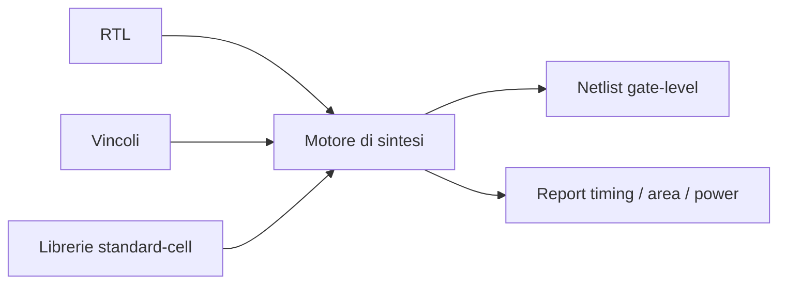
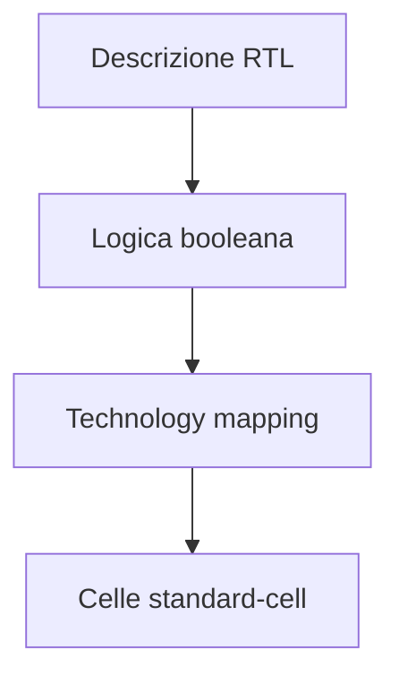
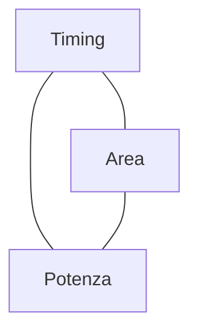
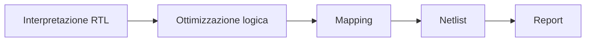
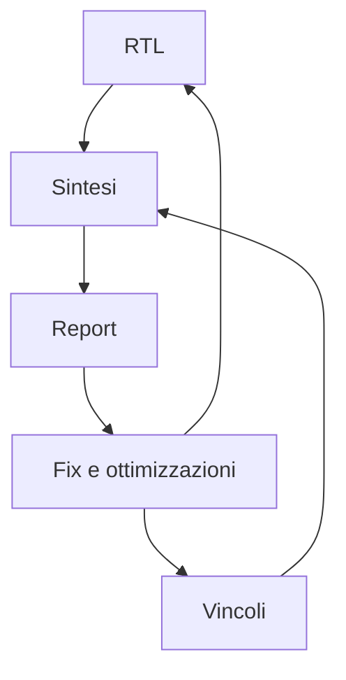

# Sintesi logica in un progetto ASIC

La **sintesi logica** è la fase del flow ASIC in cui la descrizione **RTL** del progetto viene trasformata in una **gate-level netlist** realizzata usando celle appartenenti a una libreria standard-cell.

Questa fase rappresenta il passaggio decisivo tra:

- il livello di descrizione architetturale e RTL;
- la rappresentazione logica concreta che verrà poi implementata fisicamente.

La sintesi non si limita a tradurre il codice in una rete di porte: deve anche ottimizzare il progetto rispetto a vincoli reali, tra cui:

- timing;
- area;
- potenza;
- testabilità;
- compatibilità con le librerie e il processo.

Per questo, la sintesi è una delle fasi più importanti del flow ASIC, perché rende visibile per la prima volta il costo logico reale del design.

---

## 1. Che cos'è la sintesi logica

La sintesi logica è il processo con cui un tool prende in ingresso:

- il codice RTL;
- i vincoli;
- le librerie tecnologiche;

e produce in uscita:

- una **netlist gate-level**;
- report di timing;
- report di area;
- stime di potenza;
- informazioni utili per le fasi successive del flow.

Il risultato non è ancora il layout fisico del chip, ma è già una descrizione molto più vicina all'hardware reale rispetto all'RTL.

---

## 2. Perché la sintesi è fondamentale

La sintesi è importante perché permette di rispondere concretamente a domande come:

- il design può raggiungere la frequenza target?
- quanto area occupa?
- quali sono i percorsi critici?
- l'architettura è compatibile con i vincoli temporali?
- il codice RTL è realmente traducibile in hardware efficiente?
- il costo logico del progetto è sostenibile?

In pratica, la sintesi è spesso il primo momento in cui l'architettura viene "messa alla prova" in termini quantitativi.

---

## 3. Input della sintesi

Per eseguire una sintesi coerente servono diversi input.

## 3.1 RTL

È la descrizione funzionale e strutturale del progetto a livello register-transfer.

## 3.2 Vincoli

I vincoli definiscono il contesto temporale e operativo del design:

- clock;
- periodi;
- input/output delay;
- false path;
- multicycle path;
- eventuali assunzioni sul carico o sull'ambiente.

## 3.3 Librerie standard-cell

La sintesi non può produrre hardware senza sapere quali celle sono disponibili.  
Le librerie forniscono informazioni su:

- funzionalità logica delle celle;
- area;
- ritardi;
- consumo;
- modelli ai diversi corner.

## 3.4 Setup del flow

Include:

- configurazione del tool;
- opzioni di ottimizzazione;
- obiettivi prioritari;
- eventuali eccezioni o strategie specifiche.

---

## 4. Output della sintesi

La sintesi produce una serie di artefatti molto importanti.

## 4.1 Netlist gate-level

È la rappresentazione del design come rete di:

- flip-flop;
- porte logiche;
- mux;
- buffer;
- celle di libreria.

## 4.2 Report di timing

Mostrano:

- percorsi critici;
- slack;
- violazioni di setup o hold, in forma preliminare;
- cammini più problematici.

## 4.3 Report di area

Riportano il costo del design in termini di area logica, suddivisibile per moduli o categorie di celle.

## 4.4 Stime di potenza

Permettono una prima valutazione di:

- consumo dinamico;
- consumo statico;
- blocchi più attivi o costosi dal punto di vista energetico.

## 4.5 Informazioni per le fasi successive

La sintesi prepara il materiale necessario per:

- DFT;
- floorplanning;
- place and route;
- verifiche di equivalenza;
- analisi temporale più avanzata.

---

## 5. Mapping su standard cells

Uno dei concetti centrali della sintesi ASIC è il **technology mapping**.

## 5.1 Cosa significa

La logica descritta in RTL viene trasformata in una rete composta da celle disponibili nella libreria scelta.

Esempi di celle tipiche:

- inverter;
- NAND;
- NOR;
- AOI/OAI;
- multiplexer;
- flip-flop;
- latch, se previsti;
- buffer;
- celle specializzate.

## 5.2 Perché è importante

La qualità del mapping influenza direttamente:

- area;
- timing;
- potenza;
- struttura della netlist;
- facilità di implementazione fisica.

Il mapping non è neutrale: a seconda dei vincoli e delle librerie, il tool può scegliere strutture molto diverse.

---

## 6. Obiettivi di ottimizzazione della sintesi

La sintesi cerca in generale di ottimizzare il design rispetto a più obiettivi contemporaneamente.

## 6.1 Timing

Il tool cerca di soddisfare i vincoli temporali, minimizzando i ritardi sui percorsi critici.

## 6.2 Area

Il tool cerca di ridurre il costo complessivo del design in termini di celle e risorse logiche.

## 6.3 Potenza

Può cercare di contenere il consumo scegliendo strutture più efficienti o riducendo attività non necessarie.

## 6.4 Robustezza del risultato

La qualità della netlist deve essere tale da non creare problemi insormontabili nelle fasi successive.

Questi obiettivi non sempre sono compatibili: migliorare uno può peggiorare un altro.

---

## 7. Trade-off tra timing, area e potenza

La sintesi è una fase fortemente guidata dai compromessi.

### Migliorare il timing

Può richiedere:

- celle più veloci;
- maggiore parallelismo;
- buffering;
- duplicazione di logica;
- aumento di area e potenza.

### Ridurre area

Può introdurre:

- logica più compatta;
- meno ridondanza;
- percorsi più lenti;
- riduzione dei margini temporali.

### Ridurre potenza

Può portare a:

- scelte conservative di attività;
- clock gating o preparazione per esso;
- strutture più compatte o meno aggressive;
- possibile impatto sulle prestazioni.

La sintesi è quindi il primo luogo in cui questi trade-off diventano misurabili.

---

## 8. Dipendenza dalla qualità dell'RTL

La sintesi non può compensare completamente una RTL debole o poco consapevole.

Se l'RTL ha problemi strutturali, la sintesi può evidenziare:

- percorsi critici troppo lunghi;
- area eccessiva;
- netlist poco regolare;
- logica difficile da ottimizzare;
- reset e controllo poco disciplinati.

Al contrario, una RTL ben progettata tende a produrre una sintesi:

- più prevedibile;
- più leggibile;
- più facile da chiudere a timing;
- meno problematica per il backend.

---

## 9. Dipendenza dai vincoli

La sintesi è guidata in modo decisivo dai vincoli.

Se i vincoli sono:

- realistici → il risultato sarà utile;
- troppo deboli → la netlist rischia di essere troppo lenta;
- troppo aggressivi → il tool può aumentare molto area e potenza;
- sbagliati → il risultato può apparire corretto ma essere ingannevole.

Per questo la sintesi va sempre letta insieme ai vincoli usati, non in modo isolato.

---

## 10. Librerie e corner

La sintesi dipende anche dalla libreria e dalle condizioni in cui essa viene usata.

## 10.1 Libreria

La scelta della libreria determina:

- quali celle sono disponibili;
- quanto sono veloci;
- quanto area occupano;
- quanto consumano.

## 10.2 Corner

La sintesi e il timing successivo devono tenere conto del fatto che il chip reale opererà in condizioni diverse, ad esempio per:

- processo;
- tensione;
- temperatura.

Questo rende la sintesi parte di un contesto tecnologico, non un esercizio astratto di traduzione logica.

---

## 11. Fasi concettuali della sintesi

Anche senza entrare nei dettagli dei tool, è utile pensare alla sintesi come a una sequenza di attività concettuali.

### Interpretazione dell'RTL

Il tool comprende la struttura hardware implicita del codice.

### Elaborazione logica

Costruisce una rappresentazione logica intermedia.

### Ottimizzazione

Riorganizza e semplifica la logica nel rispetto dei vincoli.

### Mapping

Associa la logica a celle della libreria.

### Reporting

Produce netlist e report quantitativi.

---

## 12. Report di timing

Uno degli output più importanti della sintesi è il report di timing.

Esso aiuta a capire:

- quali sono i percorsi più lenti;
- se la frequenza target è realistica;
- dove si concentrano le difficoltà del design;
- se servono modifiche a RTL, vincoli o architettura.

### Cosa osservare

- worst slack;
- percorsi critici;
- natura dei cammini problematici;
- distribuzione del ritardo tra logica e interconnessioni stimate;
- eventuale presenza di pattern architetturali ricorrenti.

La lettura del report di timing è una competenza chiave nella progettazione ASIC.

---

## 13. Report di area

La sintesi permette di quantificare il costo del design.

Un report di area può aiutare a capire:

- quali moduli sono più costosi;
- se il budget iniziale è realistico;
- se alcune scelte architetturali sono troppo onerose;
- quanto pesano registri, logica combinatoria, buffer o strutture di controllo.

L'area vista in sintesi non coincide ancora esattamente con l'area finale fisica, ma è già un indicatore molto utile.

---

## 14. Stime di potenza

La sintesi può fornire stime preliminari di potenza, spesso basate su:

- attività ipotizzate o annotate;
- modelli delle celle;
- dati di switching disponibili.

Queste stime sono importanti perché permettono di:

- identificare blocchi energivori;
- confrontare alternative architetturali;
- capire se il budget è plausibile;
- preparare ottimizzazioni future.

Le stime di potenza in questa fase non sono definitive, ma sono già molto preziose.

---

## 15. Violazioni di timing: cosa significano

Una violazione di timing in sintesi non significa necessariamente che il progetto sia fallito, ma segnala un problema da capire.

Possibili cause:

- architettura troppo ambiziosa;
- pipeline insufficiente;
- RTL inefficiente;
- vincoli errati;
- libreria non adatta;
- frequenza target irrealistica.

La sintesi è spesso il primo momento in cui queste tensioni diventano visibili in modo concreto.

---

## 16. Sintesi e iterazione progettuale

La sintesi raramente è una fase "una volta sola".  
Molto spesso è parte di un ciclo iterativo:

1. si sintetizza il progetto;
2. si leggono report di timing, area e potenza;
3. si identificano criticità;
4. si torna a:
   - RTL;
   - architettura;
   - vincoli;
   - strategia di ottimizzazione;
5. si rilancia la sintesi.

Questa iterazione è una parte normale del flow ASIC.

---

## 17. Relazione con la verifica

La sintesi non sostituisce la verifica funzionale.  
Anzi, la rende ancora più importante.

Dopo la sintesi, diventa rilevante anche il tema della **equivalenza** tra:

- comportamento RTL;
- netlist sintetizzata.

Inoltre, i risultati di sintesi possono suggerire nuovi casi di verifica, ad esempio se emergono strutture particolarmente sensibili o percorsi critici non attesi.

---

## 18. Relazione con DFT

La sintesi prepara il terreno per la DFT.

Aspetti rilevanti:

- struttura dei registri;
- uso dei reset;
- clocking;
- regolarità della logica;
- compatibilità con scan insertion.

Una sintesi poco disciplinata o una RTL inadatta possono rendere la DFT più difficile o costosa.

---

## 19. Relazione con il backend

La netlist di sintesi è il punto di partenza per il backend fisico.

La qualità della sintesi influenza direttamente:

- floorplanning;
- placement;
- congestion;
- CTS;
- timing closure post-route;
- consumi finali.

Una netlist apparentemente accettabile ma strutturalmente debole può creare grandi difficoltà in place and route.

---

## 20. Errori frequenti nell'uso della sintesi

Tra gli errori più comuni:

- considerare la sintesi come semplice "compilazione";
- guardare solo un singolo numero di slack;
- ignorare l'area mentre si insegue il timing;
- non collegare i problemi di sintesi alle scelte RTL;
- usare vincoli poco realistici;
- non confrontare il risultato con il budget iniziale;
- dimenticare l'impatto su DFT e backend;
- interpretare il report senza capire la struttura dei percorsi critici.

---

## 21. Buone pratiche concettuali

Una buona gestione della sintesi segue alcune linee guida semplici ma importanti:

- leggere i report in modo strutturato;
- confrontare timing, area e potenza insieme;
- correlare i risultati con architettura e RTL;
- non forzare la sintesi a "chiudere" con vincoli non realistici;
- usare la sintesi come strumento di apprendimento sul design, non solo come passaggio operativo.

---

## 22. Collegamento con FPGA

Anche in FPGA esiste una fase di sintesi, ma nel mondo ASIC la sintesi ha un ruolo ancora più profondo, perché:

- mappa su celle reali di libreria;
- è strettamente collegata al timing di signoff;
- prepara il design alla fabbricazione;
- ha impatto diretto su DFT e backend.

Capire la sintesi ASIC aiuta anche a leggere meglio il comportamento dei flow FPGA, ma con una consapevolezza più forte dei vincoli reali.

---

## 23. Collegamento con SoC

Nel contesto SoC, la sintesi può essere applicata:

- a singoli IP;
- a sottosistemi;
- a blocchi di interconnect;
- a controller;
- a porzioni complete del sistema.

Nel contesto ASIC, però, la sintesi non è solo una trasformazione funzionale: è l'inizio della concretizzazione logica del chip che poi andrà verso layout e signoff.

---

## 24. Esempio concettuale

Immaginiamo un piccolo acceleratore RTL con:

- un datapath;
- una FSM di controllo;
- alcuni registri di configurazione;
- una pipeline a pochi stadi.

La sintesi può mostrare che:

- il timing non chiude alla frequenza target;
- il costo dei registri è accettabile;
- l'area combinatoria è maggiore del previsto;
- la FSM non è il problema, ma il datapath sì.

A quel punto il team può decidere di:

- inserire una pipeline aggiuntiva;
- ristrutturare il datapath;
- rilassare un vincolo irrealistico;
- cambiare strategia di implementazione.

Questo esempio mostra che la sintesi è una fase di misura e comprensione, non solo di trasformazione.

---

## 25. In sintesi

La sintesi logica è la fase del flow ASIC che trasforma la RTL in una netlist di celle standard, guidata da vincoli e librerie tecnologiche.

Il suo ruolo è centrale perché rende per la prima volta misurabili in modo concreto:

- timing;
- area;
- potenza;
- qualità strutturale del design.

Una buona sintesi non dipende solo dal tool, ma dalla qualità congiunta di:

- architettura;
- RTL;
- vincoli;
- librerie;
- capacità di interpretare i report e iterare sul progetto.

---

## Prossimo passo

Dopo la sintesi logica, il passo successivo naturale è affrontare il tema della **DFT e testabilità**, cioè il modo in cui il design viene reso verificabile e collaudabile dopo la fabbricazione del chip.
