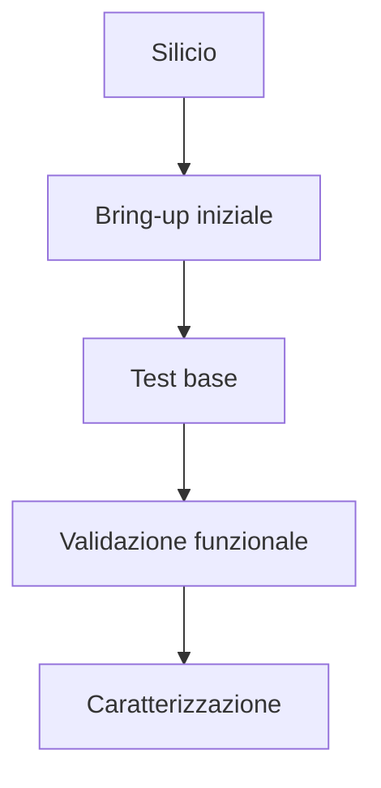

# Tape-out e fabbricazione di un ASIC

Il **tape-out** è il momento in cui un progetto ASIC, dopo aver completato tutte le fasi di verifica e signoff, viene consegnato al flusso produttivo per la realizzazione del chip fisico.  
È uno dei passaggi più importanti dell'intero progetto, perché segna il confine tra:

- il mondo della progettazione;
- il mondo della fabbricazione reale del silicio.

Fino al tape-out, il chip esiste come:

- specifica;
- RTL;
- netlist;
- layout;
- report;
- modelli e verifiche.

Dopo il tape-out, il progetto entra nel ciclo di produzione e si trasforma in:

- wafer;
- die;
- package;
- campioni reali;
- dispositivi da testare e validare.

Questa fase è quindi il punto culminante del flow ASIC e il momento in cui tutto il lavoro di progetto viene messo alla prova nel mondo fisico.

---

## 1. Che cos'è il tape-out

Storicamente, il termine **tape-out** derivava dalla consegna fisica dei dati di progetto su supporti dedicati.  
Oggi il significato è rimasto, anche se il supporto e gli strumenti sono ovviamente cambiati: il tape-out è la consegna finale del design alla fonderia o al flusso produttivo.

In termini pratici, significa che:

- il layout è stato finalizzato;
- il signoff è stato completato;
- i file richiesti dalla fabbricazione sono stati generati;
- il progetto è stato formalmente approvato per la produzione.

Il tape-out non è semplicemente "salvare il file finale": è una decisione ingegneristica e organizzativa molto importante.

---

## 2. Perché il tape-out è un momento critico

Il tape-out è critico perché dopo questo punto:

- correggere errori diventa estremamente costoso;
- eventuali bug residui possono emergere solo sul silicio;
- il tempo necessario alla fabbricazione introduce una forte inerzia progettuale;
- un errore può richiedere un nuovo ciclo di realizzazione (*re-spin*).

Per questo il tape-out avviene solo dopo che il progetto ha superato il signoff con un livello di confidenza considerato sufficiente.

---

## 3. Cosa significa "pronto per il tape-out"

Un design è considerato pronto per il tape-out quando:

- il timing è chiuso in modo accettabile;
- il layout è fisicamente valido;
- la DFT è coerente con i requisiti di test;
- i controlli di signoff sono stati completati;
- le issue residue sono note, documentate e accettate;
- la documentazione necessaria è completa;
- il rischio residuo è ritenuto compatibile con il progetto.

In altre parole, il progetto deve essere non perfetto in senso astratto, ma **sufficientemente robusto, compreso e controllato** da poter essere mandato in produzione.

---

## 4. Deliverable del tape-out

Il tape-out comporta la preparazione di un insieme di dati e documenti finali.

A livello concettuale, tra i deliverable più importanti ci sono:

- layout finale del chip;
- netlist finale di riferimento;
- dati necessari alla fabbricazione;
- documentazione di signoff;
- dati di test e collaudo;
- eventuali informazioni su packaging e pad assignment;
- checklist finale di rilascio.

Non tutti questi elementi vengono gestiti nello stesso modo in ogni organizzazione, ma il concetto chiave è che il tape-out è una **consegna strutturata**, non un singolo file.

---

## 5. Il ruolo del layout finale

Il layout finale è uno degli elementi centrali del tape-out.  
Rappresenta la realizzazione fisica del chip dopo:

- floorplanning;
- place and route;
- CTS;
- ottimizzazioni;
- verifiche fisiche;
- signoff.

È il layout finale che verrà poi usato per costruire il chip reale attraverso il processo di fabbricazione.

---

## 6. Maschere e fabbricazione: visione introduttiva

A livello introduttivo, è utile sapere che la fabbricazione di un chip richiede una serie di passaggi tecnologici che trasferiscono il layout in strutture fisiche sul silicio.

Storicamente e concettualmente, questo processo è associato anche alla generazione delle **maschere** necessarie per i passaggi litografici del processo.

Non è necessario entrare qui nel dettaglio del flusso di fabbrica, ma è importante capire che:

- il layout non è una semplice figura geometrica;
- diventa la base per costruire fisicamente strati e connessioni del chip;
- eventuali errori nel layout possono propagarsi alla realizzazione fisica.

Per questo il tape-out è strettamente legato alla qualità del signoff.

---

## 7. Il ruolo della fonderia

Dopo il tape-out, il progetto passa alla **fonderia** o comunque alla catena industriale incaricata della realizzazione del chip.

La fonderia è responsabile della trasformazione dei dati finali del progetto in wafer reali attraverso il processo tecnologico scelto.

Il progettista o il team ASIC, a questo punto, non modifica più direttamente il chip: attende il risultato della produzione e prepara le fasi successive di test e validazione.

---

## 8. Dal layout al wafer

Il primo risultato tangibile della produzione è il **wafer**, cioè il supporto fisico su cui vengono realizzate molte copie del chip.

## 8.1 Perché si produce su wafer

Il processo tecnologico realizza simultaneamente molti die sullo stesso wafer.

## 8.2 Cosa implica

Questo rende possibile:

- produrre più campioni in una singola lavorazione;
- misurare la qualità del processo;
- valutare il rendimento produttivo;
- selezionare i dispositivi funzionanti.

A livello didattico, è importante capire che il chip finale non nasce come elemento isolato, ma come uno dei molti die prodotti su wafer.

---

## 9. Die e separazione

Una volta completata la lavorazione del wafer, i singoli chip vengono identificati come **die**.

Successivamente il wafer viene suddiviso per separare i singoli die che potranno essere:

- testati;
- scartati, se difettosi;
- incapsulati;
- usati per la validazione.

La qualità del progetto e la qualità del processo si riflettono qui nella capacità di ottenere un numero sufficiente di die funzionanti.

---

## 10. Yield

Uno dei concetti fondamentali collegati alla fabbricazione è lo **yield**, cioè il rendimento produttivo.

## 10.1 Significato

Indica, in modo concettuale, la frazione di chip prodotti che risultano effettivamente funzionanti o accettabili.

## 10.2 Perché è importante

Uno yield basso può indicare problemi dovuti a:

- difetti di processo;
- sensibilità eccessiva del design;
- layout critico;
- violazioni o fragilità non emerse chiaramente prima del tape-out;
- difficoltà di test.

Lo yield è quindi una metrica che collega progettazione, tecnologia e qualità industriale del chip.

---

## 11. Wafer test e collaudo iniziale

Dopo la produzione, una delle prime attività è il **wafer test** o test preliminare sui chip ancora a livello di wafer.

## 11.1 Obiettivo

Verificare quali die siano:

- funzionanti;
- parzialmente funzionanti;
- difettosi;
- coerenti con i criteri minimi di accettazione.

## 11.2 Collegamento con la DFT

Questa fase si basa fortemente sulle strutture DFT e sui pattern di test preparati nel flow progettuale.

Senza una buona DFT, il collaudo iniziale del chip diventerebbe molto più difficile, lento e costoso.

---

## 12. Packaging

Dopo la selezione iniziale dei die, i chip vengono inseriti in un **package**, cioè in una forma fisica utilizzabile a livello di sistema.

## 12.1 Perché serve il packaging

Il die nudo non è adatto a essere usato direttamente nella maggior parte dei sistemi.  
Il package serve a:

- proteggere il chip;
- fornire connessioni esterne;
- gestire alimentazione e I/O;
- facilitare montaggio e utilizzo.

## 12.2 Implicazioni progettuali

Il package non è un dettaglio indipendente dal progetto: può influenzare aspetti come:

- numero e disposizione dei pin;
- integrità del segnale;
- alimentazione;
- dissipazione termica.

Per questo il packaging è spesso già considerato nelle fasi precedenti del progetto, almeno a livello di vincoli.

---

## 13. Test dopo il packaging

Dopo il packaging, si eseguono ulteriori test per verificare che il dispositivo finale funzioni correttamente anche nella sua configurazione reale di utilizzo.

A livello concettuale, questi test possono includere:

- conferma delle funzioni principali;
- verifica del comportamento degli I/O;
- test strutturali aggiuntivi;
- test elettrici e di alimentazione;
- screening iniziale delle prestazioni.

Questa fase aiuta a trasformare il chip da semplice "die prodotto" a componente qualificato per l'uso.

---

## 14. Bring-up del silicio

Una volta disponibili i primi campioni reali, inizia il **bring-up** del silicio.

## 14.1 Obiettivo

Portare il chip in uno stato operativo minimo e verificare che:

- il clock sia presente;
- il reset funzioni;
- gli I/O rispondano;
- le modalità di test siano accessibili;
- le funzionalità essenziali si comportino come previsto.

## 14.2 Perché è una fase critica

Il bring-up è spesso il primo contatto reale tra il progetto teorico e il chip fisico.

È qui che possono emergere problemi legati a:

- reset;
- clocking;
- I/O;
- DFT;
- comportamento reale del silicio;
- assunzioni ottimistiche fatte in progetto.

---

## 15. Caratterizzazione del chip

Dopo il bring-up iniziale, si passa alla **caratterizzazione**.

Questa fase serve a misurare in modo più preciso il comportamento reale del chip, ad esempio in termini di:

- frequenza raggiungibile;
- consumo;
- comportamento ai diversi corner reali;
- robustezza delle interfacce;
- risposta termica;
- margini operativi.

La caratterizzazione è importante perché consente di confrontare il comportamento reale del silicio con:

- le attese di progetto;
- i report di signoff;
- le ipotesi usate in architettura e backend.

---

## 16. Validazione post-silicon

La **validazione post-silicon** è la fase in cui il chip viene sottoposto a test più estesi e realistici per verificare che sia utilizzabile nel contesto applicativo previsto.

Può includere:

- esecuzione di casi d'uso reali;
- test di sistema;
- verifica delle modalità operative;
- test di potenza e temperatura;
- osservazione di comportamenti rari o difficili da riprodurre in simulazione.

Questa fase completa il lavoro della verifica pre-silicon, ma non la sostituisce: arriva molto più tardi e con costi molto maggiori.

---

## 17. Differenza tra verifica pre-silicon e validazione post-silicon

È utile distinguere chiaramente i due concetti.

## 17.1 Verifica pre-silicon

Avviene prima del tape-out e comprende:

- simulazione;
- coverage;
- equivalence checking;
- STA;
- DRC/LVS;
- signoff.

## 17.2 Validazione post-silicon

Avviene sui campioni reali e serve a:

- misurare il comportamento reale;
- confermare il funzionamento;
- trovare problemi residui;
- qualificare il chip per l'uso.

La prima cerca di prevenire i problemi.  
La seconda misura ciò che è successo davvero sul silicio.

---

## 18. Re-spin

Se il chip presenta problemi seri dopo il tape-out, può essere necessario un **re-spin**, cioè una nuova iterazione del progetto con correzioni e successiva nuova fabbricazione.

## 18.1 Perché è costoso

Un re-spin comporta:

- revisione del progetto;
- nuove verifiche;
- nuovo tape-out;
- nuova produzione;
- nuovo tempo di attesa;
- costi economici elevati.

## 18.2 Perché il signoff conta

Proprio per evitare re-spin inutili o evitabili, il signoff deve essere rigoroso e realistico.

Il re-spin è quindi uno dei motivi principali per cui il flow ASIC è così disciplinato.

---

## 19. Ruolo della documentazione nel tape-out

Il tape-out non riguarda solo file tecnici, ma anche documentazione.

È importante avere traccia di:

- versione del design;
- issue note e loro stato;
- risultati di signoff;
- parametri di configurazione;
- dati per test e bring-up;
- dipendenze di libreria e tecnologia.

Questa documentazione è fondamentale per:

- tracciabilità;
- debug post-silicon;
- analisi di eventuali problemi;
- confronto tra progetto e comportamento reale.

---

## 20. Errori frequenti in questa fase

Tra gli errori concettuali più comuni:

- considerare il tape-out come una semplice consegna burocratica;
- sottovalutare il legame tra signoff e rischio reale;
- ignorare l'importanza della DFT per il collaudo;
- pensare che il chip "finisca" al tape-out;
- trascurare il bring-up e la validazione post-silicon;
- non considerare packaging e test come parti del ciclo di vita del progetto.

---

## 21. Buone pratiche concettuali

Una buona gestione della fase finale ASIC segue alcuni principi chiave:

- arrivare al tape-out solo dopo signoff disciplinato;
- trattare i deliverable finali come parte integrante del progetto;
- preparare in anticipo test e bring-up;
- documentare bene il rilascio;
- considerare wafer test, package e validazione come estensione naturale del flow;
- usare il post-silicon come fonte di apprendimento per progetti futuri.

---

## 22. Collegamento con FPGA

Nel mondo FPGA non esiste un tape-out nel senso ASIC, perché il dispositivo fisico è già stato fabbricato e il progettista carica una configurazione.

Questo è uno dei punti di differenza più profondi tra FPGA e ASIC.

Studiare il tape-out ASIC aiuta a capire perché:

- il rischio del progetto ASIC è più alto;
- la disciplina del signoff è molto più severa;
- la verifica pre-silicon è così importante;
- il costo dell'errore è radicalmente diverso.

---

## 23. Collegamento con SoC

Nel contesto SoC, il tape-out e la fabbricazione assumono una complessità ancora maggiore perché il chip integra:

- CPU;
- memorie;
- interconnect;
- periferiche;
- acceleratori;
- domini di clock e potenza;
- IP eterogenei.

Questo rende più delicati:

- test;
- packaging;
- validazione;
- bring-up;
- caratterizzazione.

La prospettiva ASIC mostra quindi come un SoC diventi un prodotto fisico reale.

---

## 24. Esempio concettuale

Immaginiamo un ASIC che ha superato:

- timing closure;
- DRC/LVS;
- equivalence checking;
- DFT signoff.

Il tape-out viene eseguito e, dopo la produzione, arrivano i primi campioni di silicio.

Nel bring-up si osserva che:

- il clock è presente;
- il reset funziona;
- la scan chain è accessibile;
- alcune funzioni base operano correttamente.

Si passa quindi alla caratterizzazione e alla validazione, che confermano:

- frequenza reale;
- consumo;
- comportamento degli I/O;
- robustezza delle funzioni principali.

Questo esempio mostra come il tape-out non sia la "fine del progetto", ma il passaggio dal progetto al chip reale.

---

## 25. In sintesi

Il tape-out e la fabbricazione sono la fase conclusiva del flow ASIC che porta il progetto dal layout verificato al silicio reale.

I concetti fondamentali da comprendere sono:

- tape-out come consegna finale alla fabbricazione;
- wafer, die e packaging;
- wafer test e collaudo;
- bring-up del silicio;
- caratterizzazione;
- validazione post-silicon;
- rischio di re-spin.

Questa fase dimostra in modo definitivo che la progettazione ASIC non riguarda solo descrizioni hardware e tool, ma la realizzazione di un chip fisico, testabile e utilizzabile nel mondo reale.

---

## Prossimo passo

Dopo aver chiuso il flusso con tape-out e fabbricazione, il passo successivo naturale è un **caso di studio ASIC**, in cui raccogliere tutti i concetti introdotti nella sezione e mostrarli in un percorso progettuale concreto, semplice ma completo.
