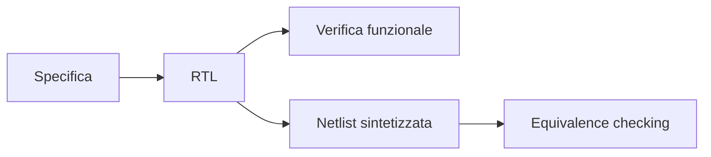
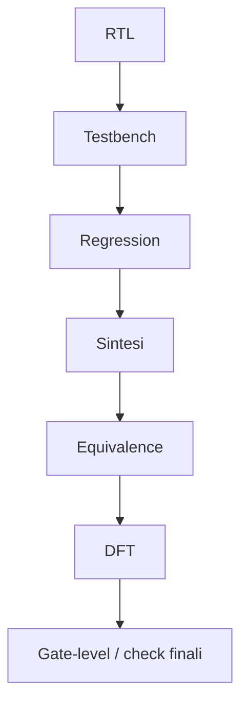
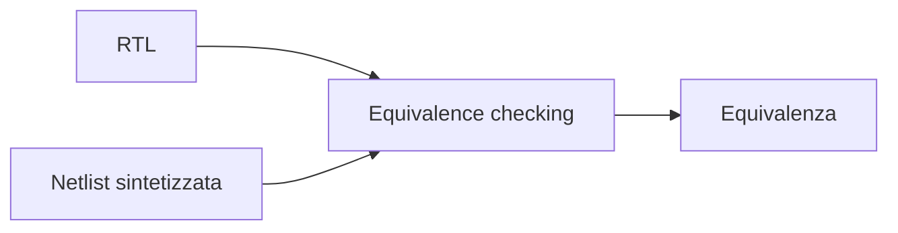

# Verifica funzionale ed equivalenza in un progetto ASIC

La **verifica** è una delle attività più importanti dell'intero flow ASIC.  
Un chip non può essere considerato pronto perché "sembra corretto" o perché il backend è concluso: deve essere verificato con metodo lungo tutte le fasi del progetto, dalla descrizione RTL fino alle trasformazioni introdotte da sintesi, DFT e implementazione fisica.

Nel contesto ASIC, la verifica non ha un solo obiettivo, ma più obiettivi complementari:

- dimostrare che l'RTL implementa la specifica;
- controllare che le interfacce funzionino correttamente;
- misurare il livello di copertura dei casi importanti;
- garantire che le trasformazioni del flow non alterino la funzionalità;
- ridurre il rischio di errori scoperti troppo tardi;
- aumentare la fiducia nel tape-out.

Per questo la verifica non è una fase isolata, ma un'attività trasversale che accompagna tutto il progetto.

---

## 1. Perché la verifica è così centrale

Nel mondo ASIC, gli errori scoperti tardi hanno un costo molto elevato.  
Un bug rimasto invisibile fino al silicio può trasformarsi in:

- malfunzionamento del chip;
- limitazioni prestazionali;
- problemi di boot o bring-up;
- re-spin costosi;
- ritardi di programma;
- perdita di affidabilità del prodotto.

Per questo motivo, la verifica è una forma di **riduzione del rischio progettuale**.

Non si tratta solo di trovare bug, ma di costruire una ragionevole fiducia nel fatto che il chip implementi correttamente la specifica in tutte le condizioni rilevanti.

---

## 2. Le due grandi dimensioni della verifica ASIC

In una sezione ASIC è utile distinguere tra due famiglie principali di verifica:

- **verifica funzionale**;
- **verifica di equivalenza**.

## 2.1 Verifica funzionale

Controlla che il comportamento descritto dall'RTL sia corretto rispetto alla specifica e ai casi d'uso previsti.

## 2.2 Verifica di equivalenza

Controlla che, dopo trasformazioni del flow come la sintesi o la DFT, il design conservi la funzionalità attesa.

Le due attività sono diverse ma strettamente collegate.

---

## 3. La verifica come attività distribuita nel flow

La verifica non si esaurisce in una singola campagna di simulazione.  
Nel flow ASIC, essa compare in più momenti.

### Fasi principali

- verifica dell'RTL;
- verifica di blocchi e sottosistemi;
- regressioni sul progetto integrato;
- verifica di strutture DFT;
- equivalence checking tra RTL e netlist;
- eventuali simulazioni gate-level o controlli aggiuntivi;
- supporto al bring-up e alla validazione post-silicon.

Questa continuità è una delle caratteristiche distintive di un flow ASIC maturo.

---

## 4. Verifica funzionale dell'RTL

La prima grande attività di verifica riguarda l'RTL.

## 4.1 Obiettivo

Dimostrare che il comportamento descritto in RTL realizzi:

- la funzione prevista;
- le interfacce attese;
- i protocolli corretti;
- i casi normali e gli error cases rilevanti.

## 4.2 Perché è fondamentale

Più bug vengono trovati a livello RTL, meno costosi saranno da correggere.

È molto più conveniente correggere:

- una FSM sbagliata;
- un reset incoerente;
- una pipeline mal allineata;
- un protocollo non rispettato;

in RTL, piuttosto che scoprirli dopo sintesi o, peggio, sul silicio.

---

## 5. Livelli di verifica funzionale

La verifica funzionale può essere pensata a più livelli.

## 5.1 Verifica di modulo

Controlla un blocco isolato, ad esempio:

- un controller;
- un datapath;
- una FIFO;
- un'interfaccia.

## 5.2 Verifica di sottosistema

Controlla l'interazione tra più blocchi che collaborano strettamente.

## 5.3 Verifica top-level

Controlla il comportamento del design integrato nel suo insieme.

Anche in ASIC, questa struttura a livelli aiuta a costruire una verifica più robusta e ordinata.

---

## 6. Testbench

Il **testbench** è l'ambiente di verifica in cui l'RTL viene stimolata e osservata.

## 6.1 Funzioni del testbench

Un testbench serve a:

- generare stimoli;
- osservare uscite e stati;
- controllare comportamenti attesi;
- automatizzare il rilevamento degli errori;
- raccogliere informazioni di coverage.

## 6.2 Qualità di un buon testbench

Un buon testbench dovrebbe essere:

- leggibile;
- riutilizzabile;
- controllabile;
- abbastanza ricco da coprire casi normali e casi limite;
- coerente con la specifica.

Il testbench è parte integrante del valore del progetto ASIC, non solo un supporto temporaneo.

---

## 7. Stimoli e scenari di test

Per verificare un design non basta applicare pochi input casuali.  
Occorre costruire scenari di test significativi.

### Tipologie utili

- casi nominali;
- casi limite;
- condizioni di errore;
- sequenze di reset;
- variazioni di configurazione;
- accessi concorrenti, se pertinenti;
- sequenze temporali realistiche.

Una buona verifica cerca di esercitare non solo ciò che il design fa "quando tutto va bene", ma anche ciò che accade quando il contesto diventa difficile o non ideale.

---

## 8. Checkers e self-checking

Un ambiente di verifica più maturo non si limita a mostrare forme d'onda: verifica attivamente la correttezza del comportamento.

Per questo si usano spesso:

- checker;
- confronti automatici;
- controlli di protocollo;
- modelli di riferimento;
- meccanismi self-checking.

### Perché sono utili

- riducono il debug manuale;
- rendono le regressioni più affidabili;
- permettono di scalare la verifica a molti test;
- migliorano la tracciabilità dei problemi.

La verifica ASIC moderna è molto più efficace quando l'ambiente di test è capace di giudicare automaticamente il comportamento del DUT.

---

## 9. Regressioni

Le **regressioni** sono esecuzioni ripetute e organizzate di insiemi di test per verificare che il progetto continui a funzionare dopo modifiche o nuove integrazioni.

## 9.1 Perché servono

Ogni modifica a RTL, vincoli o strutture di supporto può introdurre regressioni inattese.

## 9.2 Cosa contengono tipicamente

- test smoke;
- test di modulo;
- test di integrazione;
- casi critici già noti;
- test di reset e startup;
- test su error conditions.

Le regressioni permettono di mantenere fiducia nel progetto lungo tutta la sua evoluzione.

---

## 10. Coverage

La **coverage** è una misura del grado con cui il design e i casi importanti sono stati effettivamente esercitati dalla verifica.

Nel contesto ASIC, la coverage è fondamentale perché aiuta a rispondere alla domanda:

> Quanto è davvero completa la mia verifica?

---

## 11. Code coverage

La **code coverage** misura quanto dell'RTL sia stato attraversato dai test.

A livello concettuale può riguardare:

- linee;
- branch;
- condizioni;
- toggle, a seconda degli strumenti usati.

## 11.1 Utilità

Aiuta a identificare parti del design che non vengono mai esercitate.

## 11.2 Limite

Non garantisce da sola che i casi funzionalmente importanti siano stati verificati in modo adeguato.

Un'alta code coverage non equivale automaticamente a una verifica di qualità.

---

## 12. Functional coverage

La **functional coverage** misura quanto siano stati coperti i comportamenti rilevanti dal punto di vista della specifica e dell'architettura.

### Esempi

- modalità operative;
- transizioni di stato;
- configurazioni;
- combinazioni di ingressi significative;
- casi di errore;
- eventi rari ma critici.

Questa forma di coverage è spesso più vicina agli obiettivi reali del progetto rispetto alla sola code coverage.

---

## 13. Coverage closure

La **coverage closure** è il processo con cui si cerca di capire:

- quali casi importanti mancano;
- quali buchi sono reali;
- quali sono irrilevanti o impossibili;
- quali nuovi test o checker servono.

Questo processo è molto importante in ASIC, perché una verifica incompleta ma apparentemente "larga" può generare un falso senso di sicurezza.

---

## 14. Verifica di reset e inizializzazione

Un'area spesso delicata del design ASIC è il comportamento di reset.

Occorre verificare almeno:

- stato iniziale dei registri;
- correttezza dell'uscita dal reset;
- comportamento dei blocchi al primo ciclo utile;
- assenza di transizioni spurie;
- compatibilità con la sequenza architetturale prevista.

Molti problemi di silicon bring-up hanno origine proprio in dettagli di reset che non sono stati verificati con abbastanza attenzione.

---

## 15. Verifica delle interfacce e dei protocolli

Le interfacce sono uno dei punti più vulnerabili di ogni progetto.

La verifica deve controllare:

- timing funzionale del protocollo;
- handshake;
- ordine delle operazioni;
- gestione di backpressure o stall;
- sequenze di start/stop;
- condizioni d'errore;
- compatibilità con la specifica esterna.

Le interfacce sono spesso più insidiose dei blocchi interni, perché coinvolgono ipotesi temporali e semantiche condivise tra più moduli.

---

## 16. Verifica di pipeline e allineamento dei dati

Molti ASIC usano pipeline per raggiungere le prestazioni richieste.  
La verifica deve allora controllare con particolare attenzione:

- corretto allineamento dei dati tra stadi;
- allineamento dei segnali di validità;
- latenza complessiva del percorso;
- comportamento in presenza di stall, flush o reset, se previsti;
- coerenza tra controllo e datapath.

I bug di pipeline sono spesso sottili e possono passare inosservati se i test non sono strutturati con attenzione.

---

## 17. Verifica di casi limite ed error handling

Una buona verifica ASIC non si limita ai casi nominali.

Bisogna considerare anche:

- input non validi;
- sequenze inaspettate ma plausibili;
- reset durante attività;
- valori limite;
- saturazioni;
- overflow/underflow;
- error flags;
- recovery dopo condizioni anomale.

Questa parte è particolarmente importante perché i chip reali non operano sempre in condizioni ideali.

---

## 18. Equivalence checking

La **verifica di equivalenza** controlla che due rappresentazioni del design siano logicamente equivalenti.

È una parte cruciale del flow ASIC perché, dopo la verifica RTL, il progetto viene trasformato da fasi come:

- sintesi;
- inserzione DFT;
- eventuali ottimizzazioni successive.

Serve quindi un modo rigoroso per dimostrare che queste trasformazioni non abbiano alterato il comportamento previsto.

---

## 19. RTL vs netlist sintetizzata

Il caso più classico di equivalenza è il confronto tra:

- RTL di riferimento;
- netlist prodotta dalla sintesi.

Questo controllo è importantissimo perché:

- la sintesi può ristrutturare profondamente la logica;
- il design post-sintesi non è più leggibile come l'RTL;
- non è realistico affidarsi solo a simulazioni manuali per garantire l'equivalenza.

L'equivalence checking fornisce quindi una garanzia molto più forte e sistematica.

---

## 20. Verifica dopo DFT

Anche l'inserzione della DFT modifica il design.  
Di conseguenza, è importante verificare che:

- la funzionalità normale non sia stata alterata;
- la modalità test sia coerente;
- la netlist post-DFT resti compatibile con il comportamento atteso.

La DFT non va quindi trattata come una fase completamente separata dalla verifica: richiede anche lei controllo funzionale e, dove previsto, verifica di equivalenza.

---

## 21. Gate-level simulation

La **gate-level simulation** non sostituisce la verifica RTL, ma in alcuni flow può avere un ruolo complementare.

## 21.1 Perché esiste

Permette di osservare il comportamento del design a livello di netlist, eventualmente con ritardi annotati o con una rappresentazione più vicina alla struttura sintetizzata.

## 21.2 Utilità concettuale

Può aiutare a controllare:

- startup;
- reset;
- interazione con DFT;
- effetti strutturali della netlist;
- alcuni casi limite particolari.

A livello introduttivo, è utile sapere che la gate-level simulation esiste, ma non va vista come sostituto della verifica funzionale di qualità fatta a livello RTL.

---

## 22. Verifica e DFT

La verifica deve tenere conto anche delle strutture di test.

Aspetti rilevanti:

- correttezza della modalità scan;
- assenza di interferenze sulla modalità funzionale;
- coerenza di reset e clock in modalità test;
- comportamento dei segnali di test.

Questa attenzione è importante perché la testabilità è parte integrante del successo del chip.

---

## 23. Verifica e backend

Anche se la verifica funzionale nasce a livello RTL, il backend influenza il progetto in modi che non possono essere ignorati.

Ad esempio:

- la CTS cambia il comportamento del clock dal punto di vista fisico;
- il routing introduce parassitici;
- il signoff temporale rivela problemi non visibili nelle prime fasi;
- alcuni bug di reset o startup emergono solo in contesti più realistici.

Per questo la verifica ASIC richiede continuità lungo il flow, e non può essere pensata come attività confinata ai primi test di RTL.

---

## 24. Errori frequenti nella verifica ASIC

Tra gli errori più comuni:

- fermarsi ai pochi test nominali che "sembrano funzionare";
- confondere simulazione con copertura reale della specifica;
- trascurare reset e startup;
- non costruire regressioni robuste;
- guardare solo la code coverage;
- ignorare i casi limite e gli error paths;
- non eseguire equivalence checking dopo le trasformazioni critiche;
- pensare che il backend non abbia alcuna implicazione sulla verifica complessiva del progetto.

---

## 25. Buone pratiche concettuali

Una buona strategia di verifica ASIC tende a seguire questi principi:

- partire dalla specifica;
- verificare a più livelli;
- automatizzare i controlli il più possibile;
- costruire testbench leggibili e riusabili;
- usare regressioni in modo sistematico;
- usare coverage come guida e non come semplice numero da mostrare;
- integrare l'equivalence checking nel flow;
- trattare la verifica come attività continua fino al signoff.

---

## 26. Collegamento con FPGA

Molti principi della verifica RTL sono comuni anche in FPGA:

- testbench;
- regressioni;
- coverage;
- verifica di protocolli e reset.

Tuttavia, in ASIC il ruolo della verifica è ancora più critico, perché il costo di un errore che arriva al silicio è molto più alto.

Studiare la verifica ASIC rende quindi più maturo anche l'approccio alla verifica in FPGA.

---

## 27. Collegamento con SoC

Nel contesto SoC, la verifica si estende a livello di sistema:

- CPU;
- memorie;
- periferiche;
- software di bring-up;
- DMA;
- interconnect.

Nel contesto ASIC, invece, il focus è più forte sulla correttezza del blocco, sulla coerenza delle trasformazioni del flow e sulla prontezza del design per il tape-out.

Le due prospettive sono complementari: la cultura SoC amplia la verifica verso il sistema, mentre la cultura ASIC ne rafforza la disciplina lungo il flow di implementazione.

---

## 28. Esempio concettuale

Immaginiamo un piccolo acceleratore ASIC con:

- FSM di controllo;
- pipeline a tre stadi;
- registri di configurazione;
- segnale `done`;
- reset sincrono.

Una buona verifica dovrebbe controllare almeno:

- correttezza funzionale del calcolo;
- sequenza di start e completamento;
- comportamento di reset;
- allineamento tra dati e segnali di validità;
- casi di configurazione errata;
- equivalenza tra RTL e netlist sintetizzata.

Questo esempio mostra bene che la verifica ASIC non si limita a "vedere se esce qualcosa", ma costruisce una fiducia strutturata nel comportamento del design.

---

## 29. In sintesi

La verifica ASIC è l'insieme delle attività che dimostrano la correttezza del progetto lungo tutto il flow.

Le componenti principali sono:

- verifica funzionale dell'RTL;
- regressioni e coverage;
- verifica di reset, interfacce e casi limite;
- equivalence checking tra RTL e netlist;
- controlli aggiuntivi sulle trasformazioni del flow.

Un progetto ASIC robusto non nasce soltanto da una buona architettura o da un buon backend, ma anche da una verifica rigorosa, continua e ben strutturata.

---

## Prossimo passo

Dopo la verifica, il passo successivo naturale è approfondire il tema delle **librerie standard-cell e del PDK**, cioè il contesto tecnologico che rende possibile la sintesi, il backend e la realizzazione fisica del chip.
