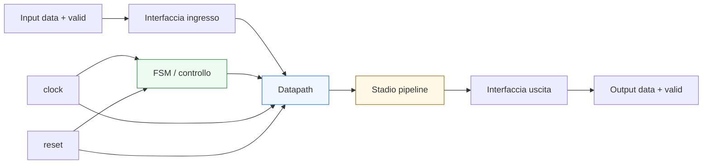
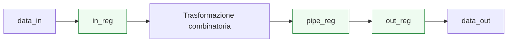

# Caso di studio introduttivo

Dopo aver costruito l’intero percorso dei **Fondamenti di progettazione microelettronica digitale** — dai segnali e dalla logica combinatoria fino a RTL, verifica, integrazione di sistema e contesti FPGA/ASIC/SoC — il passo conclusivo naturale è raccogliere questi concetti in un **caso di studio unitario**. L’obiettivo di questa pagina non è introdurre nuovi argomenti isolati, ma mostrare come le idee fondamentali della sezione collaborino davvero in un piccolo progetto coerente.

Nel corso della sezione abbiamo affrontato:
- segnali, bit e rappresentazione dell’informazione;
- logica combinatoria e logica sequenziale;
- clock, reset e tempo;
- registri, mux e datapath;
- FSM e controllo;
- pipeline, latenza e throughput;
- interfacce e handshake;
- passaggio dal comportamento all’RTL;
- sintesi, area e timing;
- verifica di base e debug;
- integrazione dal blocco al sistema;
- differenze tra contesto FPGA, ASIC e SoC.

Questa pagina li ricompone in un esempio unico con taglio:
- didattico ma tecnico;
- architetturale;
- orientato alla comprensione del comportamento e non alla sola sintassi;
- utile come ponte verso VHDL, Verilog, SystemVerilog, FPGA, ASIC e SoC.

Il caso di studio proposto non vuole essere un progetto industriale completo, ma un esempio abbastanza ricco da mostrare come un blocco digitale venga pensato, organizzato, verificato e collocato in un contesto reale.

## 1. Obiettivo del caso di studio

Per chiudere bene la sezione conviene scegliere un blocco che sia:
- abbastanza semplice da restare leggibile;
- abbastanza ricco da far emergere i concetti fondamentali;
- abbastanza realistico da mostrare il legame tra comportamento, microarchitettura, timing e verifica.

### 1.1 Il blocco scelto
Consideriamo un piccolo **modulo di elaborazione dati con controllo di validità**, che:
- riceve una parola dati in ingresso;
- la cattura quando l’ingresso è valido;
- applica una trasformazione selezionabile;
- attraversa uno stadio pipeline;
- produce un’uscita registrata;
- segnala quando l’uscita è valida.

### 1.2 Perché è un buon esempio
Questo blocco permette di far emergere in modo naturale:
- segnali e informazione;
- registri e cammino del dato;
- controllo e FSM;
- pipeline e latenza;
- interfacce e handshake semplice;
- sintesi e timing;
- verifica e debug.

### 1.3 Che cosa vogliamo mostrare
L’obiettivo non è il valore numerico della trasformazione in sé, ma il modo in cui un comportamento diventa:
- microarchitettura;
- blocco RTL;
- oggetto di verifica;
- componente di sistema.

---

## 2. Descrizione funzionale del blocco

Prima di parlare di registri e controllo, conviene chiarire il comportamento atteso a livello funzionale.

### 2.1 Funzione generale
Il blocco:
- aspetta un dato in ingresso accompagnato da un segnale di validità;
- cattura il dato;
- applica una trasformazione semplice;
- produce il risultato dopo una latenza definita;
- segnala che l’uscita è valida.

### 2.2 Esempio di trasformazioni possibili
In base a un segnale `mode`, il blocco può eseguire una delle seguenti operazioni:
- pass-through;
- NOT bitwise;
- mascheramento;
- XOR con una costante.

### 2.3 Perché è importante
Questa descrizione è ancora comportamentale: dice **che cosa** il blocco deve fare, ma non dice ancora **come** organizzeremo il dato e il controllo.

---

## 3. Ingressi, uscite e significato dei segnali

Il primo passo architetturale è chiarire l’interfaccia del blocco.

### 3.1 Ingressi principali
- `clk`
- `reset`
- `data_in`
- `in_valid`
- `mode`

### 3.2 Uscite principali
- `data_out`
- `out_valid`

### 3.3 Significato
- `data_in` porta la parola dati da elaborare;
- `in_valid` dice se quel dato è significativo;
- `mode` seleziona la trasformazione;
- `data_out` porta il risultato;
- `out_valid` dice se il risultato è pronto e significativo.

### 3.4 Perché è importante
Già da qui si vede che l’interfaccia non è solo un elenco di segnali: è un contratto che combina:
- dato;
- validità del dato;
- significato temporale dell’elaborazione.

---

## 4. Lettura in termini di informazione

Uno dei primi fondamenti della sezione era capire che i bit non “si spiegano da soli”.

### 4.1 Dato
`data_in` e `data_out` rappresentano parole che hanno significato come contenuto informativo.

### 4.2 Controllo
`mode`, `in_valid` e `out_valid` sono segnali che governano il significato e l’uso del dato.

### 4.3 Perché è importante
Questo esempio mostra bene la distinzione tra:
- contenuto del dato;
- segnali che ne definiscono il ruolo nel comportamento del blocco.

---

## 5. Dal comportamento alla microarchitettura

Una volta chiarita la funzione, bisogna decidere come realizzarla.

### 5.1 Domande architetturali
- dove memorizziamo il dato in ingresso?
- la trasformazione avviene in uno o più stadi?
- come tracciamo la validità del dato lungo il percorso?
- serve una FSM oppure basta un controllo più semplice?
- vogliamo un’uscita registrata?

### 5.2 Scelta adottata
Per questo caso di studio scegliamo una microarchitettura con:
- registro di input;
- logica combinatoria di trasformazione;
- un registro pipeline;
- uscita registrata;
- controllo semplice della validità del dato.

### 5.3 Perché è una buona scelta didattica
Permette di vedere con chiarezza:
- i registri;
- la logica combinatoria;
- la pipeline;
- il cammino del dato;
- il ruolo dei segnali di validità.

---

## 6. Datapath del blocco

Il datapath è la parte che trasporta e trasforma il dato.

### 6.1 Elementi principali
- `in_reg`: registro di input;
- `op_result`: risultato combinatorio della trasformazione;
- `pipe_reg`: registro intermedio di pipeline;
- `out_reg`: registro di uscita.

### 6.2 Flusso del dato
Il dato:
- entra;
- viene catturato in `in_reg`;
- attraversa la logica di trasformazione;
- viene memorizzato in `pipe_reg`;
- viene portato in uscita tramite `out_reg`.

### 6.3 Perché è importante
Questo rende il percorso dati leggibile come vera struttura architetturale, non come funzione astratta.

---

## 7. Logica combinatoria della trasformazione

Il cuore funzionale del blocco è la trasformazione applicata al dato.

### 7.1 Esempio concettuale
In base a `mode`, possiamo avere:
- `00` → `op_result = in_reg`
- `01` → `op_result = not in_reg`
- `10` → `op_result = in_reg and mask`
- `11` → `op_result = in_reg xor const`

### 7.2 Perché è importante
Questo mostra il ruolo della logica combinatoria nel datapath:
- il dato viene trasformato;
- la funzione dipende dagli ingressi attuali del blocco combinatorio;
- non c’è ancora memoria dentro questa parte.

### 7.3 Collegamento con la sezione
Qui riemergono:
- logica combinatoria;
- multiplexer impliciti nella selezione;
- rappresentazione del dato;
- funzione del controllo sul percorso dati.

---

## 8. Il ruolo dei registri

I registri sono i punti che strutturano il tempo del blocco.

### 8.1 `in_reg`
Cattura il dato in ingresso quando questo è valido.

### 8.2 `pipe_reg`
Introduce uno stadio pipeline e separa temporalmente la trasformazione dalla fase successiva.

### 8.3 `out_reg`
Rende l’uscita stabile e leggibile come uscita registrata.

### 8.4 Perché è importante
I registri:
- memorizzano informazione;
- delimitano il cammino combinatorio;
- introducono latenza;
- rendono il comportamento leggibile in cicli.

---

## 9. Pipeline del caso di studio

La presenza di `pipe_reg` rende il blocco un piccolo esempio di pipeline.

### 9.1 Che cosa significa
La trasformazione del dato non si conclude nello stesso passo in cui il dato entra, ma attraversa almeno uno stadio intermedio.

### 9.2 Effetti
- si riduce il carico combinatorio di un singolo tratto;
- aumenta la latenza;
- cresce il numero di registri;
- bisogna allineare il segnale `out_valid`.

### 9.3 Perché è importante
Il caso di studio mostra così in forma concreta il compromesso tra:
- timing;
- latenza;
- area;
- chiarezza del flusso del dato.

---

## 10. Controllo del blocco

Il controllo in questo esempio può essere volutamente semplice.

### 10.1 Che cosa governa
- il caricamento del registro di input;
- la propagazione della validità del dato;
- la presenza di un risultato significativo in uscita.

### 10.2 Serve una FSM completa?
Per questo esempio base, si può anche adottare un controllo semplice a segnali, senza una FSM complessa.

### 10.3 Perché è importante
Mostra una lezione importante del corso: non ogni blocco richiede una FSM articolata. La forma del controllo dipende dal comportamento reale del modulo.

---

## 11. Validità del dato lungo il percorso

Uno degli aspetti più importanti del caso di studio è il tracciamento della validità.

### 11.1 Perché serve
Il dato può attraversare più registri, ma il sistema deve anche sapere:
- quando quel dato è significativo;
- quando il risultato in uscita corrisponde davvero a un input valido precedente.

### 11.2 Come si può leggere
`in_valid` viene propagato logicamente insieme al dato e porta alla generazione di `out_valid` con la latenza corretta.

### 11.3 Perché è importante
Questo collega direttamente:
- interfacce;
- handshake semplificato;
- pipeline;
- osservazione del comportamento nel tempo.

---

## 12. Lettura temporale del blocco

Questo caso di studio va letto anche in termini di cicli.

### 12.1 Esempio intuitivo
- ciclo 0: `data_in` valido viene catturato;
- ciclo 1: il risultato combinatorio viene registrato in `pipe_reg`;
- ciclo 2: il dato compare su `out_reg` ed è accompagnato da `out_valid`.

### 12.2 Perché è importante
Mostra molto chiaramente:
- la latenza del blocco;
- il ruolo dei registri;
- la differenza tra dato presente e dato disponibile in uscita.

### 12.3 Messaggio progettuale
Il blocco non va letto solo come “trasformazione”, ma come sequenza temporale organizzata.

---

## 13. Passaggio all’RTL

Questo esempio è un ottimo ponte verso la modellazione RTL.

### 13.1 Che cosa si vedrebbe in RTL
- registri di input, pipeline e uscita;
- logica combinatoria della trasformazione;
- segnali di validità;
- eventuale controllo del caricamento dei registri.

### 13.2 Perché è importante
Mostra il significato del livello RTL:
- non solo descrizione della funzione;
- ma organizzazione concreta di stato, combinatoria e flusso del dato.

### 13.3 Collegamento con il corso
Questa pagina chiude bene il branch proprio perché ricompone molti concetti in una struttura che è già quasi un piccolo modulo RTL completo.

---

## 14. Lettura in termini di sintesi

Dal punto di vista della sintesi, questo blocco è molto istruttivo.

### 14.1 Che cosa verrebbe inferito
- registri;
- logica combinatoria di selezione e trasformazione;
- eventuale logica per `out_valid`;
- connessioni tra gli stadi.

### 14.2 Perché è importante
Mostra che la sintesi non “inventa” il blocco, ma legge una struttura già implicita nella microarchitettura.

### 14.3 Conseguenza
Se il progetto è leggibile architetturalmente, la sintesi sarà anche più prevedibile.

---

## 15. Lettura in termini di area

Anche l’area si può leggere facilmente su questo esempio.

### 15.1 Che cosa contribuisce all’area
- registri `in_reg`, `pipe_reg`, `out_reg`;
- logica di trasformazione;
- eventuale rete per i segnali di validità.

### 15.2 Perché è importante
Il caso di studio mostra che anche una pipeline piccola ha già un costo architetturale.

### 15.3 Compromesso osservabile
Si è scelto di introdurre più registri per rendere il blocco:
- più ordinato temporalmente;
- più adatto al timing;
- più semplice da leggere come pipeline.

---

## 16. Lettura in termini di timing

Anche il timing emerge in modo naturale.

### 16.1 Percorso rilevante
Uno dei percorsi principali è:
- `in_reg` → logica di trasformazione → `pipe_reg`

### 16.2 Perché è importante
È questo tipo di tratto che il progettista deve leggere come possibile cammino critico.

### 16.3 Perché la pipeline aiuta
Il registro intermedio spezza il percorso e rende più gestibile la profondità combinatoria.

---

## 17. Verifica del caso di studio

Questo blocco si presta molto bene a una verifica di base.

### 17.1 Che cosa verificare
- reset iniziale;
- corretto caricamento del dato in ingresso;
- corretta trasformazione per ogni `mode`;
- corretta latenza di `data_out`;
- corretta attivazione di `out_valid`;
- assenza di uscita valida quando non c’è stato input valido.

### 17.2 Stimoli utili
- dati validi in sequenza;
- dati con modi diversi;
- cicli senza `in_valid`;
- reset nel mezzo della prova;
- casi limite sul contenuto del dato.

### 17.3 Perché è importante
Mostra bene il legame tra:
- comportamento funzionale;
- pipeline;
- protocollo di validità;
- osservazione temporale.

---

## 18. Debug del caso di studio

Il caso di studio è anche molto adatto a una lettura orientata al debug.

### 18.1 Segnali utili da osservare
- `clk`
- `reset`
- `data_in`
- `in_valid`
- `mode`
- `in_reg`
- `op_result`
- `pipe_reg`
- `out_reg`
- `out_valid`

### 18.2 Che cosa si può capire
- se il dato è stato catturato correttamente;
- in quale stadio si rompe la trasformazione;
- se la latenza è quella attesa;
- se `out_valid` è allineato al risultato.

### 18.3 Perché è importante
Mostra come microarchitettura leggibile e debug leggibile vadano molto spesso insieme.

---

## 19. Lettura a livello di sistema

Anche se il caso di studio è piccolo, può già essere letto come blocco inseribile in una catena più ampia.

### 19.1 A monte
Può esserci un producer che fornisce `data_in` e `in_valid`.

### 19.2 A valle
Può esserci un consumer che legge `data_out` quando `out_valid` è attivo.

### 19.3 Perché è importante
Il modulo non è solo un esercizio locale, ma un piccolo componente di sistema con:
- interfaccia;
- latenza;
- contratto di validità;
- comportamento temporale definito.

---

## 20. Lettura nei diversi contesti applicativi

Il caso di studio può essere riletto anche nei contesti FPGA, ASIC e SoC.

### 20.1 In FPGA
Il progettista guarderebbe soprattutto:
- chiusura del timing;
- semplicità del mapping;
- facilità di debug;
- praticità del prototipo.

### 20.2 In ASIC
Guarderebbe con più severità:
- numero di registri;
- costo della pipeline;
- pulizia dell’RTL;
- rigore dei segnali di validità;
- qualità del cammino combinatorio.

### 20.3 In SoC
Guarderebbe anche:
- compatibilità dell’interfaccia;
- latenza osservabile a livello di sistema;
- componibilità del blocco;
- integrazione in una catena di moduli.

### 20.4 Perché è importante
Mostra che lo stesso blocco si può leggere con priorità diverse a seconda del contesto finale.

---

## 21. Che cosa insegna questo caso di studio

Questa pagina non serve solo a “riassumere la sezione”, ma a mostrare alcune lezioni forti.

### 21.1 Il progetto digitale è organizzazione del comportamento nel tempo
Non solo trasformazione logica.

### 21.2 Datapath e controllo sono i due lati della microarchitettura
Anche quando il controllo è semplice, è sempre presente.

### 21.3 La pipeline non è solo una tecnica di timing
È anche una scelta architetturale sul flusso dell’informazione.

### 21.4 Interfaccia e validità del dato sono parte del progetto
Non dettagli finali.

### 21.5 Verifica e debug nascono più facili quando l’architettura è leggibile
Buona struttura e buona osservabilità si rafforzano a vicenda.

---

## 22. In sintesi

Questo caso di studio mostra come un piccolo blocco digitale possa già ricomporre quasi tutti i fondamenti della progettazione microelettronica digitale:
- segnali e contenuto informativo;
- logica combinatoria e registri;
- tempo, cicli e latenza;
- datapath e controllo;
- pipeline;
- interfacce e validità del dato;
- lettura in termini di sintesi, area e timing;
- verifica e debug;
- integrazione di sistema;
- sensibilità diverse in FPGA, ASIC e SoC.

Il valore della sezione emerge proprio qui: non nel singolo concetto isolato, ma nella capacità di usarlo per leggere e costruire una microarchitettura digitale coerente.

## Prossimo passo

Il passo successivo più utile, adesso che il branch è completo, è preparare:
- il **nav completo della sezione** in formato MkDocs;
oppure
- una **rifinitura finale dell’`index.md`** per allinearlo perfettamente al percorso effettivamente costruito.
