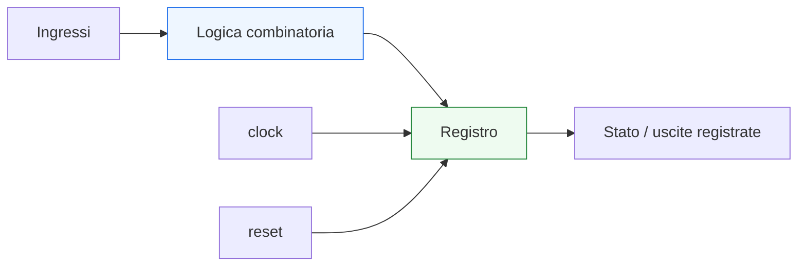
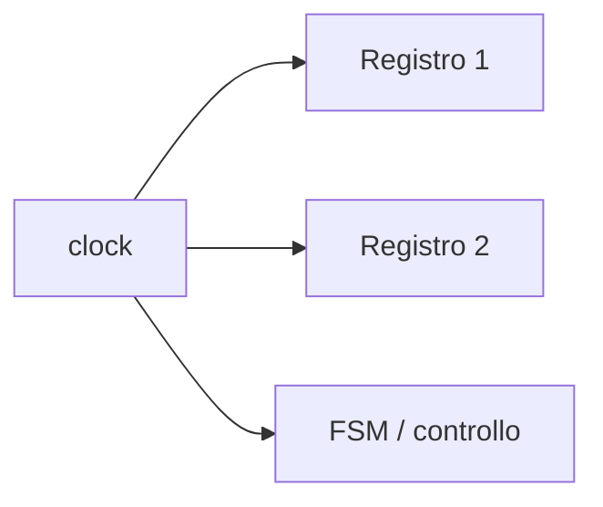
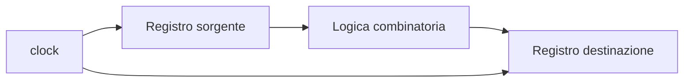
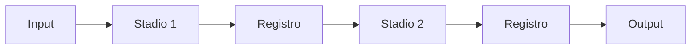

# Clock, reset e tempo nei circuiti digitali

Dopo aver introdotto la **logica combinatoria** e la **logica sequenziale**, il passo successivo naturale è approfondire il tema che rende davvero comprensibile il comportamento dei sistemi digitali nel tempo: il rapporto tra **clock**, **reset** e **evoluzione temporale** del circuito.

Questa pagina è molto importante perché molti concetti della progettazione digitale — registri, FSM, pipeline, latenza, throughput, verifica, timing — diventano davvero chiari solo quando si capisce in che modo il sistema venga organizzato temporalmente. In altre parole, non basta sapere che un circuito ha memoria: bisogna anche capire:
- quando lo stato viene aggiornato;
- quando un dato diventa significativo;
- come il circuito parte da una condizione iniziale nota;
- perché il comportamento non è solo logico, ma anche temporale.

Dal punto di vista progettuale, questa pagina serve a chiarire:
- che cos’è il clock e quale ruolo ha;
- che cos’è il reset e perché è necessario;
- che cosa significa ragionare in termini di cicli;
- come il tempo strutturi il comportamento di un blocco digitale;
- perché i sistemi sincronizzati siano così importanti nella progettazione reale.

Questa pagina mantiene il taglio della sezione:
- didattico ma tecnico;
- concettuale ma vicino al progetto reale;
- orientato alla lettura dell’hardware;
- accompagnato da schemi ed esempi quando utili.

## 1. Perché serve una pagina su clock, reset e tempo

La prima domanda utile è: perché questo tema merita una trattazione dedicata?

### 1.1 Perché il comportamento digitale non è solo “valori”
Un circuito digitale non è una tabella statica. È un sistema che evolve nel tempo:
- acquisisce dati;
- aggiorna lo stato;
- produce uscite;
- attraversa fasi diverse del comportamento.

### 1.2 Perché il tempo va organizzato
Se molti blocchi devono lavorare insieme, serve una struttura che dica:
- quando aggiornare i registri;
- quando considerare stabile un dato;
- quando una transizione di stato può avvenire;
- come sincronizzare comportamento e controllo.

### 1.3 Perché clock e reset sono fondamentali
Il clock organizza il ritmo del sistema.  
Il reset definisce la condizione iniziale da cui il sistema parte o a cui può essere riportato.

---

## 2. Che cos’è il clock

Il **clock** è il segnale temporale che sincronizza il comportamento delle parti sequenziali di un sistema digitale.

### 2.1 Significato essenziale
Nei circuiti sincroni, il clock stabilisce gli istanti in cui:
- i registri aggiornano il loro contenuto;
- lo stato del sistema può avanzare;
- il comportamento viene scandito in passi temporali ordinati.

### 2.2 Perché è importante
Senza una base temporale condivisa, diventerebbe molto più difficile coordinare:
- registri;
- FSM;
- pipeline;
- flusso dei dati;
- controllo.

### 2.3 Visione intuitiva
Il clock può essere visto come il “battito” del sistema digitale.

---

## 3. Perché il clock è così utile

Il valore del clock non sta nel segnale in sé, ma nel fatto che impone una disciplina temporale comune.

### 3.1 Che cosa permette
Permette di dire:
- “ora campiono il dato”
- “ora aggiorno lo stato”
- “ora faccio avanzare la pipeline”
- “ora il risultato diventa disponibile nel nuovo ciclo”

### 3.2 Perché è importante
Questa struttura temporale rende il progetto:
- più leggibile;
- più verificabile;
- più modulare;
- più adatto a essere costruito come insieme di blocchi coordinati.

### 3.3 Conseguenza progettuale
Il progettista può ragionare non solo per segnali, ma anche per **cicli di clock**.

---

## 4. Che cos’è un ciclo di clock

Un **ciclo di clock** è l’intervallo temporale tra due eventi equivalenti del clock, tipicamente tra due fronti consecutivi.

### 4.1 Perché è utile questa idea
Molti sistemi digitali si descrivono meglio dicendo:
- che cosa accade in un certo ciclo;
- in quale ciclo compare l’uscita;
- dopo quanti cicli una FSM cambia stato;
- dopo quanti cicli un dato attraversa una pipeline.

### 4.2 Che cosa permette
Permette di ragionare in termini di:
- latenza;
- sequenza delle operazioni;
- allineamento tra controllo e dati;
- verifica temporale del comportamento.

### 4.3 Perché è importante
Il ciclo di clock è una delle unità concettuali più utili dell’intero progetto digitale sincrono.

---

## 5. Fronti di clock

Il clock è spesso interpretato tramite i suoi **fronti**, cioè gli istanti di transizione.

### 5.1 Tipi di fronte
In generale si distinguono:
- fronte di salita;
- fronte di discesa.

### 5.2 Perché sono importanti
Nei sistemi sincronizzati, i registri vengono spesso aggiornati in corrispondenza di uno specifico fronte, tipicamente il fronte di salita.

### 5.3 Significato progettuale
Questo significa che:
- il dato viene osservato;
- il nuovo stato viene catturato;
- il sistema avanza;

in corrispondenza di istanti ben definiti.

---

## 6. Clock e aggiornamento dello stato

Una delle funzioni più importanti del clock è scandire l’aggiornamento dello stato.

### 6.1 Che cosa significa
Un registro o una FSM non cambiano continuamente come la logica combinatoria. Aggiornano il loro contenuto in corrispondenza dei fronti di clock previsti.

### 6.2 Perché è importante
Questo rende il comportamento sequenziale:
- ordinato;
- prevedibile;
- verificabile;
- più facile da integrare con altri blocchi.

### 6.3 Messaggio chiave
Il clock non trasporta informazione utile del datapath, ma organizza **quando** il sistema può cambiare stato.

---

## 7. Clock e logica combinatoria

È importante chiarire che il clock non governa direttamente la logica combinatoria.

### 7.1 Che cosa significa
La logica combinatoria continua a dipendere dagli ingressi attuali e a produrre una risposta in funzione della propria rete.

### 7.2 Dove interviene il clock
Il clock interviene quando quella logica alimenta:
- un registro;
- uno stato di controllo;
- un dato che deve essere memorizzato;
- uno stadio pipeline.

### 7.3 Perché è importante
Questo mostra il modello fondamentale dei sistemi sincroni:

**registro → logica combinatoria → registro**

---

## 8. Il modello temporale base del circuito sincrono

Uno dei modelli più utili da fissare è proprio questo.

### 8.1 Struttura concettuale

### 8.2 Che cosa mostra
- il dato parte da un registro;
- attraversa una rete combinatoria;
- viene catturato dal registro successivo.

### 8.3 Perché è fondamentale
Gran parte del progetto digitale sincrono si lascia leggere proprio attraverso questo schema.

---

## 9. Che cos’è il reset

Il **reset** è il meccanismo con cui un circuito viene portato in una condizione iniziale nota.

### 9.1 Perché serve
Se un circuito contiene stato, bisogna stabilire:
- da quale stato iniziare;
- quale valore abbiano i registri all’avvio;
- come riportare il sistema a una condizione controllata dopo un evento di riavvio o recovery.

### 9.2 Che cosa fa
Tipicamente il reset:
- azzera registri;
- forza uno stato iniziale della FSM;
- porta il blocco in una configurazione definita;
- evita ambiguità all’avvio.

### 9.3 Perché è importante
Senza reset o senza una strategia di inizializzazione chiara, il comportamento iniziale del sistema può diventare poco controllabile o ambiguo.

---

## 10. Reset come condizione iniziale del sistema

Il reset non è solo una “pulizia tecnica”, ma una parte del significato del progetto.

### 10.1 Che cosa stabilisce
Stabilisce:
- dove inizia la macchina;
- quale valore hanno i registri;
- se il modulo è pronto o inattivo;
- quali segnali di validità partono a zero;
- da quale fase operativa il sistema prende avvio.

### 10.2 Perché è importante
In molti moduli il reset definisce la forma stessa del comportamento iniziale del DUT.

### 10.3 Esempio intuitivo
Una FSM può avere:
- `IDLE` come stato di reset;
- uscite disattivate;
- registri dati inizializzati a zero.

---

## 11. Reset e leggibilità del progetto

Un buon progetto rende il reset leggibile a colpo d’occhio.

### 11.1 Perché
Se il reset è chiaro, si capisce subito:
- come parte il modulo;
- quali stati o registri vengono inizializzati;
- quale sia la condizione “sicura” del circuito.

### 11.2 Perché è utile
Questo migliora:
- integrazione;
- verifica;
- debug;
- comprensione architetturale del blocco.

### 11.3 Conseguenza progettuale
Reset e clock sono due segnali che andrebbero sempre letti come parte della struttura fondamentale del modulo.

---

## 12. Tempo logico e comportamento del circuito

Nel progetto digitale è utile distinguere tra:
- tempo fisico;
- tempo logico del comportamento.

### 12.1 Tempo fisico
È il tempo reale del circuito, con propagazioni, ritardi e frequenza di clock.

### 12.2 Tempo logico
È il modo in cui il progettista ragiona in termini di:
- cicli;
- stati;
- fasi;
- latenza;
- ordine delle operazioni.

### 12.3 Perché è importante
Questo permette di progettare moduli in modo leggibile e astratto, pur restando coerenti con il comportamento reale del sistema.

---

## 13. Tempo e latenza

Quando il comportamento del circuito si sviluppa su più cicli, compare la **latenza**.

### 13.1 Che cos’è
È il numero di cicli o l’intervallo temporale tra:
- applicazione dell’ingresso;
- disponibilità del risultato.

### 13.2 Perché è importante
La latenza dipende spesso proprio da:
- numero di registri attraversati;
- presenza di FSM;
- pipeline;
- organizzazione del controllo.

### 13.3 Perché il clock conta qui
La latenza si misura molto spesso in cicli di clock.

---

## 14. Tempo e throughput

Oltre alla latenza, è utile introdurre anche il concetto di **throughput**.

### 14.1 Che cos’è
È la quantità di risultati o dati che il sistema riesce a produrre in una certa unità di tempo o per ciclo.

### 14.2 Perché è importante
Un blocco può avere:
- latenza alta;
- ma throughput elevato;

se, per esempio, è ben pipelinato.

### 14.3 Perché rientra in questa pagina
Perché clock e organizzazione temporale influenzano sia il tempo di risposta sia la capacità complessiva del sistema di processare dati.

---

## 15. Tempo e pipeline

La pipeline è uno dei modi più chiari di vedere il ruolo del tempo nel progetto digitale.

### 15.1 Che cosa significa
Il calcolo viene suddiviso in più stadi, separati da registri.

### 15.2 Che cosa mostra
- il tempo viene segmentato;
- il dato avanza per passi;
- ogni registro delimita uno stadio temporale.

### 15.3 Perché è importante
Mostra che il tempo non è solo “quando accade qualcosa”, ma anche una vera risorsa architetturale del progetto.

---

## 16. Tempo e verifica

Il comportamento temporale del circuito ha un impatto diretto anche sul testbench e sulla simulazione.

### 16.1 Perché
Nella verifica bisogna sapere:
- quando applicare uno stimolo;
- quando osservare il risultato;
- in quale ciclo ci si aspetta una certa uscita;
- quando il reset deve essere rilasciato;
- quando la FSM dovrebbe cambiare stato.

### 16.2 Perché è importante
Molti errori di verifica non derivano da valori sbagliati, ma da controlli fatti nel momento sbagliato.

### 16.3 Conseguenza
Capire clock, reset e tempo è essenziale anche per costruire testbench corretti.

---

## 17. Esempio concettuale: dato campionato al clock

Immaginiamo un blocco che riceve `data_in` e lo memorizza in un registro.

### 17.1 Che cosa succede
Il dato non diventa automaticamente “stato del sistema” solo perché è presente in ingresso.

### 17.2 Quando diventa stato
Diventa stato quando il registro lo campiona al fronte di clock previsto.

### 17.3 Perché è importante
Questo distingue chiaramente:
- presenza del dato;
- acquisizione del dato;
- uso futuro del dato memorizzato.

---

## 18. Esempio concettuale: reset di una FSM

Immaginiamo una macchina a stati finiti.

### 18.1 Senza reset chiaro
Non è evidente da quale stato il sistema debba partire.

### 18.2 Con reset chiaro
Il reset porta la macchina in `IDLE`, da cui il comportamento può iniziare in modo ordinato.

### 18.3 Perché è importante
Mostra che il reset non è un dettaglio marginale, ma una parte sostanziale della definizione del comportamento.

---

## 19. Errori comuni di comprensione

Ci sono alcuni errori molto frequenti quando si studiano clock, reset e tempo.

### 19.1 Pensare che il clock “faccia i calcoli”
Il clock non esegue la funzione logica. Regola il momento in cui lo stato viene aggiornato.

### 19.2 Pensare che il reset sia solo un dettaglio tecnico
In realtà il reset definisce il comportamento iniziale del sistema.

### 19.3 Ignorare il momento in cui il dato diventa significativo
Il valore da solo non basta. Conta anche quando viene campionato o osservato.

### 19.4 Confondere latenza e throughput
Sono concetti distinti, anche se entrambi dipendono dall’organizzazione temporale del sistema.

### 19.5 Trascurare il ruolo dei cicli
Molti moduli digitali si capiscono meglio contando i cicli piuttosto che guardando solo le formule logiche.

---

## 20. Buone pratiche concettuali

Anche a questo livello introduttivo, alcune abitudini mentali sono molto utili.

### 20.1 Chiedersi sempre quando il circuito cambia stato
Questa è una delle domande più importanti per leggere un modulo sequenziale.

### 20.2 Distinguere combinatoria e istanti di campionamento
La logica può reagire continuamente, ma il sistema sincronizzato aggiorna lo stato in momenti definiti.

### 20.3 Leggere il reset come parte del comportamento
Non solo come inizializzazione tecnica.

### 20.4 Ragionare in cicli
Molti problemi diventano più chiari se letti in termini di:
- ciclo corrente;
- ciclo successivo;
- numero di cicli di latenza.

### 20.5 Collegare il tempo all’architettura
Pipeline, FSM, registri e datapath sono tutti modi di organizzare l’informazione nel tempo.

---

## 21. Collegamento con il resto della sezione

Questa pagina si collega direttamente alle prossime tappe del branch:
- **`registers-mux-and-basic-datapaths.md`**, perché registri e mux sono i primi blocchi architetturali che usano clock e stato;
- **`fsm-and-control.md`**, dove il clock scandirà il passaggio tra stati;
- **`pipelining-latency-and-throughput.md`**, dove il tempo verrà letto come risorsa architetturale;
- **`synthesis-area-and-timing.md`**, perché il tempo logico introdotto qui si collegherà poi al timing reale del progetto;
- **`basic-verification-and-debug.md`**, dove clock e reset torneranno fondamentali per la simulazione e il debug.

---

## 22. In sintesi

Clock, reset e tempo sono tre concetti fondamentali della progettazione digitale sincrona.

- Il **clock** organizza il ritmo del sistema e gli istanti di aggiornamento dello stato.
- Il **reset** porta il circuito in una condizione iniziale nota e leggibile.
- Il **tempo** dà forma al comportamento del sistema in termini di cicli, latenza, throughput ed evoluzione dello stato.

Capire bene questi concetti significa trasformare la logica sequenziale da idea astratta a comportamento temporale realmente progettato.

## Prossimo passo

Il passo successivo naturale è **`registers-mux-and-basic-datapaths.md`**, perché adesso conviene vedere come clock, stato e trasformazione dei dati si concretizzino nei primi blocchi architetturali fondamentali:
- registri
- multiplexer
- semplici percorsi dati
- controllo del flusso dell’informazione
