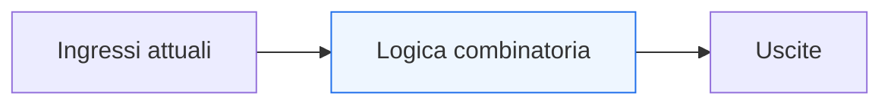
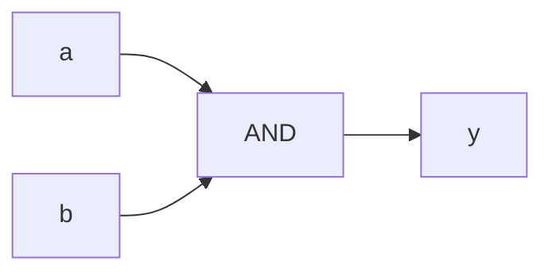
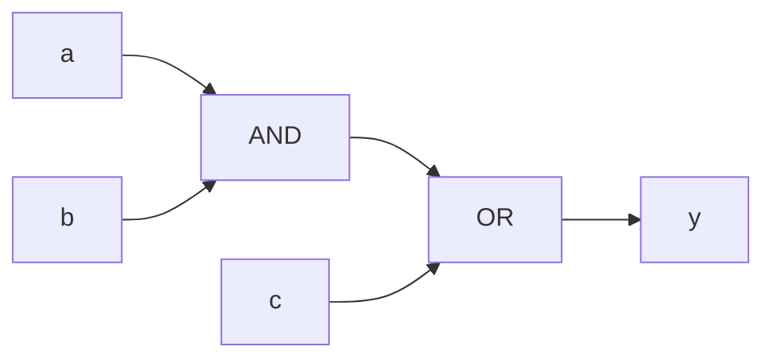
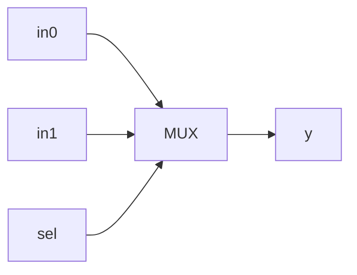

# Logica combinatoria

Dopo aver chiarito che cosa siano **segnali**, **bit** e **rappresentazione dell’informazione**, il passo successivo naturale è affrontare il primo grande modello di comportamento della progettazione digitale: la **logica combinatoria**.

Questa pagina è molto importante perché la logica combinatoria è il punto in cui l’informazione viene trasformata senza introdurre memoria del passato. È il mondo in cui:
- l’uscita dipende dagli ingressi attuali;
- non esiste stato interno persistente;
- il comportamento può essere letto come funzione logica;
- il circuito reagisce alle variazioni degli ingressi secondo la rete di porte e connessioni che lo compone.

Dal punto di vista progettuale, capire bene la logica combinatoria è essenziale per leggere:
- funzioni booleane;
- reti di selezione;
- decoder;
- comparatori;
- multiplexer;
- porzioni di datapath;
- logica di controllo locale.

Questa pagina mantiene il taglio della sezione:
- didattico ma tecnico;
- concettuale ma vicino al progetto reale;
- orientato alla lettura dell’hardware;
- accompagnato da schemi ed esempi quando utili.

## 1. Che cos’è la logica combinatoria

La **logica combinatoria** è la parte di un circuito digitale in cui l’uscita dipende solo dai valori **attuali** degli ingressi.

### 1.1 Significato essenziale
Se cambiano gli ingressi, cambia anche l’uscita in funzione della rete logica che collega quei segnali.

### 1.2 Che cosa non c’è
Nella logica combinatoria non c’è:
- memoria dello stato precedente;
- dipendenza da un clock;
- registri che conservano informazione tra un istante e l’altro.

### 1.3 Perché è importante
È il primo livello in cui si vede chiaramente come l’informazione venga trasformata nel sistema digitale.

---

## 2. Perché si chiama “combinatoria”

Il termine “combinatoria” richiama il fatto che l’uscita dipende da una **combinazione** dei valori di ingresso.

### 2.1 Esempio intuitivo
Se due ingressi valgono `a` e `b`, l’uscita può essere:
- `a and b`
- `a or b`
- `not a`
- una funzione più complessa di `a`, `b` e di altri segnali.

### 2.2 Perché è utile questa idea
Aiuta a vedere la logica combinatoria come una funzione:
- dagli ingressi;
- verso le uscite.

### 2.3 Conseguenza progettuale
Quando si studia un blocco combinatorio, la domanda naturale è:
- quale relazione esiste tra input e output?

---

## 3. Combinatoria e assenza di memoria

Una delle proprietà più importanti della logica combinatoria è l’assenza di stato persistente.

### 3.1 Che cosa significa
Se gli ingressi tornano a una certa combinazione, l’uscita torna sempre allo stesso valore corrispondente a quella combinazione.

### 3.2 Perché è importante
Questo distingue subito la logica combinatoria dalla logica sequenziale, che invece dipende anche dal passato.

### 3.3 Esempio intuitivo
Una porta AND non “ricorda” che cosa è successo un ciclo prima:
- guarda i valori presenti;
- produce la funzione corrispondente.

---

## 4. Ingressi, uscite e funzione logica

Una rete combinatoria può essere vista come una funzione logica che mappa ingressi in uscite.

### 4.1 Forma generale
Possiamo pensare a una rete come:

**uscita = f(ingressi)**

### 4.2 Che cosa significa
Il blocco non evolve in autonomia nel tempo, ma reagisce ai valori che riceve.

### 4.3 Perché è importante
Questo rende naturale rappresentare la logica combinatoria attraverso:
- espressioni booleane;
- tabelle di verità;
- schemi a blocchi;
- reti di porte.

---

## 5. Le porte logiche come mattoni elementari

I blocchi combinatori più semplici si costruiscono a partire da porte logiche elementari.

### 5.1 Esempi tipici
- AND
- OR
- NOT
- XOR

### 5.2 Perché sono importanti
Queste porte sono i mattoni di base con cui si costruiscono reti più ricche.

### 5.3 Esempio: porta AND

### 5.4 Significato
L’uscita `y` vale 1 solo quando entrambi gli ingressi sono a 1.

---

## 6. Tabella di verità

Uno dei modi più classici di descrivere la logica combinatoria è la **tabella di verità**.

### 6.1 Che cos’è
È una tabella che mostra il valore dell’uscita per ogni combinazione possibile degli ingressi.

### 6.2 Esempio: AND a due ingressi

| a | b | y |
|---|---|---|
| 0 | 0 | 0 |
| 0 | 1 | 0 |
| 1 | 0 | 0 |
| 1 | 1 | 1 |

### 6.3 Perché è utile
La tabella di verità rende esplicito il comportamento logico del blocco.

### 6.4 Limite pratico
Quando il numero di ingressi cresce, la tabella diventa rapidamente molto grande. Per questo spesso si usano anche espressioni booleane e schemi.

---

## 7. Espressioni booleane

Un altro modo molto importante di descrivere la logica combinatoria è l’uso di espressioni booleane.

### 7.1 Esempio semplice

**y = (a AND b) OR c**

### 7.2 Che cosa rappresenta
Una funzione logica che usa più operatori per combinare gli ingressi.

### 7.3 Perché è importante
Le espressioni booleane permettono di:
- descrivere il comportamento;
- ragionare sulla semplificazione della funzione;
- collegare la logica astratta allo schema del circuito.

---

## 8. Esempio: rete combinatoria semplice

Consideriamo una funzione:

**y = (a and b) or c**

### 8.1 Schema concettuale

### 8.2 Che cosa mostra
- una prima trasformazione tra `a` e `b`;
- una seconda combinazione con `c`;
- un’uscita che dipende dai valori correnti di tutti e tre gli ingressi.

### 8.3 Perché è utile
Fa vedere come una funzione anche semplice possa essere letta sia come formula sia come rete di porte.

---

## 9. Logica combinatoria e trasformazione dell’informazione

Dal punto di vista architetturale, la logica combinatoria è il luogo in cui l’informazione viene elaborata.

### 9.1 Esempi di trasformazione
- selezionare tra due valori;
- confrontare un dato;
- decodificare un codice;
- combinare flag;
- calcolare una funzione logica;
- generare una condizione di controllo.

### 9.2 Perché è importante
Questo rende la logica combinatoria centrale sia nei datapath sia nelle control unit.

### 9.3 Collegamento con il resto della sezione
Più avanti vedremo che la logica combinatoria lavora spesso:
- tra registri;
- intorno alle FSM;
- all’interno delle interfacce;
- nei percorsi critici del timing.

---

## 10. Decoder e comparatori come esempi di logica combinatoria

La logica combinatoria non si limita alle porte elementari. Molti blocchi classici appartengono a questa famiglia.

### 10.1 Decoder
Un decoder prende un ingresso codificato e attiva una o più uscite secondo una corrispondenza definita.

### 10.2 Comparatore
Un comparatore stabilisce se due valori:
- sono uguali;
- sono diversi;
- soddisfano una certa relazione.

### 10.3 Perché è importante
Mostra che la logica combinatoria può già implementare comportamenti molto utili senza introdurre memoria.

---

## 11. Il multiplexer come blocco combinatorio centrale

Uno dei blocchi combinatori più importanti in assoluto è il **multiplexer**.

### 11.1 Che cos’è
È un blocco che seleziona uno tra più ingressi e lo porta in uscita.

### 11.2 Perché è importante
Il mux compare continuamente in:
- datapath;
- controllo;
- selezione di operazioni;
- scelta del prossimo dato;
- instradamento dell’informazione.

### 11.3 Schema concettuale

### 11.4 Significato
L’uscita dipende dagli ingressi dati e dal selettore, ma sempre senza memoria.

---

## 12. Logica combinatoria e controllo locale

Anche molte condizioni di controllo sono logica combinatoria.

### 12.1 Esempi tipici
- generazione di `enable`
- selezione di `mode`
- condizioni di `valid`
- segnali di “pronto/non pronto”
- decodifica dello stato corrente per generare output

### 12.2 Perché è importante
Questo prepara molto bene al tema di FSM e control unit.

### 12.3 Messaggio progettuale
La logica combinatoria non riguarda solo dati numerici, ma anche la generazione del comportamento di controllo del sistema.

---

## 13. Logica combinatoria e datapath

Nel datapath, la logica combinatoria è la parte che trasforma realmente il dato tra due elementi di memoria.

### 13.1 Esempi tipici
- somma
- confronto
- selezione tramite mux
- mascheramento
- shift
- combinazione di campi

### 13.2 Perché è importante
Aiuta a capire che il datapath non è altro che una organizzazione di:
- registri;
- percorsi dati;
- blocchi combinatori tra essi.

### 13.3 Conseguenza
Quando il datapath cresce, la qualità della logica combinatoria diventa importante anche per il timing.

---

## 14. Logica combinatoria e tempo di propagazione

Anche se non introduce memoria, la logica combinatoria non è istantanea nel mondo reale.

### 14.1 Che cosa significa
Tra il cambiamento di un ingresso e la stabilizzazione dell’uscita esiste un certo ritardo di propagazione.

### 14.2 Perché è importante
Questo collega subito la logica combinatoria ai temi di:
- timing;
- cammino critico;
- profondità della rete;
- frequenza massima del sistema.

### 14.3 Messaggio progettuale
La logica combinatoria va letta non solo come funzione, ma anche come tratto temporale del circuito.

---

## 15. Combinatoria e profondità logica

Una rete combinatoria può essere più o meno “profonda”.

### 15.1 Che cosa significa
Una funzione semplice può attraversare pochi blocchi logici, mentre una funzione più ricca può attraversarne molti in cascata.

### 15.2 Perché è importante
Più lunga è la catena di trasformazioni:
- maggiore può essere il ritardo;
- più difficile può diventare la chiusura del timing.

### 15.3 Collegamento futuro
Questo tema sarà centrale quando parleremo di:
- registri;
- pipeline;
- cammino critico;
- sintesi e timing.

---

## 16. Logica combinatoria e assenza di clock

Un’altra proprietà importante da fissare bene è che la logica combinatoria, di per sé, non è governata da un clock.

### 16.1 Che cosa significa
Non esiste un fronte di clock che “aggiorna” la funzione combinatoria.

### 16.2 Come va letta
La rete reagisce ai valori attuali degli ingressi secondo la propria struttura.

### 16.3 Perché è importante
Questo distingue nettamente la logica combinatoria dalla logica sequenziale, che invece ha bisogno di una base temporale per memorizzare e aggiornare lo stato.

---

## 17. Esempio concettuale: blocco di selezione dati

Immaginiamo un piccolo blocco con:
- due ingressi dati `a` e `b`;
- un selettore `sel`;
- una uscita `y`.

### 17.1 Funzione
Il blocco invia in uscita:
- `a` quando `sel = 0`
- `b` quando `sel = 1`

### 17.2 Perché è utile
Mostra un comportamento molto comune nei sistemi digitali:
- non si crea nuova informazione;
- si seleziona una sorgente;
- la relazione è puramente combinatoria.

### 17.3 Significato progettuale
Questa operazione è alla base di molti percorsi dati e di molte scelte architetturali.

---

## 18. Errori comuni di comprensione

Ci sono alcuni errori molto frequenti quando si inizia a studiare la logica combinatoria.

### 18.1 Pensare che combinatorio significhi “semplice”
In realtà anche reti molto articolate possono essere combinatorie.

### 18.2 Pensare che tutto ciò che cambia nel tempo sia sequenziale
Anche la logica combinatoria cambia nel tempo, ma non memorizza stato.

### 18.3 Ignorare il ritardo di propagazione
La funzione logica astratta non basta a descrivere il comportamento reale del circuito.

### 18.4 Confondere selezione e memoria
Un mux è combinatorio: seleziona, ma non conserva informazione da un istante al successivo.

---

## 19. Buone pratiche concettuali

Anche a questo livello introduttivo, alcune abitudini aiutano molto.

### 19.1 Chiedersi sempre da che cosa dipende l’uscita
Dipende solo dagli ingressi attuali? Allora siamo in presenza di logica combinatoria.

### 19.2 Leggere la rete sia come funzione sia come struttura
- formula logica
- tabella di verità
- rete di blocchi

sono tre modi diversi di guardare la stessa realtà.

### 19.3 Considerare anche il tempo di propagazione
La logica combinatoria ha un impatto temporale reale.

### 19.4 Riconoscere i blocchi elementari
Porte, mux, decoder e comparatori sono i primi mattoni di molte architetture più grandi.

---

## 20. Collegamento con il resto della sezione

Questa pagina si collega direttamente alle prossime tappe del branch:
- **`sequential-logic-and-memory.md`**, che introdurrà il comportamento con stato e memoria;
- **`clock-reset-and-time.md`**, che chiarirà il ruolo del tempo nei circuiti digitali;
- **`registers-mux-and-basic-datapaths.md`**, dove la logica combinatoria verrà letta insieme ai registri;
- **`fsm-and-control.md`**, dove la logica combinatoria sarà usata per generare transizioni e uscite;
- **`synthesis-area-and-timing.md`**, dove il peso della combinatoria diventerà esplicito in termini di area e cammino critico.

---

## 21. In sintesi

La logica combinatoria è la parte del circuito digitale in cui l’uscita dipende solo dagli ingressi attuali.

- Non introduce memoria del passato.
- Trasforma l’informazione secondo una funzione logica.
- È costruita con reti di blocchi come porte, mux, decoder e comparatori.
- Ha un ruolo centrale in datapath, controllo e percorsi temporali del progetto.

Capire bene la logica combinatoria significa comprendere il primo grande meccanismo con cui i sistemi digitali elaborano informazione.

## Prossimo passo

Il passo successivo naturale è **`sequential-logic-and-memory.md`**, perché adesso conviene introdurre il secondo grande modello di comportamento dei circuiti digitali:
- memoria
- stato
- dipendenza dal passato
- registri e logica sequenziale
