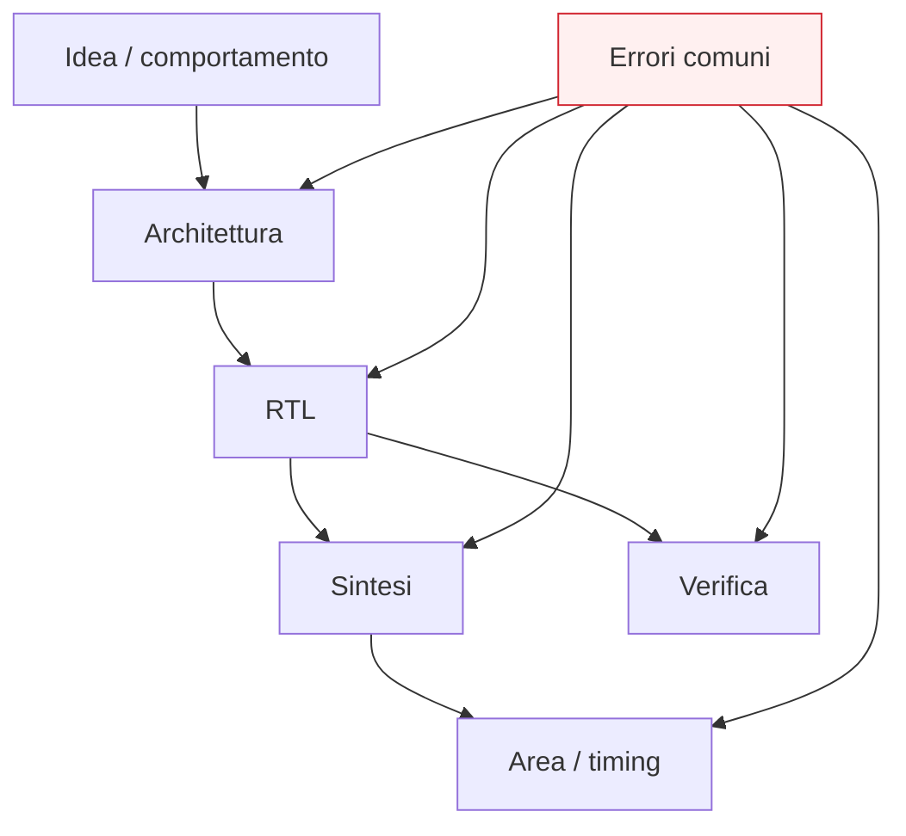

# Errori comuni di progettazione digitale

Dopo aver costruito il percorso sui fondamenti della progettazione digitale — segnali, logica combinatoria e sequenziale, clock, registri, datapath, FSM, pipeline, interfacce, RTL, sintesi, area e timing — il passo successivo naturale è fermarsi a raccogliere gli **errori più comuni** che emergono in questo cammino.

Questa lezione è molto importante perché molti problemi di progettazione non nascono da una sintassi palesemente sbagliata, ma da scelte concettuali o strutturali che:
- sembrano ragionevoli a una prima lettura;
- magari funzionano in casi semplici;
- ma diventano fragili quando il blocco cresce;
- peggiorano leggibilità, timing, area o verificabilità;
- rendono l’RTL ambiguo o poco robusto.

Dal punto di vista progettuale, questa pagina serve a:
- rileggere i concetti già visti sotto forma di errori ricorrenti;
- consolidare una mentalità più disciplinata;
- evitare equivoci molto frequenti nello studio iniziale;
- costruire una checklist mentale utile anche nelle sezioni successive su HDL, FPGA, ASIC e verifica.

Questa pagina mantiene il taglio della sezione:
- didattico ma tecnico;
- concettuale ma vicino al progetto reale;
- orientato alla qualità architetturale;
- costruito come sintesi critica delle lezioni precedenti.

## 1. Perché serve una pagina sugli errori comuni

La prima domanda utile è: perché ha senso dedicare una lezione specifica ai pitfall progettuali?

### 1.1 Perché molti errori non sono immediati
Un progetto può:
- sembrare ordinato;
- comportarsi bene in un caso nominale;
- apparire sensato a livello intuitivo;

ma nascondere problemi di:
- struttura;
- timing;
- interfaccia;
- organizzazione del controllo;
- leggibilità del comportamento.

### 1.2 Perché gli errori si ripetono
Nella progettazione digitale esistono alcuni schemi sbagliati ricorrenti che ritornano spesso:
- confusione tra dato e controllo;
- uso poco chiaro del tempo;
- cattiva separazione tra combinatorio e sequenziale;
- pipeline introdotte senza criterio;
- protocolli di interfaccia interpretati in modo superficiale.

### 1.3 Perché è importante
Imparare a riconoscere questi errori migliora rapidamente la qualità del progetto, anche prima di entrare in linguaggi HDL specifici.

---

## 2. Primo errore: pensare che il progetto sia solo una funzione logica

Questo è uno degli equivoci più profondi all’inizio dello studio.

### 2.1 In che cosa consiste
Si pensa che progettare significhi solo definire:
- una relazione input-output;
- una funzione logica;
- una trasformazione sul dato.

### 2.2 Perché è un problema
Molti blocchi reali richiedono anche:
- stato;
- controllo;
- organizzazione temporale;
- protocolli;
- gestione del flusso dei dati.

### 2.3 Conseguenza
Il progettista sottostima:
- registri;
- FSM;
- pipeline;
- interfacce;
- timing.

### 2.4 Buona pratica
Chiedersi sempre se il blocco richieda solo una funzione combinatoria oppure una vera architettura che evolve nel tempo.

---

## 3. Secondo errore: ignorare il ruolo del tempo

Un altro errore molto frequente è leggere il progetto solo in termini di valori e non di evoluzione temporale.

### 3.1 In che cosa consiste
Si guarda:
- che cosa vale un segnale;
ma non:
- quando vale;
- in quale ciclo;
- in quale fase del comportamento.

### 3.2 Perché è un problema
Nei sistemi digitali il tempo è fondamentale per:
- stato;
- clock;
- latenza;
- throughput;
- validità del dato;
- protocolli;
- timing.

### 3.3 Effetti tipici
- pipeline interpretate male;
- uscite osservate nel ciclo sbagliato;
- controllo poco chiaro;
- interfacce fragili.

### 3.4 Buona pratica
Leggere ogni blocco anche come comportamento temporale, non solo come trasformazione logica.

---

## 4. Terzo errore: confondere combinatorio e sequenziale

Questa è una delle distinzioni più importanti di tutto il corso, ed è anche una delle più spesso fraintese.

### 4.1 In che cosa consiste
Non si distingue bene tra:
- logica che dipende solo dagli ingressi attuali;
- logica che dipende anche dal passato e dallo stato.

### 4.2 Perché è un problema
Se questa distinzione è confusa, diventano poco chiari:
- ruolo dei registri;
- significato della FSM;
- lettura della pipeline;
- cammino del dato;
- timing del progetto.

### 4.3 Effetti tipici
- struttura del blocco opaca;
- errore nella scomposizione dell’architettura;
- difficoltà di verifica e debug.

### 4.4 Buona pratica
Chiedersi sempre:
- questo comportamento ricorda qualcosa del passato?
- c’è uno stato?
- il blocco cambia solo ai fronti di clock?

---

## 5. Quarto errore: trattare il registro come semplice contenitore passivo

Il registro viene spesso letto in modo troppo riduttivo.

### 5.1 In che cosa consiste
Lo si considera solo come un “posto dove mettere un valore”.

### 5.2 Perché è un problema
Il registro è anche:
- un confine temporale;
- un punto di campionamento;
- un elemento che struttura il timing;
- un costruttore di stato;
- un delimitatore della pipeline.

### 5.3 Effetti tipici
- cattiva lettura della latenza;
- sottovalutazione del timing;
- uso poco ragionato dei registri nel datapath.

### 5.4 Buona pratica
Considerare sempre il registro sia come memoria sia come elemento di organizzazione temporale del circuito.

---

## 6. Quinto errore: vedere il mux come dettaglio secondario

Il multiplexer è spesso sottovalutato.

### 6.1 In che cosa consiste
Si pensa al mux come blocco banale, quasi accessorio.

### 6.2 Perché è un problema
Il mux è invece uno dei punti in cui:
- il controllo influenza il percorso dati;
- l’architettura decide quale informazione prosegue;
- il timing può appesantirsi;
- il datapath diventa leggibile o confuso.

### 6.3 Effetti tipici
- sottovalutazione della complessità del percorso combinatorio;
- lettura poco chiara del flusso dati;
- architetture con troppi rami selettivi non ben controllati.

### 6.4 Buona pratica
Trattare ogni mux come una decisione architetturale sul cammino dell’informazione.

---

## 7. Sesto errore: non separare bene datapath e controllo

Questo è uno dei problemi strutturali più comuni.

### 7.1 In che cosa consiste
Il progetto mescola:
- percorso dati;
- segnali di comando;
- stato della FSM;
- interfacce;
- logica di sequenza

senza distinzione chiara.

### 7.2 Perché è un problema
Il modulo diventa:
- meno leggibile;
- più difficile da verificare;
- più difficile da modificare;
- più difficile da leggere in termini di timing.

### 7.3 Effetti tipici
- controllo disperso;
- datapath poco leggibile;
- protocollo d’interfaccia confuso;
- debug complicato.

### 7.4 Buona pratica
Separare il più possibile:
- dato;
- controllo;
- stato;
- segnali di protocollo;
- uscite funzionali.

---

## 8. Settimo errore: introdurre una FSM senza una vera ragione architetturale

Non ogni problema richiede una macchina a stati, e non ogni FSM è ben progettata.

### 8.1 In che cosa consiste
Si introducono stati:
- poco significativi;
- ridondanti;
- scollegati dal comportamento reale del sistema.

### 8.2 Perché è un problema
La FSM perde il suo ruolo di modello leggibile del controllo.

### 8.3 Effetti tipici
- troppi stati senza valore progettuale;
- transizioni poco chiare;
- segnali di controllo distribuiti male;
- comportamento temporale poco intuitivo.

### 8.4 Buona pratica
Usare stati che rappresentino vere fasi del comportamento del modulo.

---

## 9. Ottavo errore: non pensare al protocollo come parte del progetto

Le interfacce vengono spesso trattate come ultimo dettaglio.

### 9.1 In che cosa consiste
Si progetta bene il “cuore” del blocco, ma si lascia poco definito:
- quando l’input è valido;
- quando l’output è accettato;
- quando un trasferimento si considera completato;
- come il blocco reagisce a stall o attesa.

### 9.2 Perché è un problema
Un modulo internamente corretto può diventare difficile o pericoloso da integrare.

### 9.3 Effetti tipici
- perdita di dati;
- doppio trasferimento;
- interpretazioni diverse della stessa interfaccia;
- difficoltà di verifica.

### 9.4 Buona pratica
Pensare all’interfaccia fin dall’inizio come parte dell’architettura, non come accessorio esterno.

---

## 10. Nono errore: confondere dato e validità del dato

Questo problema compare spesso in sistemi con handshake o pipeline.

### 10.1 In che cosa consiste
Si guarda solo il valore del bus e non la sua semantica temporale.

### 10.2 Perché è un problema
Un dato può essere presente, ma:
- non ancora valido;
- non ancora accettato;
- non stabile;
- appartenere al ciclo sbagliato.

### 10.3 Effetti tipici
- handshake rotti;
- pipeline disallineate;
- testbench che controllano nel momento sbagliato;
- bug difficili da interpretare.

### 10.4 Buona pratica
Leggere sempre insieme:
- contenuto del dato;
- segnali di validità;
- condizioni di accettazione;
- ciclo temporale di riferimento.

---

## 11. Decimo errore: aggiungere pipeline senza un disegno chiaro

La pipeline è uno strumento potente, ma può essere usata male.

### 11.1 In che cosa consiste
Si aggiungono registri solo perché “serve migliorare il timing”, senza ridefinire chiaramente:
- il flusso dei dati;
- la latenza;
- i segnali di validità;
- il controllo di stadio;
- l’osservabilità dell’uscita.

### 11.2 Perché è un problema
Il progetto diventa più complesso ma non necessariamente più pulito.

### 11.3 Effetti tipici
- dati corretti nel ciclo sbagliato;
- controllo non allineato con il percorso dati;
- testbench confusi;
- area maggiore senza reale beneficio.

### 11.4 Buona pratica
Introdurre pipeline solo come scelta architetturale consapevole, non come patch casuale.

---

## 12. Undicesimo errore: pensare che la verifica arrivi solo dopo

Molti studenti progettano il blocco e solo dopo pensano a come verificarlo.

### 12.1 In che cosa consiste
Il modulo viene scritto senza chiedersi:
- come sarà osservato;
- che segnali interni saranno utili al debug;
- come si verificheranno latenza e protocolli;
- se il comportamento sarà leggibile in simulazione.

### 12.2 Perché è un problema
Un progetto difficile da verificare è spesso anche difficile da capire e mantenere.

### 12.3 Effetti tipici
- testbench poco efficaci;
- errori individuati tardi;
- waveform rumorose;
- difficoltà a distinguere bug di progetto e bug di test.

### 12.4 Buona pratica
Progettare pensando già alla verificabilità del blocco.

---

## 13. Dodicesimo errore: ignorare area e timing fino alla fine

Questo è uno degli errori metodologici più ricorrenti.

### 13.1 In che cosa consiste
Si costruisce il blocco solo in ottica funzionale e si rimanda a dopo ogni riflessione su:
- numero di registri;
- profondità della logica;
- cammino critico;
- costo architetturale.

### 13.2 Perché è un problema
Sintesi, area e timing non compaiono all’improvviso alla fine del flusso. Sono già impliciti nella struttura del modulo.

### 13.3 Effetti tipici
- blocchi formalmente corretti ma lenti;
- logica troppo profonda;
- pipeline inserite tardi e male;
- scelte di area poco ragionate.

### 13.4 Buona pratica
Pensare a area e timing già quando si organizza la microarchitettura.

---

## 14. Tredicesimo errore: scrivere un blocco senza una vera microarchitettura

Questo è il problema “alla radice” di molti altri.

### 14.1 In che cosa consiste
Si prova a costruire il modulo direttamente da una descrizione verbale, senza chiarire prima:
- registri;
- percorsi dati;
- controllo;
- protocollo;
- numero di cicli;
- latenza.

### 14.2 Perché è un problema
Il progetto diventa più fragile e meno coerente.

### 14.3 Effetti tipici
- controllo distribuito male;
- stato poco leggibile;
- interfacce fragili;
- sintesi poco prevedibile;
- debug difficile.

### 14.4 Buona pratica
Definire prima la microarchitettura e poi tradurla in RTL.

---

## 15. Quattordicesimo errore: non vedere il blocco come parte di un sistema

Anche un modulo ben progettato localmente può risultare debole a livello di integrazione.

### 15.1 In che cosa consiste
Il progettista si concentra solo sul comportamento interno e trascura:
- interfacce;
- latenza osservabile;
- segnali di validità;
- compatibilità con blocchi a monte o a valle;
- coordinamento con il resto del sistema.

### 15.2 Perché è un problema
Molti bug reali compaiono proprio all’integrazione.

### 15.3 Effetti tipici
- protocolli ambigui;
- timing di sistema poco chiaro;
- uso scorretto di start/done o valid/ready;
- difficoltà di riuso del modulo.

### 15.4 Buona pratica
Leggere sempre il blocco come componente di un sistema più ampio.

---

## 16. Quindicesimo errore: cercare una soluzione “perfetta” unica

Questo errore è più sottile ma molto importante.

### 16.1 In che cosa consiste
Si pensa che esista sempre una sola architettura evidentemente giusta.

### 16.2 Perché è un problema
Nella progettazione reale bisogna spesso bilanciare:
- semplicità;
- area;
- timing;
- latenza;
- throughput;
- verificabilità;
- modularità.

### 16.3 Effetti tipici
- rigidità progettuale;
- scarsa capacità di valutare compromessi;
- incomprensione del motivo per cui esistano più implementazioni corrette della stessa funzione.

### 16.4 Buona pratica
Imparare a leggere il progetto come scelta di compromessi, non come mera soluzione unica.

---

## 17. Una checklist pratica di rilettura del progetto

Prima di considerare buono un blocco digitale, conviene porsi alcune domande.

### 17.1 Sul comportamento
- il blocco è solo combinatorio o ha stato?
- il suo comportamento nel tempo è chiaro?

### 17.2 Sulla microarchitettura
- sono chiari registri, datapath e controllo?
- la FSM ha stati realmente significativi?
- le interfacce sono leggibili come contratto?

### 17.3 Su area e timing
- dove sono i percorsi più lunghi?
- i registri sono motivati?
- la pipeline è giustificata?

### 17.4 Sulla verifica
- il blocco è facile da osservare e testare?
- la latenza è chiara?
- il protocollo è verificabile in modo ordinato?

### 17.5 Sull’integrazione
- il modulo è leggibile dall’esterno?
- la sua interfaccia è adatta al sistema in cui verrà inserito?

---

## 18. Buone pratiche generali

Molti errori si evitano non con “trucchi”, ma con alcune discipline progettuali.

### 18.1 Parti dalla funzione, ma definisci la microarchitettura
Il salto dal comportamento alla struttura va sempre esplicitato.

### 18.2 Separa ruoli diversi
- stato
- dato
- controllo
- interfaccia
- validità del dato

Questa separazione migliora tutto il progetto.

### 18.3 Pensa in cicli e percorsi
Un buon progetto si legge:
- nel tempo;
- nello spazio architetturale;
- nella relazione tra registri e combinatoria.

### 18.4 Considera sempre sintesi, area e timing
Non come post-scriptum, ma come proprietà della struttura.

### 18.5 Progetta per la verifica
Un buon modulo si lascia osservare, testare e debuggare.

---

## 19. Collegamento con il resto della sezione

Questa pagina si collega direttamente alle prossime tappe del branch:
- **`basic-verification-and-debug.md`**, dove molti errori verranno riletti dal punto di vista del testbench e della simulazione;
- **`from-block-to-system.md`**, dove i pitfall di integrazione diventeranno ancora più chiari;
- **`fpga-asic-soc-contexts.md`**, dove area, timing e qualità del progetto verranno letti in contesti reali diversi;
- **`case-study.md`**, che ricomporrà i fondamenti in un esempio unitario e permetterà di vedere molti di questi errori in forma concreta.

---

## 20. In sintesi

Gli errori comuni della progettazione digitale nascono raramente da una sola formula sbagliata. Nascono più spesso da:
- confusione tra funzione e architettura;
- cattiva gestione del tempo e dello stato;
- scarsa separazione tra datapath e controllo;
- interfacce poco ragionate;
- sottovalutazione di sintesi, area e timing;
- mancanza di attenzione alla verifica e all’integrazione.

Capire bene questi pitfall significa trasformare i fondamenti studiati fin qui in una mentalità progettuale più robusta, più disciplinata e più vicina al lavoro reale di progettazione hardware.

## Prossimo passo

Il passo successivo naturale è **`basic-verification-and-debug.md`**, perché adesso conviene spostare l’attenzione dal lato della progettazione a quello della validazione, chiarendo:
- come si verifica un blocco digitale di base
- come si osserva il comportamento nel tempo
- come si usano simulazione e debug per capire se la microarchitettura è davvero corretta
