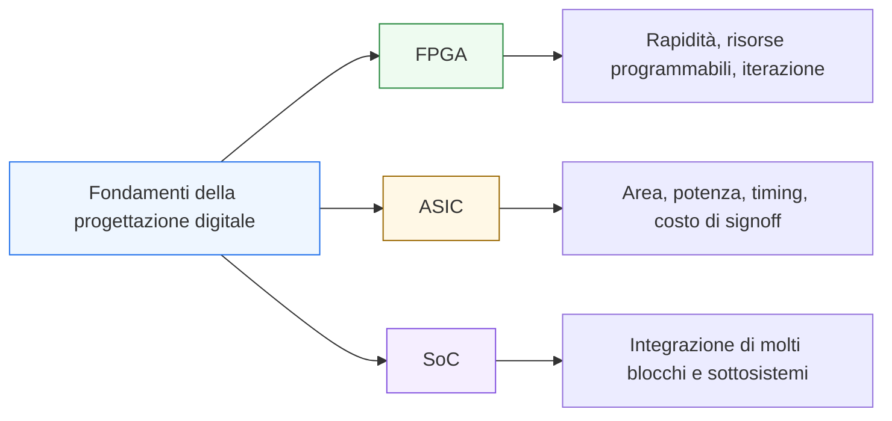

# Differenze tra contesto FPGA, ASIC e SoC

Dopo aver allargato la prospettiva dal **blocco** al **sistema**, il passo successivo naturale è collocare tutti i fondamenti costruiti fin qui nei principali contesti reali della progettazione digitale: **FPGA**, **ASIC** e **SoC**. In questa pagina il focus è sul fatto che gli stessi concetti di base — registri, datapath, controllo, pipeline, interfacce, timing, verifica — non cambiano come natura, ma cambiano nel modo in cui vengono **valutati**, **prioritizzati** e **usati** a seconda del contesto progettuale.

Questa lezione è molto importante perché molti studenti incontrano i termini FPGA, ASIC e SoC come se fossero solo “etichette di settore”, mentre in realtà rappresentano contesti con:
- vincoli diversi;
- sensibilità progettuali diverse;
- costi diversi dell’errore;
- priorità diverse tra area, timing, flessibilità, riuso e verifica;
- modi diversi di leggere la qualità di un blocco.

Dal punto di vista progettuale, questa pagina serve a chiarire:
- che cosa resti comune tra i diversi contesti;
- che cosa cambi davvero nel modo di progettare;
- perché un blocco “buono” in un contesto possa non essere ottimale in un altro;
- come leggere i fondamenti della progettazione digitale alla luce di vincoli reali.

Questa pagina mantiene il taglio della sezione:
- didattico ma tecnico;
- concettuale ma vicino al progetto reale;
- orientato alla lettura architetturale;
- accompagnato da schemi ed esempi quando utili.

## 1. Perché serve questa pagina

La prima domanda utile è: perché, dopo i fondamenti, ha senso parlare di contesto FPGA, ASIC e SoC?

### 1.1 Perché i fondamenti non vivono nel vuoto
Registri, FSM, pipeline, interfacce e timing non sono solo concetti astratti. Vengono sempre usati dentro un obiettivo reale di implementazione.

### 1.2 Perché il valore di una scelta dipende dal contesto
Una stessa architettura può essere:
- molto comoda in FPGA;
- troppo costosa o poco pulita in ASIC;
- corretta localmente ma insufficiente a livello SoC.

### 1.3 Perché è importante
Capire il contesto significa imparare a leggere la qualità di un blocco in modo più maturo e realistico.

---

## 2. Che cosa resta comune tra FPGA, ASIC e SoC

Prima di guardare le differenze, conviene chiarire ciò che non cambia.

### 2.1 Restano validi gli stessi fondamenti
In tutti e tre i contesti restano centrali:
- segnali e informazione;
- logica combinatoria e sequenziale;
- clock e reset;
- registri;
- datapath;
- FSM e controllo;
- pipeline;
- interfacce;
- verifica;
- sintesi e timing.

### 2.2 Perché è importante
Questo significa che i fondamenti della progettazione digitale non sono “fondamenti per un solo target”. Sono il linguaggio comune di tutti i contesti.

### 2.3 Conseguenza progettuale
Cambiano i vincoli e le priorità, ma non cambia la natura di base del progetto digitale.

---

## 3. Che cos’è un FPGA

Un **FPGA** è un dispositivo programmabile che permette di implementare hardware digitale riconfigurabile.

### 3.1 Significato essenziale
Il progettista descrive un blocco o un sistema digitale e lo mappa su una struttura hardware già esistente e programmabile.

### 3.2 Perché è importante
Nel contesto FPGA si lavora con:
- risorse già presenti nel dispositivo;
- forte possibilità di iterazione;
- rapido passaggio tra progetto e test su hardware;
- sensibilità molto concreta al mapping sulle risorse disponibili.

### 3.3 Visione intuitiva
L’FPGA è un ambiente in cui il progetto viene “adattato” a una piattaforma programmabile.

---

## 4. Che cos’è un ASIC

Un **ASIC** è un circuito integrato progettato per una funzione specifica.

### 4.1 Significato essenziale
Qui il progetto non viene caricato su una piattaforma generica già esistente, ma entra in un flusso che porta a una realizzazione dedicata.

### 4.2 Perché è importante
Nel contesto ASIC diventano molto più sensibili temi come:
- area;
- potenza;
- timing;
- qualità dell’RTL;
- testabilità;
- costo dell’errore tardivo;
- robustezza del signoff.

### 4.3 Visione intuitiva
L’ASIC è il contesto in cui il progetto viene giudicato con una severità architetturale molto alta, perché la realizzazione finale è dedicata e costosa da correggere.

---

## 5. Che cos’è un SoC

Un **SoC** (*System on Chip*) è un sistema integrato su chip composto da molti blocchi e sottosistemi cooperanti.

### 5.1 Significato essenziale
Un SoC non è “solo un blocco più grande”, ma una architettura in cui convivono:
- moduli di elaborazione;
- controllo;
- memoria;
- interconnessioni;
- periferiche;
- acceleratori;
- protocolli;
- domini di integrazione molto diversi.

### 5.2 Perché è importante
Nel contesto SoC diventano centrali:
- composizione;
- gerarchia;
- interfacce;
- integrazione di sistema;
- verificabilità su larga scala;
- coerenza architetturale complessiva.

### 5.3 Visione intuitiva
Il SoC è il luogo in cui il singolo blocco perde centralità assoluta e acquista valore come componente di una architettura molto più ampia.

---

## 6. Differenza di sensibilità: rapidità contro ottimizzazione estrema

Una prima grande differenza tra questi contesti riguarda il bilanciamento tra:
- rapidità di sviluppo;
- ottimizzazione estrema della realizzazione.

### 6.1 In FPGA
Conta molto:
- iterare rapidamente;
- arrivare in fretta a un prototipo funzionante;
- testare su hardware programmabile;
- sfruttare bene le risorse del dispositivo.

### 6.2 In ASIC
Conta molto di più:
- minimizzare errori tardivi;
- costruire RTL molto puliti;
- ottimizzare area, timing e potenza;
- ridurre il costo di una correzione strutturale tardiva.

### 6.3 In SoC
Conta fortemente:
- garantire integrazione coerente tra sottoblocchi;
- controllare la complessità complessiva;
- preservare modularità e verificabilità.

---

## 7. Come cambia il significato dell’area

Il concetto di area resta importante ovunque, ma cambia il suo peso.

### 7.1 In FPGA
L’area viene spesso letta in termini di:
- risorse occupate;
- numero di elementi utilizzati;
- sostenibilità del mapping sul dispositivo.

### 7.2 In ASIC
L’area ha un peso ancora più diretto sul costo e sulla qualità della realizzazione finale.

### 7.3 In SoC
L’area conta sia a livello locale dei blocchi sia nella somma di molti sottosistemi che devono convivere sul chip.

### 7.4 Perché è importante
Mostra che lo stesso blocco può essere giudicato molto diversamente a seconda di quanto “costi” nel contesto reale.

---

## 8. Come cambia il significato del timing

Anche il timing resta fondamentale in tutti i contesti, ma assume sfumature diverse.

### 8.1 In FPGA
Conta molto:
- chiudere il timing sul dispositivo;
- tenere sotto controllo i percorsi combinatori;
- usare pipeline e registri in modo utile al mapping e alla frequenza.

### 8.2 In ASIC
Il timing entra in una catena molto più severa di valutazione, e il cammino critico viene letto con grande attenzione già a livello di microarchitettura.

### 8.3 In SoC
Il timing deve essere letto anche a livello di interazione tra molti blocchi, protocolli, interconnessioni e possibili domini diversi.

### 8.4 Perché è importante
Il timing non cambia come concetto, ma cambia la pressione progettuale con cui viene affrontato.

---

## 9. Come cambia il peso del reset e del clock

Reset e clock sono fondamentali ovunque, ma il loro impatto progettuale cresce con la complessità del contesto.

### 9.1 In FPGA
Conta molto:
- inizializzare bene il blocco;
- tenere leggibile il comportamento;
- integrarsi correttamente nel clocking del dispositivo.

### 9.2 In ASIC
Reset e clock sono letti con maggiore severità perché influenzano:
- robustezza del progetto;
- timing;
- integrazione;
- qualità complessiva del flusso.

### 9.3 In SoC
Reset e clock devono essere letti anche come problemi di coordinamento tra molti sottoblocchi e sottosistemi.

### 9.4 Perché è importante
Un reset o un clocking sensati localmente possono non bastare a livello di sistema.

---

## 10. Come cambia il valore della modularità

La modularità è utile ovunque, ma cambia il motivo per cui è così importante.

### 10.1 In FPGA
La modularità aiuta:
- prototipazione;
- riuso;
- debug;
- iterazione rapida.

### 10.2 In ASIC
Aiuta:
- leggibilità del progetto;
- qualità dell’RTL;
- controllo della complessità;
- verificabilità e signoff.

### 10.3 In SoC
Diventa essenziale perché senza modularità la complessità di sistema cresce troppo rapidamente.

### 10.4 Perché è importante
La modularità non è solo “buona pratica estetica”: è una leva strategica in tutti i contesti reali.

---

## 11. Come cambia il peso dell’interfaccia

L’interfaccia è sempre importante, ma in un contesto più ampio il suo peso cresce ancora.

### 11.1 In FPGA
Una buona interfaccia aiuta a collegare e testare rapidamente i blocchi.

### 11.2 In ASIC
Una interfaccia leggibile e rigorosa riduce ambiguità e fragilità del progetto.

### 11.3 In SoC
L’interfaccia diventa uno dei punti più critici, perché unisce molti moduli, team, domini funzionali e sottosistemi.

### 11.4 Perché è importante
Nel mondo reale, i problemi di integrazione spesso nascono più dalle interfacce che dalla funzione interna dei singoli blocchi.

---

## 12. Come cambia il peso della verifica

Anche la verifica resta fondamentale in tutti i contesti, ma la sua scala cambia molto.

### 12.1 In FPGA
La verifica si accompagna spesso a:
- iterazione veloce;
- debug pratico;
- confronto rapido tra simulazione e prototipo.

### 12.2 In ASIC
La verifica deve essere molto più severa, perché il costo di un errore tardo è molto maggiore.

### 12.3 In SoC
La verifica cresce di scala e diventa problema di:
- integrazione;
- interazione tra blocchi;
- protocolli;
- sottosistemi;
- comportamento globale.

### 12.4 Perché è importante
La qualità della verifica è sempre importante, ma nei contesti più complessi diventa ancora più decisiva.

---

## 13. Esempio concettuale: stesso blocco, giudizi diversi

Immaginiamo un blocco con:
- una FSM;
- un piccolo datapath;
- una pipeline leggera;
- interfaccia `valid/ready`;
- uscita registrata.

### 13.1 In FPGA
Ci si chiede soprattutto:
- entra bene nelle risorse disponibili?
- chiude il timing richiesto?
- si integra facilmente nel prototipo?
- è pratico da debuggare?

### 13.2 In ASIC
Ci si chiede anche:
- l’RTL è abbastanza pulito?
- i registri sono davvero tutti necessari?
- area e timing sono bilanciati bene?
- l’interfaccia è rigorosa e robusta?

### 13.3 In SoC
Ci si chiede inoltre:
- il blocco è ben componibile?
- la latenza è accettabile a livello di sistema?
- il protocollo è coerente con gli altri sottosistemi?
- il controllo locale si armonizza con il controllo globale?

### 13.4 Perché è importante
Mostra che i fondamenti sono gli stessi, ma cambia il modo in cui il blocco viene giudicato.

---

## 14. Perché SoC non è semplicemente “un ASIC grande”

Questo è un equivoco molto comune.

### 14.1 Perché è sbagliato
Un SoC non si definisce solo per il supporto fisico o per il fatto di essere su chip, ma per il livello di integrazione e composizione.

### 14.2 Che cosa aggiunge il contesto SoC
- molti sottoblocchi cooperanti;
- architettura di sistema;
- gerarchia complessa;
- protocolli e interconnessioni;
- forte rilevanza dell’integrazione.

### 14.3 Perché è importante
Aiuta a capire che i problemi di sistema non sono semplicemente “più grandi”, ma spesso qualitativamente diversi.

---

## 15. Fondamenti che diventano più severi in ASIC

Alcuni concetti già visti acquistano una severità particolare in contesto ASIC.

### 15.1 Esempi
- pipeline introdotte con criterio;
- reset ben strutturato;
- controllo leggibile;
- percorsi combinatori disciplinati;
- area giustificata;
- RTL molto pulito.

### 15.2 Perché è importante
Molte scelte che in altri contesti potrebbero essere tollerate o corrette rapidamente, qui diventano molto più costose da gestire.

### 15.3 Messaggio progettuale
Il contesto ASIC amplifica il valore della disciplina architetturale.

---

## 16. Fondamenti che diventano molto pratici in FPGA

In contesto FPGA alcuni concetti assumono una lettura molto concreta e immediata.

### 16.1 Esempi
- pipeline per sostenere la frequenza;
- registri e timing osservabili rapidamente;
- interfacce e handshake testati in prototipi reali;
- modularità utile per iterazione veloce.

### 16.2 Perché è importante
L’FPGA è spesso un luogo eccellente per vedere i fondamenti tradursi in comportamento osservabile in tempi rapidi.

### 16.3 Messaggio progettuale
Il contesto FPGA rende molto tangibile il legame tra struttura digitale e risultato implementato.

---

## 17. Fondamenti che diventano strutturali in SoC

Nel contesto SoC alcuni concetti diventano soprattutto problemi di organizzazione complessiva.

### 17.1 Esempi
- interfacce come contratti di integrazione;
- latenza come proprietà di catene di moduli;
- controllo locale e globale;
- composizione di sottosistemi;
- verifica su larga scala.

### 17.2 Perché è importante
Il singolo blocco deve essere progettato pensando alla sua vita dentro una architettura più ampia.

### 17.3 Messaggio progettuale
Il SoC rende evidente che la bontà di un modulo dipende anche da quanto bene si lascia integrare.

---

## 18. Errori comuni di prospettiva

Ci sono alcuni errori molto frequenti quando si confrontano questi contesti.

### 18.1 Pensare che i fondamenti cambino
In realtà i fondamenti restano gli stessi. Cambiano soprattutto priorità e vincoli.

### 18.2 Pensare che un blocco “buono in assoluto” vada bene ovunque allo stesso modo
La bontà del progetto dipende anche dal contesto applicativo.

### 18.3 Ridurre il confronto a slogan
Per esempio:
- “FPGA è facile”
- “ASIC è solo più difficile”
- “SoC è solo un sistema grande”

Sono semplificazioni poco utili.

### 18.4 Ignorare il peso dell’integrazione
Soprattutto nel passaggio a SoC, questo porta a sottovalutare i veri problemi architetturali.

---

## 19. Buone pratiche concettuali

Anche a questo livello, alcune abitudini mentali sono molto utili.

### 19.1 Conserva i fondamenti come linguaggio comune
Non cambiare modo di pensare a registri, controllo, timing o interfacce: cambia solo il peso relativo dei vincoli.

### 19.2 Chiediti sempre qual è il costo reale dell’errore
Questo cambia fortemente tra contesti.

### 19.3 Valuta il blocco nel suo ambiente
- dispositivo programmabile?
- flusso ASIC rigoroso?
- integrazione in sistema ampio?

### 19.4 Leggi la qualità del progetto su più scale
- qualità locale del blocco
- qualità di integrazione
- qualità rispetto al target finale

---

## 20. Collegamento con il resto della sezione

Questa pagina si collega direttamente alla chiusura del branch:
- **`case-study.md`**, che ricomporrà i concetti della sezione in un esempio unitario leggibile anche alla luce dei diversi contesti applicativi.

Si collega anche trasversalmente a tutta la sezione, perché mostra come:
- registri;
- FSM;
- pipeline;
- interfacce;
- timing;
- verifica;
- integrazione

non cambino natura, ma cambino priorità e interpretazione a seconda del target.

---

## 21. In sintesi

FPGA, ASIC e SoC non cambiano i fondamenti della progettazione digitale, ma cambiano il contesto in cui quei fondamenti vengono giudicati.

- In **FPGA** contano molto iterazione, mappabilità e rapidità di sviluppo.
- In **ASIC** contano con più severità area, timing, pulizia dell’RTL e costo dell’errore tardivo.
- In **SoC** contano soprattutto integrazione, gerarchia, interfacce e coerenza architetturale complessiva.

Capire bene queste differenze significa fare un passo importante verso una visione più realistica della progettazione digitale: non come insieme di concetti isolati, ma come disciplina che vive dentro vincoli concreti e obiettivi diversi.

## Prossimo passo

Il passo successivo naturale è **`case-study.md`**, perché a questo punto conviene chiudere la sezione con un esempio applicativo unitario che ricomponga:
- segnali e informazione
- registri e datapath
- FSM e controllo
- pipeline e latenza
- interfacce e verifica
- lettura del progetto in un contesto reale
